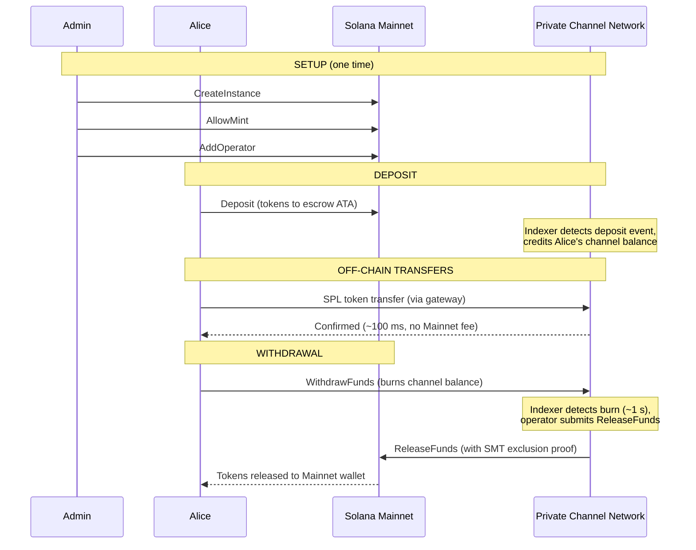
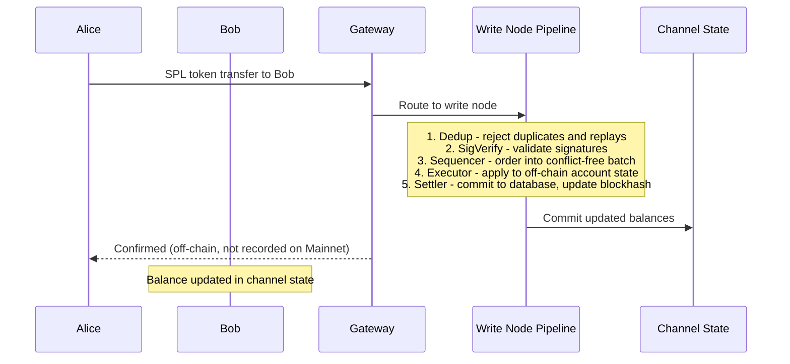
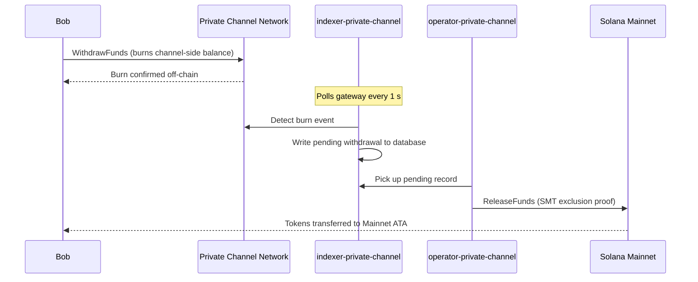

## Τι είναι ένα Ιδιωτικό Κανάλι;

Ένα ιδιωτικό κανάλι είναι ένα δίκτυο πληρωμών εκτός αλυσίδας (off-chain) αγκυρωμένο στο Solana. Οι χρήστες καταθέτουν SPL tokens σε ένα πρόγραμμα θεματοφυλακής (escrow) στην αλυσίδα, και στη συνέχεια πραγματοποιούν συναλλαγές εκτός αλυσίδας μέσω ενός gateway με υψηλή ταχύτητα και μηδενικό κόστος ανά μεταφορά. Η εκκαθάριση στο Solana Mainnet γίνεται μέσω απόδειξης Sparse Merkle Tree, διασφαλίζοντας ότι τα κεφάλαια είναι πάντα εξαγοράσιμα και η διπλή δαπάνη είναι αδύνατη.

Σε αντίθεση με τη ροή πληρωμών του Solana, οι μεταφορές εντός ενός καναλιού δεν εμφανίζονται στην αλυσίδα έως ότου ο χρήστης κάνει ανάληψη. Το δίκτυο καναλιών εκτελεί τη δική του διαδικασία επεξεργασίας συναλλαγών (dedup -> sig verify -> sequencer -> executor -> settler) που επεξεργάζεται συναλλαγές ανεξάρτητα από τον χρόνο block του Solana.

## Συμμετέχοντες

### Διαχειριστής Instance

Ο διαχειριστής αναπτύσσει το `Instance` PDA μέσω του `CreateInstance` και ελέγχει ποια SPL token mints γίνονται αποδεκτά (`AllowMint` / `BlockMint`). Ο διαχειριστής εκχωρεί και ανακαλεί operators μέσω των `AddOperator` / `RemoveOperator`, και μπορεί να μεταφέρει τα δικαιώματα διαχείρισης μέσω του `SetNewAdmin`. Υπάρχει ένας διαχειριστής ανά instance. Η μεταφορά δικαιωμάτων διαχείρισης είναι μη αναστρέψιμη σε ένα μόνο βήμα: ο τρέχων διαχειριστής δεν μπορεί να ανακτήσει τον ρόλο χωρίς τη συνεργασία του νέου διαχειριστή.

### Operators

Οι operators εκχωρούνται από τον διαχειριστή. Διαθέτουν ένα `Operator` PDA και είναι οι μόνοι λογαριασμοί που επιτρέπεται να καλούν το `ReleaseFunds` (για την εκκαθάριση αναλήψεων στο Mainnet) και το `ResetSmtRoot` (για την εναλλαγή του Sparse Merkle Tree). Οι operators παρακάμπτουν όλους τους ελέγχους ιδιοκτησίας στο gateway και έχουν πρόσβαση σε όλες τις μεθόδους JSON-RPC, συμπεριλαμβανομένων των `getBlock`, `getTransaction` και `simulateTransaction`. Ρόλος JWT: `"operator"`. Οι operators πρέπει να εκχωρούνται απευθείας στη βάση δεδομένων· δεν υπάρχει αυτοεξυπηρέτηση κλιμάκωσης δικαιωμάτων. Δείτε τον
[οδηγό Operators](/docs/tools/private-channels/operators) για λεπτομέρειες ανάπτυξης και διαμόρφωσης.

### Χρήστες

Οι χρήστες αυτοεγγράφονται μέσω της Υπηρεσίας Ταυτοποίησης (Auth Service). Ρόλος JWT: `"user"`. Οι χρήστες μπορούν να καλούν το `Deposit` απευθείας στο Escrow Program και να ξεκινούν αναλήψεις μέσω της εντολής `WithdrawFunds` στο Withdraw Program από την πλευρά του καναλιού. Η πρόσβαση στο gateway περιορίζεται στα επαληθευμένα πορτοφόλια τους· δεν μπορούν να καλούν `getBlock`, `getTransaction` ή `simulateTransaction`.

## Κύκλος Ζωής Καναλιού

1. **Δημιουργία instance** - Ο διαχειριστής καλεί το `CreateInstance`, δημιουργώντας το `Instance` PDA και διαμορφώνοντας τα επιτρεπόμενα mints.
2. **Κατάθεση** - Οι χρήστες καταθέτουν SPL tokens στο escrow μέσω της εντολής `Deposit`. Τα tokens μεταφέρονται στο associated token account του instance.
3. **Μεταφορές εκτός αλυσίδας** - Οι χρήστες αποστέλλουν μεταφορές μέσω του gateway. Οι μεταφορές ακολουθούν σειρά και εκτελούνται στο δίκτυο καναλιών χωρίς να αγγίζουν το Mainnet.
4. **Έναρξη ανάληψης** - Ένας χρήστης καλεί το `WithdrawFunds` στο Withdraw Program (πλευρά καναλιού) για να εξαντλήσει το υπόλοιπό του και να σηματοδοτήσει μια ανάληψη.
5. **Εκκαθάριση στο Mainnet** - Ένας operator παρέχει έγκυρη απόδειξη αποκλεισμού SMT και καλεί το `ReleaseFunds` στο Escrow Program (Mainnet), αποδεσμεύοντας τα tokens στο πορτοφόλι του χρήστη.
6. **Εναλλαγή δέντρου** - Όταν το SMT πλησιάζει τη χωρητικότητά του (65.536 φύλλα), ο operator καλεί το `ResetSmtRoot` για να εναλλάξει το δέντρο και να ξεκινήσει ένα νέο epoch.

### Μεταφορά

### Ανάληψη

## Πότε να Χρησιμοποιείτε Ιδιωτικά Κανάλια

Χρησιμοποιήστε ιδιωτικά κανάλια όταν η εφαρμογή σας χρειάζεται:

- **Υψηλή απόδοση εκτός αλυσίδας** - ο όγκος μεταφορών σας θα κορέσει το TPS του Solana ή χρειάζεστε επιβεβαίωση σε λιγότερο από ένα δευτερόλεπτο
- **Απορρήτου** - οι ταυτότητες των αντισυμβαλλομένων και τα ποσά μεταφοράς δεν πρέπει να εμφανίζονται στην αλυσίδα
- **Μηδενικά τέλη ανά μεταφορά** - συχνές μεταφορές όπου το κόστος SOL ανά συναλλαγή είναι απαγορευτικό

Χρησιμοποιήστε εγγενείς μεταφορές SPL αντί για αυτό, όταν:

- **Απαιτείται συνθετότητα στην αλυσίδα** (DeFi, ανταλλαγές, δανεισμός· άλλα προγράμματα πρέπει να μπορούν να παρακολουθούν ή να ενεργούν βάσει της μεταφοράς)
- **Η εκκαθάριση σε μία μεταφορά** είναι αποδεκτή και το απόρρητο δεν αποτελεί ανησυχία
- **Δεν υπάρχει διαθέσιμη υποδομή gateway** ή δεν είναι λειτουργικά εφικτή
