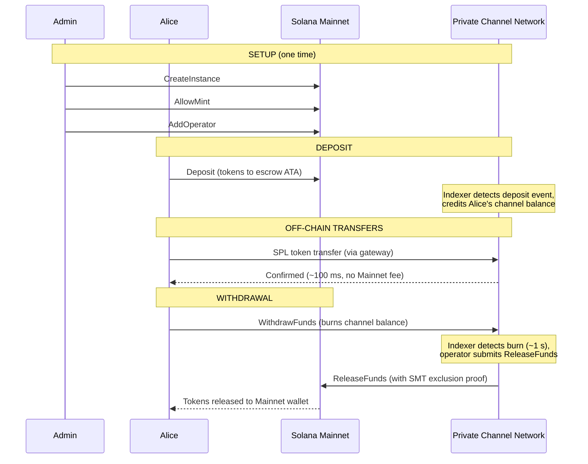
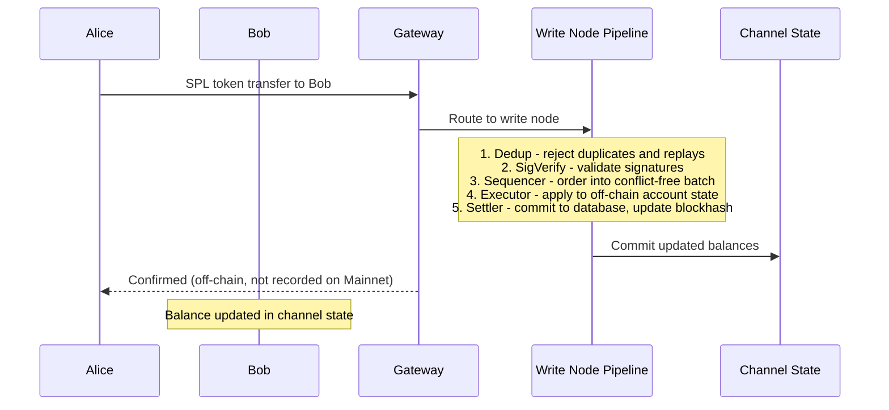
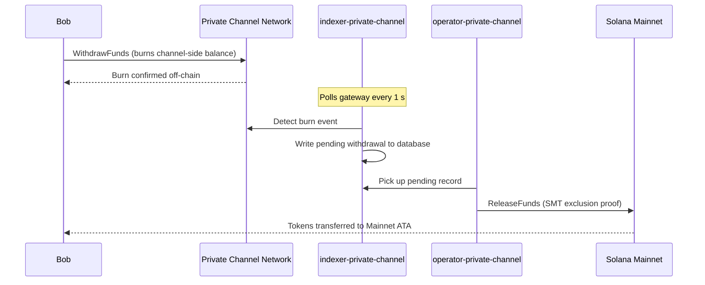

## Τι είναι ένα Ιδιωτικό Κανάλι;

Ένα ιδιωτικό κανάλι είναι ένα δίκτυο πληρωμών εκτός αλυσίδας (off-chain) αγκυρωμένο στο Solana. Οι χρήστες
καταθέτουν SPL tokens σε ένα on-chain πρόγραμμα θεματοφυλακής (escrow), και στη συνέχεια συναλλάσσονται off-chain
μέσω ενός gateway με υψηλή ταχύτητα και μηδενικό κόστος ανά μεταφορά. Ο διακανονισμός πίσω στο
Solana Mainnet γίνεται μέσω απόδειξης Sparse Merkle Tree, διασφαλίζοντας ότι τα κεφάλαια είναι πάντα
εξαγοράσιμα και η διπλή δαπάνη είναι αδύνατη.

Σε αντίθεση με τη native ροή πληρωμών του Solana, οι μεταφορές εντός ενός καναλιού δεν εμφανίζονται
on-chain έως ότου ο χρήστης κάνει ανάληψη. Το δίκτυο καναλιών εκτελεί τον δικό του αγωγό συναλλαγών
(dedup -> sig verify -> sequencer -> executor -> settler) που
επεξεργάζεται συναλλαγές ανεξάρτητα από τον χρόνο μπλοκ του Solana.

## Συμμετέχοντες

### Διαχειριστής Instance

Ο διαχειριστής αναπτύσσει το `Instance` PDA μέσω του `CreateInstance` και ελέγχει ποια SPL
token mints γίνονται αποδεκτά (`AllowMint` / `BlockMint`). Ο διαχειριστής παρέχει και
ανακαλεί operators μέσω `AddOperator` / `RemoveOperator`, και μπορεί να μεταβιβάσει τα δικαιώματα διαχειριστή
μέσω `SetNewAdmin`. Υπάρχει ένας διαχειριστής ανά instance. Η μεταβίβαση δικαιωμάτων διαχειριστή
είναι μη αναστρέψιμη σε ένα μόνο βήμα: ο τρέχων διαχειριστής δεν μπορεί να ανακτήσει τον ρόλο
χωρίς τη συνεργασία του νέου διαχειριστή.

### Operators

Οι operators παρέχονται από τον διαχειριστή. Κατέχουν ένα `Operator` PDA και είναι οι
μόνοι λογαριασμοί που επιτρέπεται να καλούν το `ReleaseFunds` (για τον διακανονισμό αναλήψεων στο
Mainnet) και το `ResetSmtRoot` (για την εναλλαγή του Sparse Merkle Tree). Οι operators παρακάμπτουν
όλους τους ελέγχους ιδιοκτησίας στο gateway και έχουν πρόσβαση σε όλες τις μεθόδους JSON-RPC
συμπεριλαμβανομένων των `getBlock`, `getTransaction` και `simulateTransaction`. JWT ρόλος:
`"operator"`. Οι operators πρέπει να παρέχονται απευθείας στη βάση δεδομένων· δεν υπάρχει
αυτοεξυπηρέτηση κλιμάκωσης. Δείτε τον
[οδηγό Operators](/docs/tools/private-channels/operators) για λεπτομέρειες ανάπτυξης και
διαμόρφωσης.

### Χρήστες

Οι χρήστες εγγράφονται μόνοι τους μέσω της Υπηρεσίας Auth. JWT ρόλος: `"user"`. Οι χρήστες μπορούν να καλούν
το `Deposit` απευθείας στο Escrow Program και να εκκινούν αναλήψεις μέσω της
εντολής `WithdrawFunds` στην πλευρά του καναλιού στο Withdraw Program. Η πρόσβαση στο gateway
περιορίζεται στα δικά τους επαληθευμένα πορτοφόλια· δεν μπορούν να καλούν `getBlock`,
`getTransaction` ή `simulateTransaction`.

## Κύκλος Ζωής Καναλιού

1. **Δημιουργία instance** - Ο διαχειριστής καλεί το `CreateInstance`, δημιουργώντας το `Instance`
   PDA και διαμορφώνοντας τα επιτρεπόμενα mints.
2. **Κατάθεση** - Οι χρήστες καταθέτουν SPL tokens στο escrow μέσω της εντολής `Deposit`.
   Τα tokens μεταφέρονται στο associated token account του instance.
3. **Μεταφορές off-chain** - Οι χρήστες στέλνουν μεταφορές μέσω του gateway. Οι μεταφορές
   αλληλουχούνται και εκτελούνται στο δίκτυο καναλιών χωρίς να αγγίζουν το Mainnet.
4. **Εκκίνηση ανάληψης** - Ένας χρήστης καλεί το `WithdrawFunds` στο Withdraw
   Program (πλευρά καναλιού) για να καταστρέψει το υπόλοιπό του και να σηματοδοτήσει μια ανάληψη.
5. **Διακανονισμός Mainnet** - Ένας operator παρέχει μια έγκυρη απόδειξη αποκλεισμού SMT και
   καλεί το `ReleaseFunds` στο Escrow Program (Mainnet), αποδεσμεύοντας τα tokens στο
   πορτοφόλι του χρήστη.
6. **Εναλλαγή δέντρου** - Όταν το SMT πλησιάζει τη χωρητικότητά του (65.536 φύλλα), ο
   operator καλεί το `ResetSmtRoot` για να εναλλάξει το δέντρο και να ξεκινήσει ένα νέο epoch.

### Μεταφορά

### Ανάληψη

## Πότε να Χρησιμοποιείτε Ιδιωτικά Κανάλια

Χρησιμοποιήστε ιδιωτικά κανάλια όταν η εφαρμογή σας χρειάζεται:

- **Throughput off-chain** - ο όγκος μεταφορών σας θα κορέσει το TPS του Solana ή
  χρειάζεστε επιβεβαίωση σε λιγότερο από ένα δευτερόλεπτο
- **Ιδιωτικότητα** - οι ταυτότητες των αντισυμβαλλομένων και τα ποσά μεταφορών δεν πρέπει να εμφανίζονται
  on-chain
- **Μηδενικές χρεώσεις ανά μεταφορά** - συχνές μεταφορές όπου το κόστος SOL ανά συναλλαγή
  είναι απαγορευτικό

Χρησιμοποιήστε native SPL μεταφορές αντ' αυτού όταν:

- **Απαιτείται on-chain composability** (DeFi, swaps, lending· άλλα προγράμματα
  πρέπει να μπορούν να παρατηρούν ή να ενεργούν βάσει της μεταφοράς)
- **Ο διακανονισμός μεμονωμένης μεταφοράς** είναι αποδεκτός και η ιδιωτικότητα δεν αποτελεί ζήτημα
- **Δεν υπάρχει διαθέσιμη υποδομή gateway** ή δεν είναι λειτουργικά εφικτή
