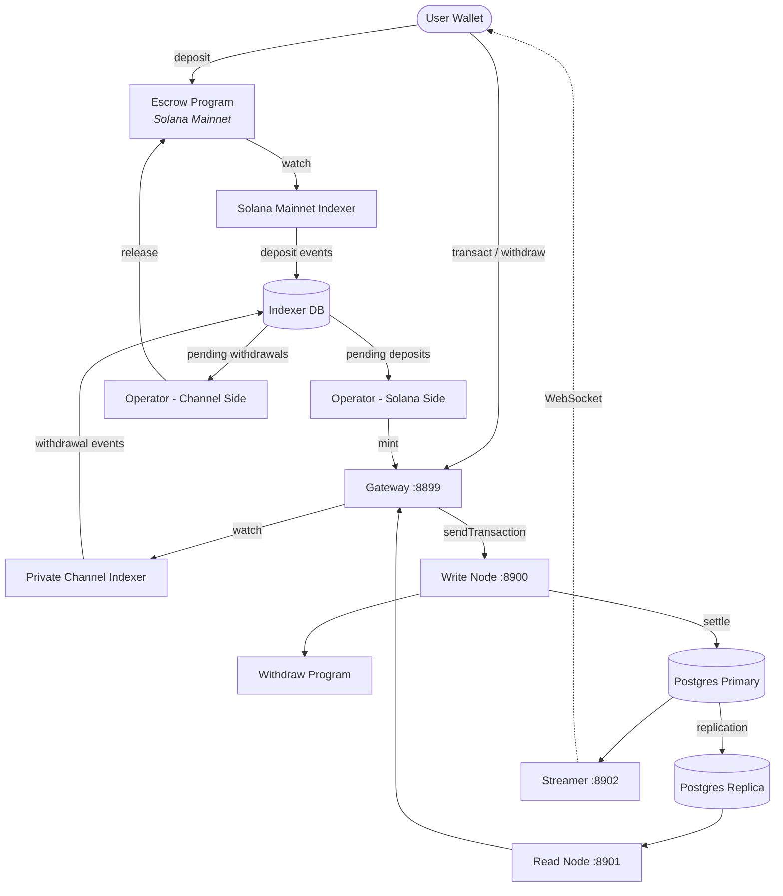

<Callout type="warning">
  Το Private Channels δεν έχει υποβληθεί σε έλεγχο ασφαλείας και δεν συνιστάται για
  χρήση σε παραγωγικό περιβάλλον με πραγματικά κεφάλαια χωρίς διεξοδικό έλεγχο ασφαλείας.
</Callout>

<Callout type="info">
  **Αναπτύσσετε μια παρουσία;** Μεταβείτε στον [οδηγό
  Operators](/docs/tools/private-channels/operators). **Ενσωματώνετε σε
  υπάρχουσα παρουσία;** Μεταβείτε στο
  [Quickstart](/docs/tools/private-channels/quickstart/installation). Αυτή η σελίδα
  αποτελεί την αναφορά αρχιτεκτονικής και για τα δύο κοινά.
</Callout>

## Αρχιτεκτονική

Το Private Channels αποτελείται από τέσσερα στοιχεία: δύο on-chain προγράμματα Solana
(Escrow και Withdraw) και δύο off-chain υπηρεσίες (Gateway και Auth Service).
Μαζί σχηματίζουν ένα πρωτόκολλο καναλιού κατάστασης, όπου τα κεφάλαια βρίσκονται στο Mainnet
αλλά οι μεταφορές διακανονίζονται off-chain.

### Πρόγραμμα Escrow

Το Πρόγραμμα Escrow είναι ένα on-chain πρόγραμμα Solana που διατηρεί κατατεθειμένα SPL
tokens. Αποτελεί την άγκυρα εμπιστοσύνης του συστήματος: όλα τα κεφάλαια παραμένουν τελικά σε
escrow έως ότου ένας operator παράσχει έγκυρη απόδειξη αποκλεισμού Sparse Merkle Tree για
την αποδέσμευσή τους.

- Program ID: `9tgHa1DcnaSSUtmMsst8ovKTe1Gfxzezn27KnH9xXYeU`
- Αυτό το ID μεταγλωττίζεται στο δυαδικό αρχείο του προγράμματος μέσω του `declare_id!()`. Οι off-chain
  υπηρεσίες διαβάζουν το ίδιο ID κατά τη μεταγλώττιση από το παραγόμενο client crate, όχι
  από μια μεταβλητή περιβάλλοντος.
- Διαχειρίζεται τα PDAs `Instance`, `AllowedMint` και `Operator`
- Εντολές: `CreateInstance`, `AllowMint`, `BlockMint`, `AddOperator`,
  `RemoveOperator`, `SetNewAdmin`, `Deposit`, `ReleaseFunds`, `ResetSmtRoot`

### Πρόγραμμα Withdraw

Το Πρόγραμμα Withdraw εκτελείται στο δίκτυο ιδιωτικών καναλιών, όχι στο Solana Mainnet.
Οι χρήστες καλούν το `WithdrawFunds` για να εξαργυρώσουν το υπόλοιπο token στην πλευρά του καναλιού. Αυτή η εξαργύρωση
δεν αποδεσμεύει αυτόματα κεφάλαια· σηματοδοτεί στον operator ότι
εκκρεμεί ανάληψη. Ο operator στη συνέχεια καλεί το `ReleaseFunds` στο Πρόγραμμα Escrow
με έγκυρη απόδειξη SMT για την ολοκλήρωση του διακανονισμού.

- Program ID: `J231K9UEpS4y4KAPwGc4gsMNCjKFRMYcQBcjVW7vBhVi`
- Αυτό το ID μεταγλωττίζεται στο δυαδικό αρχείο του προγράμματος. Οι off-chain υπηρεσίες διαβάζουν το ίδιο
  ID κατά τη μεταγλώττιση από το παραγόμενο client crate, όχι από μια μεταβλητή
  περιβάλλοντος.

### Gateway

Το Gateway είναι ένας διακομιστής μεσολάβησης συμβατός με Solana JSON-RPC που δρομολογεί αιτήματα πελατών στον
κόμβο εγγραφής του δικτύου καναλιών (για υποβολή συναλλαγών) και στον κόμβο ανάγνωσης (για
ερωτήματα). Διαμορφώνεται μέσω μεταβλητών περιβάλλοντος: `GATEWAY_PORT`,
`GATEWAY_WRITE_URL`, `GATEWAY_READ_URL`.

Endpoints υγείας (χωρίς απαίτηση αυθεντικοποίησης):

- `GET /health` - έλεγχος λειτουργίας· επιστρέφει `200 {"status":"ok"}`
- `GET /ready` - βαθύς έλεγχος ετοιμότητας, ελέγχει τους κόμβους εγγραφής + ανάγνωσης· επιστρέφει
  `200 {"status":"ready"}` ή `503 {"status":"degraded"}`

#### Δρομολόγηση και Πρόσβαση Μεθόδων RPC

Το gateway δρομολογεί το `sendTransaction` στον κόμβο εγγραφής και όλες τις άλλες μεθόδους στον
κόμβο ανάγνωσης. Αιτήματα μεγαλύτερα από 64 KB απορρίπτονται με HTTP 413. Όταν
η αυθεντικοποίηση είναι ενεργοποιημένη, η πρόσβαση στις μεθόδους ελέγχεται από τον ρόλο JWT. Δείτε
**[Αυθεντικοποίηση & Ρόλοι](/docs/tools/private-channels/concepts/auth)** για τον
πλήρη πίνακα μεθόδων.

### Auth Service

Το Auth Service είναι ένα προαιρετικό στοιχείο που εκδίδει JWT HS256 (λήξη 24 ωρών)
για έλεγχο πρόσβασης στο gateway. Ενεργοποιείται όταν οριστεί η μεταβλητή περιβάλλοντος `JWT_SECRET`.
Χωρίς αυτήν, το gateway δέχεται όλες τις συνδέσεις.

Claims JWT: `sub` (UUID χρήστη), `role` (`"user"` ή `"operator"`), `iss`
(`"private-channel-auth"`), `aud` (`"private-channel-gateway"`), `exp` (Unix
timestamp). Τα `iss` και `aud` επαληθεύονται από τη διαμόρφωση JWT του gateway,
όχι αποσειριοποιούνται στο struct claims της εφαρμογής: μόνο τα `sub`, `role` και
`exp` είναι διαθέσιμα στον κώδικα επιπέδου εφαρμογής.

Ρόλοι:

- `user` - πρόσβαση περιορισμένη στα επαληθευμένα πορτοφόλια του ίδιου χρήστη· δεν μπορεί να καλέσει `getBlock`,
  `getTransaction` ή `simulateTransaction`
- `operator` - παρακάμπτει όλους τους ελέγχους ιδιοκτησίας· πλήρης πρόσβαση σε μεθόδους RPC· πρέπει να
  έχει εγγραφεί στη βάση δεδομένων (δεν υπάρχει αυτόματη αναβάθμιση)

### Streamer

Το Streamer είναι ένας διακομιστής WebSocket που προωθεί ενημερώσεις κατάστασης καναλιού στους
συνδεδεμένους πελάτες σε πραγματικό χρόνο, εξαλείφοντας την ανάγκη polling στο RPC. Κάνει polling
στην PostgreSQL για αλλαγές κατάστασης. Αποτελεί μέρος της βασικής στοίβας Docker Compose, όχι
της στοίβας devnet που αναπτύσσει αυτός ο οδηγός· δείτε την
[Αναφορά διαμόρφωσης](/docs/tools/private-channels/operators/configuration#service-port-reference).

- Θύρα: `8902`, ρυθμιζόμενη μέσω `STREAMER_PORT`
- Σύνδεση: `ws://localhost:8902`
- Health endpoint: `GET /health` - επιστρέφει `503` αν οποιοσδήποτε εσωτερικός βρόχος polling
  σταματήσει για περισσότερο από 30 δευτερόλεπτα

<Callout type="warning">
  Το σχήμα συμβάντων WebSocket δεν έχει ακόμη τεκμηριωθεί δημόσια. Ανατρέξτε στο
  [`core/src/bin/streamer.rs`](https://github.com/solana-foundation/solana-private-channels/blob/main/core/src/bin/streamer.rs)
  για λεπτομέρειες υλοποίησης έως ότου είναι διαθέσιμη η επίσημη τεκμηρίωση.
</Callout>



## Διοχέτευση Συναλλαγών

```text
Transaction -> [1:Dedup] -> [2:SigVerify] -> [3:Sequencer] -> [4:Executor] -> [5:Settler] -> Database
```

Οι συναλλαγές που υποβάλλονται στο Gateway διέρχονται από ένα pipeline πέντε σταδίων πριν
δεσμευτεί η κατάστασή τους:

1. **Dedup** - φιλτράρει διπλότυπες συναλλαγές πριν εισέλθουν στο pipeline
2. **SigVerify** - επαληθεύει τις υπογραφές των συναλλαγών έναντι του δημόσιου
   κλειδιού του υπογράφοντος
3. **Sequencer** - ταξινομεί τις έγκυρες συναλλαγές ντετερμινιστικά για τη δημιουργία
   κανονικού ιστορικού
4. **Executor** - εκτελεί συναλλαγές στο επίπεδο λογαριασμών του καναλιού
   (BOB Cache + AccountsDB), ενημερώνοντας υπόλοιπα off-chain
5. **Settler** - δεσμεύει τα συσσωρευμένα αποτελέσματα συναλλαγών στην PostgreSQL και
   ενημερώνει την κρυφή μνήμη Redis· παράγει νέα blockhashes για τον επόμενο κύκλο μπλοκ.
   Ο διακανονισμός Mainnet (κλήση `ReleaseFunds`) διαχειρίζεται ξεχωριστά από την
   υπηρεσία `operator-private-channel`

## Βασικά Χαρακτηριστικά

### Απόρρητο

Οι μεταφορές μεταξύ συμμετεχόντων στο κανάλι δεν καταγράφονται στο Solana Mainnet. Μόνο
οι καταθέσεις (είσοδος στο κανάλι) και οι τελικές αναλήψεις (έξοδος από το κανάλι)
εμφανίζονται on-chain. Οι ταυτότητες των αντισυμβαλλομένων και τα ποσά μεταφορών δεν είναι ορατά σε
εξωτερικούς παρατηρητές κατά τη λειτουργία του καναλιού.

### Απόδοση

Το off-chain pipeline αφαιρεί τον χρόνο μπλοκ της Solana από το κρίσιμο μονοπάτι.
Οι μεταφορές επιβεβαιώνονται όταν ο sequencer τις επεξεργαστεί, όχι όταν επιβεβαιωθεί ένα μπλοκ Solana.
Αυτό επιτρέπει τελικότητα κάτω του δευτερολέπτου και ρυθμαπόδοση πέρα από το εγγενές
TPS της Solana για μεταφορές σε επίπεδο εφαρμογής.

### Διακανονισμός

Κάθε ανάληψη προστατεύεται από μια on-chain απόδειξη Sparse Merkle Tree. Η ρίζα SMT
αποθηκεύεται στο `Instance.withdrawal_transactions_root` του Προγράμματος Escrow.
Όταν καλείται το `ReleaseFunds`, το πρόγραμμα επαληθεύει πρώτα μια απόδειξη αποκλεισμού για
ένα μη εμφανισθέν nonce έναντι της τρέχουσας on-chain ρίζας, έπειτα επαληθεύει μια ξεχωριστή
απόδειξη συμπερίληψης για αυτό το nonce έναντι της νέας ρίζας που παρέχει ο καλών. Μόνο αφού
περάσουν και οι δύο έλεγχοι αποθηκεύει τη νέα ρίζα, καθιστώντας την διπλή δαπάνη αδύνατη ακόμα
και αν κλειδί operator παραβιαστεί.

## Μοντέλο Ασφαλείας

**Κλειδί Admin** - ελέγχει τη δημιουργία παρουσιών (`CreateInstance`) και την παροχή operators
(`AddOperator` / `RemoveOperator`). Παραβίαση του κλειδιού admin επιτρέπει αυθαίρετη παροχή operators. Το `SetNewAdmin` μεταφέρει την εξουσία admin
μη αναστρέψιμα σε ένα μόνο βήμα· προστατέψτε το κλειδί admin αναλόγως.

**Κλειδιά Operator** - μπορούν να καλέσουν `ReleaseFunds` και `ResetSmtRoot`. Δεν μπορούν
να αποδεσμεύσουν κεφάλαια χωρίς έγκυρη απόδειξη αποκλεισμού SMT έναντι της τρέχουσας on-chain
ρίζας. Ο on-chain έλεγχος `verify_smt_exclusion_proof` είναι η τελευταία γραμμή
άμυνας κατά μη εξουσιοδοτημένων αναλήψεων: ένα παραβιασμένο κλειδί operator από μόνο του δεν
αρκεί για να αδειάσει το escrow.

**Ρίζα SMT** - αποθηκεύεται on-chain στο `Instance.withdrawal_transactions_root`.
Ενημερώνεται ατομικά με κάθε κλήση `ReleaseFunds`. Επειδή κάθε απόδειξη πρέπει
να αναφέρεται σε ένα μη εμφανισθέν nonce, η διπλή δαπάνη του ίδιου υπολοίπου καναλιού είναι
αδύνατη ακόμα και αν παραβιαστεί κλειδί operator.

**Εναλλαγή δέντρου** - το `Instance.current_tree_index` παρακολουθεί τα epoch του δέντρου. Όταν
καλείται το `ResetSmtRoot`, αυξάνει τον δείκτη δέντρου και ακυρώνει όλα τα
nonces από το προηγούμενο epoch δέντρου, παρέχοντας καθαρό σημείο εκκίνησης για νέους κύκλους διακανονισμού.

## Ασφάλεια Λειτουργικών Κλειδιών

<Callout type="warning">
  Οι off-chain υπηρεσίες χρησιμοποιούν το δικό τους λεξιλόγιο υπογραφόντων, που δεν σχετίζεται με
  τις on-chain αρχές admin/operator που περιγράφονται στο Μοντέλο Ασφαλείας παραπάνω.
  Το `ADMIN_PRIVATE_KEY` απαιτείται για κάθε υπηρεσία operator και καταβάλλει
  τέλη συναλλαγής· ένα ξεχωριστό, προαιρετικό `OPERATOR_PRIVATE_KEY` παρέχει την
  on-chain υπογραφή Operator για `ReleaseFunds` και `ResetSmtRoot`, και επιστρέφει
  στην τιμή του `ADMIN_PRIVATE_KEY` όταν δεν έχει οριστεί. Μην τοποθετείτε ποτέ το κλειδί admin
  παρουσίας σε επίπεδο πρωτοκόλλου (που χρησιμοποιείται για `CreateInstance` / `AddOperator` / `SetNewAdmin`)
  σε καμία από τις δύο μεταβλητές ούτε να το εκθέτετε κατά τη διάρκεια εκτέλεσης· διατηρήστε αυτό το κλειδί κρύο και εκτός σύνδεσης.
</Callout>

Τα `ReleaseFunds` και `ResetSmtRoot` απαιτούν δύο on-chain υπογραφές: τον πληρωτή τελών
(από `ADMIN_PRIVATE_KEY`) και την αρχή του PDA Operator (από
`OPERATOR_PRIVATE_KEY`, ή `ADMIN_PRIVATE_KEY` αν αυτό δεν έχει οριστεί). Η αναλυτική παρουσίαση devnet
αυτού του οδηγού ανάπτυξης τοποθετεί το παραγόμενο keypair operator στο
`ADMIN_PRIVATE_KEY` και αφήνει το `OPERATOR_PRIVATE_KEY` μη ορισμένο, ώστε το ίδιο keypair
να γεμίζει και τους δύο ρόλους υπογράφοντος. Αντιμετωπίστε όποιο κλειδί καταλήγει στο `ADMIN_PRIVATE_KEY` με
τους ίδιους ελέγχους όπως ένα ιδιωτικό κλειδί hot wallet:

- Αποθηκεύστε το μόνο στο αρχείο `.env` που εξαιρείται από το git, ποτέ στο `.env.devnet` ή σε οποιαδήποτε
  δεσμευμένη διαμόρφωση
- Για αναπτύξεις παραγωγής, εξετάστε έναν διαχειριστή μυστικών (AWS Secrets Manager,
  HashiCorp Vault) αντί για μεταβλητή περιβάλλοντος σε απλό κείμενο
- Το keypair admin παρουσίας σε επίπεδο πρωτοκόλλου (που χρησιμοποιείται για κλήση `AddOperator` /
  `SetNewAdmin`) πρέπει να διατηρείται κρύο· χρειάζεται μόνο κατά τη ρύθμιση παρουσίας
  και την παροχή operators, όχι κατά τη διάρκεια εκτέλεσης

Το `SetNewAdmin` μεταφέρει τα δικαιώματα admin **μη αναστρέψιμα σε μία μόνο συναλλαγή**:
ο τρέχων admin δεν έχει διαδρομή ανάκτησης χωρίς τη συνεργασία του νέου admin. Μην
το καλείτε χωρίς επαλήθευση της διεύθυνσης προορισμού.

## Επόμενα Βήματα

<Cards>
  <Card
    title="Quickstart"
    href="/docs/tools/private-channels/quickstart/installation"
  >
    Ρυθμίστε το περιβάλλον σας και δημιουργήστε TypeScript clients.
  </Card>
  <Card title="Κανάλια" href="/docs/tools/private-channels/concepts/channels">
    Κατανοήστε τους συμμετέχοντες και τον κύκλο ζωής του καναλιού.
  </Card>
  <Card
    title="Sparse Merkle Tree"
    href="/docs/tools/private-channels/concepts/smt"
  >
    Κατανοήστε πώς επαληθεύονται οι αποδείξεις ανάληψης on-chain.
  </Card>
  <Card
    title="Εντολές"
    href="/docs/tools/private-channels/instructions/deposit"
  >
    Πλήρης αναφορά εντολών για όλα τα προγράμματα.
  </Card>
</Cards>
