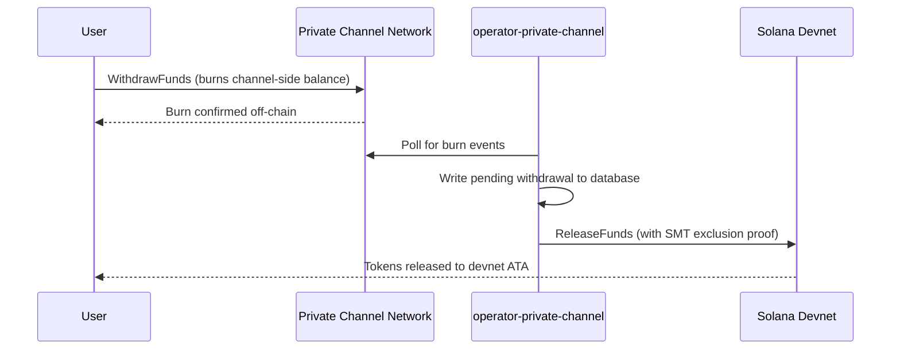

## Επισκόπηση

Η ανάληψη από το Private Channels είναι μια διαδικασία δύο βημάτων. Πρώτον, ο χρήστης καίει
το υπόλοιπο token της πλευράς του καναλιού καλώντας το `WithdrawFunds` στο Withdraw
Program. Δεύτερον, ένας operator καλεί το `ReleaseFunds` στο Escrow Program (devnet,
σε αυτό το walkthrough) με έγκυρη απόδειξη αποκλεισμού Sparse Merkle Tree για την αποδέσμευση
των κεφαλαίων. Η απόδειξη SMT διασφαλίζει ότι κάθε nonce ανάληψης μπορεί να χρησιμοποιηθεί μόνο μία φορά,
αποτρέποντας το double-spend.



## Βήμα 1: Έναρξη Ανάληψης στο Κανάλι

Καλέστε το `WithdrawFunds` στο Withdraw Program για να κάψετε το υπόλοιπό σας στην πλευρά του καναλιού.
Χρησιμοποιήστε την παραλλαγή `Async`, η οποία παράγει αυτόματα το PDA `tokenAccount` και είναι η
συνιστώμενη μορφή για χρήση σε παραγωγικό περιβάλλον:

```typescript
import { getWithdrawFundsInstructionAsync } from "../private-channel-withdraw-program/clients/typescript/src/generated";
import {
  createSolanaRpc,
  address,
  pipe,
  createTransactionMessage,
  setTransactionMessageFeePayerSigner,
  setTransactionMessageLifetimeUsingBlockhash,
  appendTransactionMessageInstruction,
  signAndSendTransactionMessageWithSigners,
  assertIsTransactionMessageWithSingleSendingSigner,
  getBase58Decoder
} from "@solana/kit";

// Point to the gateway, not a public Solana RPC
const privateChannelRpc = createSolanaRpc("http://localhost:8899");

const withdrawIx = await getWithdrawFundsInstructionAsync({
  user: userSigner,
  mint: address(mintAddress),
  amount: 1_000_000n, // 1 USDC (6 decimals)
  destination: null // null = release to signer's devnet wallet
});

const { value: latestBlockhash } = await privateChannelRpc
  .getLatestBlockhash({ commitment: "confirmed" })
  .send();

// Sent to the Private Channels gateway (not Solana RPC directly), which
// expects the legacy transaction format - do not switch this to version 0.
const transactionMessage = pipe(
  createTransactionMessage({ version: "legacy" }),
  (m) => setTransactionMessageFeePayerSigner(userSigner, m),
  (m) => setTransactionMessageLifetimeUsingBlockhash(latestBlockhash, m),
  (m) => appendTransactionMessageInstruction(withdrawIx, m)
);

assertIsTransactionMessageWithSingleSendingSigner(transactionMessage);

const signatureBytes =
  await signAndSendTransactionMessageWithSigners(transactionMessage);
const signature = getBase58Decoder().decode(signatureBytes);
console.log("Withdrawal initiated:", signature);
```

- Withdraw Program ID: `J231K9UEpS4y4KAPwGc4gsMNCjKFRMYcQBcjVW7vBhVi`
- Υποβάλετε αυτή τη συναλλαγή στην πύλη (`http://localhost:8899`), όχι σε
  δημόσιο Solana RPC
- Εάν παρέχεται `destination`, τα αποδεσμευμένα κεφάλαια μεταφέρονται σε αυτό το πορτοφόλι αντί για
  το πορτοφόλι του υπογράφοντος

## Τι να Περιμένετε

Δεν απαιτείται καμία περαιτέρω ενέργεια μετά την κλήση του `WithdrawFunds`. Οι υπηρεσίες operator
χειρίζονται τον διακανονισμό αυτόματα:

1. Το `indexer-private-channel` ελέγχει το κανάλι κάθε 1 δευτερόλεπτο για συμβάντα burn
   και καταγράφει μια εκκρεμή εγγραφή ανάληψης όταν εντοπιστεί η δική σας
2. Το `operator-private-channel` ελέγχει τη βάση δεδομένων κάθε 1 δευτερόλεπτο για εκκρεμείς
   εγγραφές και υποβάλλει `ReleaseFunds` στο Escrow Program στο Solana devnet
   με την απαιτούμενη απόδειξη αποκλεισμού SMT· ελέγχει για επιβεβαίωση devnet έως
   5 φορές σε διαστήματα 400 ms πριν επαναλάβει

Τα κεφάλαια εμφανίζονται συνήθως στο πορτοφόλι σας στο devnet μέσα σε λίγα δευτερόλεπτα υπό κανονικές
συνθήκες.

## Πώς Διακανονίζει ο Operator (Αναφορά)

Μετά το burn στην πλευρά του καναλιού, ένας εγκατεστημένος operator πρέπει να καλέσει το `ReleaseFunds` στο
Escrow Program με έγκυρη απόδειξη αποκλεισμού SMT· ο operator δεν μπορεί να αποδεσμεύσει
κεφάλαια χωρίς να αποδείξει ότι το nonce ανάληψης δεν έχει χρησιμοποιηθεί ξανά. Αυτό το βήμα
χειρίζεται αυτόματα από το `operator-private-channel`· δεν χρειάζεται να το καλέσετε
εσείς οι ίδιοι.

Ο operator παρέχει:

- `amount`: πρέπει να ταιριάζει με το burned ποσό
- `user`: πορτοφόλι παραλήπτη στο devnet
- `new_withdrawal_root`: ενημερωμένη ρίζα SMT μετά από αυτή την ανάληψη
- `transaction_nonce`: μοναδικό nonce για αυτό το φύλλο
- `sibling_proofs`: 512 bytes (16 x 32-byte sibling hashes για την απόδειξη δέντρου)

## Επαλήθευση

Αφού επιβεβαιωθεί η κλήση του operator, ελέγξτε το υπόλοιπο token σας στο devnet:

```bash
spl-token balance <MINT_ADDRESS> --owner <YOUR_WALLET>
```

Ή μέσω RPC:

```typescript
import { createSolanaRpc, address } from "@solana/kit";
import { findAssociatedTokenPda } from "@solana-program/token";

const TOKEN_PROGRAM_ADDRESS = address(
  "TokenkegQfeZyiNwAJbNbGKPFXCWuBvf9Ss623VQ5DA"
);

// Query devnet directly; ReleaseFunds settles here, not through the gateway
const rpc = createSolanaRpc("https://api.devnet.solana.com");

const [yourDevnetAta] = await findAssociatedTokenPda({
  mint: address(mintAddress),
  owner: address(userSigner.address),
  tokenProgram: TOKEN_PROGRAM_ADDRESS
});

const balance = await rpc.getTokenAccountBalance(yourDevnetAta).send();
console.log(balance.value.uiAmountString);
```

## Ολοκληρώσατε το Quickstart

Εκτελέσατε τον πλήρη κύκλο Private Channels στο devnet: καταθέσατε SPL tokens στο
escrow, στείλατε μια off-chain μεταφορά μέσω της πύλης και αναλάβατε κεφάλαια
πίσω στο πορτοφόλι σας στο devnet.

<Cards>
  <Card
    title="Κύκλος Ζωής Καναλιού"
    href="/docs/tools/private-channels/concepts/channels"
  >
    Κατανοήστε τους συμμετέχοντες και την πλήρη ροή από κατάθεση έως ανάληψη σε βάθος.
  </Card>
  <Card
    title="Αυθεντικοποίηση & Ρόλοι"
    href="/docs/tools/private-channels/concepts/auth"
  >
    Προσθέστε αυθεντικοποίηση JWT στην ενσωμάτωσή σας.
  </Card>
  <Card
    title="Αναφορά Release Funds"
    href="/docs/tools/private-channels/instructions/release-funds"
  >
    Πλήρης αναφορά οδηγιών ReleaseFunds για εργαλεία operator.
  </Card>
  <Card
    title="Sparse Merkle Tree"
    href="/docs/tools/private-channels/concepts/smt"
  >
    Κατανοήστε πώς οι αποδείξεις ανάληψης αποτρέπουν το double-spend.
  </Card>
</Cards>
