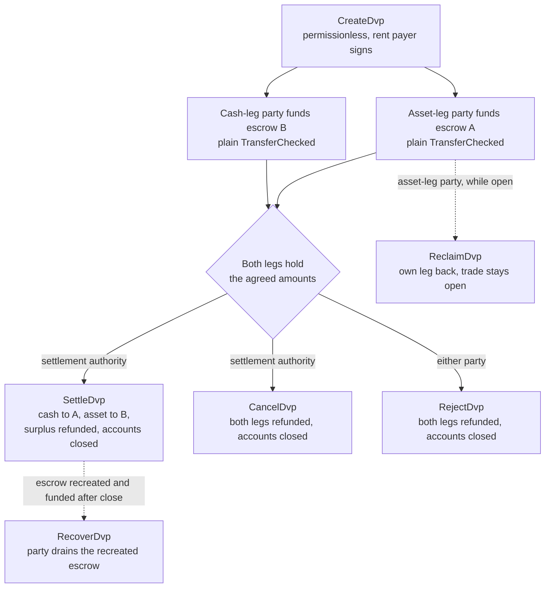
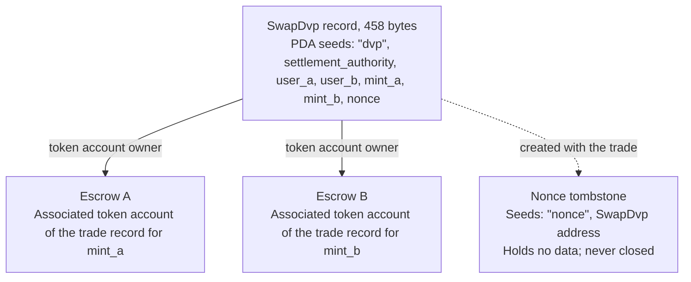

The DvP program is the standard program for delivery versus payment on Solana,
maintained by the Solana Foundation and audited by Cantina. Two parties agree on
a trade, each sends its leg to an escrow account with an ordinary token
transfer, and a settlement authority settles both legs in one transaction, so
either both move or neither does. The settlement authority is a third address
named in the trade, such as the venue or agent that arranged it. Neither party
writes or deploys a program, and a wallet or custodian that can send a standard
token transfer (`TransferChecked`) can fund a leg with no DvP-specific
integration. Until settlement, either party can take its own leg back or unwind
the trade.

<Callout type="warn" title="Read the record before acting on it">

Creating a trade record is permissionless, so a record is not proof of
agreement. Each party reads the stored terms before it funds, and the settlement
authority before it settles (see
[verification](#verification-before-funding-and-settlement)).

</Callout>

## How it works

Each trade gets a program-owned record and two escrow accounts, one per leg. The
asset-leg party (`user_a`) and the cash-leg party (`user_b`) each fund a leg by
transferring tokens into the escrow account for that leg. The settlement
authority is the only signer that can settle. Settlement transfers the agreed
amount of each leg to the other side, returns any surplus to the party that owns
the leg, and closes the record and both escrows. The atomicity comes from Solana
[transactions](/docs/core/transactions): both transfers are in one transaction,
so either both take effect or neither does.

Every refund, reclaim, and surplus return goes to the party's own associated
token account: `user_a`'s account for `mint_a`, `user_b`'s for `mint_b`. A
custodian or treasury system can fund a leg from its own account, but anything
returned lands in the party's account, not back with the custodian. Each trade
also leaves a permanent marker account (see [State](#state)).

## Guides

The step pages take one trade from creation to settlement, with TypeScript and
Rust for each instruction.

<Cards>
  <Card title="Create a trade" href="/docs/defi/dvp-program/create-a-trade">
    Install the clients and record the trade's terms with CreateDvp
  </Card>
  <Card title="Fund the legs" href="/docs/defi/dvp-program/fund-the-legs">
    Verify the stored terms, then fund each leg with a plain transfer
  </Card>
  <Card title="Settle the trade" href="/docs/defi/dvp-program/settle-the-trade">
    Settle both legs in one transaction as the settlement authority
  </Card>
  <Card title="Unwind a trade" href="/docs/defi/dvp-program/unwind-a-trade">
    Reclaim a leg, cancel or reject the trade, and recover late deposits
  </Card>
</Cards>

A [devnet demo](https://solana.com/delivery-vs-payment/demo) runs a trade end to
end: it creates the trade, funds both escrows with standard token transfers, and
settles both legs in one transaction.

## Choosing between the program and delegation

[Delivery vs Payment (DvP) using delegation](/docs/tokenization/dvp) settles the
same exchange without a program: each side delegates its position to a
settlement agent, which moves both legs in one transaction.

- **The program** needs no delegation, so the limit of one delegate per token
  account does not apply, and the settlement authority cannot redirect proceeds.
  Each trade depends on an upgradeable program and its upgrade authority.
- **The delegation pattern** has no program dependency and works with mints that
  carry Scaled UI Amount. The program rejects those mints, which rules out any
  mint created from Mosaic's `tokenized-security` template (see
  [mint configuration constraints](#mint-configuration-constraints)).

## Roles

The program is symmetric. In its interface the two parties are `user_a`, who
delivers `mint_a`, and `user_b`, who delivers `mint_b`. The README and the
generated clients call `mint_a` the asset leg and `mint_b` the cash leg, and
these pages follow that convention, but nothing in the program requires the cash
leg to be a cash instrument. Two assets, or two stablecoins, settle the same
way.

| Role                 | Who                               | Signs                                              | Notes                                                                                                                                                                                                     |
| -------------------- | --------------------------------- | -------------------------------------------------- | --------------------------------------------------------------------------------------------------------------------------------------------------------------------------------------------------------- |
| Asset-leg party      | `user_a`, delivers `mint_a`       | Its own funding transfer; Reclaim, Reject, Recover | A keypair wallet, or a PDA-based smart wallet such as a multisig vault. An SPL Token multisig account or a program account cannot be a party: Create fails with `PartyNotSignerCapable`                   |
| Cash-leg party       | `user_b`, delivers `mint_b`       | Its own funding transfer; Reclaim, Reject, Recover | Same requirement                                                                                                                                                                                          |
| Settlement authority | A third address named at creation | Settle, Cancel                                     | The only signer that can settle. It cannot redirect proceeds, which are fixed at creation. It receives the rent of the closed accounts when it settles or cancels                                         |
| Rent payer           | Whoever signs `CreateDvp`         | Create                                             | Funds the rent (the SOL deposit that keeps an account open) for the record, the nonce tombstone, and both escrows. Not recorded as a rent recipient: closed-account rent goes to whoever closes the trade |

## Program ID

```text
dvp34bdbcEm4f4FCUjGV4mDAkDshaQR4LkK8fdcsyZq
```

| Cluster      | Program                                       | Upgrade authority                              | Last deployed slot |
| ------------ | --------------------------------------------- | ---------------------------------------------- | ------------------ |
| mainnet-beta | `dvp34bdbcEm4f4FCUjGV4mDAkDshaQR4LkK8fdcsyZq` | `DXtFpbPjcn2hxPnw79x1Pfoj35vXh5AsWBkS37YnXMVv` | 452,058,374        |
| devnet       | `dvp34bdbcEm4f4FCUjGV4mDAkDshaQR4LkK8fdcsyZq` | `5EX1zFeJWj4rGYZv432WnYw8CbaSUeTdxPx4r573UgYU` | 479,376,863        |

The program is upgradeable on both clusters. The figures above are what
`solana program show` reported on 2 October 2026; run the same command for
current values. The devnet build is older than the commit the step pages are
written against (see [Install](/docs/defi/dvp-program/create-a-trade#install)),
with the same instruction and error set.

## Lifecycle



A trade is open from `CreateDvp` until one of Settle, Cancel, or Reject closes
it. Funding has no instruction of its own: a leg is funded when its escrow
account holds at least the agreed amount. Reclaim is per leg and leaves the
trade open, so a problem with one leg does not force the other party to cancel
the whole trade.

## State

Each trade has one `SwapDvp` account of 458 bytes, owned by the program. Its
address is derived from the settlement authority, the two parties, the two
mints, and a nonce (the seeds
`["dvp", settlement_authority, user_a, user_b, mint_a, mint_b, nonce]`). The
amounts and times are stored inside the account and do not affect the address,
which is why they have to be read rather than inferred. A small marker account,
the nonce tombstone at `["nonce", swap_dvp]`, is created with the trade and
never closed, so each combination of parties, mints, authority, and nonce can be
used for one trade only.



| Field                                  | Type          | Meaning                                                                                                 |
| -------------------------------------- | ------------- | ------------------------------------------------------------------------------------------------------- |
| `bump`                                 | `u8`          | PDA bump                                                                                                |
| `user_a`, `user_b`                     | `Pubkey`      | The two parties                                                                                         |
| `mint_a`, `mint_b`                     | `Pubkey`      | The asset-leg and cash-leg mints                                                                        |
| `settlement_authority`                 | `Pubkey`      | The only signer that can settle or cancel                                                               |
| `token_program_a`, `token_program_b`   | `Pubkey`      | The token program that owns each mint; a trade can mix SPL Token and Token-2022 legs                    |
| `amount_a`, `amount_b`                 | `u64`         | The agreed amount of each leg, in the mint's smallest unit (base units)                                 |
| `expiry_timestamp`                     | `i64`         | After this network time (the onchain clock), Settle is rejected. Reclaim, Cancel, and Reject still work |
| `nonce`                                | `u64`         | Disambiguates trades that share the other seeds. Single-use                                             |
| `ref_string`                           | `[u8; 64]`    | An opaque client reference, zero-padded; the program never reads it                                     |
| `user_a_settlement_destination`        | `Pubkey`      | Receives the cash leg at Settle; defaults to `user_a`                                                   |
| `user_b_settlement_destination`        | `Pubkey`      | Receives the asset leg at Settle; defaults to `user_b`                                                  |
| `mint_a_authority`, `mint_b_authority` | `Pubkey`      | The mint authorities captured at creation; Settle fails if either has changed                           |
| `earliest_settlement_timestamp`        | `Option<i64>` | If set, Settle is rejected before this network time                                                     |

The field list is taken from the program's IDL at the commit named under
[Create a trade](/docs/defi/dvp-program/create-a-trade#install).

## Instructions

| Instruction  | Signer               | Effect                                                                                                                                                              |
| ------------ | -------------------- | ------------------------------------------------------------------------------------------------------------------------------------------------------------------- |
| `CreateDvp`  | Any payer            | Creates the `SwapDvp` record, its nonce tombstone, and both escrow accounts. Moves no tokens                                                                        |
| `ReclaimDvp` | `user_a` or `user_b` | Returns the signer's own leg from escrow. The trade stays open and the leg can be funded again                                                                      |
| `SettleDvp`  | Settlement authority | Transfers `amount_a` to `user_b`'s destination and `amount_b` to `user_a`'s destination, returns any surplus to the leg's party, closes the record and both escrows |
| `CancelDvp`  | Settlement authority | Refunds whatever escrow A holds to `user_a` and escrow B to `user_b`, closes the record and both escrows                                                            |
| `RejectDvp`  | `user_a` or `user_b` | Same effect as Cancel, signed by a party                                                                                                                            |
| `RecoverDvp` | `user_a` or `user_b` | After the trade is closed: drains a recreated escrow to the signer's own token account and closes it. Covers a deposit that landed after Settle, Cancel, or Reject  |

Every refund goes to the party's own associated token account for that leg's
mint, whoever funded the escrow.

Each instruction's accounts and arguments are on the page for that step.

## Errors

| Code | Error                            | When                                                                                                   |
| ---- | -------------------------------- | ------------------------------------------------------------------------------------------------------ |
| 0    | `SignerNotParty`                 | Reclaim, Reject, or Recover signed by an address that is not `user_a` or `user_b`                      |
| 1    | `DvpExpired`                     | Settle after `expiry_timestamp`                                                                        |
| 2    | `SettlementAuthorityMismatch`    | Settle or Cancel signed by an address other than the settlement authority                              |
| 3    | `SettlementTooEarly`             | Settle before `earliest_settlement_timestamp`                                                          |
| 4    | `LegNotFunded`                   | Settle while an escrow holds less than its agreed amount                                               |
| 5    | `ExpiryNotInFuture`              | Create with an expiry at or before the current network time                                            |
| 6    | `EarliestAfterExpiry`            | Create with an earliest settlement time after the expiry                                               |
| 7    | `SelfDvp`                        | Create with `user_a` equal to `user_b`                                                                 |
| 8    | `SameMint`                       | Create with `mint_a` equal to `mint_b`                                                                 |
| 9    | `ZeroAmount`                     | Create with a zero amount on either leg                                                                |
| 10   | `BlockedMintExtension`           | Create or Settle with a mint carrying TransferFee, InterestBearing, ScaledUiAmount, or NonTransferable |
| 11   | `SettlementAuthorityIsParty`     | Create with the settlement authority equal to a party                                                  |
| 12   | `SettlementAuthorityExecutable`  | Create with an executable settlement authority                                                         |
| 13   | `NonceAlreadyUsed`               | Create reusing a `(seeds, nonce)` that already has a tombstone                                         |
| 14   | `ExpiryTooFarInFuture`           | Create with an expiry more than one year ahead                                                         |
| 15   | `RefStringTooLong`               | Create with a reference longer than 64 bytes                                                           |
| 16   | `DvpStillOpen`                   | Recover while the trade is still open; use Reclaim                                                     |
| 17   | `DvpNeverCreated`                | Recover with seeds that have no tombstone                                                              |
| 18   | `EscrowPreloadedWithLamports`    | Create when a non-native escrow holds lamports above its rent-exempt minimum                           |
| 19   | `SettlementDestinationIsSwapDvp` | Create with a settlement destination equal to the trade record                                         |
| 20   | `SwapDvpPreloadedWithLamports`   | Create when the record address holds lamports above its rent reserve                                   |
| 21   | `RecipientAtaMismatch`           | A recipient or refund token account no longer belongs to the expected wallet and mint                  |
| 22   | `PartyNotSignerCapable`          | Create with a party that is not a system-owned, non-executable account                                 |
| 23   | `MintAuthorityChanged`           | Settle when a leg's mint authority differs from the value captured at creation                         |

## Events and indexing

The program emits no onchain events. An indexer or reconciliation system reads
the `SwapDvp` account state and the token balances of the two escrows, and uses
`ref_string` to correlate a trade with its off-chain order. Because the record
is closed at settlement, a system that needs the terms after the fact stores
them when it reads them, or reconstructs them from the transaction that created
the trade.

## Supported tokens

A trade can pair an SPL Token leg with a Token-2022 leg; each leg carries its
own token program. Wrapped SOL legs are supported.

| Token-2022 extension on a leg's mint                                                     | Program behavior                                                  |
| ---------------------------------------------------------------------------------------- | ----------------------------------------------------------------- |
| TransferFee, InterestBearing, ScaledUiAmount, NonTransferable                            | Rejected at Create and Settle with `BlockedMintExtension`         |
| PermanentDelegate, Pausable, DefaultAccountState, a freeze authority, MintCloseAuthority | Accepted; each authority can act on the escrowed tokens           |
| ConfidentialTransfer                                                                     | Accepted; amounts on that leg are public                          |
| TransferHook                                                                             | Supported, up to 32 extra accounts per leg                        |
| MemoTransfer on a destination or refund account                                          | Accepted; the program emits the required memo before the transfer |

A transfer fee would leave the receiving side short of the agreed amount.
Interest Bearing and Scaled UI Amount do not change raw amounts, but their rate
or multiplier can change between creating and settling a trade, which changes
how the agreed amounts display. NonTransferable would strand both legs.

The accepted authorities can move, freeze, or halt the escrowed tokens for the
life of the trade (see below). The escrow cannot be configured to receive
confidential transfers, so the escrowed and settled amounts on a confidential
leg are public.

For a hooked mint, the client resolves the hook's extra accounts and appends
them to Settle, Cancel, Reject, Reclaim, and Recover. The cap of 32 per leg
counts the hook program and its validation account. If the hook authority
enlarges the hook's account list past that cap, every transfer on that leg
fails, including Reclaim, Cancel, Reject and Recover, until the authority
reverses it. The transaction account limit can bind before the per-leg cap when
both legs carry hooks.

When a destination or refund account requires memos, the program calls the Memo
program before the transfer, which is why every instruction that moves tokens
out of escrow takes a `memo_program` account.

### Mint configuration constraints

**Scaled UI Amount.** The `tokenized-security` template in
[Mosaic](https://github.com/solana-foundation/mosaic), the Solana Foundation's
issuance toolkit, always adds Scaled UI Amount, so the program does not accept a
mint created from that template as a leg. A mint intended for this program can
be created without the extension (see
[Token Extensions](/docs/tokens/extensions));
[DvP using delegation](/docs/tokenization/dvp) settles through delegated
authority and does not apply this check.

**Frozen-by-default mints.** Each trade's escrow is an associated token account
owned by a program-derived address that is new for that trade. On a mint with
Default Account State set to frozen, the escrow is created frozen, and a funding
transfer into it fails until it is thawed. Under
[Token ACL](/docs/tokenization/token-acl) that means the issuer or its transfer
agent admits the trade's escrow before funding: either by adding the trade
record's address (the escrow's owner) to the allowlist, so that anyone can thaw
the escrow where the mint's Token ACL config enables permissionless thaw, or by
having the freeze authority thaw it directly. A frozen escrow also blocks
Settle, Reclaim, Cancel, Reject and Recover on that leg, so the freeze
authority, and on a hooked mint the hook authority, is a trusted party for the
trade's lifetime. The frozen-escrow path is described here and is not exercised
in the devnet snippets.

## Limits

- No matching, price discovery, or order book. The parties agree the terms off
  the ledger and one of them records them.
- No netting, and bilateral only: one record is one trade between two parties.
- No partial fills. Settle moves exactly the agreed amount of each leg and
  returns any surplus to the leg's party.
- No off-ledger leg. Both legs are token accounts on Solana; a cash leg on
  existing rails settles separately and is reconciled.
- No eligibility check, allowlist, or KYC. The mint's own controls enforce
  holder eligibility.
- No automatic settlement. The settlement authority has to sign.
- No events, and no protocol fee beyond transaction fees and rent.

The program removes principal risk between the two parties: neither leg moves
unless both do. It does not remove issuer credit or redemption risk on either
token, the ability of a mint's freeze, pause, or permanent delegate authority to
act on escrowed tokens (see [supported tokens](#supported-tokens)), or the
dependence on the settlement authority being available to sign.

## Verification before funding and settlement

`CreateDvp` is permissionless: only the payer signs, and the parties and the
settlement authority do not. Anyone can therefore create a record naming any
parties and any terms. Before funding, and again before settling, read the
`SwapDvp` account and confirm:

1. The account is owned by the DvP program and is exactly 458 bytes. An account
   that is not owned by the program can be filled with bytes that decode like a
   real record.
2. `user_a`, `user_b`, `mint_a`, `mint_b`, and `settlement_authority` match the
   agreed trade.
3. `amount_a`, `amount_b`, `expiry_timestamp`, and
   `earliest_settlement_timestamp` match the agreed terms.
4. Both settlement destinations are the agreed addresses. A forged record can
   redirect proceeds.

[Fund the legs](/docs/defi/dvp-program/fund-the-legs#verify-the-terms) lists the
generated clients' checked readers and shows the check in code.

Treat a trade as settled when the Settle transaction reaches
[`finalized`](/docs/rpc#configuring-state-commitment). That is a network
commitment level; whether it also marks settlement finality for legal purposes
depends on the parties' agreements and the regimes that apply.

## Versioning

The `SwapDvp` account carries no version field. Its layout is fixed at 458 bytes
(`SwapDvp::LEN`), and the checked readers reject an account of any other length.
The IDL carries its own version, `0.1.0` as of 2 October 2026.

The program is upgradeable on both clusters (see [Program ID](#program-id)). A
trade record exists only until it is settled, cancelled, or rejected, so check
the repository for how an upgrade treats open trades, and regenerate clients
from the IDL of the deployed build.

## Repository and audit

Source, IDL, generated clients, and tests are in
[`solana-foundation/dvp`](https://github.com/solana-foundation/dvp) under the
MIT license. The program is a `no_std` Pinocchio program; the clients are
generated from the IDL with Codama. Vulnerability reports go through the
repository's security advisory link, per its `SECURITY.md`.

The program has been audited by
[Cantina](https://cantina.xyz/portfolio/fe870bb4-d96d-4902-8aec-9dfcfa2d6a79).

## Related

- [Delivery vs Payment (DvP) using delegation](/docs/tokenization/dvp): the
  delegation pattern without a program
- [Token ACL](/docs/tokenization/token-acl): how a gated mint interacts with the
  escrow accounts
