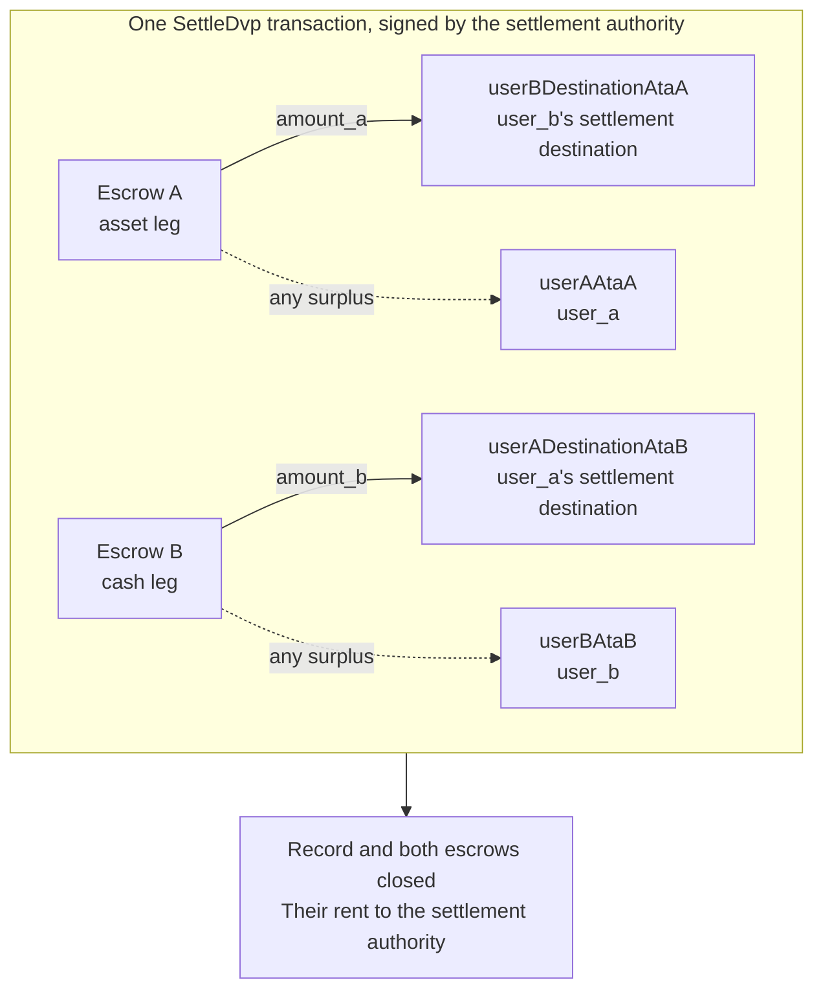

`SettleDvp` is signed by the settlement authority named in the trade record. In
one transaction it moves `amount_a` of the asset leg to the cash-leg party's
destination and `amount_b` of the cash leg to the asset-leg party's destination,
returns any surplus in either escrow to the leg's party, and closes the record
and both escrows. If any of those transfers cannot complete, the instruction
fails and nothing moves.

This page continues from [create a trade](/docs/defi/dvp-program/create-a-trade)
and [fund the legs](/docs/defi/dvp-program/fund-the-legs); the client, signers,
`trade`, and the parties' token accounts carry over.

## Re-validate before signing

The settlement authority signs the transaction that moves both legs, so it
performs the same read as each party before it signs: owner, size, parties,
mints, amounts, expiry, and both destinations (see
[fund the legs](/docs/defi/dvp-program/fund-the-legs#verify-the-terms)). The
program itself re-checks at settlement that each mint still belongs to the token
program recorded at creation, carries no blocked extension, and has the same
mint authority as when the trade was created, so a mint recreated with a blocked
extension, a different token program, or a different mint authority cannot
settle.

## Create the recipient accounts

Settle writes to four token accounts that the program does not create:

| Account                | Receives                     | Owner                           |
| ---------------------- | ---------------------------- | ------------------------------- |
| `userADestinationAtaB` | The cash leg (`amount_b`)    | `user_a_settlement_destination` |
| `userBDestinationAtaA` | The asset leg (`amount_a`)   | `user_b_settlement_destination` |
| `userAAtaA`            | Any surplus on the asset leg | `user_a`                        |
| `userBAtaB`            | Any surplus on the cash leg  | `user_b`                        |

The surplus accounts are only used when an escrow holds more than the agreed
amount, but anyone holding the mint can create a surplus by sending a few base
units into the escrow. If the refund account doesn't exist, the whole Settle
fails, so create all four idempotently in the same transaction.

<Tabs items={["TypeScript", "Rust"]}>
  <Tab value="TypeScript">
    ```ts
    import {
      findAssociatedTokenPda,
      getCreateAssociatedTokenIdempotentInstruction,
    } from "@solana-program/token-2022";

    const destinationA = t.userASettlementDestination; // defaults to userA
    const destinationB = t.userBSettlementDestination; // defaults to userB

    const [userADestinationAtaB] = await findAssociatedTokenPda({
      mint: mintB,
      owner: destinationA,
      tokenProgram: tokenProgramB,
    });
    const [userBDestinationAtaA] = await findAssociatedTokenPda({
      mint: mintA,
      owner: destinationB,
      tokenProgram: tokenProgramA,
    });
    // userAAtaA and userBAtaB are from fund the legs.

    const createRecipientAccounts = [
      { ata: userADestinationAtaB, owner: destinationA, mint: mintB, tokenProgram: tokenProgramB },
      { ata: userBDestinationAtaA, owner: destinationB, mint: mintA, tokenProgram: tokenProgramA },
      { ata: userAAtaA, owner: userA, mint: mintA, tokenProgram: tokenProgramA },
      { ata: userBAtaB, owner: userB, mint: mintB, tokenProgram: tokenProgramB },
    ].map(({ ata, owner, mint, tokenProgram }) =>
      getCreateAssociatedTokenIdempotentInstruction({
        payer: authoritySigner,
        ata,
        owner,
        mint,
        tokenProgram,
      }),
    );
    ```

  </Tab>

  <Tab value="Rust">
    ```rust
    use spl_associated_token_account_client::address::get_associated_token_address_with_program_id;
    use spl_associated_token_account_client::instruction::create_associated_token_account_idempotent;

    let authority: Pubkey = pubkey!("SETTLEMENT_AUTHORITY_ADDRESS_HERE");
    let destination_a = trade.user_a_settlement_destination; // defaults to user_a
    let destination_b = trade.user_b_settlement_destination; // defaults to user_b

    let user_a_destination_ata_b =
        get_associated_token_address_with_program_id(&destination_a, &mint_b, &token_program_b);
    let user_b_destination_ata_a =
        get_associated_token_address_with_program_id(&destination_b, &mint_a, &token_program_a);
    let user_a_ata_a = get_associated_token_address_with_program_id(&user_a, &mint_a, &token_program_a);
    let user_b_ata_b = get_associated_token_address_with_program_id(&user_b, &mint_b, &token_program_b);

    let create_recipient_accounts = [
        create_associated_token_account_idempotent(&authority, &destination_a, &mint_b, &token_program_b),
        create_associated_token_account_idempotent(&authority, &destination_b, &mint_a, &token_program_a),
        create_associated_token_account_idempotent(&authority, &user_a, &mint_a, &token_program_a),
        create_associated_token_account_idempotent(&authority, &user_b, &mint_b, &token_program_b),
    ];
    ```

  </Tab>
</Tabs>

## Settle

`legAExtrasCount` tells the program how many of the accounts appended after the
fixed list belong to the asset leg's transfer hook; the rest go to the cash
leg's. For mints without transfer hooks, pass zero and append nothing. The memo
program account is required by the instruction and is used only for destinations
that require a memo.

<Tabs items={["TypeScript", "Rust"]}>
  <Tab value="TypeScript">
    ```ts
    import { MEMO_PROGRAM_ADDRESS } from "@solana-program/memo";
    import { getSettleDvpInstruction } from "./dvp";

    const settleInstruction = getSettleDvpInstruction({
      settlementAuthority: authoritySigner,
      swapDvp,
      mintA,
      mintB,
      dvpAtaA: escrowA,
      dvpAtaB: escrowB,
      userADestinationAtaB,
      userBDestinationAtaA,
      userAAtaA,
      userBAtaB,
      tokenProgramA,
      tokenProgramB,
      memoProgram: MEMO_PROGRAM_ADDRESS,
      legAExtrasCount: 0,
    });

    const { context: settleContext } = await client.sendTransaction([
      ...createRecipientAccounts,
      settleInstruction,
    ]);
    const settleSignature = settleContext.signature;
    console.log("Submitted:", settleSignature);

    // sendTransaction returns at the client's commitment (confirmed by default).
    // Wait for finalized before recording the trade as settled.
    for (;;) {
      const {
        value: [status],
      } = await client.rpc.getSignatureStatuses([settleSignature]).send();
      if (status?.err) {
        throw new Error("Settle transaction failed");
      }
      if (status?.confirmationStatus === "finalized") {
        break;
      }
      await new Promise((resolve) => setTimeout(resolve, 2_000));
    }
    console.log("Settled:", settleSignature);
    ```

  </Tab>

  <Tab value="Rust">
    ```rust
    use dvp_swap_program_client::instructions::SettleDvpBuilder;

    const MEMO_PROGRAM_ID: Pubkey = pubkey!("MemoSq4gqABAXKb96qnH8TysNcWxMyWCqXgDLGmfcHr");

    let settle_ix = SettleDvpBuilder::new()
        .settlement_authority(authority)
        .swap_dvp(swap_dvp)
        .mint_a(mint_a)
        .mint_b(mint_b)
        .dvp_ata_a(escrow_a)
        .dvp_ata_b(escrow_b)
        .user_a_destination_ata_b(user_a_destination_ata_b)
        .user_b_destination_ata_a(user_b_destination_ata_a)
        .user_a_ata_a(user_a_ata_a)
        .user_b_ata_b(user_b_ata_b)
        .token_program_a(token_program_a)
        .token_program_b(token_program_b)
        .memo_program(MEMO_PROGRAM_ID)
        .leg_a_extras_count(0)
        .instruction();
    ```

  </Tab>
</Tabs>



### Transfer hooks

The generated IDL lists only the fixed accounts, so the generated builders do
not know about hook accounts. Resolve each hook mint's extra account metas the
same way you would for a direct transfer of that token, then append them to the
instruction: the asset leg's accounts first, then the cash leg's, with
`legAExtrasCount` set to the number in the first group. In TypeScript, spread
the resolved metas onto the instruction's `accounts` array; in Rust, use
`add_remaining_accounts` on the builder. The cap is 32 accounts per leg,
including the hook program and validation account; the transaction account limit
can bind first when both legs carry hooks. The program strips the signer flag
from every forwarded account, so a hook cannot obtain the settlement authority's
signature through this path.

## Record the result

Treat the trade as settled when the Settle transaction reaches `finalized`. The
record and both escrows no longer exist after settlement, so a system that needs
the terms later stores them from its pre-settlement read or from the creating
transaction. The rent of the closed accounts has gone to the settlement
authority.

## Settle errors

`LegNotFunded` means an escrow holds less than its agreed amount; `DvpExpired`
and `SettlementTooEarly` mean the time window was missed; `MintAuthorityChanged`
and `BlockedMintExtension` mean a mint changed after creation;
`RecipientAtaMismatch` means a destination or refund token account is missing or
no longer belongs to the expected owner and mint, usually because the
create-account step above was skipped. In every case nothing has moved, and the
parties can unwind, subject to the mint's authorities (see
[unwind a trade](/docs/defi/dvp-program/unwind-a-trade)).

## Next steps

- [Unwind a trade](/docs/defi/dvp-program/unwind-a-trade) - recovering funded
  legs when a trade does not settle
