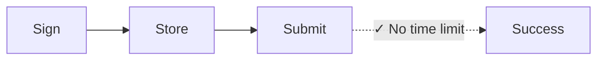
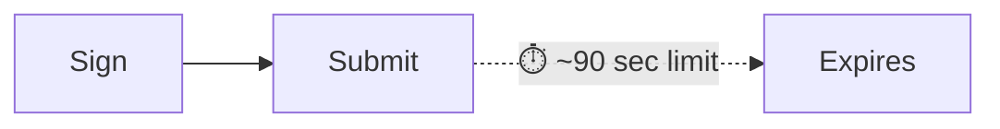

Every Solana transaction includes a recent blockhash—a reference to a recent
network state that proves the transaction was created "now." The network rejects
any transaction with a blockhash older than ~150 blocks (~60-90 seconds),
preventing replay attacks and stale submissions. This works perfectly for
real-time payments. But it breaks workflows that need a gap between signing and
submission, such as:

| Scenario                   | Why Standard Transactions Fail                                            |
| -------------------------- | ------------------------------------------------------------------------- |
| **Treasury operations**    | CFO in Tokyo signs, Controller in NYC approves—90 seconds isn't enough    |
| **Compliance workflows**   | Transactions need legal/compliance review before execution                |
| **Cold storage signing**   | Air-gapped machines require manual transfer of signed transactions        |
| **Batch preparation**      | Prepare payroll or disbursements during business hours, execute overnight |
| **Multi-sig coordination** | Multiple approvers across time zones                                      |
| **Scheduled payments**     | Schedule payments to be executed at a future date                         |

In traditional finance, a signed check doesn't expire in 90 seconds. Certain
blockchain operations shouldn't either. **Durable nonces** solve this by
replacing the recent blockhash with a stored, persistent value that only
advances when you use it—giving you transactions that stay valid until you're
ready to submit.

## How It Works

Instead of a recent blockhash (valid ~150 blocks), you use a **nonce account**,
a special account that stores a _unique_ value which can be used in place of a
blockhash. Each transaction using this nonce must "advance" it as the first
instruction. Each nonce value can only be used for one transaction.





<Callout type="info">
  The nonce account costs ~0.0015 SOL for rent exemption. One nonce account =
  one pending transaction at a time. For parallel workflows, create multiple
  nonce accounts.
</Callout>

### Create a Nonce Account

Creating a nonce account requires two instructions in a single transaction:

1. **Create the account** using `getCreateAccountInstruction` from the System
   Program
2. **Initialize it as a nonce** using `getInitializeNonceAccountInstruction`

<ScrollyCoding>

## !!steps Generate Keypair

Generate a new keypair to use as the nonce account address and calculate the
required space and rent.

<CodePlaceholder title="Create Nonce Account" />

```ts !! title="Create Nonce Account"
const nonceKeypair = await generateKeyPairSigner();
const nonceSpace = BigInt(getNonceSize());
const nonceRent = await rpc
  .getMinimumBalanceForRentExemption(nonceSpace)
  .send();
```

## !!steps Create Account Instruction

Create the account owned by the System Program with enough lamports for rent
exemption.

<CodePlaceholder title="Create Nonce Account" />

```ts !! title="Create Nonce Account"
const nonceKeypair = await generateKeyPairSigner();
const nonceSpace = BigInt(getNonceSize());
const nonceRent = await rpc
  .getMinimumBalanceForRentExemption(nonceSpace)
  .send();

// !focus(1:7)
const createNonceAccountIx = getCreateAccountInstruction({
  payer: sender,
  newAccount: nonceKeypair,
  lamports: nonceRent,
  space: nonceSpace,
  programAddress: SYSTEM_PROGRAM_ADDRESS
});
```

## !!steps Initialize Nonce Instruction

Initialize the account as a nonce account, setting the authority that can
advance it.

<CodePlaceholder title="Create Nonce Account" />

```ts !! title="Create Nonce Account"
const nonceKeypair = await generateKeyPairSigner();
const nonceSpace = BigInt(getNonceSize());
const nonceRent = await rpc
  .getMinimumBalanceForRentExemption(nonceSpace)
  .send();

const createNonceAccountIx = getCreateAccountInstruction({
  payer: sender,
  newAccount: nonceKeypair,
  lamports: nonceRent,
  space: nonceSpace,
  programAddress: SYSTEM_PROGRAM_ADDRESS
});

// !focus(1:4)
const initNonceIx = getInitializeNonceAccountInstruction({
  nonceAccount: nonceKeypair.address,
  nonceAuthority: sender.address
});
```

## !!steps Build Transaction

Build a transaction with both instructions.

<CodePlaceholder title="Create Nonce Account" />

```ts !! title="Create Nonce Account"
const nonceKeypair = await generateKeyPairSigner();
const nonceSpace = BigInt(getNonceSize());
const nonceRent = await rpc
  .getMinimumBalanceForRentExemption(nonceSpace)
  .send();

const createNonceAccountIx = getCreateAccountInstruction({
  payer: sender,
  newAccount: nonceKeypair,
  lamports: nonceRent,
  space: nonceSpace,
  programAddress: SYSTEM_PROGRAM_ADDRESS
});

const initNonceIx = getInitializeNonceAccountInstruction({
  nonceAccount: nonceKeypair.address,
  nonceAuthority: sender.address
});

// !focus(1:7)
const { value: blockhash } = await rpc.getLatestBlockhash().send();
const createNonceTx = pipe(
  createTransactionMessage({ version: 0 }),
  (tx) => setTransactionMessageFeePayerSigner(sender, tx),
  (tx) => setTransactionMessageLifetimeUsingBlockhash(blockhash, tx),
  (tx) =>
    appendTransactionMessageInstructions(
      [createNonceAccountIx, initNonceIx],
      tx
    )
);
```

## !!steps Sign and Send

Sign and send the transaction to create and initialize the nonce account.

<CodePlaceholder title="Create Nonce Account" />

```ts !! title="Create Nonce Account"
const nonceKeypair = await generateKeyPairSigner();
const nonceSpace = BigInt(getNonceSize());
const nonceRent = await rpc
  .getMinimumBalanceForRentExemption(nonceSpace)
  .send();

const createNonceAccountIx = getCreateAccountInstruction({
  payer: sender,
  newAccount: nonceKeypair,
  lamports: nonceRent,
  space: nonceSpace,
  programAddress: SYSTEM_PROGRAM_ADDRESS
});

const initNonceIx = getInitializeNonceAccountInstruction({
  nonceAccount: nonceKeypair.address,
  nonceAuthority: sender.address
});

const { value: blockhash } = await rpc.getLatestBlockhash().send();
const createNonceTx = pipe(
  createTransactionMessage({ version: 0 }),
  (tx) => setTransactionMessageFeePayerSigner(sender, tx),
  (tx) => setTransactionMessageLifetimeUsingBlockhash(blockhash, tx),
  (tx) =>
    appendTransactionMessageInstructions(
      [createNonceAccountIx, initNonceIx],
      tx
    )
);

// !focus(1:6)
const signedCreateNonceTx =
  await signTransactionMessageWithSigners(createNonceTx);

await sendAndConfirmTransactionFactory({ rpc, rpcSubscriptions })(
  signedCreateNonceTx,
  { commitment: "confirmed" }
);
```

</ScrollyCoding>

### Build a Deferred Transaction

Instead of a recent blockhash, use the nonce account's `blockhash` as the
transaction's lifetime.

<ScrollyCoding>

## !!steps Fetch the Nonce

Fetch the data from the nonce account. Use the `blockhash` from the nonce
account as the transaction's lifetime.

```sh title="Example Nonce Account Data"
{
  version: 1,
  state: 1,
  authority: 'HgjaL8artMtmntaQDVM2UBk3gppsYYERS4PkUhiaLZD1',
  # !mark
  blockhash: '5U7seXqfgZx1uh5DFhdH1vyBhr7XGRrKxBAnJJTbbUa',
  lamportsPerSignature: 5000n
}
```

<CodePlaceholder title="Build Deferred Transaction" />

```ts !! title="Build Deferred Transaction"
// !focus(1:1)
const { data: nonceData } = await fetchNonce(rpc, nonceKeypair.address);
```

## !!steps Create Transfer Instruction

Create the instruction for your payment. This example shows a token transfer.

<CodePlaceholder title="Build Deferred Transaction" />

```ts !! title="Build Deferred Transaction"
const { data: nonceData } = await fetchNonce(rpc, nonceKeypair.address);

// !focus(1:6)
const transferInstruction = getTransferInstruction({
  source: senderAta,
  destination: recipientAta,
  authority: sender.address,
  amount: 250_000n
});
```

## !!steps Build Transaction with Durable Nonce

Use `setTransactionMessageLifetimeUsingDurableNonce` which sets the nonce as the
blockhash and automatically prepends the advance nonce instruction.

<CodePlaceholder title="Build Deferred Transaction" />

```ts !! title="Build Deferred Transaction"
const { data: nonceData } = await fetchNonce(rpc, nonceKeypair.address);

const transferInstruction = getTransferInstruction({
  source: senderAta,
  destination: recipientAta,
  authority: sender.address,
  amount: 250_000n
});

// !focus(1:14)
const transactionMessage = pipe(
  createTransactionMessage({ version: 0 }),
  (tx) => setTransactionMessageFeePayerSigner(sender, tx),
  (tx) =>
    // !mark(1:8)
    setTransactionMessageLifetimeUsingDurableNonce(
      {
        nonce: nonceData.blockhash as Nonce,
        nonceAccountAddress: nonceKeypair.address,
        nonceAuthorityAddress: nonceData.authority
      },
      tx
    ),
  (tx) => appendTransactionMessageInstructions([transferInstruction], tx)
);
```

## !!steps Sign Transaction

Sign the transaction. It now uses the durable nonce instead of a standard
blockhash.

<CodePlaceholder title="Build Deferred Transaction" />

```ts !! title="Build Deferred Transaction"
const { data: nonceData } = await fetchNonce(rpc, nonceKeypair.address);

const transferInstruction = getTransferInstruction({
  source: senderAta,
  destination: recipientAta,
  authority: sender.address,
  amount: 250_000n
});

const transactionMessage = pipe(
  createTransactionMessage({ version: 0 }),
  (tx) => setTransactionMessageFeePayerSigner(sender, tx),
  (tx) =>
    setTransactionMessageLifetimeUsingDurableNonce(
      {
        nonce: nonceData.blockhash as Nonce,
        nonceAccountAddress: nonceKeypair.address,
        nonceAuthorityAddress: nonceData.authority
      },
      tx
    ),
  (tx) => appendTransactionMessageInstructions([transferInstruction], tx)
);

// !focus(1:2)
const signedTransaction =
  await signTransactionMessageWithSigners(transactionMessage);
```

</ScrollyCoding>

### Store or Send Transaction

After signing, encode the transaction for storage. When ready, send it to the
network.

<ScrollyCoding>

## !!steps Encode for Storage

Encode the signed transaction to base64. Store this value in your database.

<CodePlaceholder title="Store and Execute" />

```ts !! title="Store and Execute"
const signedTransaction =
  await signTransactionMessageWithSigners(transactionMessage);

// !focus(1:2)
const base64EncodedTransaction =
  getBase64EncodedWireTransaction(signedTransaction);

// Store base64EncodedTransaction in your database
```

## !!steps Send Transaction

Send the signed transaction when ready. The transaction remains valid until the
nonce is advanced.

<CodePlaceholder title="Store and Execute" />

```ts !! title="Store and Execute"
const signedTransaction =
  await signTransactionMessageWithSigners(transactionMessage);

const base64EncodedTransaction =
  getBase64EncodedWireTransaction(signedTransaction);

// When ready to execute (could be days later):
// !focus(1:3)
await rpc
  .sendTransaction(base64EncodedTransaction, { encoding: "base64" })
  .send();
```

</ScrollyCoding>

### Demo

<CodeTabs flags="r">

```ts !! title="Demo"
// !collapse(1:39) collapsed
// Click ">" icon on left to expand demo imports
import {
  airdropFactory,
  appendTransactionMessageInstructions,
  assertIsTransactionWithBlockhashLifetime,
  assertIsTransactionWithDurableNonceLifetime,
  createSolanaRpc,
  createSolanaRpcSubscriptions,
  createTransactionMessage,
  generateKeyPairSigner,
  getSignatureFromTransaction,
  lamports,
  type Nonce,
  pipe,
  sendAndConfirmTransactionFactory,
  setTransactionMessageFeePayerSigner,
  setTransactionMessageLifetimeUsingBlockhash,
  setTransactionMessageLifetimeUsingDurableNonce,
  signTransactionMessageWithSigners,
  type KeyPairSigner,
  getBase64EncodedWireTransaction
} from "@solana/kit";
import {
  fetchNonce,
  getCreateAccountInstruction,
  getInitializeNonceAccountInstruction,
  getNonceSize,
  SYSTEM_PROGRAM_ADDRESS
} from "@solana-program/system";
import {
  getCreateAssociatedTokenInstructionAsync,
  getInitializeMintInstruction,
  getMintSize,
  TOKEN_2022_PROGRAM_ADDRESS,
  findAssociatedTokenPda,
  getMintToInstruction,
  getTransferInstruction
} from "@solana-program/token-2022";

// Generate keypairs for sender and recipient
const sender = await generateKeyPairSigner();
const recipient = await generateKeyPairSigner();

console.log("Sender Address:", sender.address);
console.log("Recipient Address:", recipient.address);

// Demo Setup: Create RPC connection, mint, and token accounts
const { rpc, rpcSubscriptions, mint } = await demoSetup(sender, recipient);

// =============================================================================
// Step 1: Create a Nonce Account
// =============================================================================

// !mark
const nonceKeypair = await generateKeyPairSigner();
console.log("\nNonce Account Address:", nonceKeypair.address);

// !mark(1:4)
const nonceSpace = BigInt(getNonceSize());
const nonceRent = await rpc
  .getMinimumBalanceForRentExemption(nonceSpace)
  .send();

// Instruction to create new account for the nonce
// !mark(1:7)
const createNonceAccountIx = getCreateAccountInstruction({
  payer: sender,
  newAccount: nonceKeypair,
  lamports: nonceRent,
  space: nonceSpace,
  programAddress: SYSTEM_PROGRAM_ADDRESS
});

// Instruction to initialize the nonce account
// !mark(1:4)
const initNonceIx = getInitializeNonceAccountInstruction({
  nonceAccount: nonceKeypair.address,
  nonceAuthority: sender.address
});

// Build and send nonce account creation transaction
const { value: blockhash } = await rpc.getLatestBlockhash().send();
const createNonceTx = pipe(
  createTransactionMessage({ version: 0 }),
  (tx) => setTransactionMessageFeePayerSigner(sender, tx),
  (tx) => setTransactionMessageLifetimeUsingBlockhash(blockhash, tx),
  (tx) =>
    appendTransactionMessageInstructions(
      [createNonceAccountIx, initNonceIx],
      tx
    )
);

const signedCreateNonceTx =
  await signTransactionMessageWithSigners(createNonceTx);
assertIsTransactionWithBlockhashLifetime(signedCreateNonceTx);

await sendAndConfirmTransactionFactory({ rpc, rpcSubscriptions })(
  signedCreateNonceTx,
  { commitment: "confirmed" }
);

console.log("Nonce Account created.");

// =============================================================================
// Step 2: Token Payment with Durable Nonce
// =============================================================================

// Fetch current nonce value from the nonce account
// !mark
const { data: nonceData } = await fetchNonce(rpc, nonceKeypair.address);
console.log("Nonce Account data:", nonceData);

const [senderAta] = await findAssociatedTokenPda({
  mint: mint.address,
  owner: sender.address,
  tokenProgram: TOKEN_2022_PROGRAM_ADDRESS
});

const [recipientAta] = await findAssociatedTokenPda({
  mint: mint.address,
  owner: recipient.address,
  tokenProgram: TOKEN_2022_PROGRAM_ADDRESS
});

console.log("\nMint Address:", mint.address);
console.log("Sender Token Account:", senderAta);
console.log("Recipient Token Account:", recipientAta);

const transferInstruction = getTransferInstruction({
  source: senderAta,
  destination: recipientAta,
  authority: sender.address,
  amount: 250_000n // 0.25 tokens
});

// Create transaction message using durable nonce lifetime
// setTransactionMessageLifetimeUsingDurableNonce automatically prepends
// the AdvanceNonceAccount instruction
const transactionMessage = pipe(
  createTransactionMessage({ version: 0 }),
  (tx) => setTransactionMessageFeePayerSigner(sender, tx),
  (tx) =>
    // !mark(1:8)
    setTransactionMessageLifetimeUsingDurableNonce(
      {
        nonce: nonceData.blockhash as string as Nonce,
        nonceAccountAddress: nonceKeypair.address,
        nonceAuthorityAddress: nonceData.authority
      },
      tx
    ),
  (tx) => appendTransactionMessageInstructions([transferInstruction], tx)
);

const signedTransaction =
  await signTransactionMessageWithSigners(transactionMessage);
assertIsTransactionWithDurableNonceLifetime(signedTransaction);
const transactionSignature = getSignatureFromTransaction(signedTransaction);

// Encode the transaction to base64, optionally save and send at a later time
// !mark(1:2)
const base64EncodedTransaction =
  getBase64EncodedWireTransaction(signedTransaction);
console.log("\nBase64 Encoded Transaction:", base64EncodedTransaction);

// Send the encoded transaction, blockhash does not expire
// !mark(1:6)
await rpc
  .sendTransaction(base64EncodedTransaction, {
    encoding: "base64",
    skipPreflight: true
  })
  .send();

console.log("\n=== Token Payment with Durable Nonce Complete ===");
console.log("Transaction Signature:", transactionSignature);

// =============================================================================
// Demo Setup Helper Function
// =============================================================================
// !collapse(1:1000) collapsed

/**
 * Sets up for a token transfer demo:
 * - Creates RPC connection
 * - Airdrops SOL to sender for transaction fees
 * - Generates mint keypair and creates/initializes mint account
 * - Creates associated token accounts for sender and recipient
 * - Mints initial tokens to sender
 *
 * @param sender - The sender's keypair (will be funded and used as mint authority)
 * @param recipient - The recipient's keypair
 * @returns RPC connection and mint address
 */
async function demoSetup(sender: KeyPairSigner, recipient: KeyPairSigner) {
  const rpc = createSolanaRpc("http://localhost:8899");
  const rpcSubscriptions = createSolanaRpcSubscriptions("ws://localhost:8900");

  // Fund sender with SOL for transaction fees
  await airdropFactory({ rpc, rpcSubscriptions })({
    recipientAddress: sender.address,
    lamports: lamports(1_000_000_000n),
    commitment: "confirmed"
  });

  // Create Mint and Token Accounts
  const mint = await generateKeyPairSigner();

  const mintSpace = BigInt(getMintSize());
  const mintRent = await rpc
    .getMinimumBalanceForRentExemption(mintSpace)
    .send();

  const createMintAccountIx = getCreateAccountInstruction({
    payer: sender,
    newAccount: mint,
    lamports: mintRent,
    space: mintSpace,
    programAddress: TOKEN_2022_PROGRAM_ADDRESS
  });

  const initializeMintIx = getInitializeMintInstruction({
    mint: mint.address,
    decimals: 6,
    mintAuthority: sender.address
  });

  const [senderAta] = await findAssociatedTokenPda({
    mint: mint.address,
    owner: sender.address,
    tokenProgram: TOKEN_2022_PROGRAM_ADDRESS
  });

  const createSenderAtaIx = await getCreateAssociatedTokenInstructionAsync({
    payer: sender,
    mint: mint.address,
    owner: sender.address
  });

  const createRecipientAtaIx = await getCreateAssociatedTokenInstructionAsync({
    payer: sender,
    mint: mint.address,
    owner: recipient.address
  });

  const mintToIx = getMintToInstruction({
    mint: mint.address,
    token: senderAta,
    mintAuthority: sender.address,
    amount: 1_000_000n // Mint 1.00 tokens (1,000,000 base units with 6 decimals)
  });

  const { value: latestBlockhash } = await rpc.getLatestBlockhash().send();

  const instructions = [
    createMintAccountIx,
    initializeMintIx,
    createSenderAtaIx,
    createRecipientAtaIx,
    mintToIx
  ];

  const transactionMessage = pipe(
    createTransactionMessage({ version: 0 }),
    (tx) => setTransactionMessageFeePayerSigner(sender, tx),
    (tx) => setTransactionMessageLifetimeUsingBlockhash(latestBlockhash, tx),
    (tx) => appendTransactionMessageInstructions(instructions, tx)
  );

  const signedTransaction =
    await signTransactionMessageWithSigners(transactionMessage);

  assertIsTransactionWithBlockhashLifetime(signedTransaction);

  await sendAndConfirmTransactionFactory({ rpc, rpcSubscriptions })(
    signedTransaction,
    { commitment: "confirmed" }
  );

  return { rpc, rpcSubscriptions, mint };
}
```

</CodeTabs>

## Invalidate a Pending Transaction

Each nonce account `blockhash` can only be used once. To invalidate a pending
transaction or prepare the nonce account for reuse, advance it manually:

```ts
import { getAdvanceNonceAccountInstruction } from "@solana-program/system";

// Submit this instruction (with a regular blockhash) to invalidate any pending transaction
getAdvanceNonceAccountInstruction({
  nonceAccount: nonceAddress,
  nonceAuthority
});
```

This generates a new nonce value, making any transaction signed with the old
value permanently invalid.

## Multi-Party Approval Workflow

Deserialize the transaction to add additional signatures, then serialize again
for storage or submission:

```ts
import {
  getBase64Decoder,
  getTransactionDecoder,
  getBase64EncodedWireTransaction,
  partiallySignTransaction
} from "@solana/kit";

// Deserialize the stored transaction
const txBytes = getBase64Decoder().decode(serializedString);
const partiallySignedTx = getTransactionDecoder().decode(txBytes);

// Each approver adds their signature
const fullySignedTx = await partiallySignTransaction(
  [newSigner],
  partiallySignedTx
);

// Serialize again for storage or submission
const serialized = getBase64EncodedWireTransaction(fullySignedTx);
```

The transaction can be serialized, stored, and passed between approvers. Once
all required signatures are collected, submit to the network.

## Production Considerations

**Nonce account management:**

- Create a pool of nonce accounts for parallel transaction preparation
- Track which nonces are "in use" (have pending signed transactions)
- Implement nonce recycling after transactions are submitted or abandoned

**Security:**

- The nonce authority controls whether transactions can be invalidated. Consider
  separating nonce authority from transaction signers for additional control and
  separation of duties
- _Anyone_ with the serialized transaction bytes can submit it to the network

## Related Resources

- [Introduction to Durable Nonces](https://solana.com/developers/guides/advanced/introduction-to-durable-nonces)
