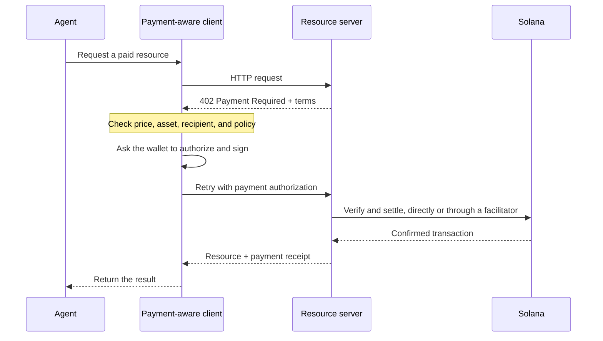

Agentic payments let software discover a price, authorize a payment, and receive
a resource in the same HTTP workflow. An agent can pay for a data query, model
inference, or tool call without first creating a billing account or copying an
API key.

Solana makes low-value, high-frequency payments practical, but the protocol is
only one part of a safe system. The application still needs spending limits,
trusted signing, and rules for which services an agent may use.

[Pay](https://pay.sh) is a payment-aware client for agents and command-line
tools. It can discover an MPP or x402 challenge, request local approval, and
retry the API request with payment proof.

<Cards>
  <Card
    title="Get an agent to pay for an API request"
    href="/docs/payments/agentic-payments/quickstart"
  >
    Launch an agent with Pay and make one sandbox-paid API request.
  </Card>
  <Card title="MPP" href="/docs/payments/agentic-payments/mpp">
    Use HTTP authentication for one-time charges and metered payment sessions.
  </Card>
  <Card title="x402" href="/docs/payments/agentic-payments/intro-to-x402">
    Add x402 V2 payment requirements, signatures, and settlement to an HTTP
    resource.
  </Card>
</Cards>

## The common payment flow

MPP and x402 use different headers and data models, but their basic HTTP flow is
similar:

The payment-aware client should treat every challenge as untrusted input. It
must check the amount, accepted asset, network, recipient, expiry, and requested
resource before asking a wallet to sign.

## MPP and x402

Both protocols can settle stablecoin payments on Solana. Choose based on the
payment model and interoperability your service needs, not only the shared `402`
status code.

|                         | MPP                                                               | x402                                                                     |
| ----------------------- | ----------------------------------------------------------------- | ------------------------------------------------------------------------ |
| Challenge               | `WWW-Authenticate: Payment`                                       | `PAYMENT-REQUIRED`                                                       |
| Client authorization    | `Authorization: Payment`                                          | `PAYMENT-SIGNATURE`                                                      |
| Receipt                 | `Payment-Receipt`                                                 | `PAYMENT-RESPONSE`                                                       |
| Solana payment models   | One-time `charge` and capped, metered `session` intents           | Schemes such as `exact` and `upto`; support varies by network and client |
| Settlement architecture | Server validation, or an optional relay or gateway                | Resource server with local verification or a facilitator                 |
| Good starting point     | APIs that need HTTP authentication semantics or repeated metering | Pay-per-request resources and existing x402 clients                      |

MPP is the **Machine Payments Protocol**. Do not confuse it with the **Model
Context Protocol (MCP)**. MCP exposes tools and resources to agents; MPP or x402
can require payment when an agent invokes one of those tools.

<Callout type="info">
  A service may advertise more than one protocol. The client selects a payment
  option it supports, then uses the matching challenge, authorization, and
  receipt headers for the entire exchange.
</Callout>

## Buyer and seller responsibilities

### If your agent pays

- Put a maximum amount on each payment and a daily or session budget on the
  wallet.
- Allowlist networks, assets, recipients, and services when the workflow is
  predictable.
- Keep private keys outside the model process. Give the agent a constrained
  signing interface instead.
- Show or log the quoted price before signing, and retain the receipt after a
  successful response.
- Do not automatically retry a payment unless the client can prove the first
  authorization was not accepted.

### If your API charges

- Bind each challenge to the exact method, URL, amount, recipient, and expiry.
- Verify the signed transaction or authorization before returning the paid
  resource.
- Prevent replay with a durable store and an atomic consume operation.
- Make fulfillment idempotent. A retried request must not deliver or charge
  twice.
- Keep fee-payer and settlement keys in production signing infrastructure, not
  application environment files.
- Record challenge IDs, transaction signatures, settlement status, and failure
  reasons without logging credentials or private keys.

Continue with the [quickstart](/docs/payments/agentic-payments/quickstart), then
use the protocol guide that matches your integration.
