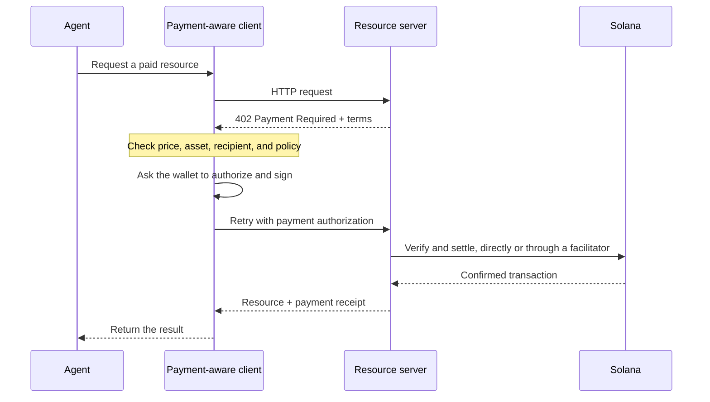

Agentic payments let software discover a price, authorize a payment, and receive
a resource in the same HTTP workflow. An agent can pay for a data query, model
inference, or tool call without first creating a billing account or copying an
API key.

<Cards>
  <Card title="MPP" href="/docs/payments/agentic-payments/mpp">
    Use HTTP authentication for one-time charges and metered payment sessions.
  </Card>
  <Card title="x402" href="/docs/payments/agentic-payments/x402">
    Add x402 V2 payment requirements, signatures, and settlement to an HTTP
    resource.
  </Card>
</Cards>

## The common payment flow

MPP and x402 use different headers and data models, but their basic HTTP flow is
similar:

## MPP and x402

Both protocols can settle stablecoin payments on Solana. Choose based on the
payment model and interoperability your service needs, not only the shared `402`
status code.

|                         | MPP                                                               | x402                                                                     |
| ----------------------- | ----------------------------------------------------------------- | ------------------------------------------------------------------------ |
| Challenge               | `WWW-Authenticate: Payment`                                       | `PAYMENT-REQUIRED`                                                       |
| Client authorization    | `Authorization: Payment`                                          | `PAYMENT-SIGNATURE`                                                      |
| Receipt                 | `Payment-Receipt`                                                 | `PAYMENT-RESPONSE`                                                       |
| Solana payment models   | One-time `charge` and capped, metered `session` intents           | Schemes such as `exact` and `upto`; support varies by network and client |
| Settlement architecture | Server validation, or an optional relay or gateway                | Resource server with local verification or a facilitator                 |
| Good starting point     | APIs that need HTTP authentication semantics or repeated metering | Pay-per-request resources and existing x402 clients                      |

MPP is the **Machine Payments Protocol**. Do not confuse it with the **Model
Context Protocol (MCP)**. MCP exposes tools and resources to agents; MPP or x402
can require payment when an agent invokes one of those tools.

<Callout type="info">
  A service may advertise more than one protocol. The client selects a payment
  option it supports, then uses the matching challenge, authorization, and
  receipt headers for the entire exchange.
</Callout>
