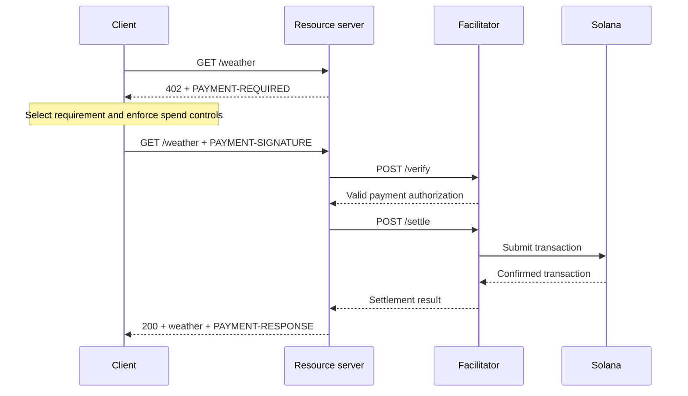

[x402](https://www.x402.org/) is an open payment protocol for internet
resources. A resource server returns `402 Payment Required` with acceptable
payment options, and a compatible client signs one option and retries the
request.

This guide uses x402 V2. V1 integrations used headers such as `X-PAYMENT` and
network names such as `solana-devnet`. Do not use those V1 fields in a new
integration.

## Protocol roles

x402 separates the HTTP application from settlement infrastructure:

- The **client** requests a resource, selects a supported payment requirement,
  signs a payment payload, and retries.
- The **resource server** describes the resource and its accepted payments. It
  fulfills the request only after verification succeeds.
- The **facilitator** optionally verifies payment payloads and submits
  transactions. A resource server can also self-facilitate.

## HTTP V2 flow

The HTTP transport carries base64-encoded protocol objects in three headers:

| Direction        | Header              | Value                                  |
| ---------------- | ------------------- | -------------------------------------- |
| Server to client | `PAYMENT-REQUIRED`  | A `PaymentRequired` object             |
| Client to server | `PAYMENT-SIGNATURE` | A signed `PaymentPayload`              |
| Server to client | `PAYMENT-RESPONSE`  | The verification and settlement result |



The protocol objects are transport data. Do not parse or assemble the encoded
headers with string concatenation; use an x402 client or server library.

## Solana networks and assets

x402 V2 identifies networks with
[CAIP-2](https://chainagnostic.org/CAIPs/caip-2) identifiers:

| Network | Identifier                                |
| ------- | ----------------------------------------- |
| Mainnet | `solana:5eykt4UsFv8P8NJdTREpY1vzqKqZKvdp` |
| Devnet  | `solana:EtWTRABZaYq6iMfeYKouRu166VU2xqa1` |

Solana requirements identify the SPL or Token-2022 mint in `asset`, the
recipient in `payTo`, and the amount in token base units. If you accept a price
string such as `"$0.01"`, the server library resolves it to its configured
default stablecoin.

The main Solana schemes are:

- **`exact`**: The client authorizes the exact amount in the requirement. Use it
  for fixed-price resources and per-request API calls.
- **`upto`**: The client authorizes a maximum and the seller settles the actual
  usage up to that limit. Use it only when the client, server, and facilitator
  all support the Solana `upto` implementation.

Scheme support is operational, not only syntactic. Before advertising a
`(scheme, network)` pair, confirm that your resource server and facilitator can
verify and settle that pair in production.

## Build an Express resource server

Install the x402 V2 packages:

```bash
pnpm add @x402/core @x402/express @x402/svm express
pnpm add --save-dev @types/express tsx
```

Set a Solana recipient and an x402 facilitator URL, then protect one route:

```ts filename=server.ts
import express from "express";
import { HTTPFacilitatorClient } from "@x402/core/server";
import { paymentMiddleware, x402ResourceServer } from "@x402/express";
import { ExactSvmScheme } from "@x402/svm/exact/server";

const network = "solana:EtWTRABZaYq6iMfeYKouRu166VU2xqa1";
const payTo = process.env.SOLANA_PAY_TO;
const facilitatorUrl = process.env.FACILITATOR_URL;

if (!payTo || !facilitatorUrl) {
  throw new Error("Set SOLANA_PAY_TO and FACILITATOR_URL");
}

const facilitator = new HTTPFacilitatorClient({ url: facilitatorUrl });
const resourceServer = new x402ResourceServer(facilitator).register(
  network,
  new ExactSvmScheme()
);

const app = express();

app.use(
  paymentMiddleware(
    {
      "GET /weather": {
        accepts: [
          {
            scheme: "exact",
            price: "$0.001",
            network,
            payTo
          }
        ],
        description: "Weather data",
        mimeType: "application/json"
      }
    },
    resourceServer
  )
);

app.get("/weather", (_req, res) => {
  res.json({ weather: "sunny", temperature: 21 });
});

app.listen(4021, () => {
  console.log("x402 API listening on http://127.0.0.1:4021");
});
```

An ordinary request now receives a V2 payment requirement:

```bash
curl -i http://127.0.0.1:4021/weather
```

The facilitator must list `exact` support for the configured Solana network at
its `/supported` endpoint before a client can complete this example.

## Build a payment-aware client

Install the fetch client and Solana signer dependencies:

```bash
pnpm add @scure/base @solana/kit@^6.9.0 @x402/fetch @x402/svm
```

The client below accepts only Devnet USDC requirements up to `0.01` USDC
(`10,000` base units) before registering the Solana scheme:

```ts filename=client.ts
import { base58 } from "@scure/base";
import { createKeyPairSignerFromBytes } from "@solana/kit";
import { x402Client, wrapFetchWithPayment } from "@x402/fetch";
import { ExactSvmScheme } from "@x402/svm/exact/client";

const secret = process.env.SOLANA_PRIVATE_KEY;

if (!secret) {
  throw new Error("Set SOLANA_PRIVATE_KEY for this development example");
}

const signer = await createKeyPairSignerFromBytes(base58.decode(secret));
const client = new x402Client();

client.registerPolicy((_version, requirements) =>
  requirements.filter(
    ({ network, asset, amount }) =>
      network === "solana:EtWTRABZaYq6iMfeYKouRu166VU2xqa1" &&
      asset === "4zMMC9srt5Ri5X14GAgXhaHii3GnPAEERYPJgZJDncDU" &&
      BigInt(amount) <= 10_000n
  )
);
client.register("solana:*", new ExactSvmScheme(signer));

const fetchWithPayment = wrapFetchWithPayment(fetch, client);
const response = await fetchWithPayment("http://127.0.0.1:4021/weather");

if (!response.ok) {
  throw new Error(`Request failed with ${response.status}`);
}

console.log(await response.json());
console.log(response.headers.get("PAYMENT-RESPONSE"));
```

<Callout type="caution" title="Use a constrained signer in production">
  An environment key is acceptable only for a disposable development account.
  Production agents should receive a signing interface with per-payment and
  cumulative limits, not raw private-key material.
</Callout>

## Verification requirements

For the Solana `exact` scheme, verification includes more than checking that a
transaction has a valid signature. The verifier must enforce the expected
instruction layout, amount, mint, recipient associated token account, transfer
authority, compute-budget limits, and fee-payer restrictions.

Also verify that:

- The payload matches the selected requirement and the requested resource.
- The network and asset are allowlisted by your service.
- The authorization is unexpired and has not been replayed.
- Settlement reaches the confirmation level required before fulfillment.
- A retry cannot settle or fulfill the same purchase twice.

Use the reference SDK or a conforming implementation rather than writing a
partial transaction verifier.

## Next steps

- [x402 protocol specification](https://github.com/x402-foundation/x402/blob/main/specs/x402-specification-v2.md)
- [x402 HTTP transport](https://github.com/x402-foundation/x402/blob/main/specs/transports-v2/http.md)
- [x402 exact scheme for Solana](https://github.com/x402-foundation/x402/blob/main/specs/schemes/exact/scheme_exact_svm.md)
- [x402 facilitators](/docs/payments/agentic-payments/x402-facilitator)
- [Kora x402 integration](/docs/tools/kora/guides/x402)
