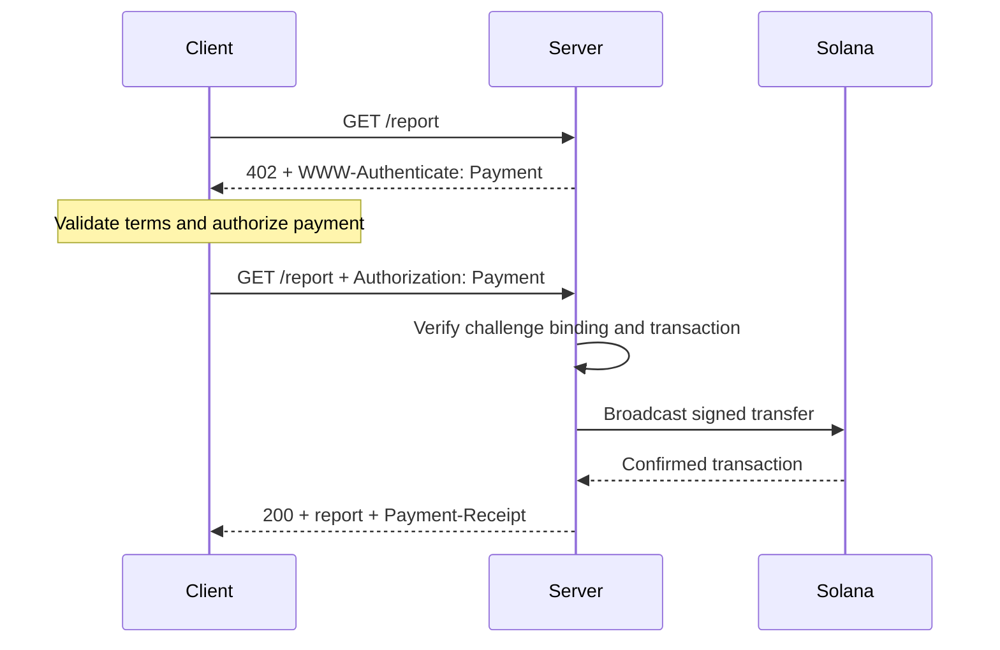
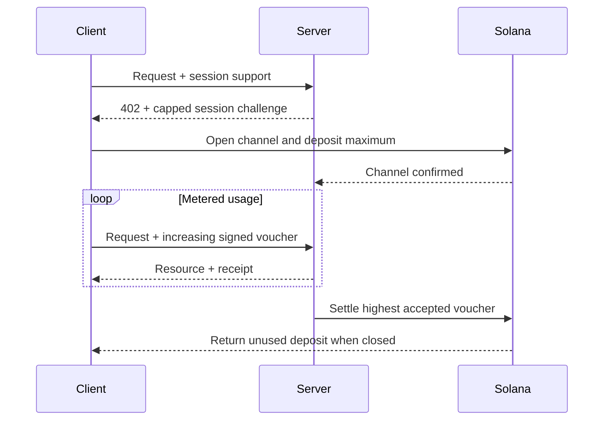

The [Machine Payments Protocol (MPP)](https://mpp.dev/) applies HTTP
authentication semantics to payments. A server challenges an unpaid request, a
client returns a payment credential, and the server returns a receipt after it
accepts the payment.

MPP separates three concerns:

- An **intent** describes the commercial interaction, such as a one-time
  `charge` or a metered `session`.
- A **payment method** describes how value moves. The Solana method supports
  native SOL and SPL tokens for charges.
- An HTTP **transport** carries challenges, credentials, receipts, and errors.

MPP is published as a set of Internet-Drafts. Treat the
[current specifications](https://paymentauth.org/) as the source of truth and
expect details to evolve while the drafts are work in progress.

## HTTP exchange

MPP uses standard HTTP authentication fields instead of protocol-specific
payment headers:

| Message                 | HTTP representation                                         |
| ----------------------- | ----------------------------------------------------------- |
| Payment challenge       | `402 Payment Required` with `WWW-Authenticate: Payment ...` |
| Payment credential      | Retried request with `Authorization: Payment ...`           |
| Successful receipt      | Resource response with `Payment-Receipt: ...`               |
| Invalid payment details | Problem Details body using `application/problem+json`       |



A challenge includes a server-generated ID, realm, method, intent, encoded
payment request, and expiry. The credential echoes the challenge and adds the
method-specific payment proof. The server must verify both pieces; a valid
transfer that belongs to a different challenge must not unlock the resource.

## One-time Solana charges

The Solana `charge` intent supports two credential types:

- **Pull mode** uses a signed transaction. The client signs the transfer and
  sends the transaction to the server. The server verifies, optionally adds a
  fee-payer signature, broadcasts, confirms, and returns the transaction
  signature in its receipt.
- **Push mode** uses a transaction signature. The client broadcasts first, then
  sends the confirmed signature to the server. The server fetches and verifies
  the transaction before returning the resource.

Pull mode enables server-sponsored transaction fees and server-side retry logic.
Push mode is useful when a wallet requires the client to submit its own
transaction, but it cannot use server fee sponsorship.

For the normative fields and verification rules, see the
[Solana charge specification](https://paymentauth.org/draft-solana-charge-00.html).

## Add an MPP charge to an Express API

The Solana Pay Kit provides a current TypeScript integration for MPP and x402.
Install it with Express:

```bash
pnpm add @solana/pay-kit @solana/kit@^6.9.0 express
pnpm add --save-dev @types/express tsx
```

This smallest example uses the hosted Surfpool sandbox and the package's public
demo recipient. It is for local development only:

```ts filename=server.ts
import express from "express";
import { createPayKit, usd } from "@solana/pay-kit";

const pay = await createPayKit({
  accept: ["mpp"],
  rpcUrl: "https://402.surfnet.dev:8899"
});

const app = express();

app.get("/report", pay.express(usd("0.01")), (_req, res) => {
  res.json({ report: "Paid report" });
});

app.listen(4567, () => {
  console.log("Paid API listening on http://127.0.0.1:4567");
});
```

Run it and compare an unpaid request with a payment-aware request:

```bash
pnpm tsx server.ts
curl -i http://127.0.0.1:4567/report
pay --sandbox curl http://127.0.0.1:4567/report
```

The route handler runs only after the middleware accepts the payment.

<Callout type="warn" title="Replace every sandbox default in production">
  Configure an explicit network, merchant recipient, dedicated RPC, stable
  challenge-binding secret, production signer, and durable replay store. Never
  route real payments to a package demo signer.
</Callout>

## Metered sessions

Use a Solana MPP `session` when a client will make many small, related payments.
A session opens an onchain payment channel with a maximum deposit, then uses
cumulative signed vouchers as usage grows. The server can verify vouchers
offchain and settle the highest accepted amount later.

This is useful for token-metered inference, byte-metered downloads, live data,
and repeated tool calls. It is not the same as sending a separate onchain
payment for every event.



Call a session a **session payment**, **payment channel**, or **capped repeated
authorization**. Only call it a streamed payment when the service and payment
contract actually meter a stream of usage.

## Production verification

For every Solana charge, the server must verify at least:

- The challenge is authentic, unexpired, bound to this request, and intended for
  this realm.
- The transaction uses the expected network, asset or mint, recipient, amount,
  and token program.
- Any fee-payer or associated-token-account instructions are explicitly
  permitted and cannot drain the server signer.
- The transaction succeeded at the required commitment level.
- The transaction signature has not already been consumed.
- The replay check and consume operation are atomic across all server instances.

For sessions, also persist the channel state, accepted cumulative amount, and
settlement watermark in a shared store. Document how clients recover unused
funds if the server becomes unavailable.

## Related resources

- [MPP specifications](https://paymentauth.org/)
- [MPP protocol documentation](https://mpp.dev/protocol)
- [Solana Pay Kit](https://github.com/solana-foundation/pay-kit)
- [Agentic payments quickstart](/docs/payments/agentic-payments/quickstart)
- [Production readiness](/docs/payments/production-readiness)
