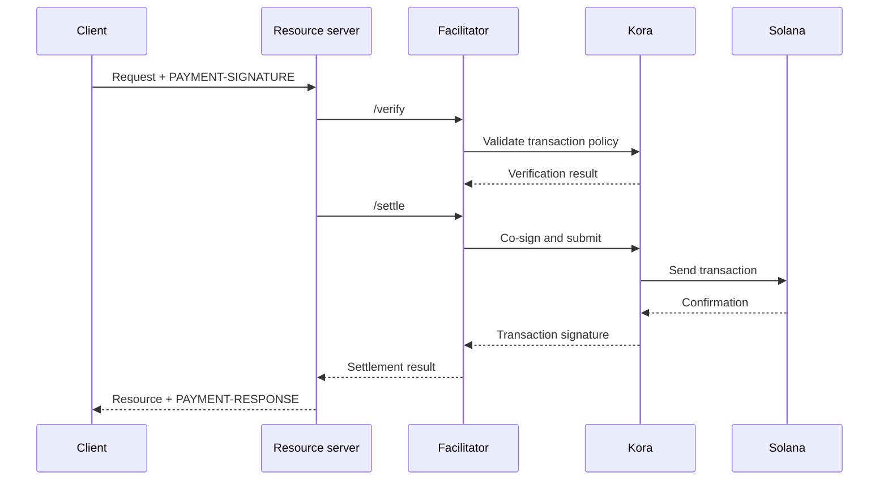

An x402 facilitator performs payment verification and settlement for one or more
resource servers. It lets an API accept onchain payments without putting RPC,
transaction-submission, and fee-payer logic in every application process.

A facilitator is an architectural role, not a required third party. You can use
a managed service, operate a separate facilitator, or self-facilitate inside
your resource server.

## Facilitator interface

x402 V2 defines three HTTP operations:

| Endpoint     | Purpose                                                                       |
| ------------ | ----------------------------------------------------------------------------- |
| `/supported` | Lists supported protocol versions, schemes, networks, extensions, and signers |
| `/verify`    | Checks a payment payload against its requirements without settling it         |
| `/settle`    | Submits or completes the payment and returns its settlement result            |

Your resource server should check `/supported` during startup or deployment. Do
not advertise a payment option until the selected facilitator confirms support
for that exact x402 version, scheme, and Solana network.

```bash
curl https://facilitator.example/supported
```

## Verification before fulfillment

The safe request order is:

1. Parse the `PAYMENT-SIGNATURE` payload with a protocol library.
2. Match it to the exact `PaymentRequirements` originally offered.
3. Verify the payload locally or through `/verify`.
4. Perform the resource operation only if the chosen payment flow permits
   post-fulfillment settlement.
5. Call `/settle` and return `PAYMENT-RESPONSE` with the result.

Different schemes can define different fulfillment ordering. For example, an
authorization flow may verify before the resource operation and settle after it,
while another scheme may require settlement before fulfillment. Follow the flow
declared by the selected scheme rather than assuming one order for every
payment.

<Callout type="warn" title="Treat facilitator responses as payment decisions">
  Authenticate facilitator traffic, validate every response, use strict
  timeouts, and fail closed. A network error or malformed response is not proof
  of payment.
</Callout>

## Choose a deployment model

| Model                   | Use when                                                        | Main responsibility                                                    |
| ----------------------- | --------------------------------------------------------------- | ---------------------------------------------------------------------- |
| Managed facilitator     | You want the smallest operational surface                       | Review supported networks, trust model, availability, and data policy  |
| Dedicated self-hosted   | Several APIs share signing and settlement infrastructure        | Secure keys, RPCs, storage, scaling, and upgrades                      |
| In-process facilitation | One service needs full control and can operate chain components | Keep payment code isolated and prevent request load from exhausting it |

Do not select a facilitator only because its URL responds to `/supported`.
Review how it protects fee-payer keys, prevents replay, confirms transactions,
handles partial failures, and reports incidents.

## Kora as Solana signing infrastructure

[Kora](/docs/tools/kora) is a Solana signer node with transaction validation and
fee-sponsorship policies. An x402 facilitator can use Kora as its signing and
submission backend:



Kora does not replace x402. The resource server and facilitator still implement
the x402 V2 objects and endpoints; Kora enforces Solana transaction policy and
protects the fee-payer signer behind its RPC interface.

Follow the [Kora x402 guide](/docs/tools/kora/guides/x402) for the maintained
demo and configuration.

## Production checklist

### Keys and transaction policy

- Store facilitator and fee-payer keys in a hardware-backed or remote signing
  backend.
- Allowlist the System, Compute Budget, Token, Token-2022, and Associated Token
  programs only as required by the supported scheme.
- Reject unexpected writable accounts, transfer authorities, recipients, mints,
  instructions, and compute prices before signing.
- Keep payment-receiving accounts separate from operational fee-payer accounts.

### Replay and idempotency

- Persist consumed payment identifiers and transaction signatures in a shared,
  durable store.
- Make verification and consume atomic so two server instances cannot accept the
  same authorization concurrently.
- Require an idempotency key for resource operations with side effects.
- Return the original result for a legitimate retry instead of charging again.

### Availability and failure handling

- Set bounded timeouts for `/verify`, `/settle`, RPC submission, and
  confirmation.
- Distinguish rejected, expired, pending, confirmed, and failed settlements.
- Do not rebuild or resign a transaction after blockhash expiry without asking
  the payer to authorize the new transaction.
- Use more than one RPC endpoint and monitor blockhash freshness, confirmation
  latency, and fee-payer balance.

### Observability

Record the resource, challenge ID, selected scheme and network, amount, asset,
recipient, payer address, transaction signature, confirmation level, latency,
and final status. Never log encoded payment credentials, bearer tokens, private
keys, or raw signer responses.

Alert on settlement failures, replay attempts, policy rejections, unexpected
assets or recipients, fee-payer depletion, and differences between verified
payments and fulfilled resources.

## Related resources

- [x402 facilitator specification](https://github.com/x402-foundation/x402/blob/main/specs/x402-specification-v2.md#7-facilitator-interface)
- [x402 on Solana](/docs/payments/agentic-payments/intro-to-x402)
- [Kora operators guide](/docs/tools/kora/operators)
- [Production readiness](/docs/payments/production-readiness)
