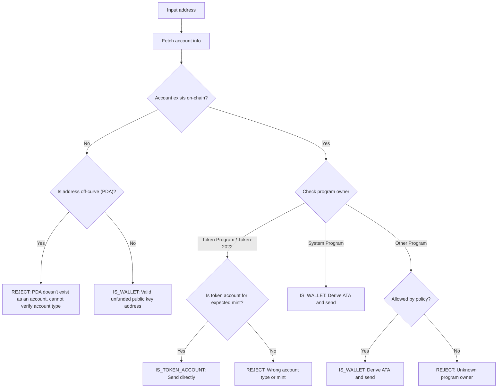

Sending tokens to the wrong address can result in permanent loss of funds.
Address verification ensures you only send tokens to addresses that can properly
receive and access them.

<Callout>
  See [How Payments Work on Solana](/docs/payments/how-payments-work) for core
  payment concepts.
</Callout>

## Understanding Solana Addresses

Solana accounts have two types of addresses, on-curve and off-curve.

### On-Curve Addresses

Standard addresses are the public keys from Ed25519 keypairs. These addresses:

- Have a corresponding private key that can sign transactions
- Are used as wallet addresses

### Off-Curve Addresses (PDAs)

[Program Derived Addresses](/docs/core/pda) are deterministically derived from a
program ID and seeds. These addresses:

- Do **not** have a corresponding private key
- Can only be signed for by the program the address was derived from

## Account Types in Payments

Use the address to fetch an [account](/docs/core/accounts) from the network,
check its program owner and account type to determine how to handle the address.

<Callout>
  Knowing whether an address is on-curve or off-curve does not tell you what
  type of account it is, what program owns it, or whether an account exists at
  that address. You must fetch the account from the network to determine these
  details.
</Callout>

### System Program Accounts (Wallets)

Accounts owned by the System Program are standard wallets. To send SPL tokens to
a wallet, you derive and use its
[Associated Token Account (ATA)](/docs/tokens/basics/create-token-account#whats-an-associated-token-account).

After deriving the ATA address, check whether the token account exists on-chain.
If the ATA does not exist, you can include an instruction to create the
recipient's token account in the same transaction as the transfer. However, this
requires paying rent for the new token account. Since the recipient owns the
ATA, the SOL paid for the rent cannot be recovered by the sender.

<Callout type="warn">
  Without safeguards, subsidizing ATA creation can be exploited. A malicious
  user could request a transfer, have their ATA created at your expense, close
  the ATA to reclaim the rent SOL, and repeat.
</Callout>

### Token Accounts

[Token accounts](/docs/tokens/basics/create-token-account) are owned by the
Token Program or Token-2022 Program and hold token balances. If the address you
receive is owned by a token program, you should verify the account is a token
account (not a mint account) and matches the expected token mint account before
sending.

<Callout type="info">
  The Token Programs automatically validate that both token accounts in a
  transfer hold tokens of the same mint. If validation fails, the transaction is
  rejected and no funds are lost.
</Callout>

### Mint Accounts

[Mint accounts](/docs/tokens/basics/create-mint) track the token supply and
metadata of a specific token. Mint accounts are also owned by Token Programs but
are **not** valid recipients for token transfers. Attempting to send tokens to a
mint address results in a failed transaction, but no funds are lost.

### Other Accounts

Accounts owned by other programs require a policy decision. Some accounts (e.g.
multisig wallets) may be valid token account owners, while others should be
rejected.

## Verification Flow

The following diagram shows a reference decision tree for validating an address:



<Steps>
<Step>

### Fetch account

Use the address to fetch the account details from the network.

</Step>
<Step>

### Account does not exist

If no account exists at this address, check whether the address is on-curve or
off-curve:

- **Off-curve (PDA)**: Conservatively reject the address to avoid sending to an
  ATA that may be inaccessible. Without an existing account, you cannot
  determine from the address alone which program derived this PDA or whether the
  address is for an ATA. Deriving an ATA for this address to send tokens could
  result in funds being locked in an inaccessible token account.

- **On-curve**: This is a valid wallet address (public key) that hasn't been
  funded yet. Derive the ATA, check if it exists, and send tokens to it. You
  must make a policy decision whether to fund the creation of the ATA if it
  doesn't exist.

</Step>
<Step>

### Account exists

If an account exists, check which program owns it:

- **System Program**: This is a standard wallet. Derive the ATA, check if it
  exists, and send tokens to it. You must make a policy decision whether to fund
  the creation of the ATA if it doesn't exist.

- **Token Program / Token-2022**: Verify the account is a token account (not a
  mint account) and that it holds the token (mint) you intend to send. If valid,
  send tokens directly to this address. If it's a mint account or a token
  account for a different mint, reject the address.

- **Other Program**: This requires a policy decision. Some programs like
  multisig wallets may be acceptable owners of token accounts. If your policy
  allows it, derive the ATA and send. Otherwise, reject the address.

</Step>
</Steps>

## Demo

The following example shows only the address validation logic. This is reference
code for illustration purposes.

<Callout>
  The demo does not show how to derive an ATA or build a transaction to send
  tokens. Refer to the [token
  account](/docs/tokens/basics/create-token-account#how-to-create-an-associated-token-account)
  and [token transfer](/docs/tokens/basics/transfer-tokens) documentation for
  example code.
</Callout>

The demo below uses three possible outcomes:

| Result             | Meaning              | Action                                      |
| ------------------ | -------------------- | ------------------------------------------- |
| `IS_WALLET`        | Valid wallet address | Derive and send to associated token account |
| `IS_TOKEN_ACCOUNT` | Valid token account  | Send tokens directly to this address        |
| `REJECT`           | Invalid address      | Do not send                                 |

<CodeTabs flags="r">

```ts !! title="Demo"
// !collapse(1:35) collapsed

import {
  type Address,
  type Rpc,
  type GetAccountInfoApi,
  createSolanaRpc,
  fetchJsonParsedAccount,
  isOffCurveAddress,
  generateKeyPairSigner,
  getProgramDerivedAddress
} from "@solana/kit";

// =============================================================================
// Constants
// =============================================================================

const defaultRpc = createSolanaRpc("https://api.mainnet-beta.solana.com");

const SYSTEM_PROGRAM = "11111111111111111111111111111111" as Address;
const TOKEN_PROGRAM = "TokenkegQfeZyiNwAJbNbGKPFXCWuBvf9Ss623VQ5DA" as Address;
const TOKEN_2022_PROGRAM =
  "TokenzQdBNbLqP5VEhdkAS6EPFLC1PHnBqCXEpPxuEb" as Address;

// =============================================================================
// Validation Function
// =============================================================================

/**
 * Possible validation results for an input address.
 */
export type ValidationResult =
  | { type: "IS_TOKEN_ACCOUNT" }
  | { type: "IS_WALLET" }
  | { type: "REJECT"; reason: string };

/**
 * Validates an input address and classifies it as a wallet, token account, or invalid.
 *
 * @param inputAddress - The address to validate
 * @param rpc - Optional RPC client (defaults to mainnet)
 * @returns Classification result:
 *   - IS_WALLET: Valid wallet address
 *   - IS_TOKEN_ACCOUNT: Valid token account
 *   - REJECT: Invalid address for transfers
 */
export async function validateAddress(
  inputAddress: Address,
  rpc: Rpc<GetAccountInfoApi> = defaultRpc
): Promise<ValidationResult> {
  const account = await fetchJsonParsedAccount(rpc, inputAddress);
  // Log the account data for demo
  console.log("\nAccount:", account);

  // Account doesn't exist on-chain
  if (!account.exists) {
    // Off-curve = PDA that doesn't exist as an account
    // Reject conservatively to avoid sending to an address that may be inaccessible.
    if (isOffCurveAddress(inputAddress)) {
      return { type: "REJECT", reason: "PDA doesn't exist as an account" };
    }
    // On-curve = valid keypair address, treat as unfunded wallet
    return { type: "IS_WALLET" };
  }

  // Account exists, check program owner
  const owner = account.programAddress;

  // System Program = wallet
  if (owner === SYSTEM_PROGRAM) {
    return { type: "IS_WALLET" };
  }

  // Token Program or Token-2022, check if token account
  if (owner === TOKEN_PROGRAM || owner === TOKEN_2022_PROGRAM) {
    const accountType = (
      account.data as { parsedAccountMeta?: { type?: string } }
    ).parsedAccountMeta?.type;

    if (accountType === "account") {
      return { type: "IS_TOKEN_ACCOUNT" };
    }
    // Reject if not a token account (mint account)
    return {
      type: "REJECT",
      reason: "Not a token account"
    };
  }

  // Unknown program owner
  return { type: "REJECT", reason: "Unknown program owner" };
}

// =============================================================================
// Examples
// =============================================================================
// !collapse(1:1000) collapsed

// Wallets
const EXISTING_WALLET =
  "H8sMJSCQxfKiFTCfDR3DUMLPwcRbM61LGFJ8N4dK3WjS" as Address;
const NEW_WALLET = (await generateKeyPairSigner()).address;

// Token accounts
const USDC_TOKEN_ACCOUNT =
  "3emsAVdmGKERbHjmGfQ6oZ1e35dkf5iYcS6U4CPKFVaa" as Address;
const PYUSD_TOKEN_ACCOUNT =
  "47od2TPRvqJipfPVWZdyenLEngPw8hC36nDxiLyvGsEP" as Address;

// Token mints (should be rejected)
const USDC_MINT = "EPjFWdd5AufqSSqeM2qN1xzybapC8G4wEGGkZwyTDt1v" as Address;
const PYUSD_MINT = "2b1kV6DkPAnxd5ixfnxCpjxmKwqjjaYmCZfHsFu24GXo" as Address;

// PDA that doesn't exist (should be rejected)
const [NON_EXISTENT_PDA] = await getProgramDerivedAddress({
  programAddress: (await generateKeyPairSigner()).address,
  seeds: ["seed"]
});

// Program account (should be rejected)
const PROGRAM_ACCOUNT =
  "p1exdMJcjVao65QdewkaZRUnU6VPSXhus9n2GzWfh98" as Address;

async function runExample(label: string, address: Address) {
  console.log(`\n${"─".repeat(60)}`);
  console.log(`Example: ${label}`);
  console.log(`Input: ${address}`);
  console.log(`${"─".repeat(60)}`);

  const result = await validateAddress(address);
  console.log("\nResult:", result);
}

console.log("\n" + "═".repeat(60));
console.log("  IS_WALLET Examples");
console.log("═".repeat(60));

await runExample("Existing funded wallet", EXISTING_WALLET);
await runExample("New wallet (unfunded)", NEW_WALLET);

console.log("\n" + "═".repeat(60));
console.log("  IS_TOKEN_ACCOUNT Examples");
console.log("═".repeat(60));

await runExample("USDC token account (Token Program)", USDC_TOKEN_ACCOUNT);
await runExample("PYUSD token account (Token-2022)", PYUSD_TOKEN_ACCOUNT);

console.log("\n" + "═".repeat(60));
console.log("  REJECT Examples");
console.log("═".repeat(60));

await runExample("USDC mint address", USDC_MINT);
await runExample("PYUSD mint address", PYUSD_MINT);
await runExample("Non-existent PDA", NON_EXISTENT_PDA);
await runExample("Program account", PROGRAM_ACCOUNT);

console.log("\n" + "═".repeat(60));
console.log("  Done!");
console.log("═".repeat(60) + "\n");
```

</CodeTabs>
