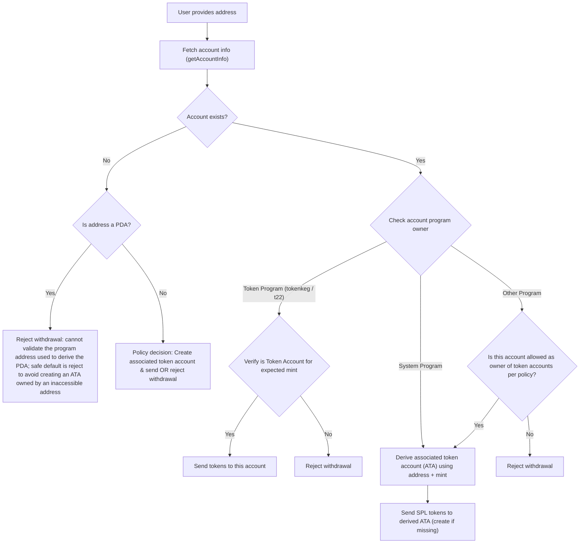

```mermaid title="Apply Pending Balance"
flowchart TD
    A["User provides address"]
    B["Fetch account info (getAccountInfo)"]

    A --> B
    B --> C{"Account exists?"}

    %% --- Non-existent account path ---
    C -- "No" --> D{"Is address a PDA?"}
    D -- "Yes" --> R1["Reject withdrawal: cannot validate the program address used to derive the PDA; safe default is reject to avoid creating an ATA owned by an inaccessible address"]
    D -- "No" --> E["Policy decision: Create associated token account & send OR reject withdrawal"]

    %% --- Existing account path ---
    C -- "Yes" --> F{"Check account program owner"}

    F -- "Token Program (tokenkeg / t22)" --> G{"Verify is Token Account for expected mint"}
    G -- "Yes" --> H["Send tokens to this account"]
    G -- "No" --> R2["Reject withdrawal"]

    F -- "System Program" --> I["Derive associated token account (ATA) using address + mint"]
    I --> J["Send SPL tokens to derived ATA (create if missing)"]

    F -- "Other Program" --> K{"Is this account allowed as owner of token accounts per policy?"}
    K -- "Yes" --> I
    K -- "No" --> R3["Reject withdrawal"]
```
