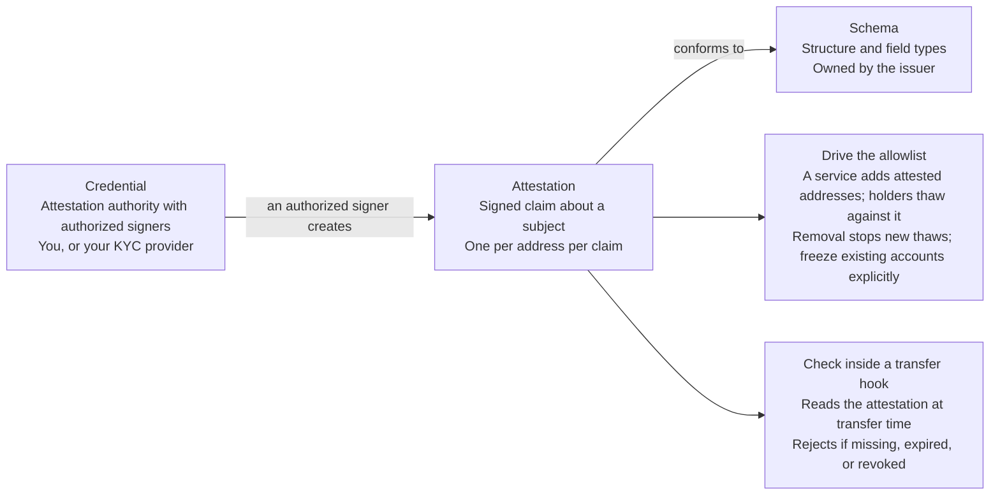

<Callout type="info" title="Summary">

Run the KYC, sanctions, and travel-rule checks off-chain, as they run today.
Publish only the _result_ onchain, as an attestation asserting a narrow claim -
"this address passed sanctions screening, valid until this date." The token's
gate reads the attestation. The evidence behind the claim stays in your systems
or your provider's.

</Callout>

## Personal data and a public ledger

A gated token needs an onchain answer to "may this address hold the token?" The
inputs to that answer - identity documents, screening hits, beneficial-ownership
records - are personal data, which data-protection obligations may keep off a
public ledger.

Attestations separate the check from its evidence. The check runs where it
always ran, inside your compliance function or your vendor's. What lands onchain
is a signed statement that the check ran and what it concluded.

<Callout type="warn">

Attestation data is stored onchain and is public and permanent. The pattern
protects personal data only because you choose to attest a narrow conclusion.
Putting a name, a document number, a date of birth, a residential address, or a
raw screening payload into an attestation publishes it permanently. Attest
booleans and coarse categories, never the inputs.

</Callout>

## The three objects

[Solana Attestations](/docs/tools/attestations) is built from three onchain
objects. Mapping them to who owns what in an issuance:

| Object          | What it is                                                        | Who owns it in practice                                                      |
| --------------- | ----------------------------------------------------------------- | ---------------------------------------------------------------------------- |
| **Credential**  | An attestation authority, with a list of authorized signers       | The institution standing behind the check - you, or your KYC provider        |
| **Schema**      | The structure and field types a valid attestation must conform to | The issuer, so every attester makes the same claim in the same format        |
| **Attestation** | A signed claim about a subject, conforming to a schema            | Created by an authorized signer of the credential, one per address per claim |

An attestation carries an expiration timestamp and a unique nonce, and can
optionally be issued in tokenized form, held in the recipient's token account.
See [credentials](/docs/tools/attestations/credentials),
[schemas](/docs/tools/attestations/schemas), and
[attestations](/docs/tools/attestations/attestations) for the mechanics.

### Who signs

The credential's authorized-signer list is a compliance decision. Two
arrangements:

- **You attest.** Your compliance function holds the credential and signs. You
  are asserting your own conclusion.
- **Your provider attests.** Your KYC or screening vendor holds a credential and
  signs. You rely on their claim.

Multiple credentials can coexist for one token - a sanctions attester and an
accreditation attester, for example, each with its own schema.

## Designing the schema

Schema design determines how much the pattern exposes. Keep every field to the
narrowest thing that supports the gate decision.

Reasonable fields:

- A boolean: screening passed, accreditation confirmed, eligibility met.
- A coarse jurisdiction code, where the rule varies by jurisdiction.
- A tier or category, where holding limits differ by investor class.
- A validity window, which the expiration timestamp already gives you.
- An opaque reference to your own case file, meaningful only inside your systems
  and not derivable from onchain data.

Fields to keep out: anything identifying a person, anything describing the
evidence, and anything precise enough to re-identify by combination. A birth
date plus a postcode can identify a person even though neither field is a name.

Version the schema from the start. Rules change, and a schema that cannot be
superseded without invalidating every existing attestation forces a migration.

## Wiring an attestation to the gate

Two places the claim can be enforced, with different costs.

|                   | Drive the allowlist                                                                                          | Check inside a transfer hook                                                                                                                                           |
| ----------------- | ------------------------------------------------------------------------------------------------------------ | ---------------------------------------------------------------------------------------------------------------------------------------------------------------------- |
| How it works      | A service adds attested addresses to the allowlist; holders thaw against it                                  | A [transfer hook](/docs/tokens/extensions/transfer-hook) reads the attestation account at transfer time and rejects the transfer if it is missing, expired, or revoked |
| Per-transfer cost | None; the check happens before any transfer                                                                  | Compute on every transfer, plus extra accounts the sender must supply                                                                                                  |
| Revocation        | Removing the address stops new thaws but **does not freeze an already-thawed account**; freeze it explicitly | Takes effect on the next transfer, which fails                                                                                                                         |
| Operations        | An off-chain service, kept running and monitored, with latency between an attestation and the list update    | The hook program, audited and maintained                                                                                                                               |
| Use for           | Eligibility claims about the holder                                                                          | Rules that need a current claim at transfer time                                                                                                                       |

See [gate the holders](/docs/tokenization/tutorials/issuing/gate-the-holders)
for the allowlist mechanics.

## Lifecycle

An attestation records a check at one point in time. Decide these before you
launch:

- **Expiry.** Set an expiration that matches your re-screening cycle.
- **Re-attestation.** Who re-runs the check, on what schedule, and does the
  holder have to do anything? Prefer renewal that completes without holder
  action over a lapse discovered at transfer time.
- **Revocation.** Plan for a sanctions hit against an existing holder; see
  [wiring an attestation to the gate](#wiring-an-attestation-to-the-gate) for
  how each pattern handles it.
- **A holder whose attestation lapses while holding a balance.** They still hold
  the asset. A lapse does not change the account's state by itself; the options
  are a freeze, transfers only to redeem, or a grace period.

## Limits

- **It is not proof the check was done well.** An attestation is a signature on
  a claim. Its value depends on the standing of whoever signed it.
- **It does not carry travel-rule data.** Where a travel rule applies,
  originator and beneficiary information moves between institutions; regimes may
  differ. That is personal data and stays off-chain, on your existing rails.
  What an attestation can do is assert that the counterparty is an institution
  you have a travel-rule arrangement with.
- **It does not hide who holds the token.** Addresses, balances, and the fact
  that an address carries an attestation are all public. If holder relationships
  need to stay private, see
  [privacy and transfer controls](/docs/tokenization/compliance/privacy-and-transfer-controls).
- **It does not resolve identity across chains or institutions.** An attestation
  is about an address, not a person. Two addresses attested by the same provider
  are not linked by the attestations themselves, though issuance patterns may
  still support inference - and a case-file reference reused across both would
  link them directly.

## Related

- [Gate the holders](/docs/tokenization/tutorials/issuing/gate-the-holders) -
  the allowlist end to end
- [Token ACL](/docs/tokenization/compliance/token-acl) - the gate the allowlist
  path thaws against
- [Attestations](/docs/tools/attestations) - the program reference
