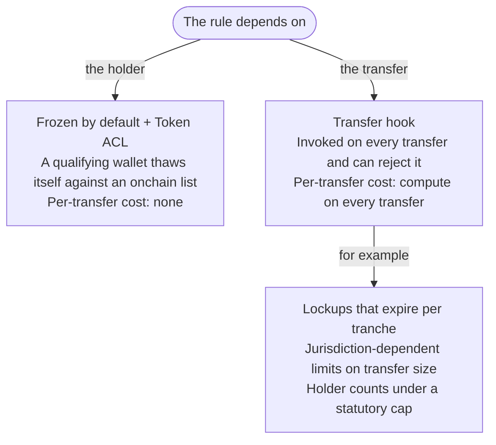

<Callout type="info" title="Summary">

Frozen-by-default accounts with Token ACL add no per-transfer compute and keep
the token usable in venues that do not run custom code on every transfer. A
transfer hook suits rules that cannot be expressed as whether an account is
permitted to hold the token at all.

</Callout>

## Three ways to restrict who holds a token

On networks where each token is its own contract, transfer restrictions run as
code on every transfer. On Solana most of these controls are extensions enforced
inside the [Token-2022 program](/docs/tokens) itself, so they are shared
standards rather than bespoke code.

| Approach                          | How it works                                                                                        | Per-transfer cost         | Composability                                                                                                |
| --------------------------------- | --------------------------------------------------------------------------------------------------- | ------------------------- | ------------------------------------------------------------------------------------------------------------ |
| **Frozen by default + Token ACL** | Every new token account is created frozen. A qualifying wallet thaws itself against an onchain list | None                      | High - the mint reads as an ordinary Token-2022 mint, though integrators must handle accounts created frozen |
| **Transfer hook**                 | A program you write is invoked on every transfer and can reject it                                  | Compute on every transfer | Lower - integrating venues must support hooks and account for your program                                   |
| **Manual freeze and thaw**        | You hold the freeze authority and act on each account yourself                                      | None                      | High, but you are a liveness dependency for every new holder                                                 |

### Frozen by default with Token ACL

[Default Account State](/docs/tokens/extensions/default-state) creates every
token account frozen. On its own, no address can hold the token until the issuer
thaws it individually.

[Token ACL](/docs/tokenization/compliance/token-acl) removes the issuer's
signature from each thaw. The freeze authority is delegated to a shared program
that exposes a permissionless thaw, and that program delegates the allow-or-deny
decision to a pluggable gate. With an address-based list as the gate, a wallet
on the allowlist thaws itself; in allowlist mode the issuer, or its operator,
still adds each holder to the list. The issuer retains an override throughout:
freeze or thaw directly, swap the gate, or reclaim the freeze authority.

Integrators read it as an ordinary Token-2022 mint, but need a path for accounts
that are created frozen and thaw through the gate.

<Callout type="info">

Token ACL is live on mainnet-beta and specified in sRFC-37. Releases are pre-1.0
at the time of writing; check the latest state on
[Token ACL](/docs/tokenization/compliance/token-acl).

</Callout>

### When a hook is required

A [transfer hook](/docs/tokens/extensions/transfer-hook) fits rules that depend
on the transfer rather than on the holder. Lockups that expire per tranche,
jurisdiction-dependent limits on transfer size, and holder counts that must stay
under a statutory cap cannot be expressed as a list of permitted addresses.

A hook is also a program to audit and maintain.

### Allowlist or blocklist

Token ACL's pluggable gate supports either. They differ in the default: admitted
or denied.

An **allowlist** defaults to denied: nobody holds the token until they are
admitted. This suits a supervised issuance, where every holder has been
onboarded and you can name them. It also fails safe - a gap in your onboarding
pipeline stops new holders rather than admitting unchecked ones.

A **blocklist** defaults to permitted: anyone holds the token unless excluded.
This suits a broadly circulating asset where the obligation is to exclude
specific addresses rather than to vet every holder. It fails open, so the list's
completeness and freshness determine whether it works.

## Split authorities from the start

Token-2022 allows each power to sit on a different key. If one key holds the
mint, pause, and permanent delegate authorities, one compromise exposes all
three.

| Authority              | What it can do                                 | Suggested holder                                   |
| ---------------------- | ---------------------------------------------- | -------------------------------------------------- |
| Mint                   | Create new supply                              | Treasury quorum, offline                           |
| Metadata               | Change name, symbol, URI and additional fields | Operations, low privilege                          |
| Pausable               | Halt all mint, burn, and transfer activity     | Incident response, reachable 24/7                  |
| Permanent delegate     | Move or burn any holder's balance              | Legal and compliance quorum, offline               |
| Permissioned burn      | Co-sign redemptions                            | Redemption operations                              |
| Confidential Balances  | Configure confidential transfer settings       | Same quorum as mint                                |
| Freeze (via Token ACL) | Freeze and thaw accounts                       | Delegated to the ACL program, with issuer override |

<DocsDiagram
  src="/assets/docs/diagrams/tokenization-authority-roles.svg"
  alt="Each Token-2022 authority and a suggested holder for it, from the table above"
  mermaid={`
flowchart LR
  M["Token-2022 mint"]
  M --> A1["Mint: treasury quorum, offline"]
  M --> A2["Metadata: operations, low privilege"]
  M --> A3["Pausable: incident response, reachable 24/7"]
  M --> A4["Permanent delegate: legal and compliance quorum, offline"]
  M --> A5["Permissioned burn: redemption operations"]
  M --> A6["Confidential Balances: same quorum as mint"]
  M --> A7["Freeze: delegated to the ACL program, with issuer override"]
`}
/>

A permanent delegate reaches only the public balance of a confidential account;
see
[privacy and transfer controls](/docs/tokenization/compliance/privacy-and-transfer-controls#which-controls-still-work).
Extension references:
[permanent delegate](/docs/tokens/extensions/permanent-delegate),
[permissioned burn](/docs/tokens/extensions/permissioned-burn), and
[confidential transfers](/docs/tokens/extensions/confidential-transfer).

[Program and authority design](/docs/tokenization/design/program-and-authority-design)
covers which option holds each authority - a program-derived address (PDA), an
onchain multisig, or a single custodied key - along with rotation and the audit
and upgrade risk carried by every program in your transfer path.

## Related

- [Program and authority design](/docs/tokenization/design/program-and-authority-design) -
  which key or multisig holds each authority the controls create
- [Issuing a token](/docs/tokenization/tutorials/issuing) - build a mint that
  carries these controls
- [Gate the holders](/docs/tokenization/tutorials/issuing/gate-the-holders) -
  Token ACL end to end
- [Choosing the cash leg](/docs/tokenization/settlement/cash-leg) - what the
  controls chosen here let the asset settle against
