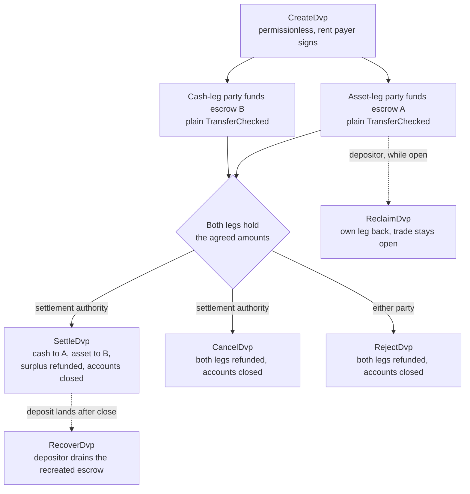

<Callout type="info" title="Summary">

The DvP program holds two legs of a trade in escrow accounts it controls and
lets one settlement authority move both in a single transaction. Either both
legs settle or neither does. Each party funds its own leg with an ordinary token
transfer, and either party can take its leg back until settlement, subject to
the mint's freeze and pause authorities. Creating a trade record is
permissionless, so a record is not proof of agreement: every party reads the
stored terms before it deposits or settles.

</Callout>

## Purpose

Where both legs of a trade are token accounts on Solana, one transaction can
move the asset one way and the cash the other, and either both transfers take
effect or neither does. That is a property of Solana transactions, described in
[choosing the cash leg](/docs/tokenization/settlement/cash-leg). The DvP program
puts it to use through escrow. Each trade gets a program-owned record and two
escrow accounts, one per leg. A party funds its leg by transferring tokens into
the escrow account for that leg, so a custodian or treasury system needs no
program-specific instruction to participate. The settlement authority, a third
address named in the trade, is the only signer that can settle. Settlement
transfers the agreed amount of each leg to the other side, refunds any surplus
to whoever deposited it, and closes the record and both escrows. Until then, a
depositor can reclaim its own leg, and either party or the authority can unwind
the trade.

The extensions-only pattern in
[Delivery vs Payment with Token Extensions](/docs/tokenization/settlement/dvp)
reaches the same one-transaction settlement by having each side delegate its
position to a settlement agent. Compared with that pattern, the program
separates funding from settlement and lets a custodian fund a leg with a plain
token transfer, and uses no delegation, so the one-delegate limit described in
[choosing the cash leg](/docs/tokenization/settlement/cash-leg#someone-still-has-to-sign-both-legs)
does not apply. Each trade depends on an upgradeable program and its upgrade
authority, and leaves a permanent tombstone account.

## Roles

The program is symmetric. In its interface the two parties are `user_a`, who
delivers `mint_a`, and `user_b`, who delivers `mint_b`. The README and the
generated clients call `mint_a` the asset leg and `mint_b` the cash leg, and
these pages follow that convention, but nothing in the program requires the cash
leg to be a cash instrument. Two assets, or two stablecoins, settle the same
way.

| Role                 | Who                               | Signs                                              | Notes                                                                                                                                                                                                                               |
| -------------------- | --------------------------------- | -------------------------------------------------- | ----------------------------------------------------------------------------------------------------------------------------------------------------------------------------------------------------------------------------------- |
| Asset-leg party      | `user_a`, delivers `mint_a`       | Its own funding transfer; Reclaim, Reject, Recover | Must be a system-owned, non-executable account (a wallet, or a smart-wallet PDA that signs via CPI), so that it can sign to recover its funds                                                                                       |
| Cash-leg party       | `user_b`, delivers `mint_b`       | Its own funding transfer; Reclaim, Reject, Recover | Same requirement                                                                                                                                                                                                                    |
| Settlement authority | A third address named at creation | Settle, Cancel                                     | The only signer that can settle. It cannot redirect proceeds, which are fixed at creation. It receives the rent of the closed accounts when it settles or cancels. If it does not act, the parties unwind through Reclaim or Reject |
| Rent payer           | Whoever signs `CreateDvp`         | Create                                             | Funds the rent (the SOL deposit that keeps an account open) for the record, the nonce tombstone, and both escrows. Not recorded as a rent recipient: closed-account rent goes to whoever closes the trade                           |

If the settlement authority never signs, the trade does not complete, and the
parties take their legs back through Reclaim or Reject, subject to the mint
authorities listed under supported tokens below.

## Program ID

```text
dvp34bdbcEm4f4FCUjGV4mDAkDshaQR4LkK8fdcsyZq
```

| Cluster      | Program                                       | Upgrade authority                              | Last deployed slot |
| ------------ | --------------------------------------------- | ---------------------------------------------- | ------------------ |
| mainnet-beta | `dvp34bdbcEm4f4FCUjGV4mDAkDshaQR4LkK8fdcsyZq` | `DXtFpbPjcn2hxPnw79x1Pfoj35vXh5AsWBkS37YnXMVv` | 452,058,374        |
| devnet       | `dvp34bdbcEm4f4FCUjGV4mDAkDshaQR4LkK8fdcsyZq` | `5EX1zFeJWj4rGYZv432WnYw8CbaSUeTdxPx4r573UgYU` | 479,376,863        |

The program is upgradeable on both clusters. The figures above are what
`solana program show` reported on 2 October 2026; read the current values from
the network before relying on them. The deployed build carries an onchain
`security.txt` pointing at the repository's advisory process.

## Lifecycle



A trade is open from `CreateDvp` until one of Settle, Cancel, or Reject closes
it. Funding has no instruction of its own: a leg is funded when its escrow
account holds at least the agreed amount. Reclaim is per leg and leaves the
trade open, so a problem with one leg does not force the other party to cancel
the whole trade.

## State

Each trade has one `SwapDvp` account of 458 bytes, owned by the program. Its
address is derived from the settlement authority, the two parties, the two
mints, and a nonce (the seeds
`["dvp", settlement_authority, user_a, user_b, mint_a, mint_b, nonce]`). The
amounts and times are stored inside the account and do not affect the address,
which is why they have to be read rather than inferred. A small marker account,
the nonce tombstone at `["nonce", swap_dvp]`, is created with the trade and
never closed, so each combination of parties, mints, authority, and nonce can be
used for one trade only.

| Field                                  | Type          | Meaning                                                                                                 |
| -------------------------------------- | ------------- | ------------------------------------------------------------------------------------------------------- |
| `bump`                                 | `u8`          | PDA bump                                                                                                |
| `user_a`, `user_b`                     | `Pubkey`      | The two parties                                                                                         |
| `mint_a`, `mint_b`                     | `Pubkey`      | The asset-leg and cash-leg mints                                                                        |
| `settlement_authority`                 | `Pubkey`      | The only signer that can settle or cancel                                                               |
| `token_program_a`, `token_program_b`   | `Pubkey`      | The token program that owns each mint; a trade can mix SPL Token and Token-2022 legs                    |
| `amount_a`, `amount_b`                 | `u64`         | The agreed amount of each leg, in the mint's smallest unit (base units)                                 |
| `expiry_timestamp`                     | `i64`         | After this network time (the onchain clock), Settle is rejected. Reclaim, Cancel, and Reject still work |
| `nonce`                                | `u64`         | Disambiguates trades that share the other seeds. Single-use                                             |
| `ref_string`                           | `[u8; 64]`    | An opaque client reference, zero-padded; the program never reads it                                     |
| `user_a_settlement_destination`        | `Pubkey`      | Receives the cash leg at Settle; defaults to `user_a`                                                   |
| `user_b_settlement_destination`        | `Pubkey`      | Receives the asset leg at Settle; defaults to `user_b`                                                  |
| `mint_a_authority`, `mint_b_authority` | `Pubkey`      | The mint authorities captured at creation; Settle fails if either has changed                           |
| `earliest_settlement_timestamp`        | `Option<i64>` | If set, Settle is rejected before this network time                                                     |

The field list is taken from the program's IDL at the commit named under
[Create a trade](/docs/tokenization/settlement/dvp-program/create-a-trade#install).

## Instructions

| Instruction  | Signer               | Effect                                                                                                                                                            |
| ------------ | -------------------- | ----------------------------------------------------------------------------------------------------------------------------------------------------------------- |
| `CreateDvp`  | Any payer            | Creates the `SwapDvp` record, its nonce tombstone, and both escrow accounts. Moves no tokens                                                                      |
| `ReclaimDvp` | `user_a` or `user_b` | Returns the signer's own leg from escrow. The trade stays open and the leg can be funded again                                                                    |
| `SettleDvp`  | Settlement authority | Transfers `amount_a` to `user_b`'s destination and `amount_b` to `user_a`'s destination, refunds any surplus to its depositor, closes the record and both escrows |
| `CancelDvp`  | Settlement authority | Refunds whatever each escrow holds to its depositor, closes the record and both escrows                                                                           |
| `RejectDvp`  | `user_a` or `user_b` | Same effect as Cancel, signed by a party                                                                                                                          |
| `RecoverDvp` | `user_a` or `user_b` | After the trade is closed: drains a recreated escrow back to the depositor and closes it. Covers a deposit that landed after Settle, Cancel, or Reject            |

Each instruction's accounts and arguments are on the page for that step.

## Errors

| Code | Error                            | When                                                                                                   |
| ---- | -------------------------------- | ------------------------------------------------------------------------------------------------------ |
| 0    | `SignerNotParty`                 | Reclaim, Reject, or Recover signed by an address that is not `user_a` or `user_b`                      |
| 1    | `DvpExpired`                     | Settle after `expiry_timestamp`                                                                        |
| 2    | `SettlementAuthorityMismatch`    | Settle or Cancel signed by an address other than the settlement authority                              |
| 3    | `SettlementTooEarly`             | Settle before `earliest_settlement_timestamp`                                                          |
| 4    | `LegNotFunded`                   | Settle while an escrow holds less than its agreed amount                                               |
| 5    | `ExpiryNotInFuture`              | Create with an expiry at or before the current network time                                            |
| 6    | `EarliestAfterExpiry`            | Create with an earliest settlement time after the expiry                                               |
| 7    | `SelfDvp`                        | Create with `user_a` equal to `user_b`                                                                 |
| 8    | `SameMint`                       | Create with `mint_a` equal to `mint_b`                                                                 |
| 9    | `ZeroAmount`                     | Create with a zero amount on either leg                                                                |
| 10   | `BlockedMintExtension`           | Create or Settle with a mint carrying TransferFee, InterestBearing, ScaledUiAmount, or NonTransferable |
| 11   | `SettlementAuthorityIsParty`     | Create with the settlement authority equal to a party                                                  |
| 12   | `SettlementAuthorityExecutable`  | Create with an executable settlement authority                                                         |
| 13   | `NonceAlreadyUsed`               | Create reusing a `(seeds, nonce)` that already has a tombstone                                         |
| 14   | `ExpiryTooFarInFuture`           | Create with an expiry more than one year ahead                                                         |
| 15   | `RefStringTooLong`               | Create with a reference longer than 64 bytes                                                           |
| 16   | `DvpStillOpen`                   | Recover while the trade is still open; use Reclaim                                                     |
| 17   | `DvpNeverCreated`                | Recover with seeds that have no tombstone                                                              |
| 18   | `EscrowPreloadedWithLamports`    | Create when a non-native escrow holds lamports above its rent-exempt minimum                           |
| 19   | `SettlementDestinationIsSwapDvp` | Create with a settlement destination equal to the trade record                                         |
| 20   | `SwapDvpPreloadedWithLamports`   | Create when the record address holds lamports above its rent reserve                                   |
| 21   | `RecipientAtaMismatch`           | A recipient or refund token account no longer belongs to the expected wallet and mint                  |
| 22   | `PartyNotSignerCapable`          | Create with a party that is not a system-owned, non-executable account                                 |
| 23   | `MintAuthorityChanged`           | Settle when a leg's mint authority differs from the value captured at creation                         |

## Events and indexing

The program emits no onchain events. An indexer or reconciliation system reads
the `SwapDvp` account state and the token balances of the two escrows, and uses
`ref_string` to correlate a trade with its off-chain order. Because the record
is closed at settlement, a system that needs the terms after the fact stores
them when it reads them, or reconstructs them from the transaction that created
the trade.

## Supported tokens

A trade can pair an SPL Token leg with a Token-2022 leg; each leg carries its
own token program. Wrapped SOL legs are supported.

| Token-2022 extension on a leg's mint                                                     | Program behavior                                                                                                                                                                                                                               |
| ---------------------------------------------------------------------------------------- | ---------------------------------------------------------------------------------------------------------------------------------------------------------------------------------------------------------------------------------------------- |
| TransferFee, InterestBearing, ScaledUiAmount, NonTransferable                            | Rejected at Create and Settle with `BlockedMintExtension`. The amount-mutating extensions would make the escrowed and settled quantities disagree; NonTransferable would strand both legs                                                      |
| PermanentDelegate, Pausable, DefaultAccountState, a freeze authority, MintCloseAuthority | Accepted. Each is an authority that can move, freeze, or halt the escrowed tokens for the life of the trade (see below)                                                                                                                        |
| ConfidentialTransfer                                                                     | Accepted. The escrow cannot be configured to receive confidential transfers, so the escrowed and settled amounts on that leg are public                                                                                                        |
| TransferHook                                                                             | Supported. The client resolves the hook's extra accounts and appends them to Settle, Cancel, Reject, Reclaim, and Recover; up to 32 per leg. If the hook authority enlarges a hook's account list past that cap, settlement fails for that leg |

### Gated assets

**Scaled UI Amount is blocked.** The `tokenized-security` template in the Mosaic
toolkit used by the [issuing tutorials](/docs/tokenization/tutorials/issuing)
includes Scaled UI Amount, so a mint created from that template cannot be a leg
of a trade in this program. An asset that is expected to settle through the DvP
program is designed without the extension; see
[choosing controls](/docs/tokenization/design/choosing-controls) and the price
representation note in [tokenized funds](/docs/tokenization/tokenized-funds).

**A frozen-by-default mint produces a frozen escrow.** Each trade's escrow is an
associated token account owned by a program-derived address that is new for that
trade. On a mint with Default Account State set to frozen, the escrow is created
frozen, and a funding transfer into it fails until it is thawed. Under
[Token ACL](/docs/tokenization/compliance/token-acl) that means the issuer or
its transfer agent admits the trade's escrow before funding: either by adding
the escrow to the allowlist so it can be thawed without an authority signature,
where the gate's mode allows that for a program-derived address, or by having
the freeze authority thaw it directly. A frozen escrow also blocks Reclaim,
Reject, and Settle on that leg, so the freeze authority is a trusted party for
the trade's lifetime. The frozen-escrow path is described here and is not
exercised in the devnet snippets.

## Limits

- No matching, price discovery, or order book. The parties agree the terms off
  the ledger and one of them records them.
- No netting, and bilateral only: one record is one trade between two parties.
- No partial fills. Settle moves exactly the agreed amount of each leg and
  refunds any surplus to its depositor.
- No off-ledger leg. Both legs are token accounts on Solana; a cash leg on
  existing rails is the reconciliation problem described in
  [choosing the cash leg](/docs/tokenization/settlement/cash-leg#settle-off-ledger-confirm-onchain).
- No eligibility check, allowlist, or KYC. Holder eligibility is the mint's
  concern, enforced by its own controls.
- No automatic settlement. The settlement authority has to sign.
- No events, and no protocol fee beyond transaction fees and rent.

Settlement is atomic across the two onchain legs: both move or neither does. The
program removes the exposure of one party delivering before the other. It does
not remove issuer exposure on either token, the exposure described for each cash
instrument in [choosing the cash leg](/docs/tokenization/settlement/cash-leg),
or the authorities listed under supported tokens, and the settlement authority
remains an operational dependency for completion.

## Verification before funding and settlement

`CreateDvp` is permissionless: only the payer signs, and the parties and the
settlement authority do not. Anyone can therefore create a record naming any
parties and any terms. Before depositing, and again before settling, read the
`SwapDvp` account and confirm:

1. The account is owned by the DvP program and is exactly 458 bytes. An account
   that is not owned by the program can be filled with bytes that decode like a
   real record.
2. `user_a`, `user_b`, `mint_a`, `mint_b`, and `settlement_authority` match the
   agreed trade.
3. `amount_a`, `amount_b`, `expiry_timestamp`, and
   `earliest_settlement_timestamp` match the agreed terms.
4. Both settlement destinations are the addresses you expect. A forged record
   can redirect proceeds.

The generated clients include checked readers for the first test:
`verifySwapDvp` in TypeScript and `verify::decode_swap_dvp_account` in Rust
check the owner, the size, and that the account sits at the address its own
fields derive; `fetchSwapDvpChecked` checks the owner and size only. The plain
`fetchSwapDvp` and `decodeSwapDvp` readers check none of these.
[Fund the legs](/docs/tokenization/settlement/dvp-program/fund-the-legs) shows
the check in code.

## Finality

[Settle the trade](/docs/tokenization/settlement/dvp-program/settle-the-trade)
says which commitment level to treat as settled.
[Settlement and finality](/docs/tokenization/settlement/finality) covers the
commitment levels and the distinction between protocol finality and legal
finality, which this program does not change.

## Repository and audit

Source, IDL, generated clients, and tests are in
[`solana-foundation/dvp`](https://github.com/solana-foundation/dvp) under the
MIT license. The program is a `no_std` Pinocchio program; the clients are
generated from the IDL with Codama. Vulnerability reports go through the
repository's security advisory link, per its `SECURITY.md`.

The program has been audited by
[Cantina](https://cantina.xyz/portfolio/fe870bb4-d96d-4902-8aec-9dfcfa2d6a79).
Check the repository for the audited commit and any later changes before
depending on a specific build.

## Related

- [Create a trade](/docs/tokenization/settlement/dvp-program/create-a-trade) -
  the first step, with the client setup
- [Choosing the cash leg](/docs/tokenization/settlement/cash-leg) - which
  instrument settles against the asset
- [Delivery vs Payment with Token Extensions](/docs/tokenization/settlement/dvp) -
  the delegation pattern without a program
- [Settlement and finality](/docs/tokenization/settlement/finality) - when the
  trade is settled
