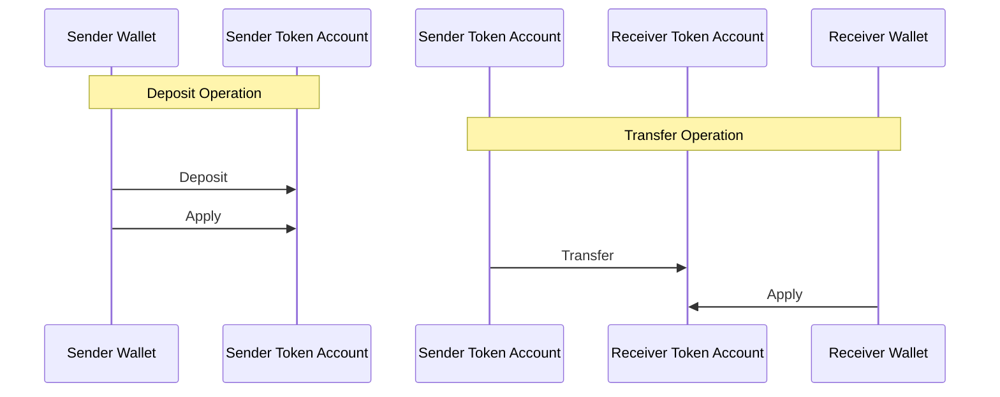
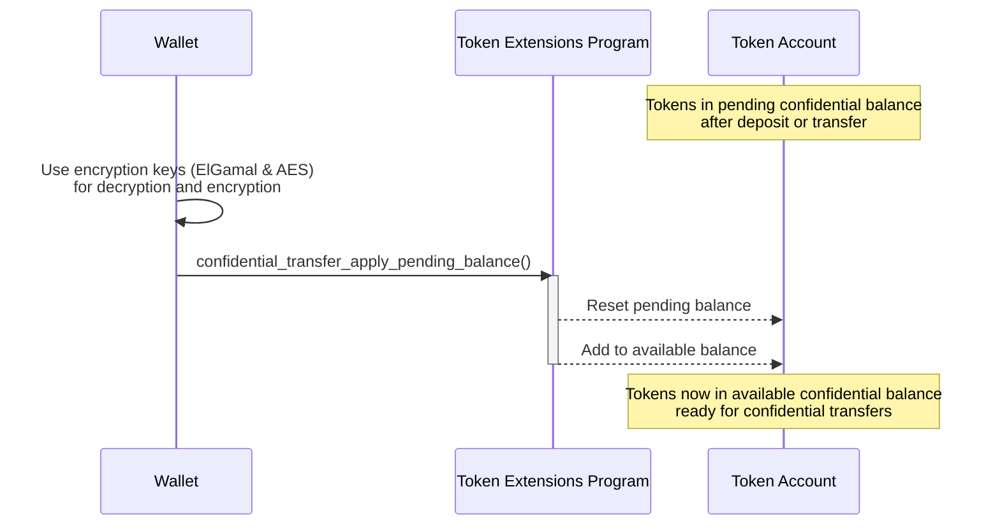

## How to apply pending balance to available balance

Before tokens can be transferred confidentially, the public token balance must
be converted to a confidential balance. This conversion happens in two stages:

1. **Confidential Pending Balance**: Initially, tokens are "deposited" from
   public balance to a "pending" confidential balance.
2. **Confidential Available Balance**: The pending balance is then "applied" to
   the available balance, making the tokens available for confidential
   transfers.

This section explains the second stage: applying the pending balance to the
available balance.

When tokens are "deposited" from the public balance or when tokens are
confidentially transferred from one token account to another, the tokens are
initially added to the confidential pending balance. Before tokens can be used
for confidential transfers, the pending balance must be "applied" to the
available balance.



The following diagram shows the steps involved in applying the pending balance
to the available balance:



### Required Instruction

To convert a pending balance to an available balance, invoke the
[ConfidentialTransferInstruction::ApplyPendingBalance](https://github.com/solana-program/token-2022/blob/efd0c957fefbd79882d77df5fb2dac88c001249c/program/src/extension/confidential_transfer/processor.rs#L1152)
instruction.

The `spl_token_client` crate provides a
`confidential_transfer_apply_pending_balance` method that builds and sends a
transaction with the `ApplyPendingBalance` instruction, as demonstrated in the
example below.

### Example Code

The following example demonstrates how to apply the confidential pending balance
to the confidential available balance.

Confidential transfers depend on the ZK ElGamal Proof program, which is enabled
on mainnet and devnet. A stock `solana-test-validator` does not enable it, but a
mainnet-forking local validator such as [Surfpool](https://surfpool.run) does.
Run the example against one of those (the code uses devnet) with a funded payer,
and replace the placeholder mint and account addresses with your own.

<CodeTabs>

```rust !! title="main.rs"
use anyhow::{Context, Result};
use solana_client::rpc_client::RpcClient;
use solana_commitment_config::CommitmentConfig;
use solana_keypair::Keypair;
use solana_pubkey::Pubkey;
use solana_signer::Signer;
use solana_transaction::Transaction;
use solana_zk_sdk::encryption::{
    auth_encryption::{AeCiphertext, AeKey},
    elgamal::{ElGamalCiphertext, ElGamalKeypair},
};
use solana_zk_sdk_pod::encryption::auth_encryption::PodAeCiphertext;
use spl_associated_token_account::get_associated_token_address_with_program_id;
use spl_token_2022::{
    extension::{
        confidential_transfer::{
            instruction::apply_pending_balance, ConfidentialTransferAccount,
        },
        BaseStateWithExtensions, StateWithExtensions,
    },
    state::Account as TokenAccount,
};

fn main() -> Result<()> {
    let rpc_client = RpcClient::new_with_commitment(
        String::from("https://api.devnet.solana.com"),
        CommitmentConfig::confirmed(),
    );

    let owner = load_keypair()?;
    let mint: Pubkey = "REPLACE_WITH_YOUR_MINT_ADDRESS"
        .parse()
        .context("invalid mint address")?;

    let token_account = get_associated_token_address_with_program_id(
        &owner.pubkey(),
        &mint,
        &spl_token_2022::id(),
    );

    // Derive the owner's keys to decrypt the current balances.
    let elgamal_keypair = ElGamalKeypair::new_from_signer(&owner, &token_account.to_bytes())
        .map_err(|e| anyhow::anyhow!("derive ElGamal keypair: {e}"))?;
    let aes_key = AeKey::new_from_signer(&owner, &token_account.to_bytes())
        .map_err(|e| anyhow::anyhow!("derive AES key: {e}"))?;

    let account_data = rpc_client.get_account(&token_account)?;
    let account = StateWithExtensions::<TokenAccount>::unpack(&account_data.data)?;
    let ct_extension = account.get_extension::<ConfidentialTransferAccount>()?;

    // The pending balance is split into low (16 bits) and high parts, each small
    // enough to recover with ElGamal's bounded decrypt_u32.
    let pending_lo: ElGamalCiphertext = ct_extension
        .pending_balance_lo
        .try_into()
        .map_err(|e| anyhow::anyhow!("pending_balance_lo: {e:?}"))?;
    let pending_hi: ElGamalCiphertext = ct_extension
        .pending_balance_hi
        .try_into()
        .map_err(|e| anyhow::anyhow!("pending_balance_hi: {e:?}"))?;
    let pending_lo_amount = pending_lo
        .decrypt_u32(elgamal_keypair.secret())
        .context("decrypt pending_balance_lo")? as u64;
    let pending_hi_amount = pending_hi
        .decrypt_u32(elgamal_keypair.secret())
        .context("decrypt pending_balance_hi")? as u64;
    let pending_total = pending_lo_amount + (pending_hi_amount << 16);

    // Read the current available balance from the AES-encrypted decryptable
    // balance. ElGamal's decrypt_u32 only recovers values up to 2^32 raw units,
    // so it fails for realistic balances; the AES field has no such limit.
    let decryptable_balance: AeCiphertext = ct_extension
        .decryptable_available_balance
        .try_into()
        .map_err(|e| anyhow::anyhow!("decryptable_available_balance: {e:?}"))?;
    let current_available = decryptable_balance
        .decrypt(&aes_key)
        .context("decrypt available balance")?;

    let new_available = current_available + pending_total;

    // Re-encrypt the new available balance with the AES key for fast reads.
    let new_decryptable: PodAeCiphertext = aes_key.encrypt(new_available).into();

    // The expected counter guards against pending credits that arrive between
    // building and processing this instruction.
    let expected_counter: u64 = ct_extension.pending_balance_credit_counter.into();

    let apply_ix = apply_pending_balance(
        &spl_token_2022::id(),
        &token_account,
        expected_counter,
        &new_decryptable,
        &owner.pubkey(),
        &[&owner.pubkey()],
    )?;

    let blockhash = rpc_client.get_latest_blockhash()?;
    let transaction =
        Transaction::new_signed_with_payer(&[apply_ix], Some(&owner.pubkey()), &[&owner], blockhash);
    let signature = rpc_client.send_and_confirm_transaction(&transaction)?;
    println!("Applied pending balance. New available: {new_available}. Tx: {signature}");
    Ok(())
}

fn load_keypair() -> Result<Keypair> {
    let keypair_path = dirs::home_dir()
        .context("could not find home directory")?
        .join(".config/solana/id.json");
    let bytes: Vec<u8> = serde_json::from_reader(std::fs::File::open(keypair_path)?)?;
    let mut secret = [0u8; 32];
    secret.copy_from_slice(&bytes[0..32]);
    Ok(Keypair::new_from_array(secret))
}
```

```toml !! title="Cargo.toml"
[package]
name = "confidential-transfer"
version = "0.1.0"
edition = "2021"

# spl-token-2022 11 requires solana-system-interface 3.2 (which needs
# solana-instruction >= 3.4). The stable solana-client 4.0.0 caps it lower, so
# pin the 4.0.0-rc.0 line and use the granular solana crates instead of the
# solana-sdk umbrella. This collapses back to solana-sdk once a stable
# solana-client that allows solana-instruction 3.4 ships.
[dependencies]
solana-client = "4.0.0-rc.0"
solana-pubkey = "4.2"
solana-keypair = "3.1"
solana-signer = "3.0"
solana-transaction = "3.1"
solana-commitment-config = "3.1.1"
solana-zk-sdk = "6.0.1"
solana-zk-sdk-pod = "0.1.2"
spl-token-2022 = { version = "11.0.0", features = ["zk-ops"] }
spl-associated-token-account = "8.0.0"

anyhow = "1.0"
dirs = "6.0.0"
serde_json = "1.0"
```

```ts !! title="confidential-apply.ts"
import {
  deriveAeKeyForOwnerMint,
  deriveElGamalKeypairForOwnerMint,
  getApplyConfidentialPendingBalanceInstructionFromToken
} from "@solana-program/token-2022/confidential";
import {
  fetchToken,
  findAssociatedTokenPda,
  TOKEN_2022_PROGRAM_ADDRESS
} from "@solana-program/token-2022";
import { AeKey, ElGamalSecretKey } from "@solana/zk-sdk/bundler";
import { address } from "@solana/kit";

// `owner` is your wallet signer (a @solana/kit `KeyPairSigner`) and `client` is
// a @solana/kit client.
const mint = address("REPLACE_WITH_YOUR_MINT_ADDRESS");
const [token] = await findAssociatedTokenPda({
  owner: owner.address,
  mint,
  tokenProgram: TOKEN_2022_PROGRAM_ADDRESS
});

// Derive the owner's keys to decrypt the current balances.
const derived = await deriveElGamalKeypairForOwnerMint({
  signer: owner,
  owner: owner.address,
  mint
});
const elgamalSecretKey = ElGamalSecretKey.fromBytes(derived.secretKey);
const aesKey = AeKey.fromBytes(
  await deriveAeKeyForOwnerMint({ signer: owner, owner: owner.address, mint })
);

// The helper decrypts the pending and available balances, re-encrypts the new
// available balance, and builds the ApplyPendingBalance instruction. No proof
// is required.
const tokenAccount = await fetchToken(client.rpc, token);
const applyInstruction = getApplyConfidentialPendingBalanceInstructionFromToken(
  {
    token,
    tokenAccount: tokenAccount.data,
    authority: owner,
    elgamalSecretKey,
    aesKey
  }
);

await client.sendTransaction([applyInstruction]);
```

</CodeTabs>
