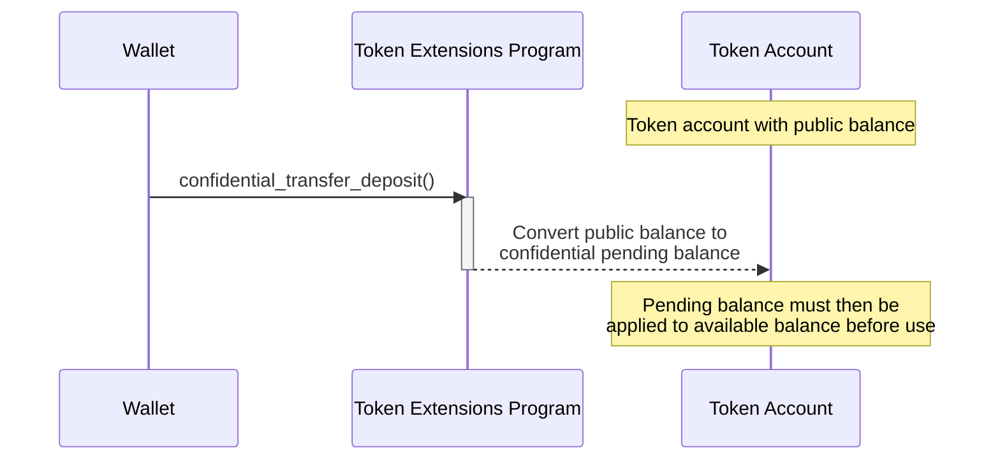

## How to deposit tokens to confidential pending balance

Before tokens can be transferred confidentially, the public token balance must
be converted to a confidential balance. This conversion happens in two stages:

1. **Confidential Pending Balance**: Initially, tokens are "deposited" from
   public balance to a "pending" confidential balance.
2. **Confidential Available Balance**: The pending balance is then "applied" to
   the available balance, making the tokens available for confidential
   transfers.

This section explains the first stage: depositing public token balance to the
confidential pending balance.

The following diagram shows the steps involved in depositing tokens from the
public balance to the confidential pending balance:



### Required Instruction

To convert a public balance to a confidential pending balance, invoke the
[ConfidentialTransferInstruction::Deposit](https://github.com/solana-program/token-2022/blob/efd0c957fefbd79882d77df5fb2dac88c001249c/program/src/extension/confidential_transfer/processor.rs#L386)
instruction. The
[maximum amount](https://github.com/solana-program/token-2022/blob/efd0c957fefbd79882d77df5fb2dac88c001249c/program/src/extension/confidential_transfer/mod.rs#L21)
per deposit instruction is limited to 2^48.

The `spl_token_client` crate provides a `confidential_transfer_deposit` method
that builds and sends a transaction with the `Deposit` instruction, as
demonstrated in the example below.

## Example Code

The following example demonstrates how to deposit public token balance to
confidential pending balance.

Confidential transfers depend on the ZK ElGamal Proof program, which is enabled
on mainnet and devnet. A stock `solana-test-validator` does not enable it, but a
mainnet-forking local validator such as [Surfpool](https://surfpool.run) does.
Run the example against one of those (the code uses devnet) with a funded payer,
and replace the placeholder mint and account addresses with your own.

### Rust

<CodeTabs>

```rust !! title="main.rs"
// !collapse(1:37) collapsed
// Imports: dependencies used by this example.
use anyhow::{Context, Result};
use solana_address::Address;
use solana_client::rpc_client::RpcClient;
use solana_commitment_config::CommitmentConfig;
use solana_instruction::Instruction;
use solana_keypair::Keypair;
use solana_pubkey::Pubkey;
use solana_signer::Signer;
use solana_system_interface::instruction as system_instruction;
use solana_transaction::Transaction;
use solana_zk_elgamal_proof_interface::{
    instruction::{ContextStateInfo, ProofInstruction},
    proof_data::PubkeyValidityProofContext,
    state::ProofContextState,
};
use solana_zk_sdk::{
    encryption::derivation::derive_confidential_keys,
    zk_elgamal_proof_program::pubkey_validity::build_pubkey_validity_proof_data,
};
use solana_zk_sdk_pod::encryption::auth_encryption::PodAeCiphertext;
use spl_associated_token_account::{
    get_associated_token_address_with_program_id, instruction::create_associated_token_account,
};
use spl_token_2022::{
    extension::{
        confidential_transfer::instruction::{
            configure_account, deposit, initialize_mint as initialize_confidential_transfer_mint,
            PubkeyValidityProofData,
        },
        ExtensionType,
    },
    instruction::{initialize_mint as initialize_mint_base, mint_to, reallocate},
    state::Mint,
};
use spl_token_confidential_transfer_proof_extraction::instruction::ProofLocation;
use std::mem::size_of;

const ZK_PROOF_PROGRAM_ID: Pubkey =
    solana_pubkey::pubkey!("ZkE1Gama1Proof11111111111111111111111111111");

fn main() -> Result<()> {
    let rpc_client = RpcClient::new_with_commitment(
        String::from("https://api.devnet.solana.com"),
        CommitmentConfig::confirmed(),
    );

    // Owner = fee payer = token account owner. The setup below configures the
    // account for confidential transfers (see "Create a Token Account").
    let owner = load_keypair()?;
    let amount: u64 = 100;
    let decimals: u8 = 2;

    // Setup: create a confidential token account with public tokens.
    let (mint, token_account) = setup_deposit_account(&rpc_client, &owner, amount, decimals)?;

    // Deposit moves tokens from the public balance into the pending confidential
    // balance. No proof is required. The tokens land in the pending balance and
    // must be applied (see "Apply Pending Balance") before they can be spent.
    let deposit_ix = deposit(
        &spl_token_2022::id(),
        &token_account,
        &mint,
        amount,
        decimals,
        &owner.pubkey(),
        &[&owner.pubkey()],
    )?;

    let blockhash = rpc_client.get_latest_blockhash()?;
    let transaction =
        Transaction::new_signed_with_payer(&[deposit_ix], Some(&owner.pubkey()), &[&owner], blockhash);
    let signature = rpc_client.send_and_confirm_transaction(&transaction)?;
    println!("Deposited {amount} tokens to the pending confidential balance: {signature}");
    Ok(())
}

// !collapse(1:1000) collapsed
// Setup: helper functions to create and fund the account.
fn setup_deposit_account(
    rpc_client: &RpcClient,
    owner: &Keypair,
    amount: u64,
    decimals: u8,
) -> Result<(Pubkey, Pubkey)> {
    let mint = create_confidential_mint(rpc_client, owner, decimals)?;
    let token_account = configure_confidential_token_account(rpc_client, owner, owner, &mint)?;

    let mint_to_ix = mint_to(
        &spl_token_2022::id(),
        &mint,
        &token_account,
        &owner.pubkey(),
        &[&owner.pubkey()],
        amount,
    )?;
    send_tx(rpc_client, &[mint_to_ix], &[owner])?;

    Ok((mint, token_account))
}

fn create_confidential_mint(rpc_client: &RpcClient, payer: &Keypair, decimals: u8) -> Result<Pubkey> {
    let mint = Keypair::new();
    let space =
        ExtensionType::try_calculate_account_len::<Mint>(&[ExtensionType::ConfidentialTransferMint])?;
    let rent = rpc_client.get_minimum_balance_for_rent_exemption(space)?;

    let create_account_ix = system_instruction::create_account(
        &payer.pubkey(),
        &mint.pubkey(),
        rent,
        space as u64,
        &spl_token_2022::id(),
    );
    let init_confidential_ix = initialize_confidential_transfer_mint(
        &spl_token_2022::id(),
        &mint.pubkey(),
        Some(payer.pubkey()),
        true,
        None,
    )?;
    let init_mint_ix = initialize_mint_base(
        &spl_token_2022::id(),
        &mint.pubkey(),
        &payer.pubkey(),
        None,
        decimals,
    )?;

    send_tx(
        rpc_client,
        &[create_account_ix, init_confidential_ix, init_mint_ix],
        &[payer, &mint],
    )?;
    Ok(mint.pubkey())
}

fn configure_confidential_token_account(
    rpc_client: &RpcClient,
    payer: &Keypair,
    owner: &Keypair,
    mint: &Pubkey,
) -> Result<Pubkey> {
    let token_account = get_associated_token_address_with_program_id(
        &owner.pubkey(),
        mint,
        &spl_token_2022::id(),
    );
    let create_ata_ix = create_associated_token_account(
        &payer.pubkey(),
        &owner.pubkey(),
        mint,
        &spl_token_2022::id(),
    );
    let realloc_ix = reallocate(
        &spl_token_2022::id(),
        &token_account,
        &payer.pubkey(),
        &owner.pubkey(),
        &[&owner.pubkey()],
        &[ExtensionType::ConfidentialTransferAccount],
    )?;

    let (elgamal_keypair, aes_key) = derive_confidential_keys(owner, &token_account.to_bytes())
        .map_err(|e| anyhow::anyhow!("derive confidential keys: {e}"))?;
    let decryptable_balance: PodAeCiphertext = aes_key.encrypt(0).into();

    let proof_data = build_pubkey_validity_proof_data(&elgamal_keypair)
        .map_err(|e| anyhow::anyhow!("generate pubkey validity proof: {e}"))?;
    let proof_account = Keypair::new();
    let context_state_size = size_of::<ProofContextState<PubkeyValidityProofContext>>();
    let create_proof_account_ix = system_instruction::create_account(
        &payer.pubkey(),
        &proof_account.pubkey(),
        rpc_client.get_minimum_balance_for_rent_exemption(context_state_size)?,
        context_state_size as u64,
        &ZK_PROOF_PROGRAM_ID,
    );

    let proof_account_address: Address = proof_account.pubkey().to_bytes().into();
    let owner_address: Address = owner.pubkey().to_bytes().into();
    let verify_proof_ix = ProofInstruction::VerifyPubkeyValidity.encode_verify_proof(
        Some(ContextStateInfo {
            context_state_account: &proof_account_address,
            context_state_authority: &owner_address,
        }),
        &proof_data,
    );
    let proof_location: ProofLocation<PubkeyValidityProofData> =
        ProofLocation::ContextStateAccount(&proof_account.pubkey());
    let configure_account_ixs = configure_account(
        &spl_token_2022::id(),
        &token_account,
        mint,
        &decryptable_balance,
        65_536,
        &owner.pubkey(),
        &[&owner.pubkey()],
        proof_location,
    )?;

    let mut instructions = vec![
        create_ata_ix,
        realloc_ix,
        create_proof_account_ix,
        verify_proof_ix,
    ];
    instructions.extend(configure_account_ixs);

    if payer.pubkey() == owner.pubkey() {
        send_tx(rpc_client, &instructions, &[payer, &proof_account])?;
    } else {
        send_tx(rpc_client, &instructions, &[payer, owner, &proof_account])?;
    }

    Ok(token_account)
}

fn send_tx(client: &RpcClient, instructions: &[Instruction], signers: &[&Keypair]) -> Result<()> {
    let blockhash = client.get_latest_blockhash()?;
    let transaction =
        Transaction::new_signed_with_payer(instructions, Some(&signers[0].pubkey()), signers, blockhash);
    client.send_and_confirm_transaction(&transaction)?;
    Ok(())
}

fn load_keypair() -> Result<Keypair> {
    let keypair_path = dirs::home_dir()
        .context("could not find home directory")?
        .join(".config/solana/id.json");
    let bytes: Vec<u8> = serde_json::from_reader(std::fs::File::open(keypair_path)?)?;
    let mut secret = [0u8; 32];
    secret.copy_from_slice(&bytes[0..32]);
    Ok(Keypair::new_from_array(secret))
}
```

```toml !! title="Cargo.toml"
[package]
name = "confidential-transfer"
version = "0.1.0"
edition = "2021"

# spl-token-2022 11 requires solana-system-interface 3.2 (which needs
# solana-instruction >= 3.4). The stable solana-client 4.0.0 caps it lower, so
# pin the 4.0.0-rc.0 line and use the granular solana crates instead of the
# solana-sdk umbrella. This collapses back to solana-sdk once a stable
# solana-client that allows solana-instruction 3.4 ships.
[dependencies]
solana-client = "4.0.0-rc.0"
solana-pubkey = "4.2"
solana-keypair = "3.1"
solana-signer = "3.0"
solana-transaction = "3.1"
solana-instruction = "3.4"
solana-commitment-config = "3.1.1"
solana-system-interface = { version = "3.2.0", features = ["bincode"] }
solana-address = "2.6"
solana-zk-sdk = "7.0.1"
solana-zk-sdk-pod = "0.1.2"
solana-zk-elgamal-proof-interface = "0.1.2"
spl-token-2022 = { version = "11.0.0", features = ["zk-ops"] }
spl-associated-token-account = "8.0.0"
spl-token-confidential-transfer-proof-extraction = "0.6.1"

anyhow = "1.0"
dirs = "6.0.0"
serde_json = "1.0"
```

</CodeTabs>

### Typescript

<CodeTabs>

```ts !! title="confidential-deposit.ts"
import {
  findAssociatedTokenPda,
  getConfidentialDepositInstruction,
  TOKEN_2022_PROGRAM_ADDRESS
} from "@solana-program/token-2022";
import { address } from "@solana/kit";

// `owner` is your wallet signer (a @solana/kit `KeyPairSigner`) and `client` is
// a @solana/kit client. The account must already be configured for confidential
// transfers (see "Create a Token Account").
const mint = address("REPLACE_WITH_YOUR_MINT_ADDRESS");
const amount = 100n;
const decimals = 2;

const [token] = await findAssociatedTokenPda({
  owner: owner.address,
  mint,
  tokenProgram: TOKEN_2022_PROGRAM_ADDRESS
});

// Deposit moves public tokens into the pending confidential balance. No proof
// is required; the tokens must then be applied before they can be spent.
const depositInstruction = getConfidentialDepositInstruction({
  token,
  mint,
  authority: owner,
  amount,
  decimals
});

await client.sendTransaction([depositInstruction]);
```

```json !! title="package.json"
{
  "name": "confidential-deposit",
  "version": "0.1.0",
  "private": true,
  "type": "module",
  "dependencies": {
    "@solana-program/token-2022": "^0.12.0",
    "@solana/kit": "^6.10.0"
  },
  "devDependencies": {
    "typescript": "^5.8.3"
  }
}
```

</CodeTabs>
