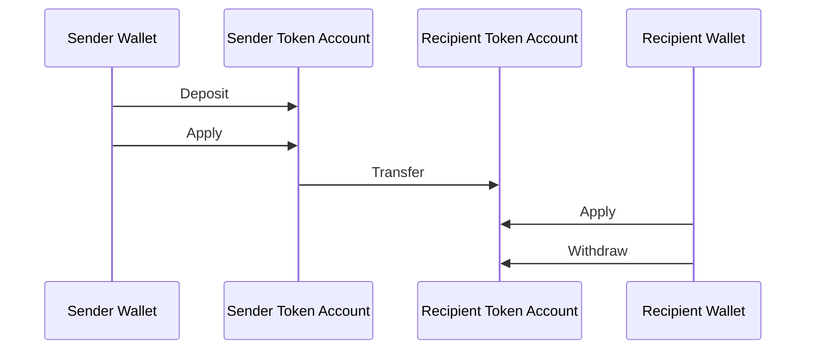
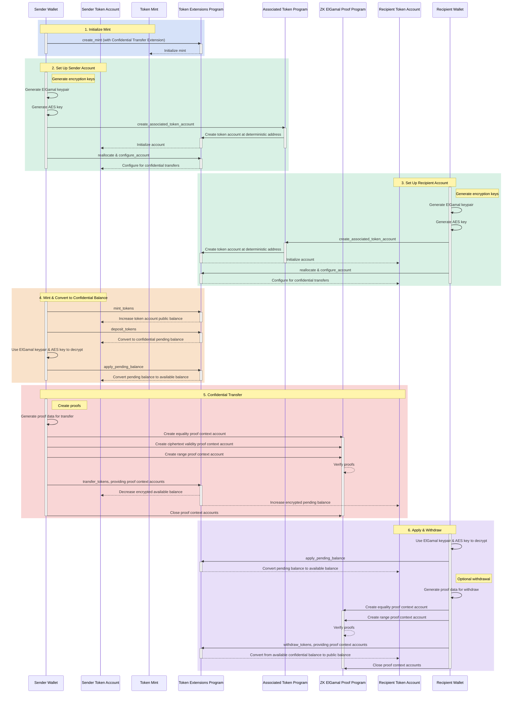

## What are Confidential Transfers?

<Embed url="https://youtu.be/Bqs95tFcRIU" />

Confidential transfers enable you to transfer tokens between token accounts
without revealing the transfer amount. This is useful for privacy-preserving
transactions. Only the transfer amounts and token balances are private. The
token account addresses remain public.

- [Protocol Overview](https://www.solana-program.com/docs/confidential-balances/overview) -
  Details on the underlying cryptographic protocol
- [Quick Start Guide](https://www.solana-program.com/docs/confidential-balances#setup) -
  Setup and basic CLI commands
- [Confidential Balances Cookbook](https://github.com/solana-developers/Confidential-Balances-Sample) -
  Code snippets on how to use the Confidential Transfer extension

### How does it work?

The Confidential Transfer extension adds
[instructions](https://github.com/solana-program/token-2022/blob/efd0c957fefbd79882d77df5fb2dac88c001249c/program/src/extension/confidential_transfer/instruction.rs#L29)
to the Token Extension program that allows you to transfer tokens between
accounts without revealing the transfer amount.

The basic flow of confidential token transfers is as follows:

1. Create a mint account with the confidential transfer extension.
2. Create token accounts with confidential transfer extension for the sender and
   recipient.
3. Mint tokens to the sender account.
4. **Deposit** sender's public balance to **confidential pending balance**.
5. **Apply** sender's pending balance to **confidential available balance**.
6. Confidentially **transfer** tokens from sender token account to recipient
   token account.
7. **Apply** recipient's pending balance to **confidential available balance**.
8. **Withdraw** recipient's confidential available balance to **public
   balance**.

For more details on the steps in the confidential transfer flow, see the
corresponding pages:

<Cards>
  <Card
    title="Create Mint Account"
    href="/docs/tokens/extensions/confidential-transfer/create-mint"
  >
    How to create a mint account with the Confidential Transfer extension
  </Card>
  <Card
    title="Create Token Account"
    href="/docs/tokens/extensions/confidential-transfer/create-token-account"
  >
    How to configure a token account with the Confidential Transfer extension
  </Card>
  <Card
    title="Deposit Tokens"
    href="/docs/tokens/extensions/confidential-transfer/deposit-tokens"
  >
    How to deposit tokens to confidential pending balance
  </Card>
  <Card
    title="Apply Pending Balance"
    href="/docs/tokens/extensions/confidential-transfer/apply-pending-balance"
  >
    How to apply pending balance to available confidential balance
  </Card>
  <Card
    title="Withdraw Tokens"
    href="/docs/tokens/extensions/confidential-transfer/withdraw-tokens"
  >
    How to withdraw tokens from confidential available balance
  </Card>
  <Card
    title="Transfer Tokens"
    href="/docs/tokens/extensions/confidential-transfer/transfer-tokens"
  >
    How to confidentially transfer tokens between token accounts
  </Card>
  <Card
    title="Integration Guide"
    href="/docs/tokens/extensions/confidential-transfer/integration-guide"
  >
    How wallets, explorers, and exchanges can support confidential transfer
    tokens
  </Card>
  <Card
    title="Issuer Guide"
    href="/docs/tokens/extensions/confidential-transfer/issuer-guide"
  >
    How to issue and operate a confidential transfer token (approve policy,
    auditors, fees, mint and burn)
  </Card>
</Cards>

The diagram below shows a detailed sequence of the basic flow for confidential
token transfers:

## Confidential Transfer Instructions

The full list of Confidential Transfer extension
[instructions](https://github.com/solana-program/token-2022/blob/efd0c957fefbd79882d77df5fb2dac88c001249c/program/src/extension/confidential_transfer/instruction.rs#L29)
are as follows:

| Instruction                         | Description                                                                                                                                                       |
| ----------------------------------- | ----------------------------------------------------------------------------------------------------------------------------------------------------------------- |
| _rs`InitializeMint`_                | Sets up mint account for confidential transfers. This instruction must be included in the same transaction as _rs`TokenInstruction::InitializeMint`_ instruction. |
| _rs`UpdateMint`_                    | Updates confidential transfer settings for a mint.                                                                                                                |
| _rs`ConfigureAccount`_              | Sets up a token account for confidential transfers.                                                                                                               |
| _rs`ApproveAccount`_                | Approves a token account for confidential transfers if the mint requires approval for new token accounts.                                                         |
| _rs`EmptyAccount`_                  | Empties the pending and available confidential balances to allow closing a token account.                                                                         |
| _rs`Deposit`_                       | Converts public token balance into pending confidential balance.                                                                                                  |
| _rs`Withdraw`_                      | Converts available confidential balance back to public balance.                                                                                                   |
| _rs`Transfer`_                      | Transfers tokens between token accounts confidentially.                                                                                                           |
| _rs`ApplyPendingBalance`_           | Converts pending balance into available balance after deposits or transfers.                                                                                      |
| _rs`EnableConfidentialCredits`_     | Allows a token account to receive confidential token transfers.                                                                                                   |
| _rs`DisableConfidentialCredits`_    | Blocks incoming confidential transfers while still allowing public transfers.                                                                                     |
| _rs`EnableNonConfidentialCredits`_  | Allows a token account to receive public token transfers.                                                                                                         |
| _rs`DisableNonConfidentialCredits`_ | Blocks regular transfers to make account receive only confidential transfers.                                                                                     |
| _rs`TransferWithFee`_               | Transfers tokens between token accounts confidentially with a fee.                                                                                                |
| _rs`ConfigureAccountWithRegistry`_  | Alternative way to configure token accounts for confidential transfers using an _rs`ElGamalRegistry`_ account instead of _rs`VerifyPubkeyValidity`_ proof.        |
