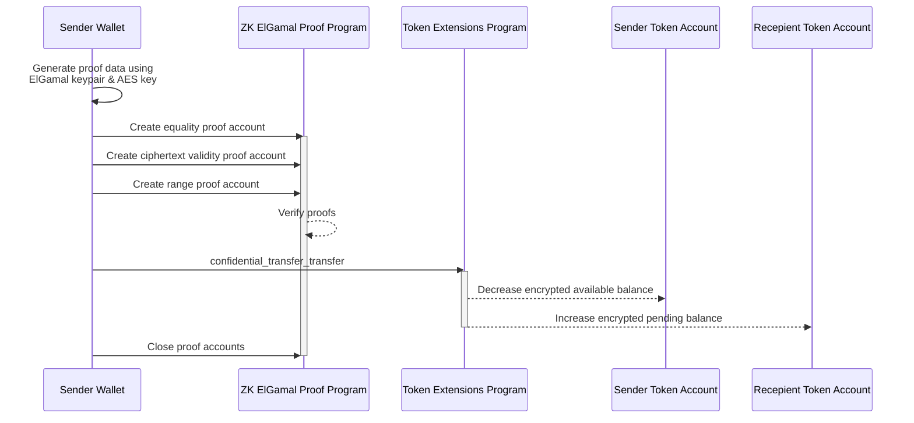

## How to confidentially transfer tokens from one token account to another

To confidentially transfer tokens from one token account to another, both the
sender and recipient must have token accounts configured with the
_rs`ConfidentialTransferAccount`_ state and approved for confidential transfers.
The sender's token account must also have an available confidential balance to
transfer from.

To transfer tokens confidentially:

1. Create
   [three proofs](https://github.com/solana-program/token-2022/blob/d073cb89dbcd430387b5c6fb4b7157911351e4a3/confidential-transfer/proof-generation/src/transfer.rs#L35)
   client side:

   **Equality Proof
   ([CiphertextCommitmentEqualityProofData](https://github.com/anza-xyz/agave/blob/8b33d6d311c95780362a7d235919e7b8d2345939/zk-token-sdk/src/instruction/ciphertext_commitment_equality.rs#L56))**:
   Verifies that the new available balance ciphertext after the transfer matches
   its corresponding
   [Pedersen commitment](https://en.wikipedia.org/wiki/Commitment_scheme),
   ensuring the source account's new available balance is correctly computed as
   `new_balance = current_balance - transfer_amount`.

   **Ciphertext Validity Proof
   ([BatchedGroupedCiphertext3HandlesValidityProofData](https://github.com/anza-xyz/agave/blob/8b33d6d311c95780362a7d235919e7b8d2345939/zk-token-sdk/src/instruction/batched_grouped_ciphertext_validity/handles_3.rs#L63))**:
   Verifies that the transfer amount ciphertexts are properly generated for all
   three parties (source, destination, and auditor), ensuring the transfer
   amount is correctly encrypted under each party's public key.

   **Range Proof
   ([BatchedRangeProofU128Data](https://github.com/anza-xyz/agave/blob/8b33d6d311c95780362a7d235919e7b8d2345939/zk-token-sdk/src/instruction/batched_range_proof/batched_range_proof_u128.rs#L37))**:
   Verifies that the new available balance and transfer amount (split into
   low/high bits) are all non-negative and within a specified range.

2. For each proof:
   - Invoke the ZK ElGamal proof program to verify the proof data.
   - Store the proof-specific metadata in a proof "context state" account to use
     in other instructions.

3. Invoke the
   [ConfidentialTransferInstruction::Transfer](https://github.com/solana-program/token-2022/blob/efd0c957fefbd79882d77df5fb2dac88c001249c/program/src/extension/confidential_transfer/processor.rs#L604)
   instruction, providing the proof context state accounts.

4. Close the proof context state accounts to recover the SOL used to create
   them.

The following diagram shows the steps involved in transferring tokens from a
sender's token account to a recipient's token account.



### Required Instructions

To confidentially transfer tokens from one token account to another, you must:

- Generate an equality proof, ciphertext validity proof, and range proof
  client-side
- Invoke the Zk ElGamal proof program to verify the proofs and initialize the
  "context state" accounts
- Invoke the
  [ConfidentialTransferInstruction::Transfer](https://github.com/solana-program/token-2022/blob/efd0c957fefbd79882d77df5fb2dac88c001249c/program/src/extension/confidential_transfer/processor.rs#L604)
  instruction providing the three proof accounts.
- Close the three proof accounts to recover rent.

The Rust example below generates the proofs with the
`spl-token-confidential-transfer-proof-generation` crate, verifies each into a
context state account through the ZK ElGamal Proof program, references the three
accounts in the transfer instruction, and closes them afterward. The TypeScript
example uses the `getConfidentialTransferInstructionPlan` helper from
`@solana-program/token-2022/confidential`, which assembles the same proof
accounts, transfer, and closes as a multi-transaction instruction plan.

## Example Code

The following example confidentially transfers tokens from one account to
another. Both accounts must already be configured for confidential transfers,
and the sender must have an available confidential balance.

Confidential transfers depend on the ZK ElGamal Proof program, which is enabled
on mainnet and devnet. A stock `solana-test-validator` does not enable it, but a
mainnet-forking local validator such as [Surfpool](https://surfpool.run) does.
Run the example against one of those (the code uses devnet) with a funded payer,
and replace the placeholders with your mint and the sender and recipient
accounts.

### Rust

<CodeTabs>

```rust !! title="main.rs"
// !collapse(1:49) collapsed
// Imports: dependencies used by this example.
use anyhow::{Context, Result};
use solana_address::Address;
use solana_client::rpc_client::RpcClient;
use solana_commitment_config::CommitmentConfig;
use solana_instruction::Instruction;
use solana_keypair::Keypair;
use solana_pubkey::Pubkey;
use solana_signer::Signer;
use solana_system_interface::instruction as system_instruction;
use solana_transaction::Transaction;
use solana_zk_elgamal_proof_interface::{
    instruction::{close_context_state, ContextStateInfo, ProofInstruction},
    proof_data::{
        BatchedGroupedCiphertext3HandlesValidityProofContext, BatchedRangeProofContext,
        CiphertextCommitmentEqualityProofContext, PubkeyValidityProofContext,
    },
    state::ProofContextState,
};
use solana_zk_sdk::{
    encryption::{
        auth_encryption::AeCiphertext,
        derivation::derive_confidential_keys,
        elgamal::{ElGamalCiphertext, ElGamalPubkey},
    },
    zk_elgamal_proof_program::pubkey_validity::build_pubkey_validity_proof_data,
};
use solana_zk_sdk_pod::encryption::{auth_encryption::PodAeCiphertext, elgamal::PodElGamalPubkey};
use spl_associated_token_account::{
    get_associated_token_address_with_program_id, instruction::create_associated_token_account,
};
use spl_token_2022::{
    extension::{
        confidential_transfer::{
            instruction::{
                apply_pending_balance, configure_account, deposit,
                initialize_mint as initialize_confidential_transfer_mint, inner_transfer,
                PubkeyValidityProofData,
            },
            ConfidentialTransferAccount, ConfidentialTransferMint,
        },
        BaseStateWithExtensions, ExtensionType, StateWithExtensions,
    },
    instruction::{initialize_mint as initialize_mint_base, mint_to, reallocate},
    state::{Account as TokenAccount, Mint},
};
use spl_token_confidential_transfer_proof_extraction::instruction::ProofLocation;
use spl_token_confidential_transfer_proof_generation::transfer::transfer_split_proof_data;
use std::mem::size_of;

const ZK_PROOF_PROGRAM_ID: Pubkey =
    solana_pubkey::pubkey!("ZkE1Gama1Proof11111111111111111111111111111");

fn main() -> Result<()> {
    let rpc_client = RpcClient::new_with_commitment(
        String::from("https://api.devnet.solana.com"),
        CommitmentConfig::confirmed(),
    );

    // Sender = fee payer = token account owner. Both the sender and recipient
    // accounts must already be configured for confidential transfers, and the
    // sender must have an available confidential balance (deposit then apply
    // pending balance beforehand).
    let sender = load_keypair()?;
    let amount: u64 = 100;

    // Setup: create confidential accounts and fund the sender.
    let recipient_keypair = Keypair::new();
    let (mint, sender_token_account, recipient_token_account) =
        setup_transfer_accounts(&rpc_client, &sender, &recipient_keypair, amount)?;

    // Read the recipient's ElGamal public key from their confidential account.
    let recipient_acc = rpc_client.get_account(&recipient_token_account)?;
    let recipient_state = StateWithExtensions::<TokenAccount>::unpack(&recipient_acc.data)?;
    let recipient_elgamal_pubkey: ElGamalPubkey = recipient_state
        .get_extension::<ConfidentialTransferAccount>()?
        .elgamal_pubkey
        .try_into()
        .map_err(|e| anyhow::anyhow!("recipient ElGamal pubkey: {e:?}"))?;

    // Read the optional auditor ElGamal public key from the mint.
    let mint_acc = rpc_client.get_account(&mint)?;
    let mint_state = StateWithExtensions::<Mint>::unpack(&mint_acc.data)?;
    let mint_ext = mint_state.get_extension::<ConfidentialTransferMint>()?;
    let auditor_elgamal_pubkey: Option<ElGamalPubkey> =
        Option::<PodElGamalPubkey>::from(mint_ext.auditor_elgamal_pubkey)
            .map(|pod| {
                ElGamalPubkey::try_from(pod).map_err(|e| anyhow::anyhow!("auditor pubkey: {e:?}"))
            })
            .transpose()?;

    // Derive the sender's keys and read their current confidential balance.
    let (sender_elgamal, sender_aes) =
        derive_confidential_keys(&sender, &sender_token_account.to_bytes())
            .map_err(|e| anyhow::anyhow!("derive confidential keys: {e}"))?;

    let sender_acc = rpc_client.get_account(&sender_token_account)?;
    let sender_state = StateWithExtensions::<TokenAccount>::unpack(&sender_acc.data)?;
    let sender_ext = sender_state.get_extension::<ConfidentialTransferAccount>()?;
    let current_available: ElGamalCiphertext = sender_ext
        .available_balance
        .try_into()
        .map_err(|e| anyhow::anyhow!("available balance: {e:?}"))?;
    let current_decryptable: AeCiphertext = sender_ext
        .decryptable_available_balance
        .try_into()
        .map_err(|e| anyhow::anyhow!("decryptable balance: {e:?}"))?;

    // Generate the three transfer proofs (equality, ciphertext-validity, range).
    let proof_data = transfer_split_proof_data(
        &current_available,
        &current_decryptable,
        amount,
        &sender_elgamal,
        &sender_aes,
        &recipient_elgamal_pubkey,
        auditor_elgamal_pubkey.as_ref(),
    )
    .map_err(|e| anyhow::anyhow!("transfer_split_proof_data: {e}"))?;

    // Create one context state account per proof, owned by the ZK program.
    let equality_account = Keypair::new();
    let validity_account = Keypair::new();
    let range_account = Keypair::new();
    let equality_size = size_of::<ProofContextState<CiphertextCommitmentEqualityProofContext>>();
    let validity_size =
        size_of::<ProofContextState<BatchedGroupedCiphertext3HandlesValidityProofContext>>();
    let range_size = size_of::<ProofContextState<BatchedRangeProofContext>>();
    let create = |account: &Keypair, space: usize| -> Result<Instruction> {
        Ok(system_instruction::create_account(
            &sender.pubkey(),
            &account.pubkey(),
            rpc_client.get_minimum_balance_for_rent_exemption(space)?,
            space as u64,
            &ZK_PROOF_PROGRAM_ID,
        ))
    };
    let equality_create_ix = create(&equality_account, equality_size)?;
    let validity_create_ix = create(&validity_account, validity_size)?;
    let range_create_ix = create(&range_account, range_size)?;

    // The sender is the context-state authority for all three proof accounts.
    let authority: Address = sender.pubkey().to_bytes().into();
    let equality_verify_ix = ProofInstruction::VerifyCiphertextCommitmentEquality
        .encode_verify_proof(
            Some(ContextStateInfo {
                context_state_account: &Address::from(equality_account.pubkey().to_bytes()),
                context_state_authority: &authority,
            }),
            &proof_data.equality_proof_data,
        );
    let validity_verify_ix = ProofInstruction::VerifyBatchedGroupedCiphertext3HandlesValidity
        .encode_verify_proof(
            Some(ContextStateInfo {
                context_state_account: &Address::from(validity_account.pubkey().to_bytes()),
                context_state_authority: &authority,
            }),
            &proof_data
                .ciphertext_validity_proof_data_with_ciphertext
                .proof_data,
        );
    let range_verify_ix = ProofInstruction::VerifyBatchedRangeProofU128.encode_verify_proof(
        Some(ContextStateInfo {
            context_state_account: &Address::from(range_account.pubkey().to_bytes()),
            context_state_authority: &authority,
        }),
        &proof_data.range_proof_data,
    );

    // Transaction 1: create all three accounts and verify the validity proof.
    send_tx(
        &rpc_client,
        &[
            equality_create_ix,
            validity_create_ix,
            range_create_ix,
            validity_verify_ix,
        ],
        &[&sender, &equality_account, &validity_account, &range_account],
    )?;
    // Transaction 2: verify the range proof (the largest, on its own).
    send_tx(&rpc_client, &[range_verify_ix], &[&sender])?;

    // Compute the sender's new decryptable available balance after the transfer.
    let current_plaintext = current_decryptable
        .decrypt(&sender_aes)
        .context("decrypt available balance")?;
    let new_plaintext = current_plaintext
        .checked_sub(amount)
        .context("insufficient available balance")?;
    let new_decryptable: PodAeCiphertext = sender_aes.encrypt(new_plaintext).into();

    let auditor_lo = proof_data
        .ciphertext_validity_proof_data_with_ciphertext
        .ciphertext_lo;
    let auditor_hi = proof_data
        .ciphertext_validity_proof_data_with_ciphertext
        .ciphertext_hi;

    let transfer_ix = inner_transfer(
        &spl_token_2022::id(),
        &sender_token_account,
        &mint,
        &recipient_token_account,
        &new_decryptable,
        &auditor_lo,
        &auditor_hi,
        &sender.pubkey(),
        &[],
        ProofLocation::ContextStateAccount(&equality_account.pubkey()),
        ProofLocation::ContextStateAccount(&validity_account.pubkey()),
        ProofLocation::ContextStateAccount(&range_account.pubkey()),
    )?;

    // Transaction 3: verify the equality proof, run the transfer, and close the
    // three proof accounts to reclaim their rent.
    let close = |account: &Keypair| {
        close_context_state(
            ContextStateInfo {
                context_state_account: &Address::from(account.pubkey().to_bytes()),
                context_state_authority: &authority,
            },
            &authority,
        )
    };
    let instructions = [
        equality_verify_ix,
        transfer_ix,
        close(&equality_account),
        close(&validity_account),
        close(&range_account),
    ];
    let blockhash = rpc_client.get_latest_blockhash()?;
    let transaction = Transaction::new_signed_with_payer(
        &instructions,
        Some(&sender.pubkey()),
        &[&sender],
        blockhash,
    );
    let signature = rpc_client.send_and_confirm_transaction(&transaction)?;

    println!("Transferred {amount} tokens confidentially: {signature}");
    Ok(())
}

// !collapse(1:1000) collapsed
// Setup: helper functions to create accounts and sender funds.
fn send_tx(client: &RpcClient, instructions: &[Instruction], signers: &[&Keypair]) -> Result<()> {
    let blockhash = client.get_latest_blockhash()?;
    let transaction =
        Transaction::new_signed_with_payer(instructions, Some(&signers[0].pubkey()), signers, blockhash);
    client.send_and_confirm_transaction(&transaction)?;
    Ok(())
}

fn setup_transfer_accounts(
    rpc_client: &RpcClient,
    sender: &Keypair,
    recipient: &Keypair,
    amount: u64,
) -> Result<(Pubkey, Pubkey, Pubkey)> {
    let decimals: u8 = 2;
    let mint = create_confidential_mint(rpc_client, sender, decimals)?;
    let sender_token_account = configure_confidential_token_account(rpc_client, sender, sender, &mint)?;
    let recipient_token_account =
        configure_confidential_token_account(rpc_client, sender, recipient, &mint)?;

    let mint_to_ix = mint_to(
        &spl_token_2022::id(),
        &mint,
        &sender_token_account,
        &sender.pubkey(),
        &[&sender.pubkey()],
        amount,
    )?;
    let deposit_ix = deposit(
        &spl_token_2022::id(),
        &sender_token_account,
        &mint,
        amount,
        decimals,
        &sender.pubkey(),
        &[&sender.pubkey()],
    )?;
    send_tx(rpc_client, &[mint_to_ix, deposit_ix], &[sender])?;
    apply_pending_balance_for_account(rpc_client, sender, &sender_token_account)?;

    Ok((mint, sender_token_account, recipient_token_account))
}

fn create_confidential_mint(rpc_client: &RpcClient, payer: &Keypair, decimals: u8) -> Result<Pubkey> {
    let mint = Keypair::new();
    let space =
        ExtensionType::try_calculate_account_len::<Mint>(&[ExtensionType::ConfidentialTransferMint])?;
    let rent = rpc_client.get_minimum_balance_for_rent_exemption(space)?;

    let create_account_ix = system_instruction::create_account(
        &payer.pubkey(),
        &mint.pubkey(),
        rent,
        space as u64,
        &spl_token_2022::id(),
    );
    let init_confidential_ix = initialize_confidential_transfer_mint(
        &spl_token_2022::id(),
        &mint.pubkey(),
        Some(payer.pubkey()),
        true,
        None,
    )?;
    let init_mint_ix = initialize_mint_base(
        &spl_token_2022::id(),
        &mint.pubkey(),
        &payer.pubkey(),
        None,
        decimals,
    )?;

    send_tx(
        rpc_client,
        &[create_account_ix, init_confidential_ix, init_mint_ix],
        &[payer, &mint],
    )?;
    Ok(mint.pubkey())
}

fn configure_confidential_token_account(
    rpc_client: &RpcClient,
    payer: &Keypair,
    owner: &Keypair,
    mint: &Pubkey,
) -> Result<Pubkey> {
    let token_account = get_associated_token_address_with_program_id(
        &owner.pubkey(),
        mint,
        &spl_token_2022::id(),
    );
    let create_ata_ix = create_associated_token_account(
        &payer.pubkey(),
        &owner.pubkey(),
        mint,
        &spl_token_2022::id(),
    );
    let realloc_ix = reallocate(
        &spl_token_2022::id(),
        &token_account,
        &payer.pubkey(),
        &owner.pubkey(),
        &[&owner.pubkey()],
        &[ExtensionType::ConfidentialTransferAccount],
    )?;

    let (elgamal_keypair, aes_key) = derive_confidential_keys(owner, &token_account.to_bytes())
        .map_err(|e| anyhow::anyhow!("derive confidential keys: {e}"))?;
    let decryptable_balance: PodAeCiphertext = aes_key.encrypt(0).into();

    let proof_data = build_pubkey_validity_proof_data(&elgamal_keypair)
        .map_err(|e| anyhow::anyhow!("generate pubkey validity proof: {e}"))?;
    let proof_account = Keypair::new();
    let context_state_size = size_of::<ProofContextState<PubkeyValidityProofContext>>();
    let create_proof_account_ix = system_instruction::create_account(
        &payer.pubkey(),
        &proof_account.pubkey(),
        rpc_client.get_minimum_balance_for_rent_exemption(context_state_size)?,
        context_state_size as u64,
        &ZK_PROOF_PROGRAM_ID,
    );

    let proof_account_address: Address = proof_account.pubkey().to_bytes().into();
    let owner_address: Address = owner.pubkey().to_bytes().into();
    let verify_proof_ix = ProofInstruction::VerifyPubkeyValidity.encode_verify_proof(
        Some(ContextStateInfo {
            context_state_account: &proof_account_address,
            context_state_authority: &owner_address,
        }),
        &proof_data,
    );
    let proof_location: ProofLocation<PubkeyValidityProofData> =
        ProofLocation::ContextStateAccount(&proof_account.pubkey());
    let configure_account_ixs = configure_account(
        &spl_token_2022::id(),
        &token_account,
        mint,
        &decryptable_balance,
        65_536,
        &owner.pubkey(),
        &[&owner.pubkey()],
        proof_location,
    )?;

    let mut instructions = vec![
        create_ata_ix,
        realloc_ix,
        create_proof_account_ix,
        verify_proof_ix,
    ];
    instructions.extend(configure_account_ixs);

    if payer.pubkey() == owner.pubkey() {
        send_tx(rpc_client, &instructions, &[payer, &proof_account])?;
    } else {
        send_tx(rpc_client, &instructions, &[payer, owner, &proof_account])?;
    }

    Ok(token_account)
}

fn apply_pending_balance_for_account(
    rpc_client: &RpcClient,
    owner: &Keypair,
    token_account: &Pubkey,
) -> Result<()> {
    let (elgamal_keypair, aes_key) = derive_confidential_keys(owner, &token_account.to_bytes())
        .map_err(|e| anyhow::anyhow!("derive confidential keys: {e}"))?;

    let account_data = rpc_client.get_account(token_account)?;
    let account = StateWithExtensions::<TokenAccount>::unpack(&account_data.data)?;
    let ct_extension = account.get_extension::<ConfidentialTransferAccount>()?;
    let pending_lo: ElGamalCiphertext = ct_extension
        .pending_balance_lo
        .try_into()
        .map_err(|e| anyhow::anyhow!("pending_balance_lo: {e:?}"))?;
    let pending_hi: ElGamalCiphertext = ct_extension
        .pending_balance_hi
        .try_into()
        .map_err(|e| anyhow::anyhow!("pending_balance_hi: {e:?}"))?;

    let pending_lo_amount = pending_lo
        .decrypt_u32(elgamal_keypair.secret())
        .context("decrypt pending_balance_lo")? as u64;
    let pending_hi_amount = pending_hi
        .decrypt_u32(elgamal_keypair.secret())
        .context("decrypt pending_balance_hi")? as u64;

    let decryptable_balance: AeCiphertext = ct_extension
        .decryptable_available_balance
        .try_into()
        .map_err(|e| anyhow::anyhow!("decryptable_available_balance: {e:?}"))?;
    let current_available = decryptable_balance
        .decrypt(&aes_key)
        .context("decrypt available balance")?;

    let new_available = current_available + pending_lo_amount + (pending_hi_amount << 16);
    let new_decryptable: PodAeCiphertext = aes_key.encrypt(new_available).into();
    let expected_counter: u64 = ct_extension.pending_balance_credit_counter.into();

    let apply_ix = apply_pending_balance(
        &spl_token_2022::id(),
        token_account,
        expected_counter,
        &new_decryptable,
        &owner.pubkey(),
        &[&owner.pubkey()],
    )?;
    send_tx(rpc_client, &[apply_ix], &[owner])
}

fn load_keypair() -> Result<Keypair> {
    let keypair_path = dirs::home_dir()
        .context("could not find home directory")?
        .join(".config/solana/id.json");
    let bytes: Vec<u8> = serde_json::from_reader(std::fs::File::open(keypair_path)?)?;
    let mut secret = [0u8; 32];
    secret.copy_from_slice(&bytes[0..32]);
    Ok(Keypair::new_from_array(secret))
}
```

```toml !! title="Cargo.toml"
[package]
name = "confidential-transfer"
version = "0.1.0"
edition = "2021"

# spl-token-2022 11 requires solana-system-interface 3.2 (which needs
# solana-instruction >= 3.4). The stable solana-client 4.0.0 caps it lower, so
# pin the 4.0.0-rc.0 line and use the granular solana crates instead of the
# solana-sdk umbrella. This collapses back to solana-sdk once a stable
# solana-client that allows solana-instruction 3.4 ships.
[dependencies]
solana-client = "4.0.0-rc.0"
solana-pubkey = "4.2"
solana-keypair = "3.1"
solana-signer = "3.0"
solana-transaction = "3.1"
solana-instruction = "3.4"
solana-commitment-config = "3.1.1"
solana-system-interface = { version = "3.2.0", features = ["bincode"] }
solana-address = "2.6"
solana-zk-sdk = "7.0.1"
solana-zk-sdk-pod = "0.1.2"
solana-zk-elgamal-proof-interface = "0.1.2"
spl-token-2022 = { version = "11.0.0", features = ["zk-ops"] }
spl-associated-token-account = "8.0.0"
spl-token-confidential-transfer-proof-extraction = "0.6.1"
spl-token-confidential-transfer-proof-generation = "0.6.1"

anyhow = "1.0"
dirs = "6.0.0"
serde_json = "1.0"
```

</CodeTabs>

### Typescript

<CodeTabs>

```ts !! title="index.ts"
// !collapse(1:45) collapsed
// Imports: dependencies used by this example.
import {
  deriveAeKeyForOwnerMint,
  deriveElGamalKeypairForOwnerMint,
  getApplyConfidentialPendingBalanceInstructionFromToken,
  getConfidentialTransferInstructionPlan,
  getCreateConfidentialTransferAccountInstructionPlan
} from "@solana-program/token-2022/confidential";
import {
  TOKEN_2022_PROGRAM_ADDRESS,
  fetchMint,
  fetchToken,
  findAssociatedTokenPda,
  getConfidentialDepositInstruction,
  getCreateMintInstructionPlan,
  getMintToInstruction
} from "@solana-program/token-2022";
import {
  assertIsSendableTransaction,
  assertIsTransactionWithBlockhashLifetime,
  createClient,
  createTransactionMessage,
  createTransactionPlanExecutor,
  createTransactionPlanner,
  extendClient,
  generateKeyPairSigner,
  isSome,
  pipe,
  sendAndConfirmTransactionFactory,
  setTransactionMessageFeePayerSigner,
  setTransactionMessageLifetimeUsingBlockhash,
  signTransactionMessageWithSigners,
  some,
  summarizeTransactionPlanResult
} from "@solana/kit";
import { solanaRpc } from "@solana/kit-plugin-rpc";
import { signerFromFile } from "@solana/kit-plugin-signer";
import {
  AeKey,
  ElGamalKeypair,
  ElGamalSecretKey
} from "@solana/zk-sdk/bundler";
import { planAndSendTransactions } from "@solana/kit-plugin-instruction-plan";
import { homedir } from "node:os";
import { join } from "node:path";

const client = await createClient()
  .use(signerFromFile(join(homedir(), ".config/solana/id.json")))
  .use(
    solanaRpc({
      rpcUrl: "https://api.devnet.solana.com",
      maxConcurrency: 1
    })
  )
  // Temporary custom plugin to skip the default compute-budget estimate
  // so proof instructions fit within the transaction message cap.
  // !collapse(1:38) collapsed
  .use((client) =>
    extendClient(client, {
      // A planner that builds a bare versioned message with no provisory
      // compute-unit-limit instruction.
      transactionPlanner: createTransactionPlanner({
        createTransactionMessage: () =>
          pipe(createTransactionMessage({ version: 0 }), (tx) =>
            setTransactionMessageFeePayerSigner(client.payer, tx)
          )
      }),
      // An executor that sets the blockhash, signs, and sends, but never
      // estimates or sets a compute-unit limit. The default RPC executor would
      // re-add that instruction after planning validated the size.
      transactionPlanExecutor: createTransactionPlanExecutor({
        executeTransactionMessage: async (_context, message) => {
          const { value: latestBlockhash } = await client.rpc
            .getLatestBlockhash()
            .send();
          const transaction = await pipe(
            setTransactionMessageLifetimeUsingBlockhash(
              latestBlockhash,
              message
            ),
            (tx) => signTransactionMessageWithSigners(tx)
          );
          assertIsSendableTransaction(transaction);
          assertIsTransactionWithBlockhashLifetime(transaction);
          await sendAndConfirmTransactionFactory(client)(transaction, {
            commitment: "confirmed"
          });
          return transaction;
        }
      })
    })
  )
  // Re-wire sendTransaction(s) so they capture the client with the overridden
  // planner and executor above.
  .use(planAndSendTransactions());

// The Solana CLI default keypair, used as fee payer, mint authority, and sender.
const owner = client.payer;
const recipient = await generateKeyPairSigner();
const depositAmount = 100n;
const amount = 25n;
const decimals = 2;

// Setup: create source and destination confidential accounts, then fund source.
const mint = await createConfidentialMint(client, owner, decimals);
const auditorElgamalPubkey = await getAuditorElgamalPubkey(client, mint);
const sourceToken = await createConfidentialTokenAccount(client, owner, mint);
const destinationToken = await createConfidentialTokenAccount(
  client,
  recipient,
  mint
);
await mintPublicTokens(client, owner, mint, sourceToken, depositAmount);
await depositTokens(client, owner, mint, sourceToken, depositAmount, decimals);
await applyPendingBalance(client, owner, mint, sourceToken);

// Derive the sender's recoverable ElGamal and AES keys, bound to (owner, mint).
const { elgamalKeypair: sourceElgamalKeypair, aesKey } =
  await deriveConfidentialKeys(owner, mint);

// The helper reads the recipient key from the destination account; pass the
// configured auditor key so the proof matches the mint configuration.
const sourceTokenAccount = (await fetchToken(client.rpc, sourceToken)).data;
const destinationTokenAccount = (await fetchToken(client.rpc, destinationToken))
  .data;

// Builds the proof context-state accounts, the transfer, and the closes as a
// multi-transaction plan (the three proofs are too large for one transaction).
const plan = await getConfidentialTransferInstructionPlan({
  rpc: client.rpc,
  payer: owner,
  authority: owner,
  mint,
  sourceToken,
  sourceTokenAccount,
  destinationToken,
  destinationTokenAccount,
  auditorElgamalPubkey,
  amount,
  sourceElgamalKeypair,
  aesKey
});

const result = await client.sendTransactions(plan);
const summary = summarizeTransactionPlanResult(result);
const signature =
  summary.successfulTransactions[summary.successfulTransactions.length - 1]
    .context.signature;
console.log(`Transferred ${amount} tokens confidentially: ${signature}`);

// !collapse(1:1000) collapsed
// Setup: helper functions to create and fund confidential token accounts.
async function getAuditorElgamalPubkey(
  kitClient: typeof client,
  mint: Awaited<ReturnType<typeof createConfidentialMint>>
) {
  const mintAccount = (await fetchMint(kitClient.rpc, mint)).data;
  if (!isSome(mintAccount.extensions)) {
    return undefined;
  }

  const confidentialTransferMint = mintAccount.extensions.value.find(
    (extension) => extension.__kind === "ConfidentialTransferMint"
  );
  if (
    confidentialTransferMint?.__kind !== "ConfidentialTransferMint" ||
    !isSome(confidentialTransferMint.auditorElgamalPubkey)
  ) {
    return undefined;
  }

  return confidentialTransferMint.auditorElgamalPubkey.value;
}

async function createConfidentialMint(
  kitClient: typeof client,
  payer: typeof owner,
  decimals: number
) {
  const mint = await generateKeyPairSigner();
  const auditor = await deriveElGamalKeypairForOwnerMint({
    signer: payer,
    owner: payer.address,
    mint: mint.address
  });

  const plan = getCreateMintInstructionPlan({
    payer,
    newMint: mint,
    decimals,
    mintAuthority: payer,
    extensions: [
      {
        __kind: "ConfidentialTransferMint",
        authority: some(payer.address),
        autoApproveNewAccounts: true,
        auditorElgamalPubkey: some(auditor.elgamalPubkey)
      }
    ]
  });

  await kitClient.sendTransaction(plan);
  await pauseForPublicRpc();

  return mint.address;
}

async function createConfidentialTokenAccount(
  kitClient: typeof client,
  accountOwner: typeof owner,
  mint: Awaited<ReturnType<typeof createConfidentialMint>>
) {
  const [token] = await findAssociatedTokenPda({
    owner: accountOwner.address,
    tokenProgram: TOKEN_2022_PROGRAM_ADDRESS,
    mint
  });
  const { elgamalKeypair, aesKey } = await deriveConfidentialKeys(
    accountOwner,
    mint
  );

  const plan = await getCreateConfidentialTransferAccountInstructionPlan({
    rpc: kitClient.rpc,
    payer: owner,
    owner: accountOwner,
    mint,
    elgamalKeypair,
    aesKey
  });

  await kitClient.sendTransaction(plan);
  await pauseForPublicRpc();

  return token;
}

async function mintPublicTokens(
  kitClient: typeof client,
  mintAuthority: typeof owner,
  mint: Awaited<ReturnType<typeof createConfidentialMint>>,
  token: Awaited<ReturnType<typeof createConfidentialTokenAccount>>,
  amount: bigint
) {
  await kitClient.sendTransaction([
    getMintToInstruction({
      mint,
      token,
      mintAuthority,
      amount
    })
  ]);
  await pauseForPublicRpc();
}

async function depositTokens(
  kitClient: typeof client,
  authority: typeof owner,
  mint: Awaited<ReturnType<typeof createConfidentialMint>>,
  token: Awaited<ReturnType<typeof createConfidentialTokenAccount>>,
  amount: bigint,
  decimals: number
) {
  await kitClient.sendTransaction([
    getConfidentialDepositInstruction({
      token,
      mint,
      authority,
      amount,
      decimals
    })
  ]);
  await pauseForPublicRpc();
}

async function applyPendingBalance(
  kitClient: typeof client,
  accountOwner: typeof owner,
  mint: Awaited<ReturnType<typeof createConfidentialMint>>,
  token: Awaited<ReturnType<typeof createConfidentialTokenAccount>>
) {
  const { elgamalSecretKey, aesKey } = await deriveConfidentialKeys(
    accountOwner,
    mint
  );
  const tokenAccount = await fetchToken(kitClient.rpc, token);
  await kitClient.sendTransaction([
    getApplyConfidentialPendingBalanceInstructionFromToken({
      token,
      tokenAccount: tokenAccount.data,
      authority: accountOwner,
      elgamalSecretKey,
      aesKey
    })
  ]);
  await pauseForPublicRpc();
}

async function deriveConfidentialKeys(
  accountOwner: typeof owner,
  mint: Awaited<ReturnType<typeof createConfidentialMint>>
) {
  const derivedElGamal = await deriveElGamalKeypairForOwnerMint({
    signer: accountOwner,
    owner: accountOwner.address,
    mint
  });
  const elgamalSecretKey = ElGamalSecretKey.fromBytes(derivedElGamal.secretKey);
  const elgamalKeypair = ElGamalKeypair.fromSecretKey(elgamalSecretKey);
  const aesKey = AeKey.fromBytes(
    await deriveAeKeyForOwnerMint({
      signer: accountOwner,
      owner: accountOwner.address,
      mint
    })
  );

  return { elgamalKeypair, elgamalSecretKey, aesKey };
}

async function pauseForPublicRpc() {
  // Public devnet RPC can rate-limit bursts of setup transactions.
  await new Promise((resolve) => setTimeout(resolve, 2_000));
}
```

```json !! title="package.json"
{
  "name": "confidential-transfer",
  "version": "0.1.0",
  "type": "module",
  "dependencies": {
    "@solana-program/system": "^0.12.2",
    "@solana-program/token-2022": "^0.12.0",
    "@solana/kit": "^6.10.0",
    "@solana/kit-plugin-instruction-plan": "^0.10.0",
    "@solana/kit-plugin-rpc": "^0.11.1",
    "@solana/kit-plugin-signer": "^0.10.0",
    "@solana/zk-sdk": "^0.4.2"
  },
  "devDependencies": {
    "@types/node": "^24.10.0",
    "typescript": "^5.8.3"
  }
}
```

</CodeTabs>
