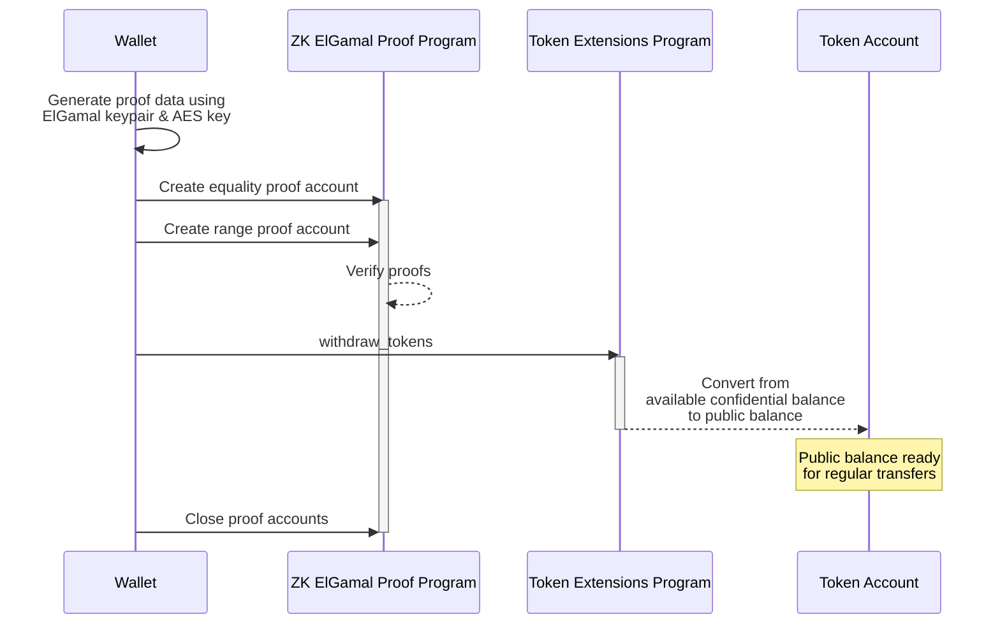

<Callout type="warn">
  The ZK ElGamal Program is temporarily disabled on the mainnet and devnet as it
  undergoes a security audit. This means that confidential transfers extension
  is currently unavailable. While the concepts are still valid, the code
  examples will not run.
</Callout>

## How to withdraw tokens from confidential available balance

To withdraw tokens from confidential available balance to public balance:

1. Create
   [two proofs](https://github.com/solana-program/token-2022/blob/efd0c957fefbd79882d77df5fb2dac88c001249c/confidential-transfer/proof-generation/src/withdraw.rs#L22)
   client side:

   **Equality Proof
   ([CiphertextCommitmentEqualityProofData](https://github.com/anza-xyz/agave/blob/8b33d6d311c95780362a7d235919e7b8d2345939/zk-token-sdk/src/instruction/ciphertext_commitment_equality.rs#L56))**:
   Verifies that the remaining available balance ciphertext after the withdrawal
   matches its corresponding
   [Pedersen commitment](https://en.wikipedia.org/wiki/Commitment_scheme),
   ensuring the account's new available balance is correctly computed as
   `remaining_balance = current_balance - withdraw_amount`.

   **Range Proof
   ([BatchedRangeProofU64Data](https://github.com/anza-xyz/agave/blob/8b33d6d311c95780362a7d235919e7b8d2345939/zk-token-sdk/src/instruction/batched_range_proof/batched_range_proof_u64.rs#L37))**:
   Verifies that the remaining available balance after withdrawal is
   non-negative and within a specified range.

2. For each proof:
   - Invoke the ZK ElGamal proof program to verify the proof data.
   - Store the proof-specific metadata in a proof "context state" account to use
     in other instructions.

3. Invoke the
   [ConfidentialTransferInstruction::Withdraw](https://github.com/solana-program/token-2022/blob/efd0c957fefbd79882d77df5fb2dac88c001249c/program/src/extension/confidential_transfer/processor.rs#L493)
   instruction providing the two proof accounts.

4. Close the proof accounts to recover the SOL used to create them.

The following diagram shows the steps involved in withdrawing tokens from
confidential available balance to public balance:



### Required Instructions

To withdraw tokens from confidential available balance to public balance, you
must:

- Generate an equality proof and range proof client-side
- Invoke the Zk ElGamal proof program to verify the proofs and initialize the
  "context state" accounts
- Invoke the
  [ConfidentialTransferInstruction::Withdraw](https://github.com/solana-program/token-2022/blob/efd0c957fefbd79882d77df5fb2dac88c001249c/program/src/extension/confidential_transfer/processor.rs#L493)
  instruction providing the two proof accounts.
- Close the two proof accounts to recover rent.

The Rust example below generates the proofs with the
`spl-token-confidential-transfer-proof-generation` crate, verifies each into a
context state account through the ZK ElGamal Proof program, references both
accounts in the withdraw instruction, and closes them afterward. The TypeScript
example uses the `getConfidentialWithdrawInstructionPlan` helper from
`@solana-program/token-2022/confidential`, which assembles the same proof
accounts, withdraw, and closes as a multi-transaction instruction plan.

## Example Code

The following example withdraws tokens from the confidential available balance
back to the public balance. The account must already be configured for
confidential transfers and hold an available confidential balance.

Confidential transfers depend on the ZK ElGamal Proof program, which is enabled
on mainnet and devnet. A stock `solana-test-validator` does not enable it, but a
mainnet-forking local validator such as [Surfpool](https://surfpool.run) does.
Run the example against one of those (the code uses devnet) with a funded payer,
and replace the placeholders with your mint and token account.

### Rust

<CodeTabs>

```rust !! title="main.rs"
// !collapse(1:49) collapsed
// Imports: dependencies used by this example.
use anyhow::{Context, Result};
use solana_address::Address;
use solana_client::rpc_client::RpcClient;
use solana_commitment_config::CommitmentConfig;
use solana_instruction::Instruction;
use solana_keypair::Keypair;
use solana_pubkey::Pubkey;
use solana_signer::Signer;
use solana_system_interface::instruction as system_instruction;
use solana_transaction::Transaction;
use solana_zk_elgamal_proof_interface::{
    instruction::{close_context_state, ContextStateInfo, ProofInstruction},
    proof_data::{
        BatchedRangeProofContext, CiphertextCommitmentEqualityProofContext,
        PubkeyValidityProofContext,
    },
    state::ProofContextState,
};
use solana_zk_sdk::{
    encryption::{
        auth_encryption::AeCiphertext,
        derivation::derive_confidential_keys,
        elgamal::ElGamalCiphertext,
    },
    zk_elgamal_proof_program::pubkey_validity::build_pubkey_validity_proof_data,
};
use solana_zk_sdk_pod::encryption::auth_encryption::PodAeCiphertext;
use spl_associated_token_account::{
    get_associated_token_address_with_program_id, instruction::create_associated_token_account,
};
use spl_token_2022::{
    extension::{
        confidential_transfer::{
            instruction::{
                apply_pending_balance, configure_account, deposit,
                initialize_mint as initialize_confidential_transfer_mint, withdraw,
                PubkeyValidityProofData,
            },
            ConfidentialTransferAccount,
        },
        BaseStateWithExtensions, ExtensionType, StateWithExtensions,
    },
    instruction::{initialize_mint as initialize_mint_base, mint_to, reallocate},
    state::{Account as TokenAccount, Mint},
};
use spl_token_confidential_transfer_proof_extraction::instruction::ProofLocation;
use spl_token_confidential_transfer_proof_generation::withdraw::withdraw_proof_data;
use std::mem::size_of;

const ZK_PROOF_PROGRAM_ID: Pubkey =
    solana_pubkey::pubkey!("ZkE1Gama1Proof11111111111111111111111111111");

fn main() -> Result<()> {
    let rpc_client = RpcClient::new_with_commitment(
        String::from("https://api.devnet.solana.com"),
        CommitmentConfig::confirmed(),
    );

    // Owner = fee payer = token account owner. The account must already be
    // configured for confidential transfers with an available confidential
    // balance to withdraw from.
    let owner = load_keypair()?;
    let amount: u64 = 100;
    let decimals: u8 = 2;

    // Setup: create an available confidential balance to withdraw.
    let (mint, token_account) = setup_withdrawable_account(&rpc_client, &owner, amount, decimals)?;

    // Derive the owner's keys and read the current confidential available balance.
    let (elgamal_keypair, aes_key) = derive_confidential_keys(&owner, &token_account.to_bytes())
        .map_err(|e| anyhow::anyhow!("derive confidential keys: {e}"))?;

    let account_data = rpc_client.get_account(&token_account)?;
    let account = StateWithExtensions::<TokenAccount>::unpack(&account_data.data)?;
    let ct_extension = account.get_extension::<ConfidentialTransferAccount>()?;

    // The ElGamal available-balance ciphertext is required to build the proof.
    let available_balance: ElGamalCiphertext = ct_extension
        .available_balance
        .try_into()
        .map_err(|e| anyhow::anyhow!("decode available balance: {e:?}"))?;

    // Read the plaintext balance from the AES-encrypted decryptable balance.
    // ElGamal's decrypt_u32 only recovers values up to 2^32 raw units, so it
    // fails for realistic balances; the AES field has no such limit.
    let decryptable_balance: AeCiphertext = ct_extension
        .decryptable_available_balance
        .try_into()
        .map_err(|e| anyhow::anyhow!("decode decryptable balance: {e:?}"))?;
    let current_available = decryptable_balance
        .decrypt(&aes_key)
        .context("decrypt available balance")?;

    // Generate the equality and range proofs for the withdrawal.
    let proof_data = withdraw_proof_data(&available_balance, current_available, amount, &elgamal_keypair)
        .map_err(|e| anyhow::anyhow!("withdraw_proof_data: {e}"))?;

    let new_available = current_available
        .checked_sub(amount)
        .context("insufficient confidential balance")?;
    let new_decryptable: PodAeCiphertext = aes_key.encrypt(new_available).into();

    // The owner is the context-state authority for both proof accounts.
    let authority: Address = owner.pubkey().to_bytes().into();

    // Equality proof context state account.
    let equality_account = Keypair::new();
    let equality_size = size_of::<ProofContextState<CiphertextCommitmentEqualityProofContext>>();
    let equality_create_ix = system_instruction::create_account(
        &owner.pubkey(),
        &equality_account.pubkey(),
        rpc_client.get_minimum_balance_for_rent_exemption(equality_size)?,
        equality_size as u64,
        &ZK_PROOF_PROGRAM_ID,
    );
    let equality_verify_ix = ProofInstruction::VerifyCiphertextCommitmentEquality
        .encode_verify_proof(
            Some(ContextStateInfo {
                context_state_account: &Address::from(equality_account.pubkey().to_bytes()),
                context_state_authority: &authority,
            }),
            &proof_data.equality_proof_data,
        );
    send_tx(&rpc_client, &[equality_create_ix], &[&owner, &equality_account])?;
    send_tx(&rpc_client, &[equality_verify_ix], &[&owner])?;

    // Range proof context state account.
    let range_account = Keypair::new();
    let range_size = size_of::<ProofContextState<BatchedRangeProofContext>>();
    let range_create_ix = system_instruction::create_account(
        &owner.pubkey(),
        &range_account.pubkey(),
        rpc_client.get_minimum_balance_for_rent_exemption(range_size)?,
        range_size as u64,
        &ZK_PROOF_PROGRAM_ID,
    );
    let range_verify_ix = ProofInstruction::VerifyBatchedRangeProofU64.encode_verify_proof(
        Some(ContextStateInfo {
            context_state_account: &Address::from(range_account.pubkey().to_bytes()),
            context_state_authority: &authority,
        }),
        &proof_data.range_proof_data,
    );
    send_tx(&rpc_client, &[range_create_ix], &[&owner, &range_account])?;
    send_tx(&rpc_client, &[range_verify_ix], &[&owner])?;

    // Withdraw, referencing both pre-verified proof accounts.
    let withdraw_ixs = withdraw(
        &spl_token_2022::id(),
        &token_account,
        &mint,
        amount,
        decimals,
        &new_decryptable,
        &owner.pubkey(),
        &[&owner.pubkey()],
        ProofLocation::ContextStateAccount(&equality_account.pubkey()),
        ProofLocation::ContextStateAccount(&range_account.pubkey()),
    )?;
    let blockhash = rpc_client.get_latest_blockhash()?;
    let transaction =
        Transaction::new_signed_with_payer(&withdraw_ixs, Some(&owner.pubkey()), &[&owner], blockhash);
    let signature = rpc_client.send_and_confirm_transaction(&transaction)?;

    // Close both proof accounts to reclaim their rent.
    for account in [&equality_account, &range_account] {
        let close_ix = close_context_state(
            ContextStateInfo {
                context_state_account: &Address::from(account.pubkey().to_bytes()),
                context_state_authority: &authority,
            },
            &authority,
        );
        send_tx(&rpc_client, &[close_ix], &[&owner])?;
    }

    println!("Withdrew {amount} tokens to the public balance: {signature}");
    Ok(())
}

// !collapse(1:1000) collapsed
// Setup: helper functions to create and apply a balance.
fn send_tx(client: &RpcClient, instructions: &[Instruction], signers: &[&Keypair]) -> Result<()> {
    let blockhash = client.get_latest_blockhash()?;
    let transaction =
        Transaction::new_signed_with_payer(instructions, Some(&signers[0].pubkey()), signers, blockhash);
    client.send_and_confirm_transaction(&transaction)?;
    Ok(())
}

fn setup_withdrawable_account(
    rpc_client: &RpcClient,
    owner: &Keypair,
    amount: u64,
    decimals: u8,
) -> Result<(Pubkey, Pubkey)> {
    let mint = create_confidential_mint(rpc_client, owner, decimals)?;
    let token_account = configure_confidential_token_account(rpc_client, owner, owner, &mint)?;

    let mint_to_ix = mint_to(
        &spl_token_2022::id(),
        &mint,
        &token_account,
        &owner.pubkey(),
        &[&owner.pubkey()],
        amount,
    )?;
    let deposit_ix = deposit(
        &spl_token_2022::id(),
        &token_account,
        &mint,
        amount,
        decimals,
        &owner.pubkey(),
        &[&owner.pubkey()],
    )?;
    send_tx(rpc_client, &[mint_to_ix, deposit_ix], &[owner])?;
    apply_pending_balance_for_account(rpc_client, owner, &token_account)?;

    Ok((mint, token_account))
}

fn create_confidential_mint(rpc_client: &RpcClient, payer: &Keypair, decimals: u8) -> Result<Pubkey> {
    let mint = Keypair::new();
    let space =
        ExtensionType::try_calculate_account_len::<Mint>(&[ExtensionType::ConfidentialTransferMint])?;
    let rent = rpc_client.get_minimum_balance_for_rent_exemption(space)?;

    let create_account_ix = system_instruction::create_account(
        &payer.pubkey(),
        &mint.pubkey(),
        rent,
        space as u64,
        &spl_token_2022::id(),
    );
    let init_confidential_ix = initialize_confidential_transfer_mint(
        &spl_token_2022::id(),
        &mint.pubkey(),
        Some(payer.pubkey()),
        true,
        None,
    )?;
    let init_mint_ix = initialize_mint_base(
        &spl_token_2022::id(),
        &mint.pubkey(),
        &payer.pubkey(),
        None,
        decimals,
    )?;

    send_tx(
        rpc_client,
        &[create_account_ix, init_confidential_ix, init_mint_ix],
        &[payer, &mint],
    )?;
    Ok(mint.pubkey())
}

fn configure_confidential_token_account(
    rpc_client: &RpcClient,
    payer: &Keypair,
    owner: &Keypair,
    mint: &Pubkey,
) -> Result<Pubkey> {
    let token_account = get_associated_token_address_with_program_id(
        &owner.pubkey(),
        mint,
        &spl_token_2022::id(),
    );
    let create_ata_ix = create_associated_token_account(
        &payer.pubkey(),
        &owner.pubkey(),
        mint,
        &spl_token_2022::id(),
    );
    let realloc_ix = reallocate(
        &spl_token_2022::id(),
        &token_account,
        &payer.pubkey(),
        &owner.pubkey(),
        &[&owner.pubkey()],
        &[ExtensionType::ConfidentialTransferAccount],
    )?;

    let (elgamal_keypair, aes_key) = derive_confidential_keys(owner, &token_account.to_bytes())
        .map_err(|e| anyhow::anyhow!("derive confidential keys: {e}"))?;
    let decryptable_balance: PodAeCiphertext = aes_key.encrypt(0).into();

    let proof_data = build_pubkey_validity_proof_data(&elgamal_keypair)
        .map_err(|e| anyhow::anyhow!("generate pubkey validity proof: {e}"))?;
    let proof_account = Keypair::new();
    let context_state_size = size_of::<ProofContextState<PubkeyValidityProofContext>>();
    let create_proof_account_ix = system_instruction::create_account(
        &payer.pubkey(),
        &proof_account.pubkey(),
        rpc_client.get_minimum_balance_for_rent_exemption(context_state_size)?,
        context_state_size as u64,
        &ZK_PROOF_PROGRAM_ID,
    );

    let proof_account_address: Address = proof_account.pubkey().to_bytes().into();
    let owner_address: Address = owner.pubkey().to_bytes().into();
    let verify_proof_ix = ProofInstruction::VerifyPubkeyValidity.encode_verify_proof(
        Some(ContextStateInfo {
            context_state_account: &proof_account_address,
            context_state_authority: &owner_address,
        }),
        &proof_data,
    );
    let proof_location: ProofLocation<PubkeyValidityProofData> =
        ProofLocation::ContextStateAccount(&proof_account.pubkey());
    let configure_account_ixs = configure_account(
        &spl_token_2022::id(),
        &token_account,
        mint,
        &decryptable_balance,
        65_536,
        &owner.pubkey(),
        &[&owner.pubkey()],
        proof_location,
    )?;

    let mut instructions = vec![
        create_ata_ix,
        realloc_ix,
        create_proof_account_ix,
        verify_proof_ix,
    ];
    instructions.extend(configure_account_ixs);

    if payer.pubkey() == owner.pubkey() {
        send_tx(rpc_client, &instructions, &[payer, &proof_account])?;
    } else {
        send_tx(rpc_client, &instructions, &[payer, owner, &proof_account])?;
    }

    Ok(token_account)
}

fn apply_pending_balance_for_account(
    rpc_client: &RpcClient,
    owner: &Keypair,
    token_account: &Pubkey,
) -> Result<()> {
    let (elgamal_keypair, aes_key) = derive_confidential_keys(owner, &token_account.to_bytes())
        .map_err(|e| anyhow::anyhow!("derive confidential keys: {e}"))?;

    let account_data = rpc_client.get_account(token_account)?;
    let account = StateWithExtensions::<TokenAccount>::unpack(&account_data.data)?;
    let ct_extension = account.get_extension::<ConfidentialTransferAccount>()?;
    let pending_lo: ElGamalCiphertext = ct_extension
        .pending_balance_lo
        .try_into()
        .map_err(|e| anyhow::anyhow!("pending_balance_lo: {e:?}"))?;
    let pending_hi: ElGamalCiphertext = ct_extension
        .pending_balance_hi
        .try_into()
        .map_err(|e| anyhow::anyhow!("pending_balance_hi: {e:?}"))?;

    let pending_lo_amount = pending_lo
        .decrypt_u32(elgamal_keypair.secret())
        .context("decrypt pending_balance_lo")? as u64;
    let pending_hi_amount = pending_hi
        .decrypt_u32(elgamal_keypair.secret())
        .context("decrypt pending_balance_hi")? as u64;

    let decryptable_balance: AeCiphertext = ct_extension
        .decryptable_available_balance
        .try_into()
        .map_err(|e| anyhow::anyhow!("decryptable_available_balance: {e:?}"))?;
    let current_available = decryptable_balance
        .decrypt(&aes_key)
        .context("decrypt available balance")?;

    let new_available = current_available + pending_lo_amount + (pending_hi_amount << 16);
    let new_decryptable: PodAeCiphertext = aes_key.encrypt(new_available).into();
    let expected_counter: u64 = ct_extension.pending_balance_credit_counter.into();

    let apply_ix = apply_pending_balance(
        &spl_token_2022::id(),
        token_account,
        expected_counter,
        &new_decryptable,
        &owner.pubkey(),
        &[&owner.pubkey()],
    )?;
    send_tx(rpc_client, &[apply_ix], &[owner])
}

fn load_keypair() -> Result<Keypair> {
    let keypair_path = dirs::home_dir()
        .context("could not find home directory")?
        .join(".config/solana/id.json");
    let bytes: Vec<u8> = serde_json::from_reader(std::fs::File::open(keypair_path)?)?;
    let mut secret = [0u8; 32];
    secret.copy_from_slice(&bytes[0..32]);
    Ok(Keypair::new_from_array(secret))
}
```

```toml !! title="Cargo.toml"
[package]
name = "confidential-transfer"
version = "0.1.0"
edition = "2021"

# spl-token-2022 11 requires solana-system-interface 3.2 (which needs
# solana-instruction >= 3.4). The stable solana-client 4.0.0 caps it lower, so
# pin the 4.0.0-rc.0 line and use the granular solana crates instead of the
# solana-sdk umbrella. This collapses back to solana-sdk once a stable
# solana-client that allows solana-instruction 3.4 ships.
[dependencies]
solana-client = "4.0.0-rc.0"
solana-pubkey = "4.2"
solana-keypair = "3.1"
solana-signer = "3.0"
solana-transaction = "3.1"
solana-instruction = "3.4"
solana-commitment-config = "3.1.1"
solana-system-interface = { version = "3.2.0", features = ["bincode"] }
solana-address = "2.6"
solana-zk-sdk = "7.0.1"
solana-zk-sdk-pod = "0.1.2"
solana-zk-elgamal-proof-interface = "0.1.2"
spl-token-2022 = { version = "11.0.0", features = ["zk-ops"] }
spl-associated-token-account = "8.0.0"
spl-token-confidential-transfer-proof-extraction = "0.6.1"
spl-token-confidential-transfer-proof-generation = "0.6.1"

anyhow = "1.0"
dirs = "6.0.0"
serde_json = "1.0"
```

</CodeTabs>

### Typescript

<CodeTabs>

```ts !! title="index.ts"
// !collapse(1:31) collapsed
// Imports: dependencies used by this example.
import {
  deriveAeKeyForOwnerMint,
  deriveElGamalKeypairForOwnerMint,
  getApplyConfidentialPendingBalanceInstructionFromToken,
  getConfidentialWithdrawInstructionPlan,
  getCreateConfidentialTransferAccountInstructionPlan
} from "@solana-program/token-2022/confidential";
import {
  TOKEN_2022_PROGRAM_ADDRESS,
  fetchToken,
  findAssociatedTokenPda,
  getConfidentialDepositInstruction,
  getCreateMintInstructionPlan,
  getMintToInstruction
} from "@solana-program/token-2022";
import {
  createClient,
  generateKeyPairSigner,
  some,
  summarizeTransactionPlanResult
} from "@solana/kit";
import { solanaRpc } from "@solana/kit-plugin-rpc";
import { signerFromFile } from "@solana/kit-plugin-signer";
import {
  AeKey,
  ElGamalKeypair,
  ElGamalSecretKey
} from "@solana/zk-sdk/bundler";
import { homedir } from "node:os";
import { join } from "node:path";

const client = await createClient()
  .use(signerFromFile(join(homedir(), ".config/solana/id.json")))
  .use(
    solanaRpc({
      rpcUrl: "https://api.devnet.solana.com",
      maxConcurrency: 1
    })
  );

// The Solana CLI default keypair, used as fee payer, mint authority, and
// token account owner.
const owner = client.payer;
const depositAmount = 100n;
const amount = 25n;
const decimals = 2;

// Setup: create a confidential account with an available confidential balance.
const mint = await createConfidentialMint(client, owner, decimals);
const token = await createConfidentialTokenAccount(client, owner, mint);
await mintPublicTokens(client, owner, mint, token, depositAmount);
await depositTokens(client, owner, mint, token, depositAmount, decimals);
await applyPendingBalance(client, owner, mint, token);

// Derive the owner's recoverable ElGamal and AES keys, bound to (owner, mint).
const { elgamalKeypair, aesKey } = await deriveConfidentialKeys(owner, mint);

const tokenAccount = (await fetchToken(client.rpc, token)).data;

// Builds the equality + range proof accounts, the withdraw, and the closes as a
// multi-transaction instruction plan.
const plan = await getConfidentialWithdrawInstructionPlan({
  rpc: client.rpc,
  payer: owner,
  authority: owner,
  token,
  mint,
  tokenAccount,
  amount,
  decimals,
  elgamalKeypair,
  aesKey
});

const result = await client.sendTransactions(plan);
const summary = summarizeTransactionPlanResult(result);
const signature =
  summary.successfulTransactions[summary.successfulTransactions.length - 1]
    .context.signature;
console.log(`Withdrew ${amount} tokens to the public balance: ${signature}`);

// !collapse(1:1000) collapsed
// Setup: helper functions to create and fund the confidential token account.
async function createConfidentialMint(
  kitClient: typeof client,
  payer: typeof owner,
  decimals: number
) {
  const mint = await generateKeyPairSigner();
  const auditor = await deriveElGamalKeypairForOwnerMint({
    signer: payer,
    owner: payer.address,
    mint: mint.address
  });

  const plan = getCreateMintInstructionPlan({
    payer,
    newMint: mint,
    decimals,
    mintAuthority: payer,
    extensions: [
      {
        __kind: "ConfidentialTransferMint",
        authority: some(payer.address),
        autoApproveNewAccounts: true,
        auditorElgamalPubkey: some(auditor.elgamalPubkey)
      }
    ]
  });

  await kitClient.sendTransaction(plan);
  await pauseForPublicRpc();

  return mint.address;
}

async function createConfidentialTokenAccount(
  kitClient: typeof client,
  accountOwner: typeof owner,
  mint: Awaited<ReturnType<typeof createConfidentialMint>>
) {
  const [token] = await findAssociatedTokenPda({
    owner: accountOwner.address,
    tokenProgram: TOKEN_2022_PROGRAM_ADDRESS,
    mint
  });
  const { elgamalKeypair, aesKey } = await deriveConfidentialKeys(
    accountOwner,
    mint
  );

  const plan = await getCreateConfidentialTransferAccountInstructionPlan({
    rpc: kitClient.rpc,
    payer: accountOwner,
    owner: accountOwner,
    mint,
    elgamalKeypair,
    aesKey
  });

  await kitClient.sendTransaction(plan);
  await pauseForPublicRpc();

  return token;
}

async function mintPublicTokens(
  kitClient: typeof client,
  mintAuthority: typeof owner,
  mint: Awaited<ReturnType<typeof createConfidentialMint>>,
  token: Awaited<ReturnType<typeof createConfidentialTokenAccount>>,
  amount: bigint
) {
  await kitClient.sendTransaction([
    getMintToInstruction({
      mint,
      token,
      mintAuthority,
      amount
    })
  ]);
  await pauseForPublicRpc();
}

async function depositTokens(
  kitClient: typeof client,
  authority: typeof owner,
  mint: Awaited<ReturnType<typeof createConfidentialMint>>,
  token: Awaited<ReturnType<typeof createConfidentialTokenAccount>>,
  amount: bigint,
  decimals: number
) {
  await kitClient.sendTransaction([
    getConfidentialDepositInstruction({
      token,
      mint,
      authority,
      amount,
      decimals
    })
  ]);
  await pauseForPublicRpc();
}

async function applyPendingBalance(
  kitClient: typeof client,
  accountOwner: typeof owner,
  mint: Awaited<ReturnType<typeof createConfidentialMint>>,
  token: Awaited<ReturnType<typeof createConfidentialTokenAccount>>
) {
  const { elgamalSecretKey, aesKey } = await deriveConfidentialKeys(
    accountOwner,
    mint
  );
  const tokenAccount = await fetchToken(kitClient.rpc, token);
  await kitClient.sendTransaction([
    getApplyConfidentialPendingBalanceInstructionFromToken({
      token,
      tokenAccount: tokenAccount.data,
      authority: accountOwner,
      elgamalSecretKey,
      aesKey
    })
  ]);
  await pauseForPublicRpc();
}

async function deriveConfidentialKeys(
  accountOwner: typeof owner,
  mint: Awaited<ReturnType<typeof createConfidentialMint>>
) {
  const derivedElGamal = await deriveElGamalKeypairForOwnerMint({
    signer: accountOwner,
    owner: accountOwner.address,
    mint
  });
  const elgamalSecretKey = ElGamalSecretKey.fromBytes(derivedElGamal.secretKey);
  const elgamalKeypair = ElGamalKeypair.fromSecretKey(elgamalSecretKey);
  const aesKey = AeKey.fromBytes(
    await deriveAeKeyForOwnerMint({
      signer: accountOwner,
      owner: accountOwner.address,
      mint
    })
  );

  return { elgamalKeypair, elgamalSecretKey, aesKey };
}

async function pauseForPublicRpc() {
  // Public devnet RPC can rate-limit bursts of setup transactions.
  await new Promise((resolve) => setTimeout(resolve, 2_000));
}
```

```json !! title="package.json"
{
  "name": "confidential-withdraw",
  "version": "0.1.0",
  "type": "module",
  "dependencies": {
    "@solana-program/system": "^0.12.2",
    "@solana-program/token-2022": "^0.12.0",
    "@solana/kit": "^6.10.0",
    "@solana/kit-plugin-rpc": "^0.11.1",
    "@solana/kit-plugin-signer": "^0.10.0",
    "@solana/zk-sdk": "^0.4.2"
  },
  "devDependencies": {
    "@types/node": "^24.10.0",
    "typescript": "^5.8.3"
  }
}
```

</CodeTabs>
