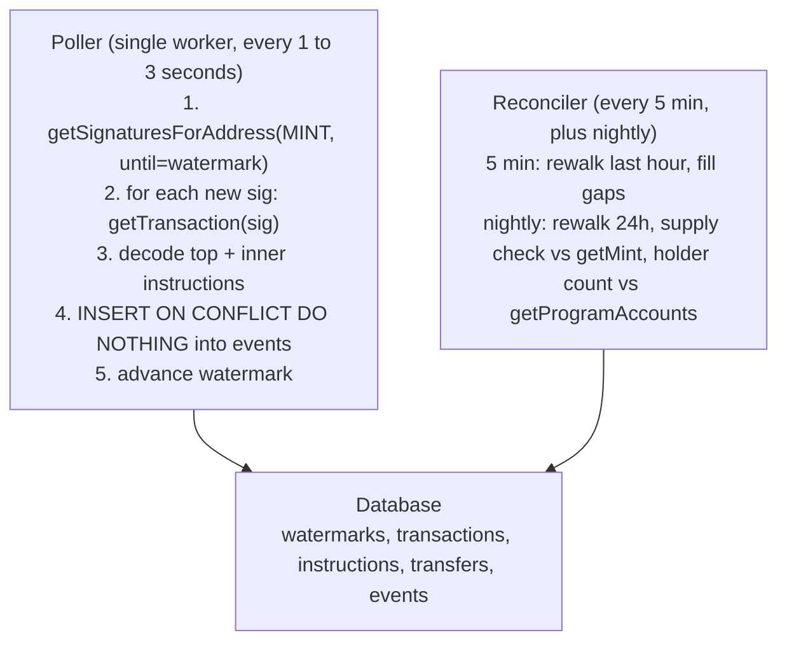

<Callout type="info" title="Summary">
  The mint pubkey is the master cursor. `getSignaturesForAddress(MINT)` returns
  every signature where the mint account appears, which on Token-2022 covers
  every transfer, every administrative instruction, and every transfer hook CPI
  that loaded the mint. Persist a watermark, poll with `until: lastSignature`,
  decode, and reconcile.
</Callout>

This page describes an indexing strategy that uses only standard RPC. For
sub-second latency or network-wide visibility at scale, see
[streaming](/docs/tokens/indexing/streaming) instead.

## Why the mint pubkey is enough

Token-2022 changes the calculus from classic SPL polling. With classic SPL,
plain `Transfer` does not always pass the mint as an account, so
`getSignaturesForAddress(mint)` sometimes misses transfers, and the indexer must
poll every token account.

Token-2022 fixes this for almost every realistic issuer mint:

| If your mint has...                                                                      | Then transfers must...                                       | Mint appears in `accountKeys`? |
| ---------------------------------------------------------------------------------------- | ------------------------------------------------------------ | ------------------------------ |
| `TransferHook`                                                                           | call `TransferChecked` and pass the mint plus hook accounts  | Yes                            |
| [`TransferFee`](/docs/tokens/extensions/transfer-fees)                                   | call `TransferChecked` so the program can compute the fee    | Yes                            |
| [`ConfidentialTransfer`](/docs/tokens/extensions/confidential-transfer)                  | route through extension instructions that reference the mint | Yes                            |
| [`Pausable`](/docs/tokens/extensions/pausable)                                           | check pause state on the mint                                | Yes                            |
| [`InterestBearing`](/docs/tokens/extensions/interest-bearing-tokens) or `ScaledUiAmount` | read the multiplier or rate from the mint                    | Yes                            |
| No extensions at all                                                                     | plain `Transfer` is allowed; mint is optional                | Sometimes only                 |

For a regulated issuer, at least one of `TransferHook`, `TransferFee`,
`Pausable`, `InterestBearing`, or `ScaledUiAmount` is almost always present. A
mint-only cursor catches everything.

If the mint genuinely has zero extensions that pull in the mint account on
transfer, two options:

1. Enable a benign extension. `MetadataPointer` is innocuous and forces a
   `TransferChecked`-style flow for compliant integrators. Not bulletproof —
   plain `Transfer` is still legal.
2. Add a secondary cursor pass over the holder token account set. Snapshot token
   accounts daily via `getProgramAccounts(T22_PROGRAM)` filtered by `memcmp` on
   the mint field; poll signatures for any account whose balance changed since
   the last snapshot.

Most issuers land on option 1 plus a daily token-account reconciliation as
belt-and-suspenders.

## Architecture



Latency floor is roughly one second, set by the polling interval and
`getTransaction` round-trip.

## Polling loop

The core loop, in TypeScript with `@solana/kit`:

```typescript title="Polling loop"
import { createSolanaRpc, address, type Signature } from "@solana/kit";

const rpc = createSolanaRpc(process.env.RPC_URL!);
const MINT = address("YourIssuedT22Mint11111111111111111111111111");
const POLL_INTERVAL_MS = 2_000;

async function pollOnce(): Promise<void> {
  const watermark = await loadWatermark("mint:" + MINT);

  const newSigs: { signature: Signature; slot: bigint }[] = [];
  let before: Signature | undefined;

  for (;;) {
    const page = await rpc
      .getSignaturesForAddress(MINT, {
        limit: 1000,
        before,
        until: watermark.lastSignature, // stops walk at last seen
        commitment: "confirmed"
      })
      .send();

    if (page.length === 0) break;
    for (const s of page) {
      if (s.err) continue; // skip failed txs
      newSigs.push({ signature: s.signature, slot: BigInt(s.slot) });
    }
    if (page.length < 1000) break;
    before = page[page.length - 1].signature;
  }

  // newSigs is newest-first; reverse so we ingest oldest-first.
  newSigs.reverse();

  for (const { signature } of newSigs) {
    await ingestSignature(signature);
  }

  if (newSigs.length > 0) {
    const last = newSigs[newSigs.length - 1];
    await saveWatermark("mint:" + MINT, last.signature, last.slot);
  }
}

setInterval(() => pollOnce().catch(console.error), POLL_INTERVAL_MS);
```

Three details that matter:

- `until: lastSignature` is the cursor. The RPC stops walking back when it hits
  that signature, so you only get the new ones. Without `until`, you would
  re-fetch the entire history every poll.
- Reverse before ingesting. `getSignaturesForAddress` returns newest-first;
  downstream consumers expect oldest-first.
- `commitment: "confirmed"` gets you the lowest latency. Use
  `commitment: "finalized"` (~13 seconds slower) for any path that affects
  ledgers, accounting, or customer-facing balance UI. Reconciliation should use
  `finalized`.

## Decoding a transaction

Pull each new signature with `getTransaction`, walk top-level and inner
instructions, and persist decoded events.

```typescript title="Ingest one signature"
async function ingestSignature(sig: Signature): Promise<void> {
  const tx = await rpc
    .getTransaction(sig, {
      encoding: "jsonParsed",
      maxSupportedTransactionVersion: 0,
      commitment: "confirmed"
    })
    .send();

  if (!tx || tx.meta?.err) return;

  await db.transaction(async (t) => {
    await upsertTransaction(t, sig, tx);
    for (const ix of walkInstructions(tx)) {
      const decoded = decodeInstruction(ix);
      if (!decoded) continue;
      await insertInstruction(t, sig, ix, decoded);
      const event = toDomainEvent(sig, tx, ix, decoded);
      if (event) await insertEvent(t, event);
    }
  });
}

function* walkInstructions(tx: any) {
  const top = tx.transaction.message.instructions;
  const inner = tx.meta?.innerInstructions ?? [];
  for (let i = 0; i < top.length; i++) {
    yield { ixIndex: i, innerIndex: null, ix: top[i] };
    const innerForI = inner.find((g: any) => g.index === i)?.instructions ?? [];
    for (let j = 0; j < innerForI.length; j++) {
      yield { ixIndex: i, innerIndex: j, ix: innerForI[j] };
    }
  }
}
```

When the mint has a `TransferHook` extension, the inner instruction list is
where the hook program's CPIs (state updates, allowlist checks, fee splits)
appear. Decoding only the top-level instructions misses them. The parent
`TransferChecked` is fairly basic; the interesting effects are inner.

## What to decode

For a single-mint issuer, dispatch on `(programId, discriminator)`:

| Program ID                 | Discriminator                                                     | Event type                              |
| -------------------------- | ----------------------------------------------------------------- | --------------------------------------- |
| Token-2022 (`TokenzQd...`) | `Transfer`, `TransferChecked`, `TransferCheckedWithFee`           | `transfer`                              |
| Token-2022                 | `MintTo`, `MintToChecked`                                         | `mint`                                  |
| Token-2022                 | `Burn`, `BurnChecked`                                             | `burn`                                  |
| Token-2022                 | `SetAuthority`                                                    | `authority_change`                      |
| Token-2022                 | `FreezeAccount`, `ThawAccount`                                    | `freeze` / `thaw`                       |
| Token-2022                 | `Pause`, `Resume` (Pausable)                                      | `pause` / `resume`                      |
| Token-2022                 | `WithdrawWithheldTokensFromMint`, `...FromAccounts` (TransferFee) | `fee_sweep`                             |
| Token-2022                 | `UpdateRateInterestBearingMint`                                   | `rate_update`                           |
| Token-2022                 | `UpdateMetadata`, `UpdateField` (Metadata)                        | `metadata_update`                       |
| Token-2022                 | `UpdateDefaultAccountState`                                       | `default_state_change`                  |
| Token-2022                 | `Initialize*Config` (any extension config init)                   | `extension_init`                        |
| Hook program               | any                                                               | `hook_call` (preserve raw payload)      |
| Memo (`MemoSq4g...`)       | memo                                                              | `memo` (attach to neighboring transfer) |

You will not have a typed decoder for someone else's hook program. Persist the
hook program ID, its accounts, and the raw data bytes; tag the event as
`hook_call` and link it to its parent `transfer` via `(signature, ix_index)`.
Operationally that is enough — you can see "transfer X triggered hook call to
program Y with N accounts" without understanding the hook's internals.

## Storage schema

Use the same schema as the
[streaming indexer](/docs/tokens/indexing/streaming#storage-schema). The
single-source polling worker writes the same
`(signature, ix_index, inner_index)`-keyed events table; you can graduate from
polling to streaming later by adding an ingestion source, not by reshaping the
data.

## Reconciliation

The polling loop occasionally drops signatures: RPC errors, restarts, deploys.
Two reconciliation jobs cover this.

### Every five minutes: gap fill

```typescript title="Recent gap fill"
async function reconcileRecent() {
  const sinceSlot = (await currentSlot()) - 7200n; // ~last hour at 2 slots/sec
  let before: Signature | undefined;
  for (;;) {
    const page = await rpc
      .getSignaturesForAddress(MINT, {
        limit: 1000,
        before,
        commitment: "finalized"
      })
      .send();
    if (page.length === 0) break;
    for (const s of page) {
      if (BigInt(s.slot) < sinceSlot) return;
      const seen = await db.query(
        "SELECT 1 FROM transactions WHERE signature = $1",
        [s.signature]
      );
      if (seen.rowCount === 0) await ingestSignature(s.signature);
    }
    before = page[page.length - 1].signature;
  }
}
```

### Nightly: supply attestation

```typescript title="Daily supply check"
async function nightlyAttestation() {
  const mint = await rpc
    .getAccountInfo(MINT, { encoding: "jsonParsed" })
    .send();
  const onchainSupply = BigInt(mint.value.data.parsed.info.supply);

  const { rows } = await db.query(
    `
    SELECT
      COALESCE(SUM(CASE WHEN event_type = 'mint' THEN amount_raw ELSE 0 END), 0)
      - COALESCE(SUM(CASE WHEN event_type = 'burn' THEN amount_raw ELSE 0 END), 0) AS net_supply
    FROM events WHERE mint = $1
  `,
    [MINT.toString()]
  );

  const indexedSupply = BigInt(rows[0].net_supply);
  if (onchainSupply !== indexedSupply) {
    pageOncall(`Supply drift: chain=${onchainSupply} indexed=${indexedSupply}`);
  }
  await persistAttestation(onchainSupply, indexedSupply);
}
```

Drift is the single highest-value alert in this whole system. If
`Σ mint events − Σ burn events` matches `getMint.supply` every day for a month,
you have very high confidence the indexer is whole.

## RPC redundancy

A single RPC endpoint is reasonable for most use cases. To reduce the impact of
a single-provider outage or to add a verification path, run a secondary
provider:

- For high-stakes balance changes (especially for owned addresses), compare
  transaction details against a second provider before recording the event as
  final.
- Implement automatic failover so the polling loop continues during the
  primary's outage.
- See [solana.com/rpc](https://solana.com/rpc) for available providers.

## Pitfalls

- Polling without `until: lastSignature` re-fetches the entire history every
  cycle.
- Decoding only top-level instructions misses transfer hook CPIs in inner
  instructions.
- Storing amounts as JavaScript `number` loses precision past 2⁵³.
- Hardcoding decimals — read from `getMint` once at bootstrap and on extension
  change.
- No supply-drift attestation — it is the canary that catches every other bug.
- Treating raw amounts and decimal-adjusted amounts as interchangeable. Use raw
  values everywhere except at the display edge.
- A single RPC provider with no fallback halts ingestion during an outage.
- Mismatched polling interval. Lower intervals improve UX but increase RPC
  spend; tune to your latency requirements.
- Mistaking missing signatures for absence of activity. Always reconcile before
  alerting on quiet periods.

## Key program IDs

| Program                  | Address                                        |
| ------------------------ | ---------------------------------------------- |
| Token-2022               | `TokenzQdBNbLqP5VEhdkAS6EPFLC1PHnBqCXEpPxuEb`  |
| SPL Token                | `TokenkegQfeZyiNwAJbNbGKPFXCWuBvf9Ss623VQ5DA`  |
| Associated Token Account | `ATokenGPvbdGVxr1b2hvZbsiqW5xWH25efTNsLJA8knL` |
| Memo (v2)                | `MemoSq4gqABAXKb96qnH8TysNcWxMyWCqXgDLGmfcHr`  |
