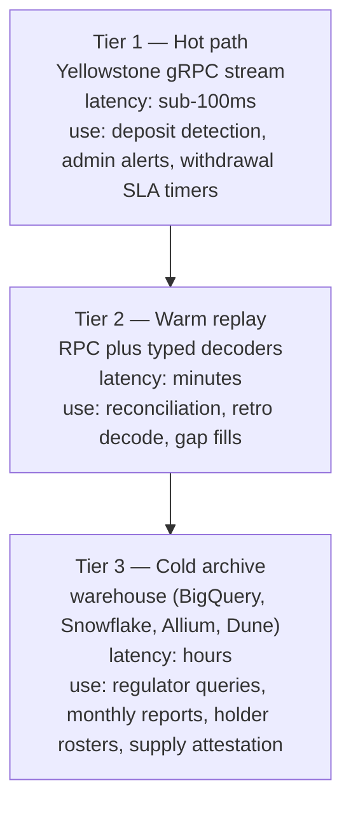

<Callout type="info" title="Summary">
  Stream with Yellowstone gRPC, reconcile with `getSignaturesForAddress` every
  few minutes, archive in a warehouse for long-window queries. Key the event
  store on `(signature, ix_index, inner_index)`. Use `confirmed` for ingestion
  and promote to `finalized` before any ledger action.
</Callout>

## Architecture

The shape that holds up under regulator scrutiny has three tiers, each acting as
a check on the others.



A single source is brittle. Streams drop on validator restarts. Warm RPC
indexers occasionally lag. Archives have batch latency. Daily reconciliation
across the tiers is what an auditor expects to see.

## Filter cascade

The largest performance win in an issuer indexer is discarding irrelevant
transactions before decoding them. Decoding a Token-2022 instruction with typed
codecs is cheap per call but expensive in aggregate at mainnet throughput. Run
cheap checks first, expensive checks last.

```
incoming transaction
        │
        ▼
┌─────────────────────────────────────────────┐
│ 1. Does the tx touch the issued mint?       │   accountKeys ∩ {mint} ≠ ∅
│    NO  → discard immediately                │
└──────────────────┬──────────────────────────┘
                   │ YES
                   ▼
┌─────────────────────────────────────────────┐
│ 2. Does the tx touch any address you own?   │   accountKeys ∩ ownedSet ≠ ∅
│    (only if you ONLY care about own flow)   │
│    NO  → discard                            │
└──────────────────┬──────────────────────────┘
                   │ YES
                   ▼
┌─────────────────────────────────────────────┐
│ 3. Does the tx touch the T22 program?       │
│    NO  → still index admin events on the    │
│           mint account; otherwise discard   │
└──────────────────┬──────────────────────────┘
                   │ YES
                   ▼
┌─────────────────────────────────────────────┐
│ 4. Decode and dispatch (the expensive part) │
└─────────────────────────────────────────────┘
```

### Issuer-wide vs own-flow

Decide upfront which mode you are in. The wrong filter shape will either miss
events or burn compute on irrelevant transactions.

| Mode        | Filters                                                     | Use when                                                                         |
| ----------- | ----------------------------------------------------------- | -------------------------------------------------------------------------------- |
| Issuer-wide | mint ∈ accountKeys                                          | regulated stablecoin, network-wide attestation, sanctions screening on all flows |
| Own-flow    | mint ∈ accountKeys AND ownedSet ∩ accountKeys ≠ ∅           | custodian, exchange, treasury, customer-deposit indexing only                    |
| Hybrid      | issuer-wide for the mint plus own-flow for unrelated assets | issuer that also custodies — most large institutions                             |

In the hybrid case run two parallel pipelines with different filters into the
same event store. Merging the filters into one stream costs you the
cheap-discard property.

### Push the filter to the source

Anything you can express as a Yellowstone filter, do not express as decoder
logic. Validator-side filtering is roughly 100x cheaper than client-side
filtering for the same outcome:

- `accountRequired: [mint]` discards at the validator's Geyser plugin before
  bytes leave the node.
- `accountInclude: [...ownedAddresses]` does the same for address membership in
  own-flow mode.
- Combine both for hybrid mode by running two subscriptions on the same gRPC
  connection.

### Bloom filter for very large address sets

Above roughly 50,000 watched addresses, `accountInclude` arrays get unwieldy and
stream filters slow down. A common pattern:

1. Compute a Bloom filter over the address set; push it to the indexer process.
2. Subscribe with the broader `accountRequired: [mint]` filter only.
3. In the decoder, do a Bloom-membership check on every account key before any
   decode work. Negative match means discard. Positive match means confirm
   against the authoritative set, then decode.

The Bloom check runs in tens of nanoseconds per key and removes 99% or more of
irrelevant transactions before any allocation happens.

## Mapping requirements to filters

A typical issuer indexer covers four requirements: transfers of the issued
token, administrative actions on the mint, deposits to institution-owned
addresses, and withdrawal completions with finality tracking.

### 1. Issued token transfers

Subscribe with the mint as a required account.

```typescript title="Yellowstone subscription (issuer-wide transfers)"
const sub = {
  accounts: {},
  transactions: {
    issued_t22_transfers: {
      vote: false,
      failed: false,
      accountInclude: [],
      accountRequired: [ISSUED_MINT],
      accountExclude: []
    }
  },
  commitment: "confirmed"
};
```

`accountRequired: [mint]` forces the mint account to appear in the transaction.
This is the cheapest issuer-wide filter — every `Transfer`, `TransferChecked`,
`MintTo`, `Burn`, `SetAuthority`, and extension instruction on the mint or any
of its associated token accounts will hit it.

For ATAs only (excluding admin), add a transaction-level decode step that
filters on instruction discriminator.

When the mint enables [`TransferFee`](/docs/tokens/extensions/transfer-fees),
every transfer also withholds fees into the recipient account. The "amount sent"
and "amount received" diverge — store both.

When the mint enables
[`ConfidentialTransfer`](/docs/tokens/extensions/confidential-transfer), the
`Transfer` instruction encodes amount as ciphertext. The indexer cannot recover
plaintext without the auditor's ElGamal key. Decide upfront whether the issuer
holds an auditor key (recommended for a regulated stablecoin) or accepts opaque
volumes. If the issuer holds the auditor key, route confidential transfers
through a separate decoder service that handles key material.

### 2. Administrative actions on the mint

Filter on `accountRequired: [ISSUED_MINT]` AND `programId` equals the Token-2022
program. Then dispatch by instruction discriminator.

| Discriminator                                                            | Instruction                                                                           | Event class            |
| ------------------------------------------------------------------------ | ------------------------------------------------------------------------------------- | ---------------------- |
| `MintTo` / `MintToChecked`                                               | mint new supply                                                                       | `mint`                 |
| `Burn` / `BurnChecked`                                                   | burn supply                                                                           | `burn`                 |
| `SetAuthority`                                                           | rotate mint, freeze, close, withheld-withdraw, interest, pause, or metadata authority | `authority_change`     |
| `InitializeMint2`                                                        | mint creation (genesis indexing)                                                      | `mint_create`          |
| `FreezeAccount` / `ThawAccount`                                          | per-account lock                                                                      | `freeze` / `thaw`      |
| `Pause` / `Resume` (Pausable)                                            | global pause                                                                          | `pause` / `resume`     |
| `WithdrawWithheldTokensFromMint` / `...FromAccounts` (TransferFee)       | issuer fee sweep                                                                      | `fee_sweep`            |
| `UpdateRateInterestBearingMint` (InterestBearing)                        | rate change                                                                           | `rate_update`          |
| `UpdateMetadata` / `UpdateField` (Metadata)                              | metadata rotation                                                                     | `metadata_update`      |
| `UpdateDefaultAccountState`                                              | default-frozen toggle                                                                 | `default_state_change` |
| `EnableConfidentialCredits` / `DisableConfidentialCredits` (per account) | privacy toggle                                                                        | `confidential_toggle`  |

Persist these into an `admin_events` table with a strong audit trail: signer
set, slot, finality, and a post-image of the mint config (pull `getMint` after
`finalized`).

### 3. Deposits to institution-owned addresses

A deposit indexer is an address-list indexer. The watched set:

- Custody wallets, cold and warm, multisig and single-sig
- Per-customer deposit addresses if the institution issues them
- Operational hot wallets — treasury, fee collectors

Use `accountInclude` with the wallet owner addresses. Decode the resulting
transaction:

- For SOL deposits: walk `meta.preBalances` and `meta.postBalances` keyed by
  account index, diff against the wallet pubkey.
- For SPL or T22 deposits: walk `meta.preTokenBalances` and
  `meta.postTokenBalances`, match `owner` to the wallet, compute `uiTokenAmount`
  delta.
- For multi-instruction transactions (DEX swaps, batched transfers), report each
  leg separately.

Filter on owners, not associated token accounts. ATAs change when a new mint is
involved; wallet owners do not. Resolve the ATA at decode time.

For high-cardinality address sets (10,000 or more customer deposit addresses),
Yellowstone has filter-size limits — shard the stream across N subscribers by
`hash(address) % N`. New deposit addresses must propagate to the streaming
filter within seconds of issuance, or you will miss the first deposit. Use a
config service or push-reload pattern; do not require a stream restart.

### 4. Withdrawal completions

A withdrawal indexer is a signature-list indexer plus finality tracking.

1. The treasury system signs and submits a withdrawal transaction; persists
   `(signature, expected_slot, retries)` in an outbox.
2. The indexer either subscribes to `signatureSubscribe` for each open
   signature, or ingests its own gRPC stream filtered to treasury wallets and
   matches signatures against the outbox.
3. On `confirmed`, mark `pending_finality`. On `finalized` (~13 seconds later),
   mark `complete`. On blockhash expiry without confirmation, mark `dropped` and
   requeue.
4. Reconciliation reads `getSignaturesForAddress(treasury_wallet)` every five
   minutes and closes any signature that the stream missed.

A withdrawal completes only when:

- Status equals `finalized`
- All inner instructions succeeded
- Recipient token account post-balance matches `pre + amount` (or
  `pre + amount − fee` if `TransferFee` is on)

Anything short of all three is not a completion. The most common bug in
withdrawal pipelines: "we saw the signature land" is not the same as "the
recipient was credited."

## Storage schema

A schema that has held up across several issuer deployments:

```sql title="events.sql"
-- Raw transaction envelope. One row per signature seen.
CREATE TABLE transactions (
  signature      TEXT PRIMARY KEY,
  slot           BIGINT NOT NULL,
  block_time     TIMESTAMPTZ,
  finality       TEXT NOT NULL CHECK (finality IN ('confirmed', 'finalized')),
  fee_lamports   BIGINT NOT NULL,
  err            JSONB,
  raw            JSONB NOT NULL,           -- the full RPC tx payload
  ingested_at    TIMESTAMPTZ DEFAULT now()
);
CREATE INDEX ON transactions (slot);
CREATE INDEX ON transactions (block_time);

-- One row per decoded instruction (incl. inner). Composite PK.
CREATE TABLE instructions (
  signature        TEXT NOT NULL REFERENCES transactions(signature),
  ix_index         INT  NOT NULL,
  inner_index      INT,
  program_id       TEXT NOT NULL,
  discriminator    TEXT NOT NULL,
  decoded          JSONB NOT NULL,
  PRIMARY KEY (signature, ix_index, inner_index)
);
CREATE INDEX ON instructions (program_id, discriminator);

-- Domain events. The thing you read for ledgers and reports.
CREATE TABLE events (
  event_id      UUID PRIMARY KEY,
  event_type    TEXT NOT NULL,
  signature     TEXT NOT NULL,
  ix_index      INT NOT NULL,
  inner_index   INT,
  slot          BIGINT NOT NULL,
  finality      TEXT NOT NULL,
  mint          TEXT,
  source_owner  TEXT,
  dest_owner    TEXT,
  amount_raw    NUMERIC(40, 0),     -- in base units, decimals NOT applied
  decimals      SMALLINT,
  payload       JSONB,
  UNIQUE (signature, ix_index, inner_index, event_type)
);
CREATE INDEX ON events (mint, slot);
CREATE INDEX ON events (dest_owner, slot);
CREATE INDEX ON events (source_owner, slot);
CREATE INDEX ON events (event_type, slot);
```

Three notes on this schema:

- The uniqueness constraint on `events` gives you idempotent re-ingestion.
  Replays are routine; double-counting is not.
- Store `amount_raw` as base units in `NUMERIC(40, 0)`, not floats. Convert to
  UI units at presentation time only.
- Slot, not `block_time`, is canonical ordering. `block_time` is
  validator-reported and can move backwards across forks at `confirmed`.

## TypeScript patterns

Use [`@solana/kit`](https://github.com/solana-foundation/framework-kit) for the
client and `@solana-program/token-2022` for typed encoders and decoders,
including extension instructions. For high-throughput indexer pipelines that
decode on a gRPC stream, Rust pipelines such as Carbon or Vixen are common
alternatives; either choice can target the same event store.

Avoid legacy `@solana/web3.js` v1 for new indexers. If a dependency forces it,
isolate the legacy code behind `@solana/web3-compat` and convert at the
boundary.

### Subscribing to a mint

```typescript title="Yellowstone subscription"
import { createSolanaClient } from "@solana/kit";
import Client, {
  CommitmentLevel,
  SubscribeRequestFilterTransactions
} from "@triton-one/yellowstone-grpc";
import { address } from "@solana/addresses";

const ISSUED_MINT = address("YourIssuedT22MintHere11111111111111111111");
const T22_PROGRAM = "TokenzQdBNbLqP5VEhdkAS6EPFLC1PHnBqCXEpPxuEb";

const grpc = new Client(
  process.env.YELLOWSTONE_URL!,
  process.env.YELLOWSTONE_TOKEN,
  {
    "grpc.max_receive_message_length": 64 * 1024 * 1024
  }
);

const stream = await grpc.subscribe();
stream.write({
  accounts: {},
  slots: {},
  transactions: {
    issuedT22: {
      vote: false,
      failed: false,
      accountRequired: [ISSUED_MINT, T22_PROGRAM],
      accountInclude: [],
      accountExclude: []
    } satisfies SubscribeRequestFilterTransactions
  },
  blocks: {},
  blocksMeta: {},
  entry: {},
  accountsDataSlice: [],
  commitment: CommitmentLevel.CONFIRMED
});
```

### Detecting mint extensions on bootstrap

```typescript title="Bootstrap snapshot"
import {
  fetchMint,
  getExtensionTypes,
  ExtensionType
} from "@solana-program/token-2022";

const mint = await fetchMint(rpc, ISSUED_MINT);
const extensions = getExtensionTypes(mint.data);

const hasPause = extensions.includes(ExtensionType.PausableConfig);
const hasFee = extensions.includes(ExtensionType.TransferFeeConfig);
const hasHook = extensions.includes(ExtensionType.TransferHook);
const hasConfidential = extensions.includes(
  ExtensionType.ConfidentialTransferMint
);
const hasInterest = extensions.includes(ExtensionType.InterestBearingConfig);

// Branch decoders accordingly. Persist a snapshot of `extensions` so a future
// admin event (e.g. enabling Pausable later) shows up as a config diff.
```

### Idempotent ingestion

```typescript title="Persist with ON CONFLICT"
async function persistEvent(ev: DomainEvent, db: Pool): Promise<void> {
  await db.query(
    `INSERT INTO events
       (event_id, event_type, signature, ix_index, inner_index, slot, finality,
        mint, source_owner, dest_owner, amount_raw, decimals, payload)
     VALUES ($1,$2,$3,$4,$5,$6,$7,$8,$9,$10,$11,$12,$13)
     ON CONFLICT (signature, ix_index, inner_index, event_type) DO NOTHING`,
    [
      ev.id,
      ev.type,
      ev.signature,
      ev.ixIndex,
      ev.innerIndex,
      ev.slot,
      ev.finality,
      ev.mint,
      ev.sourceOwner,
      ev.destOwner,
      ev.amountRaw,
      ev.decimals,
      ev.payload
    ]
  );
}
```

`ON CONFLICT DO NOTHING` is the correct default. Stream replays are routine; the
database, not the application, enforces idempotency.

### Walking inner instructions

Token-2022 transfers with hooks fan out into CPIs. To capture the hook's effect,
walk both top-level and inner instructions.

```typescript title="Instruction walker"
function* walkInstructions(tx: ConfirmedTransactionMeta) {
  const { instructions, innerInstructions = [] } = tx.transaction.message;
  for (let i = 0; i < instructions.length; i++) {
    yield { ixIndex: i, innerIndex: null, ix: instructions[i] };
    const inner =
      innerInstructions.find((g) => g.index === i)?.instructions ?? [];
    for (let j = 0; j < inner.length; j++) {
      yield { ixIndex: i, innerIndex: j, ix: inner[j] };
    }
  }
}
```

A `TransferHook` invocation routinely emits 3 to 10 inner instructions. Decode
each one.

### Reconciliation loop

```typescript title="Reconcile per address"
async function reconcile(wallet: Address, sinceSlot: bigint) {
  let before: string | undefined;
  for (;;) {
    const sigs = await rpc
      .getSignaturesForAddress(wallet, {
        limit: 1000,
        before,
        commitment: "finalized"
      })
      .send();
    if (sigs.length === 0) break;
    for (const s of sigs) {
      if (BigInt(s.slot) < sinceSlot) return;
      const known = await db.query(
        "SELECT 1 FROM transactions WHERE signature = $1",
        [s.signature]
      );
      if (known.rowCount === 0) await ingestSignature(s.signature);
    }
    before = sigs[sigs.length - 1].signature;
  }
}
```

Run every five minutes per watched address. Cheap insurance against stream gaps.

## Operational workflow

### Bootstrapping a new issuer indexer

1. Pin SDK versions. Token-2022 extensions evolve; lock
   `@solana-program/token-2022` to a specific minor and bump deliberately.
2. Snapshot the mint config. Read `getMint`, capture extensions, store as the v0
   config row in a `mint_config_history` table.
3. Snapshot all current token accounts. `getProgramAccounts(T22_PROGRAM)`
   filtered with a `memcmp` at byte 0 for the mint pubkey. This is the initial
   holder roster. Cache it; do not query in a hot path.
4. Backfill admin history. `getSignaturesForAddress` for the mint pubkey, every
   authority pubkey (current and historical via past `SetAuthority` decoded),
   the freeze authority, and the metadata authority. Decode and load into
   `admin_events`.
5. Backfill institution wallets. Same routine for every owned wallet.
6. Start streaming from `currentSlot`. Mark the bootstrap watermark; below it
   trust the backfill, above it trust the stream plus reconciler.

### Daily operations

- Reconcile every five minutes by replaying `getSignaturesForAddress` per
  watched address and filling any gaps.
- Once per day, fetch `getMint` and compare `supply` against
  `Σ(mint events) − Σ(burn events)` from the event store. Any drift is a bug or
  a missed event — page on it.
- Once per day, run `getProgramAccounts` and compare the count to the count of
  distinct `dest_owner` values with non-zero balance in the event store.
- Once per day, snapshot `getMint` extensions and compare against the previous
  day. Any change without a corresponding `authority_change` or `*_update` event
  is an indexer miss.

### Incident response

- Stream gap detected: rewind from the last reconciled slot, replay through the
  warm tier, confirm event counts match, resume.
- Fork rollback at `confirmed`: events written at `confirmed` may need to be
  marked `superseded`. Keep a `finality_history` JSONB column or a separate
  `event_versions` table. Do not hard-delete.
- New extension goes live on the mint: a `SetAuthority` or `Initialize*Config`
  for an extension the decoder does not recognize must trigger an
  `unknown_admin_event` row and a page. Do not silently drop unknown
  discriminators.

## Compliance hooks

Issuer indexers are the system of record for several regulator-facing artifacts.

- **Travel Rule.** Every transfer event should carry sender owner, recipient
  owner, and any memo (Memo program instruction in the same transaction). Push
  to your VASP messaging layer at confirmation; retract on rollback.
- **Sanctions screening.** On every newly-seen counterparty owner, screen
  against your provider and tag the event. Block-list hits should freeze the
  recipient token account via the freeze authority — your indexer is the trigger
  source.
- **Supply attestation.** The daily `getMint.supply` vs `Σ events`
  reconciliation is the primary attestation input. Persist the daily snapshot,
  signed, into immutable storage.
- **Pause and authority audit log.** Every `pause`, `resume`,
  `authority_change`, and `metadata_update` row must record the signer set, the
  human operator (via your treasury orchestration system mapping), and a reason
  code.
- **Confidential transfers and the auditor key.** If the mint enables
  [`ConfidentialTransfer`](/docs/tokens/extensions/confidential-transfer), the
  issuer should hold the auditor ElGamal key so plaintext volumes remain visible
  internally. Treat this key like the freeze key: HSM-backed, multisig-rotated,
  and never on a streaming worker.

## Pitfalls

- Filtering on associated token accounts instead of wallet owners breaks on new
  mints.
- Using `block_time` as a sort key is not safe — it is not monotonic across
  forks at `confirmed`.
- Storing amounts as JavaScript `number` loses precision past 2⁵³.
- Acting on `processed` confirmation can produce events that are later dropped.
- Treating `confirmed` as final for accounting can produce events that are later
  forked.
- Hardcoding decimals — read them from `getMint` once at bootstrap.
- Ignoring inner instructions — `TransferHook` fan-out is invisible at
  top-level.
- Not decoding `SetAuthority` for non-mint authority types — freeze,
  withheld-withdraw, and pause are separate.
- Going silent on unknown discriminators — new extensions ship every few months.
- No reconciliation loop. Treating the stream as reliable is the most expensive
  shortcut.
- Restarting the stream to add a deposit address drops in-flight messages.
- Storing the auditor key on the indexer host.
- Counting `confirmed`-status withdrawals as complete in the customer-facing UI.
- Not handling `TransferFee` withholding when reporting amount-received.
- Dropping `Burn` events because the source token account is post-burn empty —
  the event is in instructions, not balance diff.

## Who runs this in practice

- Regulated stablecoin issuers run multi-tier stacks like the one above. Each
  tier reduces a specific class of risk; the redundancy is what supports the
  daily attestation reports their oversight expects.
- Custodians and exchanges treat each Token-2022 extension as a separate
  compatibility item, so [`Pausable`](/docs/tokens/extensions/pausable) and
  [`ConfidentialTransfer`](/docs/tokens/extensions/confidential-transfer)
  support are typically gated behind issuer-by-issuer approval workflows.
- Tokenized real-world asset issuers and on-chain credit funds use the same
  shape but skew workload toward the warehouse tier, because cap-table-style
  queries dominate over real-time deposit detection.

## Alternatives

| Approach                                      | When it makes sense                                                                        |
| --------------------------------------------- | ------------------------------------------------------------------------------------------ |
| Pre-parsed transaction APIs                   | MVP, single mint, low ops budget. Skip Tier 1, run only Tiers 2 and 3.                     |
| [Polling-only](/docs/tokens/indexing/polling) | No streaming infrastructure, latency tolerance of a few seconds, single-worker simplicity. |
| Self-hosted Geyser plugin                     | You already run a validator and want zero vendor dependency. Operationally heavier.        |
| Carbon (Rust) pipeline                        | High throughput, multiple mints, decoders that compile-time typecheck. Steeper team ramp.  |
| Vixen (Rust)                                  | Lightweight typed parsing on a gRPC stream without the full Carbon pipeline.               |

## Key program IDs

| Program                  | Address                                        |
| ------------------------ | ---------------------------------------------- |
| Token-2022               | `TokenzQdBNbLqP5VEhdkAS6EPFLC1PHnBqCXEpPxuEb`  |
| SPL Token                | `TokenkegQfeZyiNwAJbNbGKPFXCWuBvf9Ss623VQ5DA`  |
| Associated Token Account | `ATokenGPvbdGVxr1b2hvZbsiqW5xWH25efTNsLJA8knL` |
| Memo (v2)                | `MemoSq4gqABAXKb96qnH8TysNcWxMyWCqXgDLGmfcHr`  |
