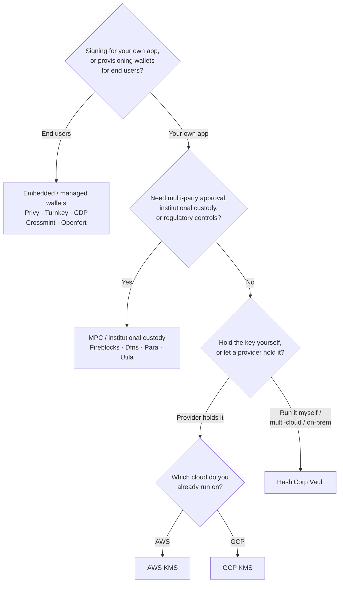

Keychain exposes one `SolanaSigner` interface across every backend, so the
choice is operational, not architectural — you can change it later through
configuration. Because of that, **start from your requirements, not from a
product.** Two questions decide most of it: _where does the private key live,
and who is allowed to authorize a signature with it?_

There is no single best backend. Each one is a better fit for a particular set
of constraints — the cloud you already run on, whether you want to operate key
infrastructure, and what custody and approval controls you're required to have.
The flow below maps those constraints to a backend.

<Callout type="info">
  This guide covers backend (server-side) signing. When your end users sign
  their own transactions in a browser, use a wallet through the Wallet Standard
  instead — see [Signing in
  Production](/docs/core/transactions/signing-in-production).
</Callout>

## Decision flow

<Callout type="info">
  Local development and tests don't need any of this — use the **Memory**
  backend for prototyping, then switch to one of the production backends above
  through configuration.
</Callout>

## Walk the questions

<Steps>

<Step>

### Are you signing for your own application, or for your end users?

If you provision wallets that **end users** own and operate (consumer apps,
onboarding flows), use an **embedded / managed wallet** backend — Privy,
Turnkey, CDP, Crossmint, or Openfort. These manage per-user wallets and
authentication on your behalf.

If you're signing as **your own application** — a fee payer, a treasury, backend
automation — continue below.

</Step>

<Step>

### Do you need multi-party approval, institutional custody, or regulatory controls?

If signatures must clear an approval policy, spending limit, or compliance
workflow before they're produced — or you need a regulated custodian holding the
keys — use an **MPC / institutional custody** backend: Fireblocks, Dfns, Para,
or Utila. These split or custody the key and co-sign according to your policy.

If you only need a key that signs on request, continue below.

</Step>

<Step>

### Do you want to hold the key yourself, or let a provider hold it?

If a cloud provider should hold the key in hardware-backed infrastructure and
your IAM policy controls who can sign, use that cloud's KMS:

- **Running on AWS** → AWS KMS
- **Running on GCP** → GCP KMS

If you want to operate the key infrastructure yourself — or you're multi-cloud
or on-prem — use **HashiCorp Vault**. You run and audit it; the key stays inside
the Transit engine and signs on request.

</Step>

</Steps>

## Custody models

The backends group into five custody models. The flow above lands you in one of
them.

- **Self-custody (in-process)** — your application holds the raw private key.
  Convenient for development, but unsuitable for production. Backend:
  **Memory**.
- **Self-hosted key management** — you operate the key infrastructure; the key
  stays inside it and signs on request. Backend: **HashiCorp Vault**.
- **Cloud KMS / HSM** — a cloud provider stores the key in hardware-backed
  infrastructure; the key never leaves the service and your IAM policy controls
  who can sign. Backends: **AWS KMS**, **GCP KMS**.
- **MPC & institutional custody** — the key is split or custodied across a
  provider, which co-signs according to your policy (approvals, limits).
  Backends: **Fireblocks**, **Dfns**, **Para**, **Utila**.
- **Embedded & managed wallets** — a provider manages wallets on your behalf,
  often to onboard end users. Backends: **Privy**, **Turnkey**, **CDP**,
  **Crossmint**, **Openfort**.

## Backend comparison

| Backend         | Custody model                | Best for                                   | Notes                                                |
| --------------- | ---------------------------- | ------------------------------------------ | ---------------------------------------------------- |
| Memory          | Self-custody (in-process)    | Local development, tests, CI               | Raw key in process — do not use in production        |
| HashiCorp Vault | Self-hosted key management   | Teams running their own key infrastructure | Transit engine; you operate and audit it             |
| AWS KMS         | Cloud KMS / HSM              | Backends running on AWS                    | Key never leaves KMS; IAM controls signing           |
| GCP KMS         | Cloud KMS / HSM              | Backends running on GCP                    | Key never leaves KMS; IAM controls signing           |
| Fireblocks      | MPC / institutional custody  | Treasuries, exchanges, regulated custody   | Policy engine and approval workflows                 |
| Dfns            | MPC wallet infrastructure    | Programmatic wallets with policy controls  | Ed25519 signing                                      |
| Para            | MPC wallets                  | Apps that want MPC-backed wallets          | API key + wallet ID                                  |
| Utila           | MPC custody + co-signer      | Existing Utila-managed Solana wallets      | `signMessage` unsupported; you broadcast the tx      |
| Privy           | Embedded wallets             | Consumer apps onboarding users to wallets  | App-managed embedded wallets                         |
| Turnkey         | Non-custodial key management | Programmatic, policy-gated signing         | Non-custodial key management                         |
| CDP             | Managed wallet (Coinbase)    | Apps on the Coinbase Developer Platform    | `signMessage` accepts UTF-8 payloads only            |
| Crossmint       | Managed wallets              | Marketplaces and managed-wallet apps       | `smart` and `mpc` wallets; `signMessage` unsupported |
| Openfort        | Embedded backend wallets     | Server-side wallets                        | TEE-stored keys                                      |

## Enterprise scenarios

A single application often needs more than one of these at once. Because the
interface is identical, you can run a different backend per role without
changing call sites.

- **Treasury operations** — separate an operational "hot" signer from a "cold"
  treasury signer. Back the treasury with MPC custody or a cloud HSM and require
  approval policies before high-value signatures.
- **Approval workflows** — MPC and custody backends (e.g. Fireblocks) enforce
  multi-party approval before a signature is produced.
- **Compliance and audit** — cloud KMS (AWS/GCP) and Vault emit signing audit
  logs; institutional custodians add policy enforcement and reporting.
- **Regulated environments** — keep key material in an HSM, KMS, or
  institutional custodian so raw keys never touch your application.

See [Production best practices](/docs/tools/keychain/production-best-practices)
for operating these backends safely.

<Cards>
  <Card title="Rust guide" href="/docs/tools/keychain/getting-started/rust">
    Configure each backend in Rust.
  </Card>
  <Card
    title="TypeScript guide"
    href="/docs/tools/keychain/getting-started/typescript"
  >
    Configure each backend in TypeScript.
  </Card>
</Cards>
