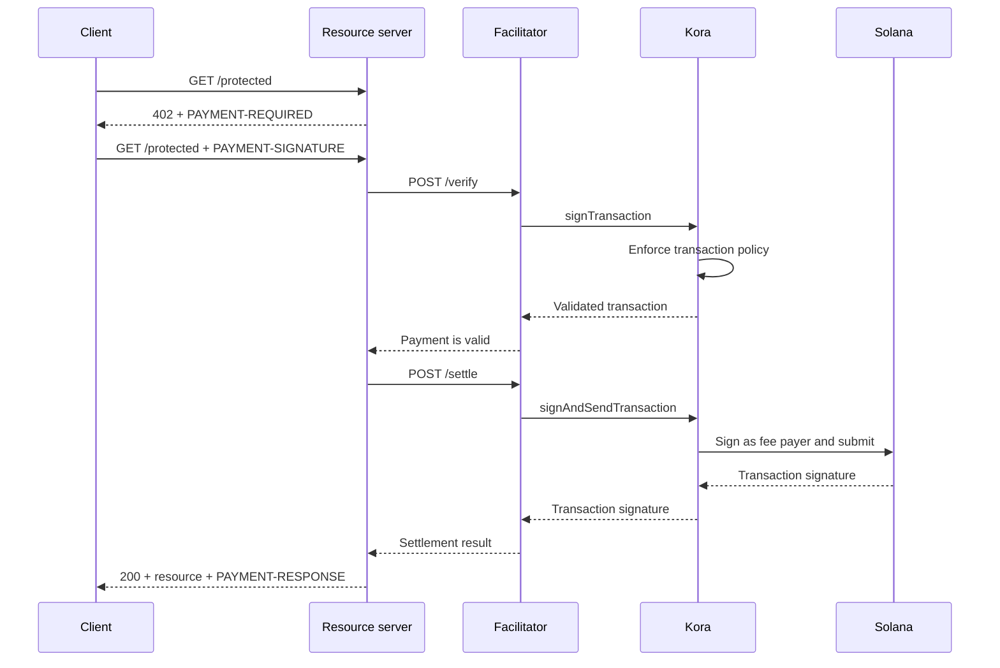

Kora can provide the Solana signing, transaction-policy, and fee-sponsorship
layer behind an
[x402 V2 facilitator](/docs/payments/agentic-payments/x402-facilitator). The
facilitator implements the x402 HTTP API; Kora validates, signs, and sends the
payment transactions it accepts.

This guide starts the reference Kora facilitator on Solana Devnet. It is a
development environment for testing the integration, not a production
deployment.

## Architecture



The four application roles remain separate:

- The **client** selects a payment requirement and signs the payment
  authorization.
- The **resource server** prices a route and fulfills it only after successful
  verification and settlement.
- The **facilitator** exposes x402's `/supported`, `/verify`, and `/settle`
  endpoints.
- **Kora** signs only transactions allowed by its policy and can sponsor their
  Solana network fees.

Kora does not replace the x402 protocol. It is the signing and policy boundary
used by this facilitator implementation.

## Start the reference facilitator

You need Git and [Docker with Compose](https://docs.docker.com/compose/). Clone
the latest stable Kora release and enter the x402 demo:

```bash
git clone --branch v2.0.5 --depth 1 https://github.com/solana-foundation/kora.git
cd kora/examples/x402/demo
cp .env.example .env
```

Set `KORA_PRIVATE_KEY` in `.env` to a disposable Devnet keypair. The demo's
signer configuration accepts a base58 secret, a byte-array keypair, or the path
to a JSON keypair file. Fund its public address with Devnet SOL so it can
sponsor transaction fees.

<Callout type="caution" title="Use a disposable Devnet signer">
  The Docker demo loads the Kora signer from an environment variable. Do not put
  a production signing key in this demo or commit the `.env` file.
</Callout>

Start Kora and the facilitator:

```bash
docker compose up --build
```

The first build can take several minutes. When both health checks pass, inspect
the facilitator's advertised capabilities from another terminal:

```bash
curl http://127.0.0.1:3000/supported
```

The response should advertise x402 version `2`, the `exact` scheme, and the
Devnet CAIP-2 network identifier:

```json
{
  "kinds": [
    {
      "x402Version": 2,
      "scheme": "exact",
      "network": "solana:EtWTRABZaYq6iMfeYKouRu166VU2xqa1",
      "extra": {
        "feePayer": "<KORA_SIGNER_ADDRESS>"
      }
    }
  ]
}
```

Kora listens on `127.0.0.1:8080` and the facilitator listens on `127.0.0.1:3000`
by default. Stop the demo with `Ctrl+C`.

## Connect a resource server

Configure the x402 resource server to use the local facilitator and the Kora
signer's public address as its recipient:

```bash
FACILITATOR_URL=http://127.0.0.1:3000
SOLANA_PAY_TO=<KORA_SIGNER_ADDRESS>
```

Then follow [x402 on Solana](/docs/payments/agentic-payments/intro-to-x402) to
add x402 V2 middleware to an Express route. An unpaid request receives
`PAYMENT-REQUIRED`, the retry carries `PAYMENT-SIGNATURE`, and a successful
response carries `PAYMENT-RESPONSE`.

Do not copy examples that use `X-PAYMENT`, `X-PAYMENT-RESPONSE`, or the
`solana-devnet` network name. Those fields belong to x402 V1.

The Kora repository also includes a protected API and payment-aware client in
the same `examples/x402/demo` directory. Use those applications when you need to
exercise the complete local flow.

## Configure the Kora policy

The reference `kora/kora.toml` is intentionally narrow. Its validation policy
controls:

- which Solana programs the signer permits;
- which SPL token mints can be used;
- the maximum sponsored lamports and signature count;
- which fee-payer operations are forbidden; and
- which Token-2022 extensions are rejected.

The demo enables only the Kora RPC methods its facilitator needs:
`signTransaction`, `signAndSendTransaction`, `getBlockhash`, `getPayerSigner`,
`getConfig`, and `getVersion`.

Treat the policy as the security boundary for the fee-payer key. For a
production service:

1. Allowlist only the programs, token mints, and transaction forms your x402
   scheme produces.
2. Deny transfers, authority changes, account closure, and other instructions
   that can move value from the Kora signer.
3. Set transaction and usage limits that bound the loss from a compromised
   facilitator credential.
4. Use a managed signer backend instead of an environment-held private key.

## Secure the facilitator-to-Kora connection

The demo enables Kora API-key authentication. The facilitator sends the value of
`KORA_API_KEY`, which must match `[kora.auth].api_key` in `kora.toml`.

For production, also:

- keep Kora on a private network and terminate TLS at a trusted boundary;
- store API credentials in a secret manager and rotate them;
- consider Kora's HMAC request authentication for tamper and replay protection;
- separate fee-payer and payment-recipient keys when your accounting model
  requires it; and
- alert on policy rejections, settlement failures, fee consumption, and signer
  balance.

## Harden payment settlement

Kora validates the Solana transaction, but the facilitator and resource server
still own x402 protocol correctness. Before serving a resource, enforce:

- the selected x402 version, scheme, network, asset, amount, and recipient;
- the authorization lifetime and exact Solana instruction layout;
- atomic replay protection and idempotent settlement;
- confirmation at the commitment level required by the product; and
- a durable mapping between the purchase, settlement result, and fulfillment.

Do not return paid content merely because Kora accepted a transaction for
signing. Fulfill only after the facilitator returns a successful settlement
result.

## Related resources

- [Kora repository and x402 demo](https://github.com/solana-foundation/kora/tree/main/examples/x402/demo)
- [Kora operator configuration](/docs/tools/kora/operators/configuration)
- [Kora signer backends](/docs/tools/kora/operators/signers)
- [Kora security audits](/docs/tools/kora/security-audits)
- [x402 V2 specification](https://github.com/x402-foundation/x402/blob/main/specs/x402-specification-v2.md)
- [Agentic payments overview](/docs/payments/agentic-payments)
