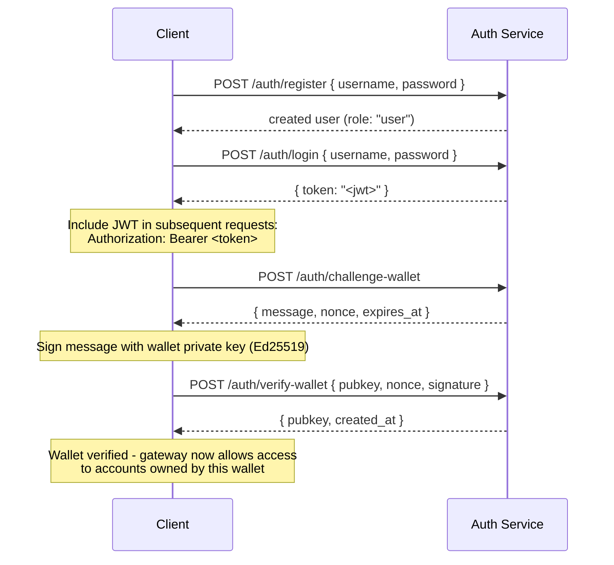

## Overview

Private Channels includes an optional Auth Service that gates gateway access
with JWT authentication and role-based access control (RBAC). When
authentication is disabled, the gateway accepts all connections. When enabled,
clients must present a valid JWT in every request.

This page covers both audiences:

- **Developers** - registration, login, wallet verification, and making
  authenticated requests
- **Operators** - enabling the auth service, configuring `JWT_SECRET`, and
  provisioning the `operator` role

## Enabling Auth

Authentication is enabled by setting `JWT_SECRET` (non-empty) on both the
gateway and the Auth Service. The Auth Service also requires
`AUTH_DATABASE_URL`.

When `JWT_SECRET` is not set, the gateway operates in open mode - no token is
required.

> **Docker Compose:** The auth service is a Docker Compose profile and is **not
> started by default**. To include it, pass `--profile auth` to your
> `docker compose` command:
>
> ```bash
> docker compose -f docker-compose.devnet.yml --env-file versions.env --env-file .env.devnet --profile auth up -d
> ```

## Auth Service API

All endpoints are under `/auth`. The auth service listens on `AUTH_PORT`
(default `8903`).

### `POST /auth/register`

Create a new account. All users are registered with the `user` role.

```json
{ "username": "alice", "password": "hunter2" }
```

- Username: 5-32 characters, alphanumeric plus `_` and `-`
- Password: 6-128 characters
- Returns the created user; password is never returned

### `POST /auth/login`

Authenticate and receive a signed JWT valid for 24 hours.

```json
{ "username": "alice", "password": "hunter2" }
```

Returns `{ "token": "<jwt>" }`. Both wrong username and wrong password return
`401` to prevent username enumeration.

### `POST /auth/challenge-wallet`

Request a signing challenge to prove ownership of a Solana wallet. Requires a
valid JWT.

Returns a message, nonce, and expiry. The challenge expires in 10 minutes.

```json
{
  "message": "Solana Private Channels wallet verification\nuser: <uuid>\nnonce: <uuid>\nexpires: <unix>",
  "nonce": "<uuid>",
  "expires_at": "<iso8601>"
}
```

### `POST /auth/verify-wallet`

Submit the signed challenge to register a wallet as verified. Requires a valid
JWT.

```json
{
  "pubkey": "<base58 pubkey>",
  "nonce": "<uuid from challenge>",
  "signature": "<base58 Ed25519 signature>"
}
```

The service reconstructs the challenge message, verifies the Ed25519 signature,
and stores the wallet. Each nonce can only be consumed once - replays are
rejected.

Returns `{ "pubkey": "<base58>", "created_at": "<iso8601>" }`.

### `GET /auth/wallets`

List all verified wallets for the authenticated user. Requires a valid JWT.

### `DELETE /auth/wallets/{pubkey}`

Remove a verified wallet from the authenticated user's account. Requires a valid
JWT.

### `GET /health`

Liveness check. Returns `200 ok`. No authentication required.

## JWT Structure

Tokens use the HS256 algorithm and expire 24 hours after issue.

| Claim  | Value                           |
| ------ | ------------------------------- |
| `sub`  | User UUID                       |
| `role` | `"user"` or `"operator"`        |
| `iss`  | `"private-channel-auth"`        |
| `aud`  | `"private-channel-gateway"`     |
| `exp`  | Unix timestamp (24h from issue) |

> `iss` and `aud` are present in the JWT payload but are validated by the
> gateway's JWT configuration, not deserialized into the application claims
> struct. Application-layer code has access to `sub`, `role`, and `exp` only.

Pass the token in the `Authorization` header:

```
Authorization: Bearer <JWT_TOKEN>
```

## Roles

### user

Default role on registration.

- Access is gated to the user's own verified wallets
- Blocked from: `getBlock`, `getTransaction`, `simulateTransaction`
- Can: call `Deposit` on the Escrow Program, initiate withdrawals via
  `WithdrawFunds`

### operator

Elevated role. Must be provisioned directly - there is no self-service path to
escalate from `user` to `operator`.

**Grant the role (requires DB access):**

<Callout type="warning">
  This is a privileged database operation. Restrict access to the Auth Service
  database accordingly and audit any role changes.
</Callout>

```sql
UPDATE private_channel_auth.users SET role = 'operator' WHERE username = 'alice';
```

**Register a wallet without the self-verify flow (Admin CLI,
`private-channel-auth-admin`):**

```bash
private-channel-auth-admin attach-wallet --username alice --pubkey <base58-pubkey>
```

This inserts a verified wallet directly into the `verified_wallets` table,
bypassing the challenge/verify flow. Enforces a unique constraint on
`(user_id, pubkey)`. It does **not** grant the `operator` role by itself - use
the SQL update above for that. This command is for attaching a wallet to an
account (for example, a service account) without requiring the interactive
challenge/verify flow.

**Capabilities:**

- Bypasses all wallet ownership checks
- Full access to all gateway RPC methods, including `getBlock`,
  `getTransaction`, `simulateTransaction`
- Required for: `ReleaseFunds`, `ResetSmtRoot`

## Full Authentication Flow



## Making Authenticated Requests

```typescript
const response = await fetch("http://localhost:8899/", {
  method: "POST",
  headers: {
    "Content-Type": "application/json",
    Authorization: `Bearer ${jwtToken}`
  },
  body: JSON.stringify({
    jsonrpc: "2.0",
    id: 1,
    method: "getBalance",
    params: [walletAddress]
  })
});
const data = await response.json();
```

## Gateway Endpoints

These endpoints do not require authentication:

| Endpoint  | Method | Description                               | Success                  | Failure                     |
| --------- | ------ | ----------------------------------------- | ------------------------ | --------------------------- |
| `/health` | GET    | Liveness check                            | `200 {"status":"ok"}`    | -                           |
| `/ready`  | GET    | Deep readiness; probes write + read nodes | `200 {"status":"ready"}` | `503 {"status":"degraded"}` |

For the `JWT_SECRET` and gateway environment variable reference, see the
[Configuration reference](/docs/tools/private-channels/operators/configuration).

## RPC Method Access Matrix

The following methods are recognized by the gateway. When `JWT_SECRET` is set,
access depends on JWT role:

| Method                        | Route      | No JWT | `user`           | `operator` |
| ----------------------------- | ---------- | ------ | ---------------- | ---------- |
| `sendTransaction`             | Write node | ✓      | ✓                | ✓          |
| `getLatestBlockhash`          | Read node  | ✓      | ✓                | ✓          |
| `getSlot`                     | Read node  | ✓      | ✓                | ✓          |
| `getRecentBlockhash`          | Read node  | ✓      | ✓                | ✓          |
| `getSignatureStatuses`        | Read node  | ✓      | ✓                | ✓          |
| `getTransactionCount`         | Read node  | ✓      | ✓                | ✓          |
| `getFirstAvailableBlock`      | Read node  | ✓      | ✓                | ✓          |
| `getBlocks`                   | Read node  | ✓      | ✓                | ✓          |
| `getEpochInfo`                | Read node  | ✓      | ✓                | ✓          |
| `getEpochSchedule`            | Read node  | ✓      | ✓                | ✓          |
| `getRecentPerformanceSamples` | Read node  | ✓      | ✓                | ✓          |
| `getBlockTime`                | Read node  | ✓      | ✓                | ✓          |
| `getVoteAccounts`             | Read node  | ✓      | ✓                | ✓          |
| `getSupply`                   | Read node  | ✓      | ✓                | ✓          |
| `getSlotLeaders`              | Read node  | ✓      | ✓                | ✓          |
| `isBlockhashValid`            | Read node  | ✓      | ✓                | ✓          |
| `getAccountInfo`              | Read node  | 401    | ownership-gated¹ | ✓          |
| `getTokenAccountBalance`      | Read node  | 401    | ownership-gated¹ | ✓          |
| `getSignaturesForAddress`     | Read node  | 401    | ownership-gated¹ | ✓          |
| `getBlock`                    | Read node  | 401    | 403              | ✓          |
| `getTransaction`              | Read node  | 401    | 403              | ✓          |
| `simulateTransaction`         | Read node  | 401    | 403              | ✓          |

¹ **Ownership-gated**: the gateway verifies that the queried account is an SPL
Token account (owner field is `TokenkegQ...` or `TokenzQ...`, data of at least
165 bytes) whose `owner` or `delegate` field matches one of the authenticated
user's verified wallets. Querying an unowned account or a non-SPL-token account
returns 403.
