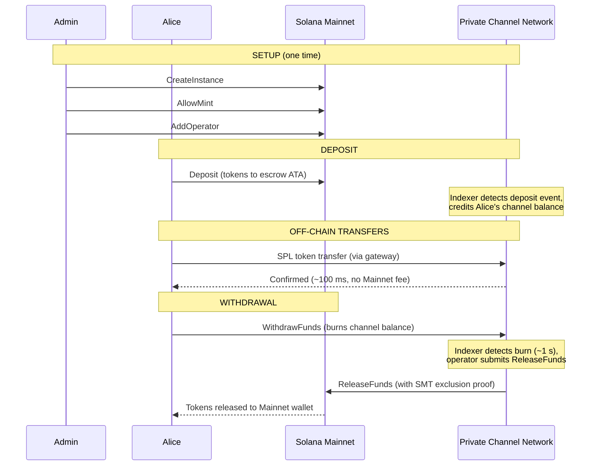
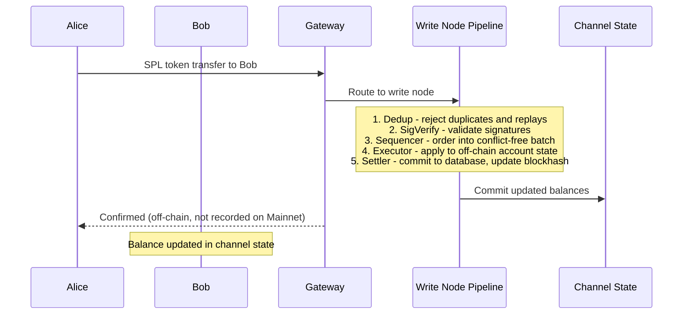
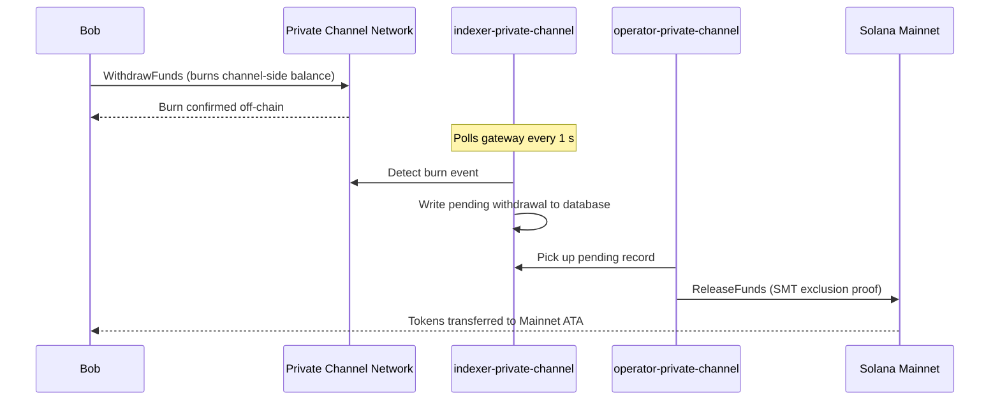

## What is a Private Channel?

A private channel is an off-chain payment network anchored to Solana. Users
deposit SPL tokens into an on-chain escrow program, then transact off-chain
through a gateway at high speed and zero per-transfer cost. Settlement back to
Solana Mainnet happens via a Sparse Merkle Tree proof, ensuring funds are always
redeemable and double-spend is impossible.

Unlike Solana's native payment flow, transfers within a channel do not appear
on-chain until a user withdraws. The channel network runs its own transaction
pipeline (dedup -> sig verify -> sequencer -> executor -> settler) that
processes transactions independently of Solana's block time.

## Participants

### Instance Admin

The admin deploys the `Instance` PDA via `CreateInstance` and controls which SPL
token mints are accepted (`AllowMint` / `BlockMint`). The admin provisions and
revokes operators via `AddOperator` / `RemoveOperator`, and can transfer admin
rights via `SetNewAdmin`. There is one admin per instance. Admin rights transfer
is irreversible in a single step - the current admin cannot reclaim the role
without the new admin's cooperation.

### Operators

Operators are provisioned by the admin. They hold an `Operator` PDA and are the
only accounts permitted to call `ReleaseFunds` (to settle withdrawals to
Mainnet) and `ResetSmtRoot` (to rotate the Sparse Merkle Tree). Operators bypass
all ownership checks in the gateway and have access to all JSON-RPC methods
including `getBlock`, `getTransaction`, and `simulateTransaction`. JWT role:
`"operator"`. Operators must be provisioned directly in the database - there is
no self-service escalation. See the
[Operators guide](/docs/tools/private-channels/operators) for deployment and
configuration details.

### Users

Users self-register through the Auth Service. JWT role: `"user"`. Users can call
`Deposit` directly on the Escrow Program and initiate withdrawals via the
channel-side `WithdrawFunds` instruction on the Withdraw Program. Gateway access
is gated to their own verified wallets; they cannot call `getBlock`,
`getTransaction`, or `simulateTransaction`.

## Channel Lifecycle

1. **Instance creation** - Admin calls `CreateInstance`, creating the `Instance`
   PDA and configuring allowed mints.
2. **Deposit** - Users deposit SPL tokens into the escrow via the `Deposit`
   instruction. Tokens move to the instance's associated token account.
3. **Off-chain transfers** - Users send transfers through the gateway. Transfers
   are sequenced and executed on the channel network without touching Mainnet.
4. **Withdrawal initiation** - A user calls `WithdrawFunds` on the Withdraw
   Program (channel side) to burn their balance and signal a withdrawal.
5. **Mainnet settlement** - An operator provides a valid SMT exclusion proof and
   calls `ReleaseFunds` on the Escrow Program (Mainnet), releasing tokens to the
   user's wallet.
6. **Tree rotation** - When the SMT approaches capacity (65,536 leaves), the
   operator calls `ResetSmtRoot` to rotate the tree and start a new epoch.

### Transfer

### Withdrawal

## When to Use Private Channels

Use private channels when your application needs:

- **Off-chain throughput** - your transfer volume would saturate Solana TPS or
  you need sub-millisecond confirmation
- **Privacy** - counterparty identities and transfer amounts must not appear
  on-chain
- **Zero per-transfer fees** - transferring frequently where per-transaction SOL
  cost is prohibitive

Use native SPL transfers instead when:

- **On-chain composability** is required (DeFi, swaps, lending - other programs
  must be able to observe or act on the transfer)
- **Single-transfer settlement** is fine and privacy is not a concern
- **No gateway infrastructure** is available or operationally feasible
