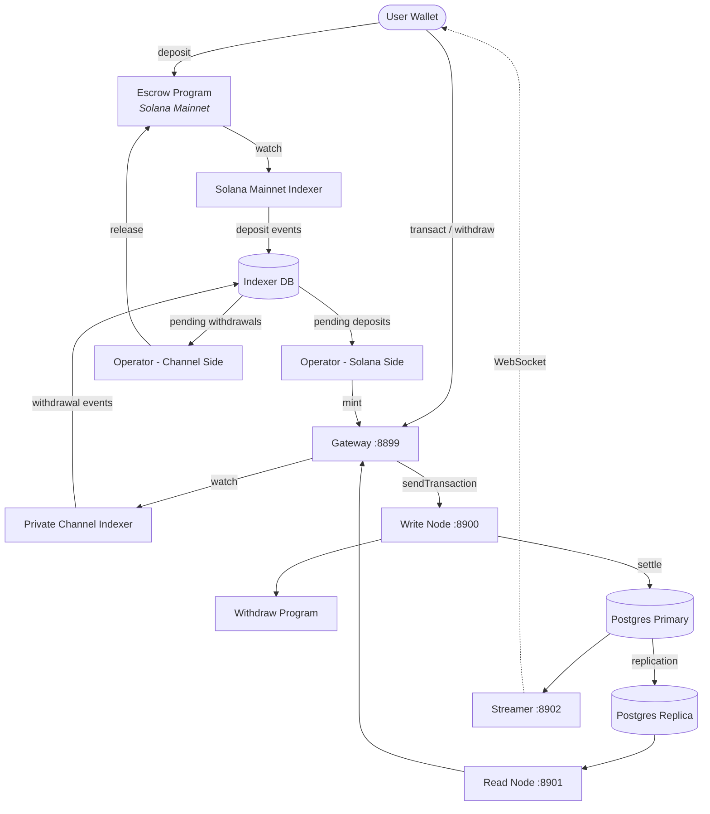

<Callout type="warning">
  Private Channels has not been security audited and is not recommended for
  production use with real funds without a thorough security review.
</Callout>

<Callout type="info">
  **Deploying an instance?** Go to the [Operators
  guide](/docs/tools/private-channels/operators). **Integrating against an
  existing instance?** Go to the
  [Quickstart](/docs/tools/private-channels/quickstart/installation). This page
  is the architecture reference for both audiences.
</Callout>

## Architecture

Private Channels is composed of four components: two on-chain Solana programs
(Escrow and Withdraw) and two off-chain services (Gateway and Auth Service).
Together they form a state channel protocol where funds live on Mainnet but
transfers settle off-chain.

### Escrow Program

The Escrow Program is an on-chain Solana program that holds deposited SPL
tokens. It is the trust anchor of the system - all funds ultimately live in
escrow until an operator provides a valid Sparse Merkle Tree exclusion proof to
release them.

- Program ID: `GokvZqD2yP696rzNBNbQvcZ4VsLW7jNvFXU1kW9m7k83`
- This ID is compiled into the program binary via `declare_id!()`. Off-chain
  services (indexer, operator service) are configured to point at it via the
  `ESCROW_PROGRAM_ID` environment variable.
- Manages `Instance`, `AllowedMint`, and `Operator` PDAs
- Instructions: `CreateInstance`, `AllowMint`, `BlockMint`, `AddOperator`,
  `RemoveOperator`, `SetNewAdmin`, `Deposit`, `ReleaseFunds`, `ResetSmtRoot`

### Withdraw Program

The Withdraw Program runs on the private channel network, not on Solana Mainnet.
Users call `WithdrawFunds` to burn their channel-side token balance. This burn
does not automatically release funds - it signals to the operator that a
withdrawal is pending. The operator then calls `ReleaseFunds` on the Escrow
Program with a valid SMT proof to complete settlement.

- Program ID: `J231K9UEpS4y4KAPwGc4gsMNCjKFRMYcQBcjVW7vBhVi`
- This ID is compiled into the program binary. Off-chain services are configured
  to point at it via the `WITHDRAW_PROGRAM_ID` environment variable.

### Gateway

The Gateway is a Solana JSON-RPC-compatible proxy that routes client requests to
the channel network's write node (for transaction submission) and read node (for
queries). It is configured via environment variables: `GATEWAY_PORT`,
`GATEWAY_WRITE_URL`, `GATEWAY_READ_URL`.

Health endpoints (no authentication required):

- `GET /health` - liveness check; returns `200 {"status":"ok"}`
- `GET /ready` - deep readiness, probes write + read nodes; returns
  `200 {"status":"ready"}` or `503 {"status":"degraded"}`

#### RPC Method Routing and Access

The gateway routes `sendTransaction` to the write node and all other methods to
the read node. Requests larger than 64 KB are rejected with HTTP 413. When
authentication is enabled, method access is gated by JWT role - see
**[Authentication & Roles](/docs/tools/private-channels/concepts/auth)** for the
full method matrix.

### Auth Service

The Auth Service is an optional component that issues HS256 JWTs (24-hour
expiry) for gateway access control. It is enabled when the `JWT_SECRET`
environment variable is set. Without it, the gateway accepts all connections.

JWT claims: `sub` (user UUID), `role` (`"user"` or `"operator"`), `iss`
(`"private-channel-auth"`), `aud` (`"private-channel-gateway"`), `exp` (Unix
timestamp). `iss` and `aud` are validated by the gateway's JWT configuration,
not deserialized into the application claims struct - only `sub`, `role`, and
`exp` are available to application-layer code.

Roles:

- `user` - access gated to own verified wallets; cannot call `getBlock`,
  `getTransaction`, or `simulateTransaction`
- `operator` - bypasses all ownership checks; full RPC method access; must be
  provisioned in the database (no self-service escalation)

### Streamer

The Streamer is a WebSocket server that pushes channel state updates to
connected clients in real time, eliminating the need to poll the RPC. It runs
alongside the Gateway and polls PostgreSQL for state changes.

- Port: `8902`, configurable via `STREAMER_PORT`
- Connect: `ws://localhost:8902`
- Health endpoint: `GET /health` - returns `503` if any internal poll loop
  stalls beyond 30 seconds

<Callout type="warning">
  The WebSocket event schema is not yet publicly documented. Refer to
  [`core/src/bin/streamer.rs`](https://github.com/solana-foundation/solana-private-channels/blob/main/core/src/bin/streamer.rs)
  for implementation details until formal documentation is available.
</Callout>



## Transaction Pipeline

```text
Transaction -> [1:Dedup] -> [2:SigVerify] -> [3:Sequencer] -> [4:Executor] -> [5:Settler] -> Database
```

Transactions submitted to the Gateway flow through a five-stage pipeline before
their state is committed:

1. **Dedup** - filters duplicate transactions before they enter the pipeline
2. **SigVerify** - validates transaction signatures against the signer's public
   key
3. **Sequencer** - orders valid transactions deterministically to establish a
   canonical history
4. **Executor** - executes transactions against the channel's accounts layer
   (BOB Cache + AccountsDB), updating balances off-chain
5. **Settler** - commits accumulated transaction results to PostgreSQL and
   updates the Redis cache; generates new blockhashes for the next block cycle.
   Mainnet settlement (calling `ReleaseFunds`) is handled separately by the
   `operator-private-channel` service

## Key Features

### Privacy

Transfers between channel participants are not recorded on Solana Mainnet. Only
deposits (entering the channel) and final withdrawals (leaving the channel)
appear on-chain. Counterparty identities and transfer amounts are not visible to
outside observers during channel operation.

### Performance

The off-chain pipeline removes Solana's block time from the critical path.
Transfers confirm when the sequencer processes them - not when a Solana block
confirms. This enables sub-second finality and throughput beyond Solana's native
TPS for app-layer transfers.

### Settlement

Every withdrawal is protected by an on-chain Sparse Merkle Tree proof. The SMT
root is stored in `Instance.withdrawal_transactions_root` on the Escrow Program.
When `ReleaseFunds` is called, the program verifies a valid exclusion proof for
an unseen nonce against the current on-chain root before releasing funds, making
double-spend impossible even if an operator key is compromised.

## Security Model

**Admin key** - controls instance creation (`CreateInstance`) and operator
provisioning (`AddOperator` / `RemoveOperator`). Compromise of the admin key
enables arbitrary operator provisioning. `SetNewAdmin` transfers admin authority
irreversibly in a single step; protect the admin key accordingly.

**Operator keys** - can call `ReleaseFunds` and `ResetSmtRoot`. They cannot
release funds without a valid SMT exclusion proof against the current on-chain
root. The on-chain `verify_smt_exclusion_proof` check is the last line of
defense against unauthorized withdrawals - a compromised operator key alone is
not sufficient to drain the escrow.

**SMT root** - stored on-chain in `Instance.withdrawal_transactions_root`.
Updated atomically with each `ReleaseFunds` call. Because each proof must
reference an unseen nonce, double-spending the same channel balance is
impossible even if an operator key is compromised.

**Tree rotation** - `Instance.current_tree_index` tracks tree epochs. When
`ResetSmtRoot` is called, it increments the tree index and invalidates all
nonces from the previous tree epoch, providing a clean slate for new settlement
cycles.

## Operational Key Security

<Callout type="warning">
  Despite its name, the `ADMIN_PRIVATE_KEY` environment variable holds the
  **operator** keypair, not the instance admin key described in the Security
  Model above. Never put the actual admin key (used for `CreateInstance` /
  `AddOperator` / `SetNewAdmin`) into this variable or expose it at runtime -
  keep that key cold and offline.
</Callout>

The `ADMIN_PRIVATE_KEY` environment variable holds the operator keypair that
signs `ReleaseFunds` and `ResetSmtRoot` on Mainnet. Treat it with the same
controls as a hot wallet private key:

- Store it only in the gitignored `.env` file, never in `.env.devnet` or any
  committed config
- For production deployments, consider a secrets manager (AWS Secrets Manager,
  HashiCorp Vault) rather than a plaintext env var
- The admin keypair (used to call `AddOperator` / `SetNewAdmin`) should be kept
  cold - it is only needed during instance setup and operator provisioning, not
  during runtime

`SetNewAdmin` transfers admin rights **irreversibly in a single transaction** -
the current admin has no recovery path without the new admin's cooperation. Do
not call it without verifying the target address.

## Next Steps

<Cards>
  <Card
    title="Quickstart"
    href="/docs/tools/private-channels/quickstart/installation"
  >
    Set up your environment and generate TypeScript clients.
  </Card>
  <Card title="Channels" href="/docs/tools/private-channels/concepts/channels">
    Understand participants and the channel lifecycle.
  </Card>
  <Card
    title="Sparse Merkle Tree"
    href="/docs/tools/private-channels/concepts/smt"
  >
    Understand how withdrawal proofs are verified on-chain.
  </Card>
  <Card
    title="Instructions"
    href="/docs/tools/private-channels/instructions/deposit"
  >
    Full instruction reference for all programs.
  </Card>
</Cards>
