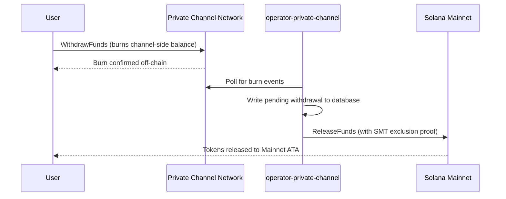

## Overview

Withdrawing from Private Channels is a two-step process. First, the user burns
their channel-side token balance by calling `WithdrawFunds` on the Withdraw
Program. Second, an operator calls `ReleaseFunds` on the Escrow Program
(Mainnet) with a valid Sparse Merkle Tree exclusion proof to release the funds.
The SMT proof ensures each withdrawal nonce can only be used once, preventing
double-spend.



## Step 1: Initiate Withdrawal on the Channel

Call `WithdrawFunds` on the Withdraw Program to burn your channel-side balance.
Use the `Async` variant - it auto-derives the `tokenAccount` PDA and is the
recommended form for production use:

```typescript
import { getWithdrawFundsInstructionAsync } from "../private-channel-withdraw-program/clients/typescript";
import {
  createSolanaRpc,
  address,
  pipe,
  createTransactionMessage,
  setTransactionMessageFeePayerSigner,
  setTransactionMessageLifetimeUsingBlockhash,
  appendTransactionMessageInstruction,
  signAndSendTransactionMessageWithSigners,
  assertIsTransactionMessageWithSingleSendingSigner
} from "@solana/kit";
import { getBase58Decoder } from "@solana/codecs-strings";

// Point to the gateway, not a public Solana RPC
const privateChannelRpc = createSolanaRpc("http://localhost:8899");

const withdrawIx = await getWithdrawFundsInstructionAsync({
  user: userSigner,
  mint: address(mintAddress),
  amount: 1_000_000n, // 1 USDC (6 decimals)
  destination: null // null = release to signer's Mainnet wallet
});

const { value: latestBlockhash } = await privateChannelRpc
  .getLatestBlockhash({ commitment: "confirmed" })
  .send();

// Sent to the Private Channels gateway (not Solana RPC directly), which
// expects the legacy transaction format - do not switch this to version 0.
const transactionMessage = pipe(
  createTransactionMessage({ version: "legacy" }),
  (m) => setTransactionMessageFeePayerSigner(userSigner, m),
  (m) => setTransactionMessageLifetimeUsingBlockhash(latestBlockhash, m),
  (m) => appendTransactionMessageInstruction(withdrawIx, m)
);

assertIsTransactionMessageWithSingleSendingSigner(transactionMessage);

const signatureBytes =
  await signAndSendTransactionMessageWithSigners(transactionMessage);
const signature = getBase58Decoder().decode(signatureBytes);
console.log("Withdrawal initiated:", signature);
```

- Withdraw Program ID: `J231K9UEpS4y4KAPwGc4gsMNCjKFRMYcQBcjVW7vBhVi`
- Submit this transaction to the gateway (`http://localhost:8899`), not to a
  public Solana RPC
- If `destination` is provided, released funds go to that wallet instead of the
  signer's

## What to Expect

No further action is required after calling `WithdrawFunds`. The operator
services handle settlement automatically:

1. `indexer-private-channel` polls the channel every 1 second for burn events
   and writes a pending withdrawal record when yours is detected
2. `operator-private-channel` polls the database every 1 second for pending
   records and submits `ReleaseFunds` to the Escrow Program on Solana Mainnet
   with the required SMT exclusion proof; it polls for Mainnet confirmation up
   to 5 times at 400 ms intervals before retrying

Funds typically appear in your Mainnet wallet within a few seconds under normal
conditions.

## How the Operator Settles (Reference)

After the channel-side burn, a provisioned operator must call `ReleaseFunds` on
the Escrow Program with a valid SMT exclusion proof - the operator cannot
release funds without proving the withdrawal nonce has not been used before.
This step is handled automatically by `operator-private-channel`; you do not
need to call it yourself.

The operator provides:

- `amount` - must match the burned amount
- `user` - recipient wallet on Mainnet
- `new_withdrawal_root` - updated SMT root after this withdrawal
- `transaction_nonce` - unique nonce for this leaf
- `sibling_proofs` - 512 bytes (16 x 32-byte sibling hashes for the tree proof)

## Verify

After the operator call confirms, check your Mainnet token balance:

```bash
spl-token balance <MINT_ADDRESS> --owner <YOUR_WALLET>
```

Or via RPC:

```typescript
const balance = await rpc.getTokenAccountBalance(yourMainnetAta).send();
console.log(balance.value.uiAmountString);
```

## You've Completed the Quickstart

You've run the full Private Channels cycle on devnet: deposited SPL tokens into
the escrow, sent an off-chain transfer through the gateway, and withdrawn funds
back to your Mainnet wallet.

<Cards>
  <Card
    title="Channel Lifecycle"
    href="/docs/tools/private-channels/concepts/channels"
  >
    Understand participants and the full deposit-to-withdrawal flow in depth.
  </Card>
  <Card
    title="Authentication & Roles"
    href="/docs/tools/private-channels/concepts/auth"
  >
    Add JWT authentication to your integration.
  </Card>
  <Card
    title="Release Funds Reference"
    href="/docs/tools/private-channels/instructions/release-funds"
  >
    Full ReleaseFunds instruction reference for operator tooling.
  </Card>
  <Card
    title="Sparse Merkle Tree"
    href="/docs/tools/private-channels/concepts/smt"
  >
    Understand how withdrawal proofs prevent double-spend.
  </Card>
</Cards>
