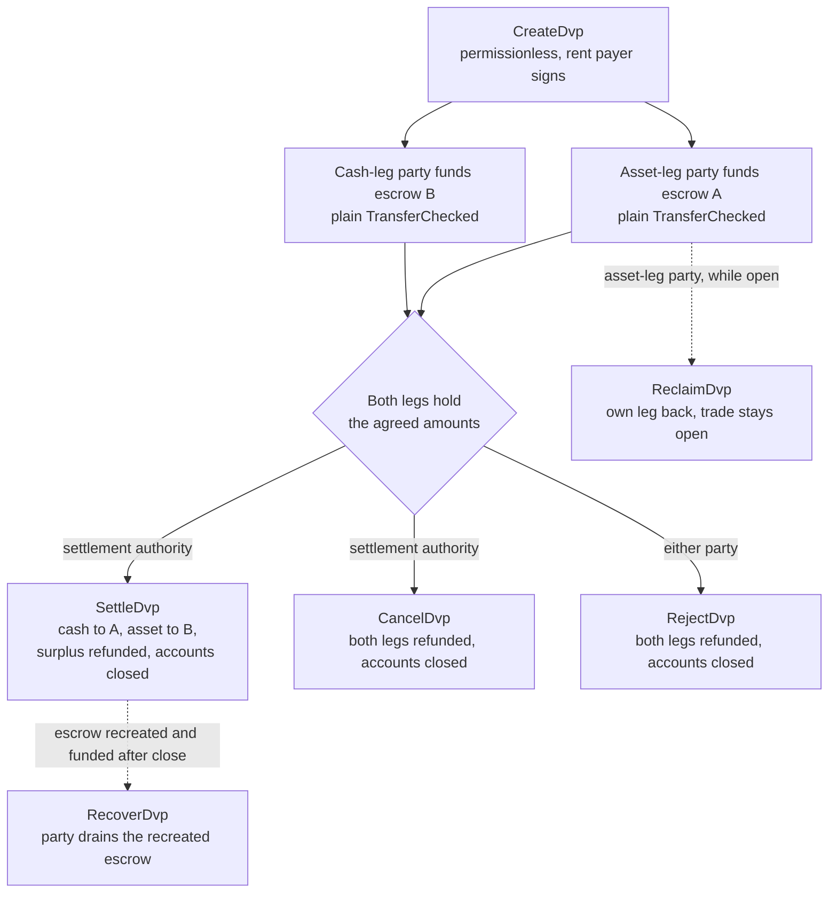
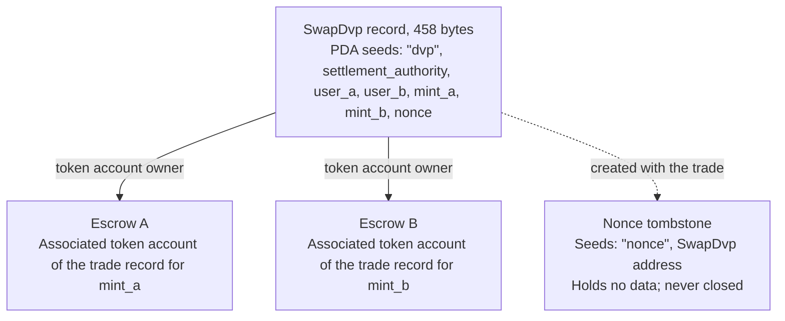

El programa DvP es el programa estándar para la entrega contra pago en Solana,
mantenido por la Solana Foundation y auditado por Cantina. Dos partes acuerdan
una operación, cada una envía su tramo a una cuenta de escrow mediante una
transferencia de tokens ordinaria, y una autoridad de liquidación liquida ambos
tramos en una sola transacción, de modo que o se mueven ambos o no se mueve
ninguno. La autoridad de liquidación es una tercera dirección designada en la
operación, como el mercado o el agente que la gestionó. Ninguna de las partes
escribe ni despliega un programa, y una wallet o un custodio que pueda enviar
una transferencia de tokens estándar (`TransferChecked`) puede fondear un tramo
sin ninguna integración específica con DvP. Hasta la liquidación, cualquiera de
las partes puede retirar su propio tramo o deshacer la operación.

<Callout type="warn" title="Lee el registro antes de actuar en base a él">

Crear un registro de operación no requiere permisos, por lo que un registro no
es prueba de acuerdo. Cada parte lee los términos almacenados antes de fondear,
y la autoridad de liquidación antes de liquidar (consulta
[verificación](#verification-before-funding-and-settlement)).

</Callout>

## Cómo funciona

Cada operación obtiene un registro propiedad del programa y dos cuentas de
escrow, una por tramo. La parte del tramo de activo (`user_a`) y la parte del
tramo de efectivo (`user_b`) fondean cada una un tramo transfiriendo tokens a la
cuenta de escrow de ese tramo. La autoridad de liquidación es el único firmante
que puede liquidar. La liquidación transfiere el importe acordado de cada tramo
a la otra parte, devuelve cualquier excedente a la parte propietaria del tramo y
cierra el registro y ambos escrows. La atomicidad proviene de las
[transacciones](/docs/core/transactions) de Solana: ambas transferencias van en una sola
transacción, por lo que o surten efecto ambas o ninguna.

Todo reembolso, retiro y devolución de excedente va a la associated token
account de la propia parte: la de `user_a` para `mint_a` y la de `user_b` para
`mint_b`. Un custodio o un sistema de tesorería puede fondear un tramo desde su
propia cuenta, pero todo lo que se devuelva llega a la cuenta de la parte, no de
vuelta al custodio. Además, cada operación deja una cuenta marcadora permanente
(consulta [Estado](#state)).

## Guías

Las páginas de pasos llevan una operación desde su creación hasta su
liquidación, con TypeScript y Rust para cada instrucción.

<Cards>
  <Card title="Crear una operación" href="/docs/defi/dvp-program/create-a-trade">
    Instala los clientes y registra los términos de la operación con CreateDvp
  </Card>
  <Card title="Fondear los tramos" href="/docs/defi/dvp-program/fund-the-legs">
    Verifica los términos almacenados y luego fondea cada tramo con una transferencia simple
  </Card>
  <Card title="Liquidar la operación" href="/docs/defi/dvp-program/settle-the-trade">
    Liquida ambos tramos en una sola transacción como autoridad de liquidación
  </Card>
  <Card title="Deshacer una operación" href="/docs/defi/dvp-program/unwind-a-trade">
    Retira un tramo, cancela o rechaza la operación y recupera depósitos tardíos
  </Card>
</Cards>

Una [demo en devnet](https://solana.com/delivery-vs-payment/demo) ejecuta una
operación de principio a fin: crea la operación, fondea ambos escrows con
transferencias de tokens estándar y liquida ambos tramos en una sola
transacción.

## Elegir entre el programa y la delegación

[Entrega contra pago (DvP) mediante delegación](/docs/tokenization/dvp) liquida el
mismo intercambio sin un programa: cada parte delega su posición en un agente
de liquidación, que mueve ambos tramos en una sola transacción.

- **El programa** no necesita delegación, por lo que no se aplica el límite de un
  delegado por token account, y la autoridad de liquidación no puede redirigir
  los fondos. Cada operación depende de un programa actualizable y de su
  autoridad de actualización.
- **El patrón de delegación** no tiene dependencia de ningún programa y funciona
  con mints que incluyen Scaled UI Amount. El programa rechaza esos mints, lo
  que excluye cualquier mint creado a partir de la plantilla `tokenized-security`
  de Mosaic (consulta [restricciones de configuración del mint](#mint-configuration-constraints)).

## Roles

El programa es simétrico. En su interfaz, las dos partes son `user_a`, que
entrega `mint_a`, y `user_b`, que entrega `mint_b`. El README y los clientes
generados llaman a `mint_a` el tramo de activo y a `mint_b` el tramo de
efectivo, y estas páginas siguen esa convención, pero nada en el programa exige
que el tramo de efectivo sea un instrumento de efectivo. Dos activos, o dos
stablecoins, se liquidan de la misma manera.

| Rol                 | Quién                               | Firma                                              | Notas                                                                                                                                                                                                     |
| -------------------- | --------------------------------- | -------------------------------------------------- | --------------------------------------------------------------------------------------------------------------------------------------------------------------------------------------------------------- |
| Parte del tramo de activo      | `user_a`, entrega `mint_a`       | Su propia transferencia de fondeo; Reclaim, Reject, Recover | Una wallet con keypair, o una smart wallet basada en PDA, como una bóveda multisig. Una cuenta multisig de SPL Token o una program account no pueden ser una parte: Create falla con `PartyNotSignerCapable`                   |
| Parte del tramo de efectivo       | `user_b`, entrega `mint_b`       | Su propia transferencia de fondeo; Reclaim, Reject, Recover | Mismo requisito                                                                                                                                                                                          |
| Autoridad de liquidación | Una tercera dirección designada en la creación | Settle, Cancel                                     | El único firmante que puede liquidar. No puede redirigir los fondos, que se fijan en la creación. Recibe el rent de las cuentas cerradas cuando liquida o cancela                                         |
| Pagador del rent           | Quien firme `CreateDvp`         | Create                                             | Aporta el rent (el depósito de SOL que mantiene abierta una cuenta) para el registro, el tombstone del nonce y ambos escrows. No se registra como receptor del rent: el rent de las cuentas cerradas va a quien cierre la operación |

## ID del programa

```text
dvp34bdbcEm4f4FCUjGV4mDAkDshaQR4LkK8fdcsyZq
```

| Clúster      | Programa                                       | Autoridad de actualización                              | Último slot desplegado |
| ------------ | --------------------------------------------- | ---------------------------------------------- | ------------------ |
| mainnet-beta | `dvp34bdbcEm4f4FCUjGV4mDAkDshaQR4LkK8fdcsyZq` | `DXtFpbPjcn2hxPnw79x1Pfoj35vXh5AsWBkS37YnXMVv` | 452.058.374        |
| devnet       | `dvp34bdbcEm4f4FCUjGV4mDAkDshaQR4LkK8fdcsyZq` | `5EX1zFeJWj4rGYZv432WnYw8CbaSUeTdxPx4r573UgYU` | 479.376.863        |

El programa es actualizable en ambos clústeres. Las cifras anteriores son lo que
mostró `solana program show` el 2 de octubre de 2026; ejecuta el mismo comando
para obtener los valores actuales. La compilación de devnet es anterior al
commit sobre el que están escritas las páginas de pasos (consulta
[Instalación](/docs/defi/dvp-program/create-a-trade#install)), con el mismo conjunto de instrucciones y errores.

## Ciclo de vida



Una operación está abierta desde `CreateDvp` hasta que Settle, Cancel o Reject
la cierra. El fondeo no tiene una instrucción propia: un tramo está fondeado
cuando su cuenta de escrow contiene al menos el importe acordado. Reclaim se
aplica por tramo y deja la operación abierta, de modo que un problema con un
tramo no obliga a la otra parte a cancelar toda la operación.

## Estado

Cada operación tiene una cuenta `SwapDvp` de 458 bytes, propiedad del programa.
Su dirección se deriva de la autoridad de liquidación, las dos partes, los dos
mints y un nonce (las seeds
`["dvp", settlement_authority, user_a, user_b, mint_a, mint_b, nonce]`). Los
importes y las fechas se almacenan dentro de la cuenta y no afectan a la
dirección, por lo que hay que leerlos en lugar de deducirlos. Una pequeña cuenta
marcadora, el tombstone del nonce en `["nonce", swap_dvp]`, se crea junto con la
operación y nunca se cierra, de modo que cada combinación de partes, mints,
autoridad y nonce solo puede usarse para una operación.



| Campo                                  | Tipo          | Significado                                                                                                 |
| -------------------------------------- | ------------- | ------------------------------------------------------------------------------------------------------- |
| `bump`                                 | `u8`          | Bump de la PDA                                                                                                |
| `user_a`, `user_b`                     | `Pubkey`      | Las dos partes                                                                                         |
| `mint_a`, `mint_b`                     | `Pubkey`      | Los mints del tramo de activo y del tramo de efectivo                                                                        |
| `settlement_authority`                 | `Pubkey`      | El único firmante que puede liquidar o cancelar                                                               |
| `token_program_a`, `token_program_b`   | `Pubkey`      | El token program propietario de cada mint; una operación puede combinar tramos de SPL Token y Token-2022                    |
| `amount_a`, `amount_b`                 | `u64`         | El importe acordado de cada tramo, en la unidad más pequeña del mint (unidades base)                                 |
| `expiry_timestamp`                     | `i64`         | Después de esta hora de la red (el reloj onchain), Settle se rechaza. Reclaim, Cancel y Reject siguen funcionando |
| `nonce`                                | `u64`         | Distingue operaciones que comparten las demás seeds. De un solo uso                                             |
| `ref_string`                           | `[u8; 64]`    | Una referencia opaca del cliente, rellenada con ceros; el programa nunca la lee                                     |
| `user_a_settlement_destination`        | `Pubkey`      | Recibe el tramo de efectivo en Settle; por defecto es `user_a`                                                   |
| `user_b_settlement_destination`        | `Pubkey`      | Recibe el tramo de activo en Settle; por defecto es `user_b`                                                  |
| `mint_a_authority`, `mint_b_authority` | `Pubkey`      | Las autoridades de los mints capturadas en la creación; Settle falla si alguna ha cambiado                           |
| `earliest_settlement_timestamp`        | `Option<i64>` | Si se establece, Settle se rechaza antes de esta hora de la red                                                     |

La lista de campos se toma del IDL del programa en el commit indicado en
[Crear una operación](/docs/defi/dvp-program/create-a-trade#install).

## Instrucciones

| Instrucción  | Firmante               | Efecto                                                                                                                                                              |
| ------------ | -------------------- | ------------------------------------------------------------------------------------------------------------------------------------------------------------------- |
| `CreateDvp`  | Cualquier pagador            | Crea el registro `SwapDvp`, su tombstone de nonce y ambas cuentas de escrow. No mueve tokens                                                                        |
| `ReclaimDvp` | `user_a` o `user_b` | Devuelve el tramo del propio firmante desde el escrow. La operación sigue abierta y el tramo puede volver a fondearse                                                                      |
| `SettleDvp`  | Autoridad de liquidación | Transfiere `amount_a` al destino de `user_b` y `amount_b` al destino de `user_a`, devuelve cualquier excedente a la parte del tramo y cierra el registro y ambos escrows |
| `CancelDvp`  | Autoridad de liquidación | Reembolsa a `user_a` lo que contenga el escrow A y a `user_b` lo que contenga el escrow B, y cierra el registro y ambos escrows                                                            |
| `RejectDvp`  | `user_a` o `user_b` | Mismo efecto que Cancel, firmado por una de las partes                                                                                                                            |
| `RecoverDvp` | `user_a` o `user_b` | Una vez cerrada la operación: vacía un escrow recreado hacia la token account del propio firmante y lo cierra. Cubre un depósito que llegó después de Settle, Cancel o Reject  |

Todo reembolso va a la associated token account de la propia parte para el mint
de ese tramo, sin importar quién fondeó el escrow.

Las cuentas y los argumentos de cada instrucción están en la página de ese paso.

## Errores

| Código | Error                            | Cuándo                                                                                                   |
| ---- | -------------------------------- | ------------------------------------------------------------------------------------------------------ |
| 0    | `SignerNotParty`                 | Reclaim, Reject o Recover firmado por una dirección que no es `user_a` ni `user_b`                      |
| 1    | `DvpExpired`                     | Settle después de `expiry_timestamp`                                                                        |
| 2    | `SettlementAuthorityMismatch`    | Settle o Cancel firmado por una dirección distinta de la autoridad de liquidación                              |
| 3    | `SettlementTooEarly`             | Settle antes de `earliest_settlement_timestamp`                                                          |
| 4    | `LegNotFunded`                   | Settle mientras un escrow contiene menos que su importe acordado                                               |
| 5    | `ExpiryNotInFuture`              | Create con un vencimiento igual o anterior a la hora actual de la red                                            |
| 6    | `EarliestAfterExpiry`            | Create con una hora de liquidación más temprana posterior al vencimiento                                               |
| 7    | `SelfDvp`                        | Create con `user_a` igual a `user_b`                                                                 |
| 8    | `SameMint`                       | Create con `mint_a` igual a `mint_b`                                                                 |
| 9    | `ZeroAmount`                     | Create con un importe cero en cualquiera de los tramos                                                                |
| 10   | `BlockedMintExtension`           | Create o Settle con un mint que incluye TransferFee, InterestBearing, ScaledUiAmount o NonTransferable |
| 11   | `SettlementAuthorityIsParty`     | Create con la autoridad de liquidación igual a una de las partes                                                  |
| 12   | `SettlementAuthorityExecutable`  | Create con una autoridad de liquidación ejecutable                                                         |
| 13   | `NonceAlreadyUsed`               | Create que reutiliza un `(seeds, nonce)` que ya tiene un tombstone                                         |
| 14   | `ExpiryTooFarInFuture`           | Create con un vencimiento a más de un año vista                                                         |
| 15   | `RefStringTooLong`               | Create con una referencia de más de 64 bytes                                                           |
| 16   | `DvpStillOpen`                   | Recover mientras la operación sigue abierta; usa Reclaim                                                     |
| 17   | `DvpNeverCreated`                | Recuperar con seeds que no tienen tombstone                                                              |
| 18   | `EscrowPreloadedWithLamports`    | Create cuando un escrow no nativo contiene lamports por encima de su mínimo exento de rent                           |
| 19   | `SettlementDestinationIsSwapDvp` | Create con un destino de liquidación igual al registro de la operación                                         |
| 20   | `SwapDvpPreloadedWithLamports`   | Create cuando la dirección del registro contiene lamports por encima de su reserva de rent                                   |
| 21   | `RecipientAtaMismatch`           | Una token account de destinatario o de reembolso ya no pertenece a la wallet y al mint esperados                  |
| 22   | `PartyNotSignerCapable`          | Create con una parte que no es una cuenta propiedad del sistema y no ejecutable                                 |
| 23   | `MintAuthorityChanged`           | Settle cuando la mint authority de un tramo difiere del valor capturado en la creación                         |

## Eventos e indexación

El programa no emite eventos onchain. Un indexador o sistema de conciliación lee
el estado de la cuenta `SwapDvp` y los saldos de tokens de los dos escrows, y usa
`ref_string` para correlacionar una operación con su orden offchain. Como el registro
se cierra en la liquidación, un sistema que necesite los términos a posteriori los almacena
al leerlos, o los reconstruye a partir de la transacción que creó
la operación.

## Tokens compatibles

Una operación puede emparejar un tramo de SPL Token con un tramo de Token-2022; cada tramo lleva su
propio Token Program. Se admiten los tramos de SOL envuelto.

| Extensión de Token-2022 en el mint de un tramo                                                     | Comportamiento del programa                                                  |
| ---------------------------------------------------------------------------------------- | ----------------------------------------------------------------- |
| TransferFee, InterestBearing, ScaledUiAmount, NonTransferable                            | Rechazado en Create y Settle con `BlockedMintExtension`         |
| PermanentDelegate, Pausable, DefaultAccountState, una freeze authority, MintCloseAuthority | Aceptado; cada authority puede actuar sobre los tokens en escrow           |
| ConfidentialTransfer                                                                     | Aceptado; los importes de ese tramo son públicos                          |
| TransferHook                                                                             | Compatible, hasta 32 cuentas adicionales por tramo                        |
| MemoTransfer en una cuenta de destino o de reembolso                                          | Aceptado; el programa emite el memo requerido antes de la transferencia |

Una comisión de transferencia dejaría a la parte receptora por debajo del importe acordado.
Interest Bearing y Scaled UI Amount no modifican los importes en bruto, pero su tasa
o multiplicador puede cambiar entre la creación y la liquidación de una operación, lo que cambia
cómo se muestran los importes acordados. NonTransferable dejaría bloqueados ambos tramos.

Las authorities aceptadas pueden mover, congelar o detener los tokens en escrow durante
toda la vida de la operación (véase más abajo). El escrow no puede configurarse para recibir
transferencias confidenciales, por lo que los importes en escrow y liquidados en un tramo
confidencial son públicos.

Para un mint con hook, el cliente resuelve las cuentas adicionales del hook y las añade
a Settle, Cancel, Reject, Reclaim y Recover. El límite de 32 por tramo
cuenta el programa del hook y su cuenta de validación. Si la hook authority
amplía la lista de cuentas del hook por encima de ese límite, todas las transferencias de ese tramo
fallan, incluidas Reclaim, Cancel, Reject y Recover, hasta que la authority
lo revierta. El límite de cuentas por transacción puede alcanzarse antes que el límite por tramo cuando
ambos tramos tienen hooks.

Cuando una cuenta de destino o de reembolso exige memos, el programa llama al programa Memo
antes de la transferencia, razón por la cual toda instrucción que mueve tokens
fuera del escrow recibe una cuenta `memo_program`.

### Restricciones de configuración del mint

**Scaled UI Amount.** La plantilla `tokenized-security` de
[Mosaic](https://github.com/solana-foundation/mosaic), el kit de herramientas de emisión de la Solana Foundation,
siempre añade Scaled UI Amount, por lo que el programa no acepta como tramo un
mint creado a partir de esa plantilla. Un mint destinado a este programa puede
crearse sin la extensión (véase
[Token Extensions](/docs/tokens/extensions));
[DvP mediante delegación](/docs/tokenization/dvp) se liquida a través de una
authority delegada y no aplica esta comprobación.

**Mints congelados por defecto.** El escrow de cada operación es una associated token account
propiedad de una Program Derived Address que es nueva para esa operación. En un mint con
Default Account State configurado como congelado, el escrow se crea congelado, y una
transferencia de fondos hacia él falla hasta que se descongela. Con
[Token ACL](/docs/tokenization/token-acl), esto significa que el emisor o su agente de
transferencias admite el escrow de la operación antes de la dotación de fondos: bien añadiendo la dirección del
registro de la operación (el propietario del escrow) a la lista de permitidos, de modo que cualquiera pueda descongelar
el escrow cuando la configuración de Token ACL del mint habilita la descongelación sin permisos, o bien
haciendo que la freeze authority lo descongele directamente. Un escrow congelado también bloquea
Settle, Reclaim, Cancel, Reject y Recover en ese tramo, por lo que la freeze
authority, y en un mint con hook la hook authority, es una parte de confianza durante toda
la vida de la operación. La vía del escrow congelado se describe aquí y no se ejecuta
en los fragmentos de código de devnet.

## Límites

- Sin emparejamiento, descubrimiento de precios ni libro de órdenes. Las partes acuerdan los términos fuera
  del ledger y una de ellas los registra.
- Sin compensación (netting) y solo bilateral: un registro es una operación entre dos partes.
- Sin ejecuciones parciales. Settle mueve exactamente el importe acordado de cada tramo y
  devuelve cualquier excedente a la parte de ese tramo.
- Sin tramo fuera del ledger. Ambos tramos son token accounts en Solana; un tramo en efectivo por
  canales existentes se liquida por separado y se concilia.
- Sin verificación de elegibilidad, lista de permitidos ni KYC. Los controles propios del mint aplican
  la elegibilidad de los titulares.
- Sin liquidación automática. La settlement authority debe firmar.
- Sin eventos y sin comisión de protocolo más allá de las comisiones de transacción y la rent.

El programa elimina el riesgo de principal entre las dos partes: ningún tramo se mueve
a menos que lo hagan ambos. No elimina el riesgo de crédito del emisor ni de reembolso en ninguno de los
tokens, la capacidad de la freeze authority, la pause authority o la permanent delegate authority de un mint para
actuar sobre los tokens en escrow (véase [tokens compatibles](#supported-tokens)), ni la
dependencia de que la settlement authority esté disponible para firmar.

## Verificación antes de la dotación de fondos y la liquidación

`CreateDvp` no requiere permisos: solo firma el pagador; las partes y la
settlement authority no. Por lo tanto, cualquiera puede crear un registro que nombre a
cualquier parte y cualquier término. Antes de aportar fondos, y de nuevo antes de liquidar, lea la
cuenta `SwapDvp` y confirme:

1. La cuenta es propiedad del programa DvP y tiene exactamente 458 bytes. Una cuenta
   que no es propiedad del programa puede rellenarse con bytes que se decodifican como un
   registro real.
2. `user_a`, `user_b`, `mint_a`, `mint_b` y `settlement_authority` coinciden con la
   operación acordada.
3. `amount_a`, `amount_b`, `expiry_timestamp` y
   `earliest_settlement_timestamp` coinciden con los términos acordados.
4. Ambos destinos de liquidación son las direcciones acordadas. Un registro falsificado puede
   redirigir los fondos.

[Aportar fondos a los tramos](/docs/defi/dvp-program/fund-the-legs#verify-the-terms) enumera los
lectores con verificación de los clientes generados y muestra la comprobación en código.

Considere una operación como liquidada cuando la transacción Settle alcanza
[`finalized`](/docs/rpc#configuring-state-commitment). Es un nivel de
compromiso de la red; que además marque la firmeza de la liquidación a efectos jurídicos
depende de los acuerdos de las partes y de los regímenes aplicables.

## Versionado

La cuenta `SwapDvp` no incluye un campo de versión. Su diseño está fijado en 458 bytes
(`SwapDvp::LEN`), y los lectores con verificación rechazan cualquier cuenta de otra longitud.
El IDL tiene su propia versión, `0.1.0` a fecha del 2 de octubre de 2026.

El programa es actualizable en ambos clústeres (véase [ID del programa](#program-id)). Un
registro de operación existe solo hasta que se liquida, se cancela o se rechaza, por lo que conviene consultar
el repositorio para saber cómo trata una actualización las operaciones abiertas, y regenerar los clientes
a partir del IDL de la versión desplegada.

## Repositorio y auditoría

El código fuente, el IDL, los clientes generados y las pruebas están en
[`solana-foundation/dvp`](https://github.com/solana-foundation/dvp) bajo la
licencia MIT. El programa es un programa Pinocchio `no_std`; los clientes se
generan a partir del IDL con Codama. Los informes de vulnerabilidades se envían a través del enlace de avisos de seguridad
del repositorio, según su `SECURITY.md`.

El programa ha sido auditado por
[Cantina](https://cantina.xyz/portfolio/fe870bb4-d96d-4902-8aec-9dfcfa2d6a79).

## Relacionado

- [Entrega contra pago (DvP) mediante delegación](/docs/tokenization/dvp): el
  patrón de delegación sin un programa
- [Token ACL](/docs/tokenization/token-acl): cómo interactúa un mint con acceso restringido con las
  cuentas de escrow
