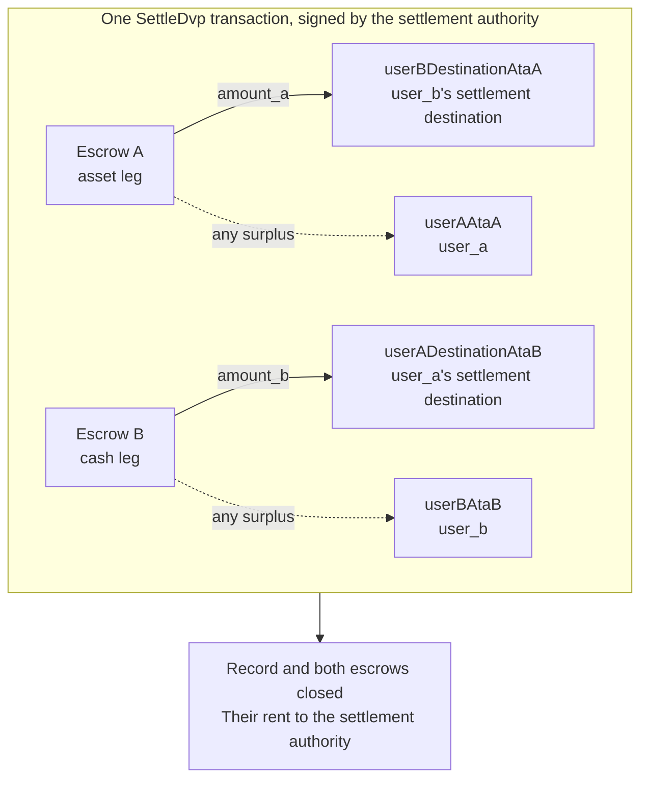

`SettleDvp` lo firma la autoridad de liquidación indicada en el registro de la operación. En
una sola transacción mueve `amount_a` del tramo de activo al destino de la parte
del tramo de efectivo y `amount_b` del tramo de efectivo al destino de la parte del
tramo de activo, devuelve cualquier excedente de cualquiera de los escrows a la parte
correspondiente de ese tramo, y cierra el registro y ambos escrows. Si alguna de esas
transferencias no puede completarse, la instrucción falla y no se mueve nada.

Esta página continúa desde [crear una operación](/docs/defi/dvp-program/create-a-trade)
y [financiar los tramos](/docs/defi/dvp-program/fund-the-legs); el cliente, los firmantes,
`trade` y las token accounts de las partes se mantienen.

## Revalidar antes de firmar

La autoridad de liquidación firma la transacción que mueve ambos tramos, por lo que
realiza la misma lectura que cada parte antes de firmar: propietario, tamaño, partes,
mints, importes, vencimiento y ambos destinos (consulta
[financiar los tramos](/docs/defi/dvp-program/fund-the-legs#verify-the-terms)). El
programa, por su parte, vuelve a comprobar en la liquidación que cada mint sigue perteneciendo al token
program registrado en la creación, que no tiene ninguna extensión bloqueada y que tiene la misma
autoridad de acuñación que cuando se creó la operación, de modo que un mint recreado con una extensión
bloqueada, un token program distinto o una autoridad de acuñación diferente no puede
liquidarse.

## Crear las cuentas de destino

La liquidación escribe en cuatro token accounts que el programa no crea:

| Cuenta                | Recibe                     | Propietario                           |
| ---------------------- | ---------------------------- | ------------------------------- |
| `userADestinationAtaB` | El tramo de efectivo (`amount_b`)    | `user_a_settlement_destination` |
| `userBDestinationAtaA` | El tramo de activo (`amount_a`)   | `user_b_settlement_destination` |
| `userAAtaA`            | Cualquier excedente del tramo de activo | `user_a`                        |
| `userBAtaB`            | Cualquier excedente del tramo de efectivo  | `user_b`                        |

Las cuentas de excedente solo se usan cuando un escrow contiene más que el importe
acordado, pero cualquiera que posea el mint puede crear un excedente enviando unas pocas unidades
base al escrow. Si la cuenta de reembolso no existe, toda la
liquidación falla, así que crea las cuatro de forma idempotente en la misma transacción.

<Tabs items={["TypeScript", "Rust"]}>
  <Tab value="TypeScript">
    ```ts
    import {
      findAssociatedTokenPda,
      getCreateAssociatedTokenIdempotentInstruction,
    } from "@solana-program/token-2022";

    const destinationA = t.userASettlementDestination; // defaults to userA
    const destinationB = t.userBSettlementDestination; // defaults to userB

    const [userADestinationAtaB] = await findAssociatedTokenPda({
      mint: mintB,
      owner: destinationA,
      tokenProgram: tokenProgramB,
    });
    const [userBDestinationAtaA] = await findAssociatedTokenPda({
      mint: mintA,
      owner: destinationB,
      tokenProgram: tokenProgramA,
    });
    // userAAtaA and userBAtaB are from fund the legs.

    const createRecipientAccounts = [
      { ata: userADestinationAtaB, owner: destinationA, mint: mintB, tokenProgram: tokenProgramB },
      { ata: userBDestinationAtaA, owner: destinationB, mint: mintA, tokenProgram: tokenProgramA },
      { ata: userAAtaA, owner: userA, mint: mintA, tokenProgram: tokenProgramA },
      { ata: userBAtaB, owner: userB, mint: mintB, tokenProgram: tokenProgramB },
    ].map(({ ata, owner, mint, tokenProgram }) =>
      getCreateAssociatedTokenIdempotentInstruction({
        payer: authoritySigner,
        ata,
        owner,
        mint,
        tokenProgram,
      }),
    );
    ```

  </Tab>

  <Tab value="Rust">
    ```rust
    use spl_associated_token_account_client::address::get_associated_token_address_with_program_id;
    use spl_associated_token_account_client::instruction::create_associated_token_account_idempotent;

    let authority: Pubkey = pubkey!("SETTLEMENT_AUTHORITY_ADDRESS_HERE");
    let destination_a = trade.user_a_settlement_destination; // defaults to user_a
    let destination_b = trade.user_b_settlement_destination; // defaults to user_b

    let user_a_destination_ata_b =
        get_associated_token_address_with_program_id(&destination_a, &mint_b, &token_program_b);
    let user_b_destination_ata_a =
        get_associated_token_address_with_program_id(&destination_b, &mint_a, &token_program_a);
    let user_a_ata_a = get_associated_token_address_with_program_id(&user_a, &mint_a, &token_program_a);
    let user_b_ata_b = get_associated_token_address_with_program_id(&user_b, &mint_b, &token_program_b);

    let create_recipient_accounts = [
        create_associated_token_account_idempotent(&authority, &destination_a, &mint_b, &token_program_b),
        create_associated_token_account_idempotent(&authority, &destination_b, &mint_a, &token_program_a),
        create_associated_token_account_idempotent(&authority, &user_a, &mint_a, &token_program_a),
        create_associated_token_account_idempotent(&authority, &user_b, &mint_b, &token_program_b),
    ];
    ```

  </Tab>
</Tabs>

## Liquidar

`legAExtrasCount` indica al programa cuántas de las cuentas añadidas después de la
lista fija pertenecen al transfer hook del tramo de activo; el resto corresponden a las del tramo
de efectivo. Para mints sin transfer hooks, pasa cero y no añadas nada. La cuenta del programa
Memo es obligatoria para la instrucción y solo se usa para destinos
que requieren un memo.

<Tabs items={["TypeScript", "Rust"]}>
  <Tab value="TypeScript">
    ```ts
    import { MEMO_PROGRAM_ADDRESS } from "@solana-program/memo";
    import { getSettleDvpInstruction } from "./dvp";

    const settleInstruction = getSettleDvpInstruction({
      settlementAuthority: authoritySigner,
      swapDvp,
      mintA,
      mintB,
      dvpAtaA: escrowA,
      dvpAtaB: escrowB,
      userADestinationAtaB,
      userBDestinationAtaA,
      userAAtaA,
      userBAtaB,
      tokenProgramA,
      tokenProgramB,
      memoProgram: MEMO_PROGRAM_ADDRESS,
      legAExtrasCount: 0,
    });

    const { context: settleContext } = await client.sendTransaction([
      ...createRecipientAccounts,
      settleInstruction,
    ]);
    const settleSignature = settleContext.signature;
    console.log("Submitted:", settleSignature);

    // sendTransaction returns at the client's commitment (confirmed by default).
    // Wait for finalized before recording the trade as settled.
    let finalized = false;
    for (let attempt = 0; attempt < 30 && !finalized; attempt++) {
      const {
        value: [status],
      } = await client.rpc.getSignatureStatuses([settleSignature]).send();
      if (status?.err) {
        throw new Error("Settle transaction failed");
      }
      finalized = status?.confirmationStatus === "finalized";
      if (!finalized) {
        await new Promise((resolve) => setTimeout(resolve, 2_000));
      }
    }
    if (!finalized) {
      // A closed record means it settled; an open one is safe to settle again.
      throw new Error("Settle not finalized after 60s; read the trade record");
    }
    console.log("Settled:", settleSignature);
    ```

  </Tab>

  <Tab value="Rust">
    ```rust
    use dvp_swap_program_client::instructions::SettleDvpBuilder;

    const MEMO_PROGRAM_ID: Pubkey = pubkey!("MemoSq4gqABAXKb96qnH8TysNcWxMyWCqXgDLGmfcHr");

    let settle_ix = SettleDvpBuilder::new()
        .settlement_authority(authority)
        .swap_dvp(swap_dvp)
        .mint_a(mint_a)
        .mint_b(mint_b)
        .dvp_ata_a(escrow_a)
        .dvp_ata_b(escrow_b)
        .user_a_destination_ata_b(user_a_destination_ata_b)
        .user_b_destination_ata_a(user_b_destination_ata_a)
        .user_a_ata_a(user_a_ata_a)
        .user_b_ata_b(user_b_ata_b)
        .token_program_a(token_program_a)
        .token_program_b(token_program_b)
        .memo_program(MEMO_PROGRAM_ID)
        .leg_a_extras_count(0)
        .instruction();
    ```

  </Tab>
</Tabs>



### Transfer hooks

El IDL generado solo enumera las cuentas fijas, por lo que los builders generados
no conocen las cuentas de los hooks. Resuelve los extra account metas de cada mint con hook
del mismo modo que lo harías para una transferencia directa de ese token y luego añádelos a la
instrucción: primero las cuentas del tramo de activo y después las del tramo de efectivo, con
`legAExtrasCount` establecido en el número del primer grupo. En TypeScript, expande
los metas resueltos en el array `accounts` de la instrucción; en Rust, usa
`add_remaining_accounts` en el builder. El límite es de 32 cuentas por tramo,
incluidos el programa del hook y la cuenta de validación; el límite de cuentas de la transacción
puede alcanzarse antes cuando ambos tramos tienen hooks. El programa elimina el indicador de firmante
de cada cuenta reenviada, de modo que un hook no puede obtener la firma de la
autoridad de liquidación por esta vía.

## Registrar el resultado

Considera la operación liquidada cuando la transacción de liquidación alcance `finalized`. El
registro y ambos escrows dejan de existir tras la liquidación, por lo que un sistema que necesite
las condiciones más adelante las almacena a partir de su lectura previa a la liquidación o de la
transacción de creación. El rent de las cuentas cerradas ha ido a la autoridad
de liquidación.

## Errores de liquidación

`LegNotFunded` significa que un escrow contiene menos que su importe acordado; `DvpExpired`
y `SettlementTooEarly` significan que se perdió la ventana de tiempo; `MintAuthorityChanged`
y `BlockedMintExtension` significan que un mint cambió después de la creación;
`RecipientAtaMismatch` significa que falta una token account de destino o de reembolso, o que
ya no pertenece al propietario y al mint esperados, normalmente porque se omitió el
paso de creación de cuentas anterior. En todos los casos no se ha movido nada, y las
partes pueden deshacer la operación, sujetas a las autoridades del mint (consulta
[deshacer una operación](/docs/defi/dvp-program/unwind-a-trade)).

## Siguientes pasos

- [Deshacer una operación](/docs/defi/dvp-program/unwind-a-trade): recuperar los tramos
  financiados cuando una operación no se liquida
