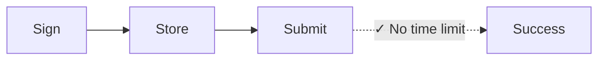
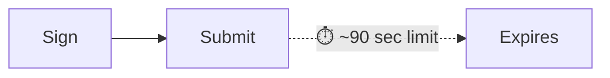

Cada transacción de Solana incluye un blockhash reciente, una referencia a un
estado reciente de la red que demuestra que la transacción se creó "ahora". La
red rechaza cualquier transacción con un blockhash anterior a ~150 bloques
(~60-90 segundos), previniendo ataques de repetición y envíos obsoletos. Esto
funciona perfectamente para pagos en tiempo real. Pero rompe los flujos de
trabajo que necesitan un intervalo entre la firma y el envío, tales como:

| Escenario                        | Por qué fallan las transacciones estándar                                            |
| -------------------------------- | ------------------------------------------------------------------------------------ |
| **Operaciones de tesorería**     | El CFO en Tokio firma, el controlador en NYC aprueba: 90 segundos no son suficientes |
| **Flujos de cumplimiento**       | Las transacciones necesitan revisión legal/de cumplimiento antes de la ejecución     |
| **Firma en almacenamiento frío** | Las máquinas aisladas requieren transferencia manual de transacciones firmadas       |
| **Preparación por lotes**        | Preparar nómina o desembolsos en horario laboral, ejecutar durante la noche          |
| **Coordinación multi-firma**     | Múltiples aprobadores en diferentes zonas horarias                                   |
| **Pagos programados**            | Programar pagos para ejecutarse en una fecha futura                                  |

En las finanzas tradicionales, un cheque firmado no expira en 90 segundos.
Ciertas operaciones de blockchain tampoco deberían hacerlo. Los **nonces
duraderos** resuelven esto reemplazando el blockhash reciente con un valor
almacenado y persistente que solo avanza cuando lo usas, dándote transacciones
que permanecen válidas hasta que estés listo para enviarlas.

## Cómo funciona

En lugar de un blockhash reciente (válido ~150 bloques), usas una **cuenta
nonce**, una cuenta especial que almacena un valor _único_ que puede usarse en
lugar de un blockhash. Cada transacción que use este nonce debe "avanzarlo" como
primera instrucción. Cada valor de nonce solo puede usarse para una transacción.





<Callout type="info">
  La cuenta nonce cuesta ~0.0015 SOL para exención de rent. Una cuenta nonce =
  una transacción pendiente a la vez. Para flujos de trabajo paralelos, crea
  múltiples cuentas nonce.
</Callout>

### Crear una cuenta nonce

Crear una cuenta nonce requiere dos instrucciones en una sola transacción:

1. **Crear la cuenta** usando `getCreateAccountInstruction` del System Program
2. **Inicializarla como nonce** usando `getInitializeNonceAccountInstruction`

<ScrollyCoding>

## !!steps Generar keypair

Genera un nuevo keypair para usar como dirección de la cuenta nonce y calcula el
espacio requerido y el rent.

<CodePlaceholder title="Create Nonce Account" />

```ts !! title="Create Nonce Account"
const nonceKeypair = await generateKeyPairSigner();
const nonceSpace = BigInt(getNonceSize());
const nonceRent = await rpc
  .getMinimumBalanceForRentExemption(nonceSpace)
  .send();
```

## !!steps Instrucción de crear cuenta

Crea la cuenta propiedad del System Program con suficientes lamports para la
exención de rent.

<CodePlaceholder title="Create Nonce Account" />

```ts !! title="Create Nonce Account"
const nonceKeypair = await generateKeyPairSigner();
const nonceSpace = BigInt(getNonceSize());
const nonceRent = await rpc
  .getMinimumBalanceForRentExemption(nonceSpace)
  .send();

// !focus(1:7)
const createNonceAccountIx = getCreateAccountInstruction({
  payer: sender,
  newAccount: nonceKeypair,
  lamports: nonceRent,
  space: nonceSpace,
  programAddress: SYSTEM_PROGRAM_ADDRESS
});
```

## !!steps Instrucción de inicializar nonce

Inicializa la cuenta como cuenta nonce, estableciendo la autoridad que puede
avanzarla.

<CodePlaceholder title="Create Nonce Account" />

```ts !! title="Create Nonce Account"
const nonceKeypair = await generateKeyPairSigner();
const nonceSpace = BigInt(getNonceSize());
const nonceRent = await rpc
  .getMinimumBalanceForRentExemption(nonceSpace)
  .send();

const createNonceAccountIx = getCreateAccountInstruction({
  payer: sender,
  newAccount: nonceKeypair,
  lamports: nonceRent,
  space: nonceSpace,
  programAddress: SYSTEM_PROGRAM_ADDRESS
});

// !focus(1:4)
const initNonceIx = getInitializeNonceAccountInstruction({
  nonceAccount: nonceKeypair.address,
  nonceAuthority: sender.address
});
```

## !!steps Construir transacción

Construye una transacción con ambas instrucciones.

<CodePlaceholder title="Create Nonce Account" />

```ts !! title="Create Nonce Account"
const nonceKeypair = await generateKeyPairSigner();
const nonceSpace = BigInt(getNonceSize());
const nonceRent = await rpc
  .getMinimumBalanceForRentExemption(nonceSpace)
  .send();

const createNonceAccountIx = getCreateAccountInstruction({
  payer: sender,
  newAccount: nonceKeypair,
  lamports: nonceRent,
  space: nonceSpace,
  programAddress: SYSTEM_PROGRAM_ADDRESS
});

const initNonceIx = getInitializeNonceAccountInstruction({
  nonceAccount: nonceKeypair.address,
  nonceAuthority: sender.address
});

// !focus(1:7)
const { value: blockhash } = await rpc.getLatestBlockhash().send();
const createNonceTx = pipe(
  createTransactionMessage({ version: 0 }),
  (tx) => setTransactionMessageFeePayerSigner(sender, tx),
  (tx) => setTransactionMessageLifetimeUsingBlockhash(blockhash, tx),
  (tx) =>
    appendTransactionMessageInstructions(
      [createNonceAccountIx, initNonceIx],
      tx
    )
);
```

## !!steps Firmar y enviar

Firma y envía la transacción para crear e inicializar la cuenta nonce.

<CodePlaceholder title="Crear cuenta nonce" />

```ts !! title="Create Nonce Account"
const nonceKeypair = await generateKeyPairSigner();
const nonceSpace = BigInt(getNonceSize());
const nonceRent = await rpc
  .getMinimumBalanceForRentExemption(nonceSpace)
  .send();

const createNonceAccountIx = getCreateAccountInstruction({
  payer: sender,
  newAccount: nonceKeypair,
  lamports: nonceRent,
  space: nonceSpace,
  programAddress: SYSTEM_PROGRAM_ADDRESS
});

const initNonceIx = getInitializeNonceAccountInstruction({
  nonceAccount: nonceKeypair.address,
  nonceAuthority: sender.address
});

const { value: blockhash } = await rpc.getLatestBlockhash().send();
const createNonceTx = pipe(
  createTransactionMessage({ version: 0 }),
  (tx) => setTransactionMessageFeePayerSigner(sender, tx),
  (tx) => setTransactionMessageLifetimeUsingBlockhash(blockhash, tx),
  (tx) =>
    appendTransactionMessageInstructions(
      [createNonceAccountIx, initNonceIx],
      tx
    )
);

// !focus(1:6)
const signedCreateNonceTx =
  await signTransactionMessageWithSigners(createNonceTx);

await sendAndConfirmTransactionFactory({ rpc, rpcSubscriptions })(
  signedCreateNonceTx,
  { commitment: "confirmed" }
);
```

</ScrollyCoding>

### Construir una transacción diferida

En lugar de un blockhash reciente, usa el `blockhash` de la cuenta nonce como
tiempo de vida de la transacción.

<ScrollyCoding>

## !!steps Obtener el nonce

Obtén los datos de la cuenta nonce. Usa el `blockhash` de la cuenta nonce como
tiempo de vida de la transacción.

```sh title="Example Nonce Account Data"
{
  version: 1,
  state: 1,
  authority: 'HgjaL8artMtmntaQDVM2UBk3gppsYYERS4PkUhiaLZD1',
  # !mark
  blockhash: '5U7seXqfgZx1uh5DFhdH1vyBhr7XGRrKxBAnJJTbbUa',
  lamportsPerSignature: 5000n
}
```

<CodePlaceholder title="Construir transacción diferida" />

```ts !! title="Build Deferred Transaction"
// !focus(1:1)
const { data: nonceData } = await fetchNonce(rpc, nonceKeypair.address);
```

## !!steps Crear instrucción de transferencia

Crea la instrucción para tu pago. Este ejemplo muestra una transferencia de
tokens.

<CodePlaceholder title="Construir transacción diferida" />

```ts !! title="Build Deferred Transaction"
const { data: nonceData } = await fetchNonce(rpc, nonceKeypair.address);

// !focus(1:6)
const transferInstruction = getTransferInstruction({
  source: senderAta,
  destination: recipientAta,
  authority: sender.address,
  amount: 250_000n
});
```

## !!steps Construir transacción con nonce duradero

Usa `setTransactionMessageLifetimeUsingDurableNonce` que establece el nonce como
blockhash y antepone automáticamente la instrucción de avance del nonce.

<CodePlaceholder title="Construir transacción diferida" />

```ts !! title="Build Deferred Transaction"
const { data: nonceData } = await fetchNonce(rpc, nonceKeypair.address);

const transferInstruction = getTransferInstruction({
  source: senderAta,
  destination: recipientAta,
  authority: sender.address,
  amount: 250_000n
});

// !focus(1:14)
const transactionMessage = pipe(
  createTransactionMessage({ version: 0 }),
  (tx) => setTransactionMessageFeePayerSigner(sender, tx),
  (tx) =>
    // !mark(1:8)
    setTransactionMessageLifetimeUsingDurableNonce(
      {
        nonce: nonceData.blockhash as Nonce,
        nonceAccountAddress: nonceKeypair.address,
        nonceAuthorityAddress: nonceData.authority
      },
      tx
    ),
  (tx) => appendTransactionMessageInstructions([transferInstruction], tx)
);
```

## !!steps Firmar transacción

Firma la transacción. Ahora usa el nonce duradero en lugar de un blockhash
estándar.

<CodePlaceholder title="Construir transacción diferida" />

```ts !! title="Build Deferred Transaction"
const { data: nonceData } = await fetchNonce(rpc, nonceKeypair.address);

const transferInstruction = getTransferInstruction({
  source: senderAta,
  destination: recipientAta,
  authority: sender.address,
  amount: 250_000n
});

const transactionMessage = pipe(
  createTransactionMessage({ version: 0 }),
  (tx) => setTransactionMessageFeePayerSigner(sender, tx),
  (tx) =>
    setTransactionMessageLifetimeUsingDurableNonce(
      {
        nonce: nonceData.blockhash as Nonce,
        nonceAccountAddress: nonceKeypair.address,
        nonceAuthorityAddress: nonceData.authority
      },
      tx
    ),
  (tx) => appendTransactionMessageInstructions([transferInstruction], tx)
);

// !focus(1:2)
const signedTransaction =
  await signTransactionMessageWithSigners(transactionMessage);
```

</ScrollyCoding>

### Almacenar o enviar transacción

Después de firmar, codifica la transacción para almacenarla. Cuando esté lista,
envíala a la red.

<ScrollyCoding>

## !!steps Codificar para almacenamiento

Codifica la transacción firmada a base64. Almacena este valor en tu base de
datos.

<CodePlaceholder title="Almacenar y ejecutar" />

```ts !! title="Store and Execute"
const signedTransaction =
  await signTransactionMessageWithSigners(transactionMessage);

// !focus(1:2)
const base64EncodedTransaction =
  getBase64EncodedWireTransaction(signedTransaction);

// Store base64EncodedTransaction in your database
```

## !!steps Enviar transacción

Envía la transacción firmada cuando esté lista. La transacción permanece válida
hasta que el nonce sea avanzado.

<CodePlaceholder title="Almacenar y ejecutar" />

```ts !! title="Store and Execute"
const signedTransaction =
  await signTransactionMessageWithSigners(transactionMessage);

const base64EncodedTransaction =
  getBase64EncodedWireTransaction(signedTransaction);

// When ready to execute (could be days later):
// !focus(1:3)
await rpc
  .sendTransaction(base64EncodedTransaction, { encoding: "base64" })
  .send();
```

</ScrollyCoding>

### Demo

<CodeTabs flags="r">

```ts !! title="Demo"
// !collapse(1:39) collapsed
// Click ">" icon on left to expand demo imports
import {
  airdropFactory,
  appendTransactionMessageInstructions,
  assertIsTransactionWithBlockhashLifetime,
  assertIsTransactionWithDurableNonceLifetime,
  createSolanaRpc,
  createSolanaRpcSubscriptions,
  createTransactionMessage,
  generateKeyPairSigner,
  getSignatureFromTransaction,
  lamports,
  type Nonce,
  pipe,
  sendAndConfirmTransactionFactory,
  setTransactionMessageFeePayerSigner,
  setTransactionMessageLifetimeUsingBlockhash,
  setTransactionMessageLifetimeUsingDurableNonce,
  signTransactionMessageWithSigners,
  type KeyPairSigner,
  getBase64EncodedWireTransaction
} from "@solana/kit";
import {
  fetchNonce,
  getCreateAccountInstruction,
  getInitializeNonceAccountInstruction,
  getNonceSize,
  SYSTEM_PROGRAM_ADDRESS
} from "@solana-program/system";
import {
  getCreateAssociatedTokenInstructionAsync,
  getInitializeMintInstruction,
  getMintSize,
  TOKEN_2022_PROGRAM_ADDRESS,
  findAssociatedTokenPda,
  getMintToInstruction,
  getTransferInstruction
} from "@solana-program/token-2022";

// Generate keypairs for sender and recipient
const sender = await generateKeyPairSigner();
const recipient = await generateKeyPairSigner();

console.log("Sender Address:", sender.address);
console.log("Recipient Address:", recipient.address);

// Demo Setup: Create RPC connection, mint, and token accounts
const { rpc, rpcSubscriptions, mint } = await demoSetup(sender, recipient);

// =============================================================================
// Step 1: Create a Nonce Account
// =============================================================================

// !mark
const nonceKeypair = await generateKeyPairSigner();
console.log("\nNonce Account Address:", nonceKeypair.address);

// !mark(1:4)
const nonceSpace = BigInt(getNonceSize());
const nonceRent = await rpc
  .getMinimumBalanceForRentExemption(nonceSpace)
  .send();

// Instruction to create new account for the nonce
// !mark(1:7)
const createNonceAccountIx = getCreateAccountInstruction({
  payer: sender,
  newAccount: nonceKeypair,
  lamports: nonceRent,
  space: nonceSpace,
  programAddress: SYSTEM_PROGRAM_ADDRESS
});

// Instruction to initialize the nonce account
// !mark(1:4)
const initNonceIx = getInitializeNonceAccountInstruction({
  nonceAccount: nonceKeypair.address,
  nonceAuthority: sender.address
});

// Build and send nonce account creation transaction
const { value: blockhash } = await rpc.getLatestBlockhash().send();
const createNonceTx = pipe(
  createTransactionMessage({ version: 0 }),
  (tx) => setTransactionMessageFeePayerSigner(sender, tx),
  (tx) => setTransactionMessageLifetimeUsingBlockhash(blockhash, tx),
  (tx) =>
    appendTransactionMessageInstructions(
      [createNonceAccountIx, initNonceIx],
      tx
    )
);

const signedCreateNonceTx =
  await signTransactionMessageWithSigners(createNonceTx);
assertIsTransactionWithBlockhashLifetime(signedCreateNonceTx);

await sendAndConfirmTransactionFactory({ rpc, rpcSubscriptions })(
  signedCreateNonceTx,
  { commitment: "confirmed" }
);

console.log("Nonce Account created.");

// =============================================================================
// Step 2: Token Payment with Durable Nonce
// =============================================================================

// Fetch current nonce value from the nonce account
// !mark
const { data: nonceData } = await fetchNonce(rpc, nonceKeypair.address);
console.log("Nonce Account data:", nonceData);

const [senderAta] = await findAssociatedTokenPda({
  mint: mint.address,
  owner: sender.address,
  tokenProgram: TOKEN_2022_PROGRAM_ADDRESS
});

const [recipientAta] = await findAssociatedTokenPda({
  mint: mint.address,
  owner: recipient.address,
  tokenProgram: TOKEN_2022_PROGRAM_ADDRESS
});

console.log("\nMint Address:", mint.address);
console.log("Sender Token Account:", senderAta);
console.log("Recipient Token Account:", recipientAta);

const transferInstruction = getTransferInstruction({
  source: senderAta,
  destination: recipientAta,
  authority: sender.address,
  amount: 250_000n // 0.25 tokens
});

// Create transaction message using durable nonce lifetime
// setTransactionMessageLifetimeUsingDurableNonce automatically prepends
// the AdvanceNonceAccount instruction
const transactionMessage = pipe(
  createTransactionMessage({ version: 0 }),
  (tx) => setTransactionMessageFeePayerSigner(sender, tx),
  (tx) =>
    // !mark(1:8)
    setTransactionMessageLifetimeUsingDurableNonce(
      {
        nonce: nonceData.blockhash as string as Nonce,
        nonceAccountAddress: nonceKeypair.address,
        nonceAuthorityAddress: nonceData.authority
      },
      tx
    ),
  (tx) => appendTransactionMessageInstructions([transferInstruction], tx)
);

const signedTransaction =
  await signTransactionMessageWithSigners(transactionMessage);
assertIsTransactionWithDurableNonceLifetime(signedTransaction);
const transactionSignature = getSignatureFromTransaction(signedTransaction);

// Encode the transaction to base64, optionally save and send at a later time
// !mark(1:2)
const base64EncodedTransaction =
  getBase64EncodedWireTransaction(signedTransaction);
console.log("\nBase64 Encoded Transaction:", base64EncodedTransaction);

// Send the encoded transaction, blockhash does not expire
// !mark(1:6)
await rpc
  .sendTransaction(base64EncodedTransaction, {
    encoding: "base64",
    skipPreflight: true
  })
  .send();

console.log("\n=== Token Payment with Durable Nonce Complete ===");
console.log("Transaction Signature:", transactionSignature);

// =============================================================================
// Demo Setup Helper Function
// =============================================================================
// !collapse(1:1000) collapsed

/**
 * Sets up for a token transfer demo:
 * - Creates RPC connection
 * - Airdrops SOL to sender for transaction fees
 * - Generates mint keypair and creates/initializes mint account
 * - Creates associated token accounts for sender and recipient
 * - Mints initial tokens to sender
 *
 * @param sender - The sender's keypair (will be funded and used as mint authority)
 * @param recipient - The recipient's keypair
 * @returns RPC connection and mint address
 */
async function demoSetup(sender: KeyPairSigner, recipient: KeyPairSigner) {
  const rpc = createSolanaRpc("http://localhost:8899");
  const rpcSubscriptions = createSolanaRpcSubscriptions("ws://localhost:8900");

  // Fund sender with SOL for transaction fees
  await airdropFactory({ rpc, rpcSubscriptions })({
    recipientAddress: sender.address,
    lamports: lamports(1_000_000_000n),
    commitment: "confirmed"
  });

  // Create Mint and Token Accounts
  const mint = await generateKeyPairSigner();

  const mintSpace = BigInt(getMintSize());
  const mintRent = await rpc
    .getMinimumBalanceForRentExemption(mintSpace)
    .send();

  const createMintAccountIx = getCreateAccountInstruction({
    payer: sender,
    newAccount: mint,
    lamports: mintRent,
    space: mintSpace,
    programAddress: TOKEN_2022_PROGRAM_ADDRESS
  });

  const initializeMintIx = getInitializeMintInstruction({
    mint: mint.address,
    decimals: 6,
    mintAuthority: sender.address
  });

  const [senderAta] = await findAssociatedTokenPda({
    mint: mint.address,
    owner: sender.address,
    tokenProgram: TOKEN_2022_PROGRAM_ADDRESS
  });

  const createSenderAtaIx = await getCreateAssociatedTokenInstructionAsync({
    payer: sender,
    mint: mint.address,
    owner: sender.address
  });

  const createRecipientAtaIx = await getCreateAssociatedTokenInstructionAsync({
    payer: sender,
    mint: mint.address,
    owner: recipient.address
  });

  const mintToIx = getMintToInstruction({
    mint: mint.address,
    token: senderAta,
    mintAuthority: sender.address,
    amount: 1_000_000n // Mint 1.00 tokens (1,000,000 base units with 6 decimals)
  });

  const { value: latestBlockhash } = await rpc.getLatestBlockhash().send();

  const instructions = [
    createMintAccountIx,
    initializeMintIx,
    createSenderAtaIx,
    createRecipientAtaIx,
    mintToIx
  ];

  const transactionMessage = pipe(
    createTransactionMessage({ version: 0 }),
    (tx) => setTransactionMessageFeePayerSigner(sender, tx),
    (tx) => setTransactionMessageLifetimeUsingBlockhash(latestBlockhash, tx),
    (tx) => appendTransactionMessageInstructions(instructions, tx)
  );

  const signedTransaction =
    await signTransactionMessageWithSigners(transactionMessage);

  assertIsTransactionWithBlockhashLifetime(signedTransaction);

  await sendAndConfirmTransactionFactory({ rpc, rpcSubscriptions })(
    signedTransaction,
    { commitment: "confirmed" }
  );

  return { rpc, rpcSubscriptions, mint };
}
```

</CodeTabs>

## Invalidar una transacción pendiente

Cada cuenta nonce `blockhash` solo puede usarse una vez. Para invalidar una
transacción pendiente o preparar la cuenta nonce para reutilizarla, avánzala
manualmente:

```ts
import { getAdvanceNonceAccountInstruction } from "@solana-program/system";

// Submit this instruction (with a regular blockhash) to invalidate any pending transaction
getAdvanceNonceAccountInstruction({
  nonceAccount: nonceAddress,
  nonceAuthority
});
```

Esto genera un nuevo valor de nonce, haciendo que cualquier transacción firmada
con el valor antiguo sea permanentemente inválida.

## Flujo de trabajo de aprobación multipartita

Deserializa la transacción para agregar firmas adicionales, luego serializa
nuevamente para almacenarla o enviarla:

```ts
import {
  getBase64Decoder,
  getTransactionDecoder,
  getBase64EncodedWireTransaction,
  partiallySignTransaction
} from "@solana/kit";

// Deserialize the stored transaction
const txBytes = getBase64Decoder().decode(serializedString);
const partiallySignedTx = getTransactionDecoder().decode(txBytes);

// Each approver adds their signature
const fullySignedTx = await partiallySignTransaction(
  [newSigner],
  partiallySignedTx
);

// Serialize again for storage or submission
const serialized = getBase64EncodedWireTransaction(fullySignedTx);
```

La transacción puede ser serializada, almacenada y pasada entre aprobadores. Una
vez que se recopilen todas las firmas requeridas, envíala a la red.

## Consideraciones de producción

**Gestión de cuentas nonce:**

- Crear un grupo de cuentas nonce para la preparación paralela de transacciones
- Rastrear qué nonces están "en uso" (tienen transacciones firmadas pendientes)
- Implementar el reciclaje de nonces después de que las transacciones se envíen
  o abandonen

**Seguridad:**

- La autoridad del nonce controla si las transacciones pueden invalidarse.
  Considera separar la autoridad del nonce de los firmantes de transacciones
  para un control adicional y separación de funciones
- _Cualquiera_ con los bytes de transacción serializados puede enviarla a la red

## Recursos relacionados

- [Introducción a los nonces duraderos](https://solana.com/developers/guides/advanced/introduction-to-durable-nonces)
