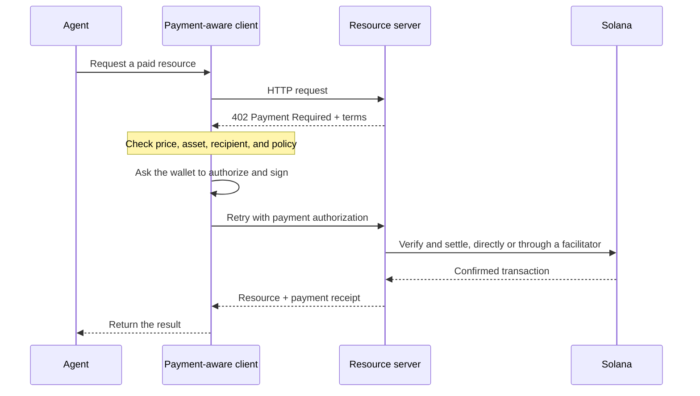

Los pagos agénticos permiten que el software descubra un precio, autorice un pago y reciba
un recurso en el mismo flujo de trabajo HTTP. Un agente puede pagar por una consulta de datos, una inferencia
de modelo o una llamada a una herramienta sin tener que crear antes una cuenta de facturación ni copiar una
clave de API.

<Cards>
  <Card title="MPP" href="/docs/payments/agentic-payments/mpp">
    Usa la autenticación HTTP para cobros únicos y sesiones de pago medidas.
  </Card>
  <Card title="x402" href="/docs/payments/agentic-payments/x402">
    Añade a un recurso HTTP los requisitos de pago, las firmas y la liquidación de x402 V2.
  </Card>
</Cards>

## El flujo de pago común

MPP y x402 usan encabezados y modelos de datos distintos, pero su flujo HTTP básico es
similar:

## MPP y x402

Ambos protocolos pueden liquidar pagos con stablecoins en Solana. Elige según el
modelo de pago y la interoperabilidad que necesite tu servicio, y no solo por el código de
estado `402` que comparten.

|                         | MPP                                                               | x402                                                                     |
| ----------------------- | ----------------------------------------------------------------- | ------------------------------------------------------------------------ |
| Desafío               | `WWW-Authenticate: Payment`                                       | `PAYMENT-REQUIRED`                                                       |
| Autorización del cliente    | `Authorization: Payment`                                          | `PAYMENT-SIGNATURE`                                                      |
| Recibo                 | `Payment-Receipt`                                                 | `PAYMENT-RESPONSE`                                                       |
| Modelos de pago en Solana   | Intenciones `charge` (cobro único) y `session` (sesión medida con límite)           | Esquemas como `exact` y `upto`; la compatibilidad varía según la red y el cliente |
| Arquitectura de liquidación | Validación en el servidor, o un relay o gateway opcional                | Servidor de recursos con verificación local o un facilitator                 |
| Buen punto de partida     | APIs que necesitan semántica de autenticación HTTP o medición repetida | Recursos de pago por solicitud y clientes x402 existentes                      |

MPP es el **Machine Payments Protocol**. No lo confundas con el **Model
Context Protocol (MCP)**. MCP expone herramientas y recursos a los agentes; MPP o x402
pueden exigir un pago cuando un agente invoca alguna de esas herramientas.

<Callout type="info">
  Un servicio puede anunciar más de un protocolo. El cliente selecciona una opción de pago
  compatible y luego usa los encabezados de desafío, autorización y
  recibo correspondientes durante todo el intercambio.
</Callout>
