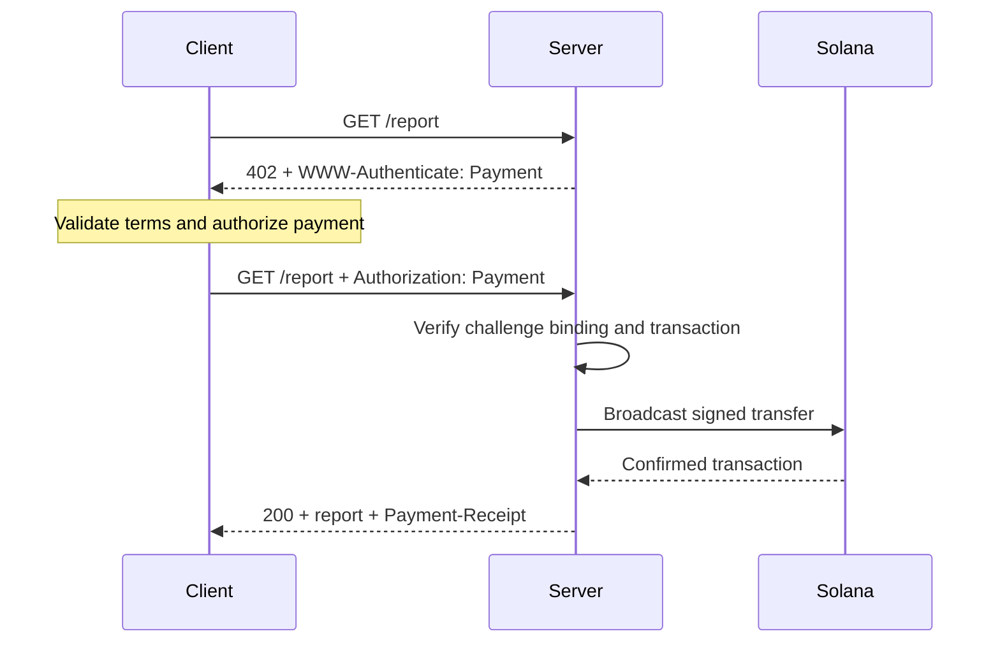
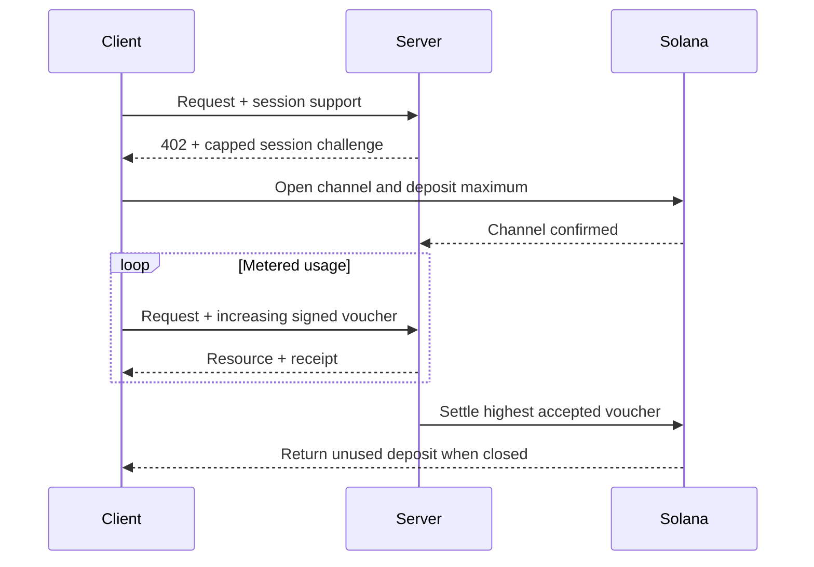

El [Machine Payments Protocol (MPP)](https://mpp.dev/) aplica la semántica de autenticación HTTP a los pagos. Un servidor plantea un desafío ante una solicitud sin pagar, un cliente devuelve una credencial de pago y el servidor devuelve un recibo después de aceptar el pago.

MPP separa tres aspectos:

- Una **intención** describe la interacción comercial, como un `charge` único o una `session` medida.
- Un **método de pago** describe cómo se mueve el valor. El método de Solana admite SOL nativo y tokens SPL para los cobros.
- Un **transporte** HTTP transmite desafíos, credenciales, recibos y errores.

MPP se publica como un conjunto de Internet-Drafts. Considera las [especificaciones actuales](https://paymentauth.org/) como la fuente de verdad y espera que los detalles evolucionen mientras los borradores sigan en desarrollo.

## Intercambio HTTP

MPP usa campos estándar de autenticación HTTP en lugar de encabezados de pago específicos del protocolo:

| Mensaje                 | Representación HTTP                                         |
| ----------------------- | ----------------------------------------------------------- |
| Desafío de pago       | `402 Payment Required` con `WWW-Authenticate: Payment ...` |
| Credencial de pago      | Solicitud reintentada con `Authorization: Payment ...`           |
| Recibo exitoso      | Respuesta del recurso con `Payment-Receipt: ...`               |
| Detalles de pago no válidos | Cuerpo de Problem Details con `application/problem+json`       |



Un desafío incluye un ID generado por el servidor, realm, método, intención, solicitud de pago codificada y vencimiento. La credencial repite el desafío y añade la prueba de pago específica del método. El servidor debe verificar ambas partes; una transferencia válida que pertenezca a un desafío distinto no debe desbloquear el recurso.

## Cobros únicos en Solana

La intención `charge` de Solana admite dos tipos de credencial:

- El **modo pull** usa una transacción firmada. El cliente firma la transferencia y envía la transacción al servidor. El servidor la verifica, opcionalmente añade una firma del pagador de comisiones, la transmite, la confirma y devuelve la firma de la transacción en su recibo.
- El **modo push** usa una firma de transacción. El cliente transmite primero y después envía la firma confirmada al servidor. El servidor obtiene y verifica la transacción antes de devolver el recurso.

El modo pull permite que el servidor patrocine las comisiones de transacción y aplique lógica de reintento en el servidor. El modo push es útil cuando una billetera requiere que el cliente envíe su propia transacción, pero no puede aprovechar el patrocinio de comisiones del servidor.

Para conocer los campos normativos y las reglas de verificación, consulta la [especificación de cobros de Solana](https://paymentauth.org/draft-solana-charge-00.html).

## Añadir un cobro MPP a una API de Express

Solana Pay Kit ofrece una integración actual en TypeScript para MPP y x402. Instálalo junto con Express:

```bash
pnpm add @solana/pay-kit @solana/kit@^6.9.0 express
pnpm add --save-dev @types/express tsx
```

Este ejemplo mínimo usa el sandbox alojado de Surfpool y el destinatario de demostración público del paquete. Es solo para desarrollo local:

```ts filename=server.ts
import express from "express";
import { createPayKit, usd } from "@solana/pay-kit";

const pay = await createPayKit({
  accept: ["mpp"],
  rpcUrl: "https://402.surfnet.dev:8899"
});

const app = express();

app.get("/report", pay.express(usd("0.01")), (_req, res) => {
  res.json({ report: "Paid report" });
});

app.listen(4567, () => {
  console.log("Paid API listening on http://127.0.0.1:4567");
});
```

Ejecútalo y compara una solicitud sin pago con una solicitud preparada para pagos:

```bash
pnpm tsx server.ts
curl -i http://127.0.0.1:4567/report
pay --sandbox curl http://127.0.0.1:4567/report
```

El controlador de la ruta se ejecuta solo después de que el middleware acepta el pago.

<Callout type="warn" title="Sustituye todos los valores predeterminados del sandbox en producción">
  Configura una red explícita, el destinatario del comercio, un RPC dedicado, un secreto estable de vinculación de desafíos, un firmante de producción y un almacén duradero contra repeticiones. Nunca dirijas pagos reales a un firmante de demostración de un paquete.
</Callout>

## Sesiones medidas

Usa una `session` de Solana MPP cuando un cliente vaya a realizar muchos pagos pequeños y relacionados. Una sesión abre un canal de pago onchain con un depósito máximo y luego usa vouchers firmados acumulativos a medida que crece el uso. El servidor puede verificar los vouchers offchain y liquidar más tarde el importe más alto aceptado.

Esto es útil para inferencia medida por tokens, descargas medidas por bytes, datos en vivo y llamadas repetidas a herramientas. No equivale a enviar un pago onchain independiente por cada evento.



Llama a una sesión **pago por sesión**, **canal de pago** o **autorización repetida con límite**. Llámala pago en streaming solo cuando el servicio y el contrato de pago realmente midan un flujo de uso.

## Verificación en producción

Para cada cobro en Solana, el servidor debe verificar como mínimo:

- Que el desafío es auténtico, no ha caducado, está vinculado a esta solicitud y está destinado a este realm.
- Que la transacción usa la red, el activo o mint, el destinatario, el importe y el token program esperados.
- Que las instrucciones de pagador de comisiones o de associated token account estén permitidas de forma explícita y no puedan vaciar al firmante del servidor.
- Que la transacción se completó con el nivel de commitment requerido.
- Que la firma de la transacción no se haya consumido ya.
- Que la comprobación de repetición y la operación de consumo sean atómicas en todas las instancias del servidor.

Para las sesiones, conserva además el estado del canal, el importe acumulado aceptado y la marca de liquidación en un almacén compartido. Documenta cómo recuperan los clientes los fondos no utilizados si el servidor deja de estar disponible.

## Recursos relacionados

- [Especificaciones de MPP](https://paymentauth.org/)
- [Documentación del protocolo MPP](https://mpp.dev/protocol)
- [Solana Pay Kit](https://github.com/solana-foundation/pay-kit)
- [Descripción general de los pagos agénticos](/docs/payments/agentic-payments)
- [Preparación para producción](/docs/tools/production-readiness)
