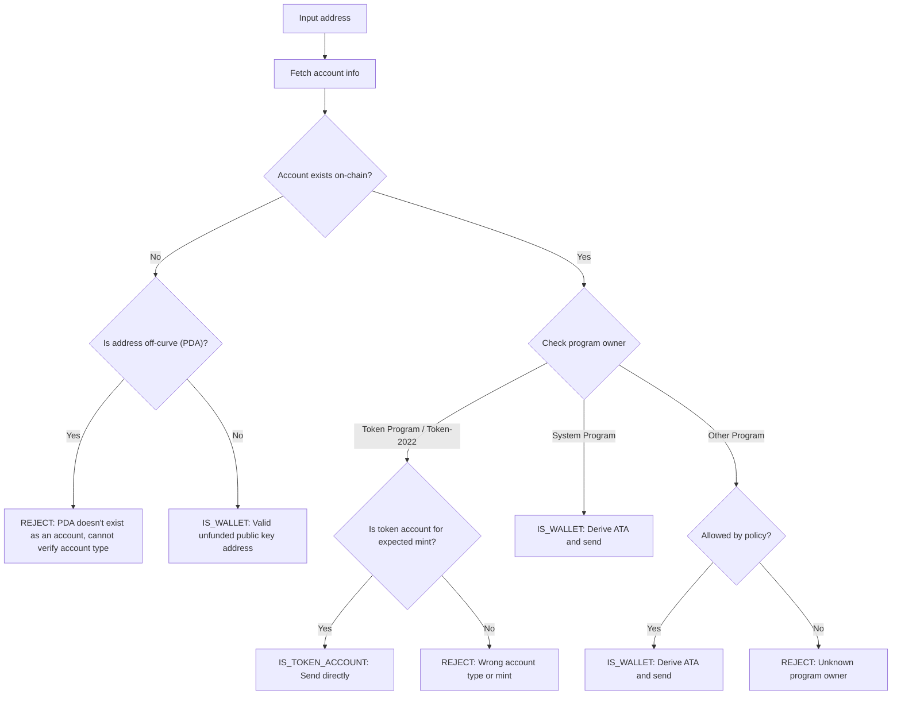

Enviar tokens a la dirección incorrecta puede resultar en la pérdida permanente
de fondos. La verificación de direcciones garantiza que solo envíes tokens a
direcciones que puedan recibirlos y acceder a ellos correctamente.

<Callout>
  Consulta [Cómo funcionan los pagos en
  Solana](/docs/payments/how-payments-work) para conocer los conceptos básicos
  de pagos.
</Callout>

## Comprender las direcciones de Solana

Las cuentas de Solana tienen dos tipos de direcciones: en curva y fuera de
curva.

### Direcciones en curva

Las direcciones estándar son las claves públicas de pares de claves Ed25519.
Estas direcciones:

- Tienen una clave privada correspondiente que puede firmar transacciones
- Se utilizan como direcciones de billetera

### Direcciones fuera de curva (PDA)

Las [direcciones derivadas de programa](/docs/core/pda) se derivan de forma
determinista a partir de un ID de programa y semillas. Estas direcciones:

- **No** tienen una clave privada correspondiente
- Solo pueden ser firmadas por el programa del cual se derivó la dirección

## Tipos de cuenta en pagos

Utiliza la dirección para obtener una [cuenta](/docs/core/accounts) de la red,
verifica su propietario de programa y tipo de cuenta para determinar cómo
manejar la dirección.

<Callout>
  Saber si una dirección está en curva o fuera de curva no te indica qué tipo de
  cuenta es, qué programa la posee o si existe una cuenta en esa dirección.
  Debes obtener la cuenta de la red para determinar estos detalles.
</Callout>

### Cuentas del System Program (billeteras)

Las cuentas propiedad del System Program son billeteras estándar. Para enviar
tokens SPL a una billetera, debes derivar y usar su
[cuenta de token asociada (ATA)](/docs/tokens/basics/create-token-account#whats-an-associated-token-account).

Después de derivar la dirección ATA, verifica si la token account existe en
cadena. Si la ATA no existe, puedes incluir una instrucción para crear la token
account del destinatario en la misma transacción que la transferencia. Sin
embargo, esto requiere pagar rent por la nueva token account. Dado que el
destinatario posee la ATA, el SOL pagado por el rent no puede ser recuperado por
el remitente.

<Callout type="warn">
  Sin salvaguardas, subsidiar la creación de ATA puede ser explotado. Un usuario
  malicioso podría solicitar una transferencia, hacer que su ATA se cree a tu
  costa, cerrar la ATA para reclamar el SOL de rent y repetir el proceso.
</Callout>

### Token accounts

Las [token accounts](/docs/tokens/basics/create-token-account) son propiedad del
Token Program o Token-2022 Program y contienen saldos de tokens. Si la dirección
que recibes es propiedad de un token program, debes verificar que la cuenta sea
una token account (no una mint account) y coincida con la mint account de token
esperada antes de enviar.

<Callout type="info">
  Los Token Programs validan automáticamente que ambas token accounts en una
  transferencia contengan tokens del mismo mint. Si la validación falla, la
  transacción se rechaza y no se pierden fondos.
</Callout>

### Mint accounts

Las [mint accounts](/docs/tokens/basics/create-mint) rastrean el suministro de
tokens y los metadatos de un token específico. Las mint accounts también son
propiedad de los Token Programs pero **no** son destinatarios válidos para
transferencias de tokens. Intentar enviar tokens a una dirección de mint resulta
en una transacción fallida, pero no se pierden fondos.

### Otras cuentas

Las cuentas propiedad de otros programas requieren una decisión de política.
Algunas cuentas (por ejemplo, wallets multifirma) pueden ser propietarios
válidos de token accounts, mientras que otras deben ser rechazadas.

## Flujo de verificación

El siguiente diagrama muestra un árbol de decisión de referencia para validar
una dirección:



<Steps>
<Step>

### Obtener cuenta

Usa la dirección para obtener los detalles de la cuenta desde la red.

</Step>
<Step>

### La cuenta no existe

Si no existe ninguna cuenta en esta dirección, verifica si la dirección está
on-curve o off-curve:

- **Fuera de la curva (PDA)**: rechaza conservadoramente la dirección para
  evitar enviar a una ATA que pueda ser inaccesible. Sin una cuenta existente,
  no puedes determinar solo desde la dirección qué programa derivó este PDA o si
  la dirección es para una ATA. Derivar una ATA para esta dirección para enviar
  tokens podría resultar en fondos bloqueados en una cuenta de tokens
  inaccesible.

- **En la curva**: esta es una dirección de billetera válida (clave pública) que
  aún no ha sido financiada. Deriva la ATA, verifica si existe y envía tokens a
  ella. Debes tomar una decisión de política sobre si financiar la creación de
  la ATA si no existe.

</Step>
<Step>

### La cuenta existe

Si existe una cuenta, verifica qué programa la posee:

- **System Program**: esta es una billetera estándar. Deriva la ATA, verifica si
  existe y envía tokens a ella. Debes tomar una decisión de política sobre si
  financiar la creación de la ATA si no existe.

- **Token Program / Token-2022**: verifica que la cuenta sea una cuenta de
  tokens (no una mint account) y que contenga el token (mint) que pretendes
  enviar. Si es válida, envía tokens directamente a esta dirección. Si es una
  mint account o una cuenta de tokens para un mint diferente, rechaza la
  dirección.

- **Otro programa**: esto requiere una decisión de política. Algunos programas
  como billeteras multifirma pueden ser propietarios aceptables de cuentas de
  tokens. Si tu política lo permite, deriva la ATA y envía. De lo contrario,
  rechaza la dirección.

</Step>
</Steps>

## Demo

El siguiente ejemplo muestra solo la lógica de validación de direcciones. Este
es código de referencia con fines ilustrativos.

<Callout>
  La demostración no muestra cómo derivar una ATA o construir una transacción
  para enviar tokens. Consulta la documentación de [cuenta de
  token](/docs/tokens/basics/create-token-account#how-to-create-an-associated-token-account)
  y [transferencia de tokens](/docs/tokens/basics/transfer-tokens) para ver
  código de ejemplo.
</Callout>

La demostración a continuación utiliza tres posibles resultados:

| Resultado          | Significado                   | Acción                                         |
| ------------------ | ----------------------------- | ---------------------------------------------- |
| `IS_WALLET`        | Dirección de billetera válida | Derivar y enviar a la associated token account |
| `IS_TOKEN_ACCOUNT` | Token account válida          | Enviar tokens directamente a esta dirección    |
| `REJECT`           | Dirección inválida            | No enviar                                      |

<CodeTabs flags="r">

```ts !! title="Demo"
// !collapse(1:35) collapsed

import {
  type Address,
  type Rpc,
  type GetAccountInfoApi,
  createSolanaRpc,
  fetchJsonParsedAccount,
  isOffCurveAddress,
  generateKeyPairSigner,
  getProgramDerivedAddress
} from "@solana/kit";

// =============================================================================
// Constants
// =============================================================================

const defaultRpc = createSolanaRpc("https://api.mainnet-beta.solana.com");

const SYSTEM_PROGRAM = "11111111111111111111111111111111" as Address;
const TOKEN_PROGRAM = "TokenkegQfeZyiNwAJbNbGKPFXCWuBvf9Ss623VQ5DA" as Address;
const TOKEN_2022_PROGRAM =
  "TokenzQdBNbLqP5VEhdkAS6EPFLC1PHnBqCXEpPxuEb" as Address;

// =============================================================================
// Validation Function
// =============================================================================

/**
 * Possible validation results for an input address.
 */
export type ValidationResult =
  | { type: "IS_TOKEN_ACCOUNT" }
  | { type: "IS_WALLET" }
  | { type: "REJECT"; reason: string };

/**
 * Validates an input address and classifies it as a wallet, token account, or invalid.
 *
 * @param inputAddress - The address to validate
 * @param rpc - Optional RPC client (defaults to mainnet)
 * @returns Classification result:
 *   - IS_WALLET: Valid wallet address
 *   - IS_TOKEN_ACCOUNT: Valid token account
 *   - REJECT: Invalid address for transfers
 */
export async function validateAddress(
  inputAddress: Address,
  rpc: Rpc<GetAccountInfoApi> = defaultRpc
): Promise<ValidationResult> {
  const account = await fetchJsonParsedAccount(rpc, inputAddress);
  // Log the account data for demo
  console.log("\nAccount:", account);

  // Account doesn't exist on-chain
  if (!account.exists) {
    // Off-curve = PDA that doesn't exist as an account
    // Reject conservatively to avoid sending to an address that may be inaccessible.
    if (isOffCurveAddress(inputAddress)) {
      return { type: "REJECT", reason: "PDA doesn't exist as an account" };
    }
    // On-curve = valid keypair address, treat as unfunded wallet
    return { type: "IS_WALLET" };
  }

  // Account exists, check program owner
  const owner = account.programAddress;

  // System Program = wallet
  if (owner === SYSTEM_PROGRAM) {
    return { type: "IS_WALLET" };
  }

  // Token Program or Token-2022, check if token account
  if (owner === TOKEN_PROGRAM || owner === TOKEN_2022_PROGRAM) {
    const accountType = (
      account.data as { parsedAccountMeta?: { type?: string } }
    ).parsedAccountMeta?.type;

    if (accountType === "account") {
      return { type: "IS_TOKEN_ACCOUNT" };
    }
    // Reject if not a token account (mint account)
    return {
      type: "REJECT",
      reason: "Not a token account"
    };
  }

  // Unknown program owner
  return { type: "REJECT", reason: "Unknown program owner" };
}

// =============================================================================
// Examples
// =============================================================================
// !collapse(1:1000) collapsed

// Wallets
const EXISTING_WALLET =
  "H8sMJSCQxfKiFTCfDR3DUMLPwcRbM61LGFJ8N4dK3WjS" as Address;
const NEW_WALLET = (await generateKeyPairSigner()).address;

// Token accounts
const USDC_TOKEN_ACCOUNT =
  "3emsAVdmGKERbHjmGfQ6oZ1e35dkf5iYcS6U4CPKFVaa" as Address;
const PYUSD_TOKEN_ACCOUNT =
  "47od2TPRvqJipfPVWZdyenLEngPw8hC36nDxiLyvGsEP" as Address;

// Token mints (should be rejected)
const USDC_MINT = "EPjFWdd5AufqSSqeM2qN1xzybapC8G4wEGGkZwyTDt1v" as Address;
const PYUSD_MINT = "2b1kV6DkPAnxd5ixfnxCpjxmKwqjjaYmCZfHsFu24GXo" as Address;

// PDA that doesn't exist (should be rejected)
const [NON_EXISTENT_PDA] = await getProgramDerivedAddress({
  programAddress: (await generateKeyPairSigner()).address,
  seeds: ["seed"]
});

// Program account (should be rejected)
const PROGRAM_ACCOUNT =
  "p1exdMJcjVao65QdewkaZRUnU6VPSXhus9n2GzWfh98" as Address;

async function runExample(label: string, address: Address) {
  console.log(`\n${"─".repeat(60)}`);
  console.log(`Example: ${label}`);
  console.log(`Input: ${address}`);
  console.log(`${"─".repeat(60)}`);

  const result = await validateAddress(address);
  console.log("\nResult:", result);
}

console.log("\n" + "═".repeat(60));
console.log("  IS_WALLET Examples");
console.log("═".repeat(60));

await runExample("Existing funded wallet", EXISTING_WALLET);
await runExample("New wallet (unfunded)", NEW_WALLET);

console.log("\n" + "═".repeat(60));
console.log("  IS_TOKEN_ACCOUNT Examples");
console.log("═".repeat(60));

await runExample("USDC token account (Token Program)", USDC_TOKEN_ACCOUNT);
await runExample("PYUSD token account (Token-2022)", PYUSD_TOKEN_ACCOUNT);

console.log("\n" + "═".repeat(60));
console.log("  REJECT Examples");
console.log("═".repeat(60));

await runExample("USDC mint address", USDC_MINT);
await runExample("PYUSD mint address", PYUSD_MINT);
await runExample("Non-existent PDA", NON_EXISTENT_PDA);
await runExample("Program account", PROGRAM_ACCOUNT);

console.log("\n" + "═".repeat(60));
console.log("  Done!");
console.log("═".repeat(60) + "\n");
```

</CodeTabs>
