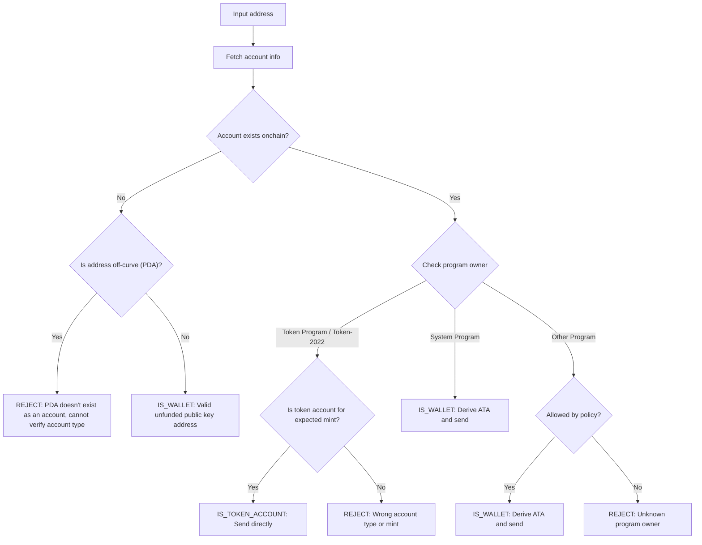

Enviar fondos a una dirección incorrecta puede ocasionar una pérdida permanente.
La verificación de direcciones garantiza que solo envíes fondos a direcciones
que puedan recibirlos y acceder a ellos correctamente.

La validación depende de lo que envíes:

- **Los tokens SPL** tienen cierta protección incorporada. El Token Program
  rechaza una transferencia cuyas cuentas no coincidan con el mint esperado, por
  lo que una transferencia de tokens mal dirigida falla sin perder fondos. La
  mayor parte de esta página abarca el envío de tokens SPL.
- **SOL nativo** no cuenta con dicha protección. Una transferencia mediante el
  System Program se ejecuta exitosamente en cualquier cuenta, por lo que un
  destinatario incorrecto bloquea el SOL de forma permanente. Consulta
  [Envío de SOL nativo](#sending-native-sol).

<Callout>
  Consulta [Cómo funcionan los pagos en
  Solana](/docs/payments/how-payments-work) para conocer los conceptos
  fundamentales sobre pagos.
</Callout>

## Comprensión de las direcciones de Solana

Las cuentas de Solana tienen dos tipos de direcciones: dentro de la curva y
fuera de la curva.

### Direcciones dentro de la curva

Las direcciones estándar son las claves públicas de los keypairs Ed25519. Estas
direcciones:

- Tienen una clave privada correspondiente que puede firmar transacciones
- Se utilizan como direcciones de billetera

### Direcciones fuera de la curva (PDAs)

Los [Program Derived Addresses](/docs/core/pda) se derivan de forma determinista
a partir de un ID de programa y semillas. Estas direcciones:

- **No** tienen una clave privada correspondiente
- Solo pueden ser firmadas por el programa del que se derivó la dirección

## Tipos de cuentas en pagos

Usa la dirección para obtener una [cuenta](/docs/core/accounts) de la red,
verifica el propietario del programa y el tipo de cuenta para determinar cómo
gestionar la dirección.

<Callout>
  Saber si una dirección está dentro o fuera de la curva no te indica qué tipo
  de cuenta es, qué programa la posee ni si existe una cuenta en esa dirección.
  Debes obtener la cuenta de la red para determinar estos detalles.
</Callout>

### Cuentas del System Program (Wallets)

Las cuentas propiadas por el System Program son wallets estándar. Para enviar
tokens SPL a una wallet, debes derivar y utilizar su
[Associated Token Account (ATA)](/docs/tokens/basics/create-token-account#whats-an-associated-token-account).

Después de derivar la dirección ATA, verifica si el token account existe en la
cadena. Si el ATA no existe, puedes incluir una instrucción para crear el token
account del destinatario en la misma transacción que la transferencia. Sin
embargo, esto requiere pagar rent por el nuevo token account. Dado que el
destinatario es el propietario del ATA, el SOL pagado por el rent no puede ser
recuperado por el remitente.

<Callout type="warn">
  Sin medidas de seguridad, subsidiar la creación de ATAs puede ser explotado.
  Un usuario malintencionado podría solicitar una transferencia, hacer que se
  cree su ATA a tu costa, cerrar el ATA para recuperar el rent SOL, y repetir el
  proceso.
</Callout>

### Token Accounts

Los [token accounts](/docs/tokens/basics/create-token-account) son propiedad del
Token Program o Token-2022 Program y almacenan saldos de tokens. Si la dirección
que recibes es propiedad de un token program, debes verificar que la cuenta sea
un token account (no un mint account) y que coincida con el mint account del
token esperado antes de enviar.

<Callout type="info">
  Los Token Programs validan automáticamente que ambos token accounts en una
  transferencia contengan tokens del mismo mint. Si la validación falla, la
  transacción es rechazada y no se pierden fondos.
</Callout>

### Mint Accounts

Los [mint accounts](/docs/tokens/basics/create-mint) rastrean el suministro de
tokens y los metadatos de un token específico. Los mint accounts también son
propiedad de los Token Programs, pero **no** son destinatarios válidos para
transferencias de tokens. Intentar enviar tokens a una dirección mint resulta en
una transacción fallida, pero no se pierden fondos.

### Otras Cuentas

Las cuentas pertenecientes a otros programas requieren una decisión de política.
Algunas cuentas (p. ej., billeteras multisig) pueden ser propietarias válidas de
token account, mientras que otras deben ser rechazadas.

## Envío de SOL nativo

La clasificación anterior determina a dónde pueden ir los tokens SPL. El SOL
nativo es más estricto: el único destinatario seguro es una **billetera de
System Program** (o una dirección en curva sin fondos que se convierta en una).

Una transferencia de System Program agrega lamport a cualquier cuenta, incluidas
las acuñaciones, token accounts, programas y PDAs. Los lamport solo pueden ser
retirados por el programa propietario de la cuenta, por lo que enviar SOL a un
destinatario incorrecto puede resultar en la pérdida permanente de fondos.

A diferencia de una transferencia de tokens SPL, la transacción **no** falla
cuando el destinatario es una dirección inesperada.

Al enviar SOL nativo, solo un resultado `IS_WALLET` es aceptable.
`IS_TOKEN_ACCOUNT` **no** lo es: un token account contiene tokens SPL, y el SOL
enviado allí queda fuera del control del remitente.

<Callout type="warn">
  Esta es una forma común en que se pierde SOL: un usuario pega la dirección de
  acuñación de un token (o una dirección de programa) en un retiro de SOL. La
  transferencia se realiza con éxito y el SOL es irrecuperable. Siempre
  clasifica al destinatario antes de firmar una transferencia de SOL.
</Callout>

## Flujo de Verificación

El siguiente diagrama muestra un árbol de decisiones de referencia para validar
una dirección:


```mermaid title="Address Verification Flow"
flowchart TD
    A["Input address"]
    B["Fetch account info"]

    A --> B
    B --> C{"Account exists onchain?"}

    %% --- Non-existent account path ---
    C -- "No" --> D{"Is address off-curve (PDA)?"}
    D -- "Yes" --> R1["REJECT: PDA doesn't exist as an account, cannot verify account type"]
    D -- "No" --> W1["IS_WALLET: Valid unfunded public key address"]

    %% --- Existing account path ---
    C -- "Yes" --> F{"Check program owner"}

    F -- "Token Program / Token-2022" --> G{"Is token account for expected mint?"}
    G -- "Yes" --> T1["IS_TOKEN_ACCOUNT: Send directly"]
    G -- "No" --> R2["REJECT: Wrong account type or mint"]

    F -- "System Program" --> W2["IS_WALLET: Derive ATA and send"]

    F -- "Other Program" --> K{"Allowed by policy?"}
    K -- "Yes" --> W3["IS_WALLET: Derive ATA and send"]
    K -- "No" --> R3["REJECT: Unknown program owner"]
```

<Steps>
<Step>

### Obtener cuenta

Usa la dirección para obtener los detalles de la cuenta desde la red.

</Step>
<Step>

### La cuenta no existe

Si no existe ninguna cuenta en esta dirección, comprueba si la dirección está en
curva o fuera de curva:

- **Fuera de curva (PDA)**: Rechaza la dirección de forma conservadora para
  evitar enviar a una ATA que podría ser inaccesible. Sin una cuenta existente,
  no puedes determinar únicamente a partir de la dirección qué programa derivó
  esta PDA ni si la dirección corresponde a una ATA. Derivar una ATA para esta
  dirección con el fin de enviar tokens podría resultar en fondos bloqueados en
  un token account inaccesible.

- **En curva**: Esta es una dirección de billetera válida (clave pública) que
  aún no ha sido financiada. Deriva la ATA, verifica si existe y envía tokens a
  ella. Debes tomar una decisión de política sobre si financiar la creación de
  la ATA en caso de que no exista.

</Step>
<Step>

### La cuenta existe

Si existe una cuenta, verifica qué programa la posee:

- **System Program**: Esta es una billetera estándar. Deriva la ATA, verifica si
  existe y envía tokens a ella. Debes tomar una decisión de política sobre si
  financiar la creación de la ATA en caso de que no exista.

- **Token Program / Token-2022**: Verifica que la cuenta sea un token account
  (no un mint account) y que contenga el token (mint) que deseas enviar. Si es
  válida, envía los tokens directamente a esta dirección. Si es un mint account
  o un token account de un mint diferente, rechaza la dirección.

- **Otro programa**: Esto requiere una decisión de política. Algunos programas,
  como las billeteras multifirma, pueden ser propietarios aceptables de token
  accounts. Si tu política lo permite, deriva la ATA y envía. De lo contrario,
  rechaza la dirección.

</Step>
</Steps>

## Demo

El siguiente ejemplo muestra únicamente la lógica de validación de direcciones.
Este es código de referencia con fines ilustrativos.

<Callout>
  La demo no muestra cómo derivar una ATA ni cómo construir una transacción para
  enviar tokens. Consulta la documentación de [token
  account](/docs/tokens/basics/create-token-account#how-to-create-an-associated-token-account)
  y [transferencia de tokens](/docs/tokens/basics/transfer-tokens) para ver
  código de ejemplo.
</Callout>

La demo a continuación utiliza tres posibles resultados:

| Resultado          | Significado                   | Acción                                     |
| ------------------ | ----------------------------- | ------------------------------------------ |
| `IS_WALLET`        | Dirección de billetera válida | Deriva y envía al associated token account |
| `IS_TOKEN_ACCOUNT` | Token account válido          | Envía tokens directamente a esta dirección |
| `REJECT`           | Dirección inválida            | No enviar                                  |

Luego asigna cada resultado a la aceptabilidad por activo con
`canReceiveNativeSol` (solo billeteras) e `canReceiveSplToken` (billeteras o
token accounts). Una token account devuelve `IS_TOKEN_ACCOUNT`, por lo que puede
recibir tokens SPL pero **no** SOL nativo — la distinción que evita que SOL
quede bloqueado.

<CodeTabs flags="r">

```ts !! title="Demo"
// !collapse(1:35) collapsed

import {
  type Address,
  type Rpc,
  type GetAccountInfoApi,
  createSolanaRpc,
  fetchJsonParsedAccount,
  isOffCurveAddress,
  generateKeyPairSigner,
  getProgramDerivedAddress
} from "@solana/kit";

// =============================================================================
// Constants
// =============================================================================

const defaultRpc = createSolanaRpc("https://api.mainnet-beta.solana.com");

const SYSTEM_PROGRAM = "11111111111111111111111111111111" as Address;
const TOKEN_PROGRAM = "TokenkegQfeZyiNwAJbNbGKPFXCWuBvf9Ss623VQ5DA" as Address;
const TOKEN_2022_PROGRAM =
  "TokenzQdBNbLqP5VEhdkAS6EPFLC1PHnBqCXEpPxuEb" as Address;

// =============================================================================
// Validation Function
// =============================================================================

/**
 * Possible validation results for an input address.
 */
export type ValidationResult =
  | { type: "IS_TOKEN_ACCOUNT" }
  | { type: "IS_WALLET" }
  | { type: "REJECT"; reason: string };

/**
 * Validates an input address and classifies it as a wallet, token account, or invalid.
 *
 * @param inputAddress - The address to validate
 * @param rpc - Optional RPC client (defaults to mainnet)
 * @returns Classification result:
 *   - IS_WALLET: Valid wallet address
 *   - IS_TOKEN_ACCOUNT: Valid token account
 *   - REJECT: Invalid address for transfers
 */
export async function validateAddress(
  inputAddress: Address,
  rpc: Rpc<GetAccountInfoApi> = defaultRpc
): Promise<ValidationResult> {
  const account = await fetchJsonParsedAccount(rpc, inputAddress);
  // Log the account data for demo
  console.log("\nAccount:", account);

  // Account doesn't exist onchain
  if (!account.exists) {
    // Off-curve = PDA that doesn't exist as an account
    // Reject conservatively to avoid sending to an address that may be inaccessible.
    if (isOffCurveAddress(inputAddress)) {
      return { type: "REJECT", reason: "PDA doesn't exist as an account" };
    }
    // On-curve = valid keypair address, treat as unfunded wallet
    return { type: "IS_WALLET" };
  }

  // Account exists, check program owner
  const owner = account.programAddress;

  // System Program = wallet
  if (owner === SYSTEM_PROGRAM) {
    return { type: "IS_WALLET" };
  }

  // Token Program or Token-2022, check if token account
  if (owner === TOKEN_PROGRAM || owner === TOKEN_2022_PROGRAM) {
    const accountType = (
      account.data as { parsedAccountMeta?: { type?: string } }
    ).parsedAccountMeta?.type;

    if (accountType === "account") {
      return { type: "IS_TOKEN_ACCOUNT" };
    }
    // Reject if not a token account (mint account)
    return {
      type: "REJECT",
      reason: "Not a token account"
    };
  }

  // Unknown program owner
  return { type: "REJECT", reason: "Unknown program owner" };
}

/**
 * Native SOL is only safe to send to a wallet. Any other account locks it.
 */
function canReceiveNativeSol(result: ValidationResult): boolean {
  return result.type === "IS_WALLET";
}

/**
 * SPL tokens can go to a wallet (via its ATA) or directly to a token account.
 */
function canReceiveSplToken(result: ValidationResult): boolean {
  return result.type === "IS_WALLET" || result.type === "IS_TOKEN_ACCOUNT";
}

// =============================================================================
// Examples
// =============================================================================
// !collapse(1:1000) collapsed

// Wallets
const EXISTING_WALLET =
  "H8sMJSCQxfKiFTCfDR3DUMLPwcRbM61LGFJ8N4dK3WjS" as Address;
const NEW_WALLET = (await generateKeyPairSigner()).address;

// Token accounts
const USDC_TOKEN_ACCOUNT =
  "3emsAVdmGKERbHjmGfQ6oZ1e35dkf5iYcS6U4CPKFVaa" as Address;
const PYUSD_TOKEN_ACCOUNT =
  "47od2TPRvqJipfPVWZdyenLEngPw8hC36nDxiLyvGsEP" as Address;

// Token mints (should be rejected)
const USDC_MINT = "EPjFWdd5AufqSSqeM2qN1xzybapC8G4wEGGkZwyTDt1v" as Address;
const PYUSD_MINT = "2b1kV6DkPAnxd5ixfnxCpjxmKwqjjaYmCZfHsFu24GXo" as Address;

// PDA that doesn't exist (should be rejected)
const [NON_EXISTENT_PDA] = await getProgramDerivedAddress({
  programAddress: (await generateKeyPairSigner()).address,
  seeds: ["seed"]
});

// Program account (should be rejected)
const PROGRAM_ACCOUNT =
  "p1exdMJcjVao65QdewkaZRUnU6VPSXhus9n2GzWfh98" as Address;

async function runExample(label: string, address: Address) {
  console.log(`\n${"─".repeat(60)}`);
  console.log(`Example: ${label}`);
  console.log(`Input: ${address}`);
  console.log(`${"─".repeat(60)}`);

  const result = await validateAddress(address);
  console.log("\nResult:", result);
  console.log(
    `Can receive SOL?   ${canReceiveNativeSol(result) ? "YES" : "NO"}`
  );
  console.log(
    `Can receive token? ${canReceiveSplToken(result) ? "YES" : "NO"}`
  );
}

console.log("\n" + "═".repeat(60));
console.log("  IS_WALLET Examples");
console.log("═".repeat(60));

await runExample("Existing funded wallet", EXISTING_WALLET);
await runExample("New wallet (unfunded)", NEW_WALLET);

console.log("\n" + "═".repeat(60));
console.log("  IS_TOKEN_ACCOUNT Examples");
console.log("═".repeat(60));

await runExample("USDC token account (Token Program)", USDC_TOKEN_ACCOUNT);
await runExample("PYUSD token account (Token-2022)", PYUSD_TOKEN_ACCOUNT);

console.log("\n" + "═".repeat(60));
console.log("  REJECT Examples");
console.log("═".repeat(60));

await runExample("USDC mint address", USDC_MINT);
await runExample("PYUSD mint address", PYUSD_MINT);
await runExample("Non-existent PDA", NON_EXISTENT_PDA);
await runExample("Program account", PROGRAM_ACCOUNT);

console.log("\n" + "═".repeat(60));
console.log("  Done!");
console.log("═".repeat(60) + "\n");
```

</CodeTabs>
