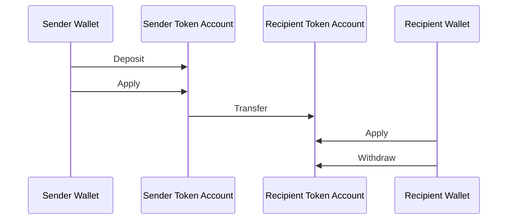
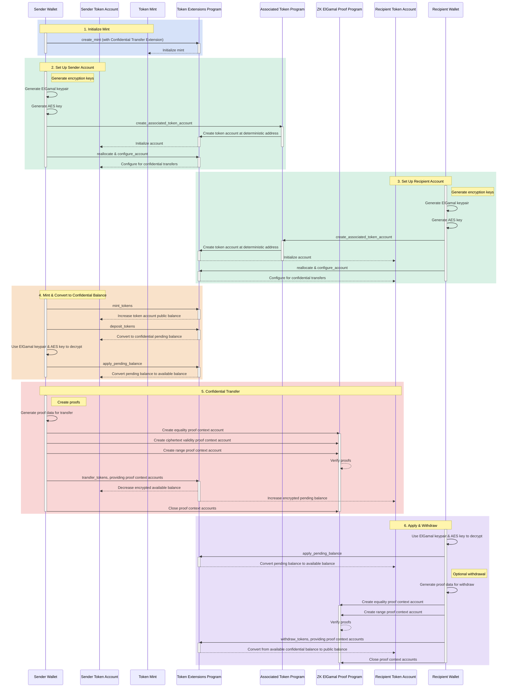

## ¿Qué son las transferencias confidenciales?

Las transferencias confidenciales te permiten transferir tokens entre token
accounts sin revelar el monto de la transferencia. Esto es útil para
transacciones que preservan la privacidad. Solo los montos de transferencia y
los saldos de tokens son privados. Las direcciones de las token accounts siguen
siendo públicas.

- [Descripción general del protocolo](https://www.solana-program.com/docs/confidential-balances/overview) -
  Detalles sobre el protocolo criptográfico subyacente
- [Guía de inicio rápido](https://www.solana-program.com/docs/confidential-balances#setup) -
  Configuración y comandos básicos de CLI
- [Confidential Balances Cookbook](https://github.com/solana-developers/Confidential-Balances-Sample) -
  Fragmentos de código sobre cómo usar la extensión Confidential Transfer

### ¿Cómo funciona?

La extensión Confidential Transfer añade
[instrucciones](https://github.com/solana-program/token-2022/blob/efd0c957fefbd79882d77df5fb2dac88c001249c/program/src/extension/confidential_transfer/instruction.rs#L29)
al Token Extensions Program que te permite transferir tokens entre cuentas sin
revelar el monto de la transferencia.

```mermaid title="Confidential Transfer Basic Overview"
    sequenceDiagram

    participant A as Sender Wallet
    participant AA as Sender Token Account
    participant BB as Recipient Token Account
    participant B as Recipient Wallet

    A->>AA: Deposit
    A->>AA: Apply

    AA->>BB: Transfer
    B->>BB: Apply

    B->>BB: Withdraw

```

El flujo básico de las transferencias confidenciales de tokens es el siguiente:

1. Crear un mint account con la extensión de transferencia confidencial.
2. Crear token accounts con la extensión de transferencia confidencial para el
   emisor y el destinatario.
3. Acuñar tokens en la cuenta del emisor.
4. **Depositar** el saldo público del emisor en el **saldo pendiente
   confidencial**.
5. **Aplicar** el saldo pendiente del emisor al **saldo disponible
   confidencial**.
6. **Transferir** tokens de forma confidencial desde la token account del emisor
   a la token account del destinatario.
7. **Aplicar** el saldo pendiente del destinatario al **saldo disponible
   confidencial**.
8. **Retirar** el saldo disponible confidencial del destinatario al **saldo
   público**.

Para más detalles sobre los pasos del flujo de transferencia confidencial,
consulta las páginas correspondientes:

<Cards>
  <Card
    title="Crear mint account"
    href="/docs/tokens/extensions/confidential-transfer/create-mint"
  >
    Cómo crear un mint account con la extensión Confidential Transfer
  </Card>
  <Card
    title="Crear token account"
    href="/docs/tokens/extensions/confidential-transfer/create-token-account"
  >
    Cómo configurar una token account con la extensión Confidential Transfer
  </Card>
  <Card
    title="Depositar tokens"
    href="/docs/tokens/extensions/confidential-transfer/deposit-tokens"
  >
    Cómo depositar tokens en el saldo pendiente confidencial
  </Card>
  <Card
    title="Aplicar saldo pendiente"
    href="/docs/tokens/extensions/confidential-transfer/apply-pending-balance"
  >
    Cómo aplicar el saldo pendiente al saldo confidencial disponible
  </Card>
  <Card
    title="Retirar tokens"
    href="/docs/tokens/extensions/confidential-transfer/withdraw-tokens"
  >
    Cómo retirar tokens del saldo confidencial disponible
  </Card>
  <Card
    title="Transferir tokens"
    href="/docs/tokens/extensions/confidential-transfer/transfer-tokens"
  >
    Cómo transferir tokens de forma confidencial entre token accounts
  </Card>
  <Card
    title="Guía de integración"
    href="/docs/tokens/extensions/confidential-transfer/integration-guide"
  >
    Cómo las billeteras, exploradores e intercambios pueden admitir tokens de
    transferencia confidencial
  </Card>
  <Card
    title="Guía para emisores"
    href="/docs/tokens/extensions/confidential-transfer/issuer-guide"
  >
    Cómo emitir y operar un token de transferencia confidencial (política de
    aprobación, auditores, comisiones, acuñación y quema)
  </Card>
</Cards>

El diagrama a continuación muestra una secuencia detallada del flujo básico para
transferencias de tokens confidenciales:

```mermaid title="Confidential Transfer Detailed Overview"
sequenceDiagram
    participant Sender as Sender Wallet
    participant SenderAccount as Sender Token Account
    participant Mint as Token Mint
    participant Token22 as Token Extensions Program
    participant ATAProgram as Associated Token Program
    participant ElGamal as ZK ElGamal Proof Program
    participant RecipientAccount as Recipient Token Account
    participant Recipient as Recipient Wallet

    rect rgba(120, 160, 235, 0.3)
    Note over Sender,Mint: 1. Initialize Mint

    activate Sender
    Sender->>Token22: create_mint (with Confidential Transfer Extension)
    activate Token22
    Token22-->>Mint: Initialize mint
    deactivate Token22
    deactivate Sender
    end

    rect rgba(130, 210, 170, 0.3)
    Note over Sender,SenderAccount: 2. Set Up Sender Account

    activate Sender
    Note right of Sender: Generate encryption keys
    Sender->>Sender: Generate ElGamal keypair
    Sender->>Sender: Generate AES key

    Sender->>ATAProgram: create_associated_token_account
    activate ATAProgram
    ATAProgram->>Token22: Create token account at deterministic address
    activate Token22
    Token22-->>SenderAccount: Initialize account
    deactivate Token22
    deactivate ATAProgram

    Sender->>Token22: reallocate & configure_account
    activate Token22
    Token22-->>SenderAccount: Configure for confidential transfers
    deactivate Token22
    deactivate Sender
    end

    rect rgba(130, 210, 170, 0.3)
    Note over Recipient,RecipientAccount: 3. Set Up Recipient Account

    activate Recipient
    Note right of Recipient: Generate encryption keys
    Recipient->>Recipient: Generate ElGamal keypair
    Recipient->>Recipient: Generate AES key

    Recipient->>ATAProgram: create_associated_token_account
    activate ATAProgram
    ATAProgram->>Token22: Create token account at deterministic address
    activate Token22
    Token22-->>RecipientAccount: Initialize account
    deactivate Token22
    deactivate ATAProgram

    Recipient->>Token22: reallocate & configure_account
    activate Token22
    Token22-->>RecipientAccount: Configure for confidential transfers
    deactivate Token22
    deactivate Recipient
    end

    rect rgba(235, 160, 80, 0.3)
    Note over Sender,SenderAccount: 4. Mint & Convert to Confidential Balance

    activate Sender
    Sender->>Token22: mint_tokens
    activate Token22
    Token22-->>SenderAccount: Increase token account public balance
    deactivate Token22

    Sender->>Token22: deposit_tokens
    activate Token22
    Token22-->>SenderAccount: Convert to confidential pending balance
    deactivate Token22

    Sender->>Sender: Use ElGamal keypair & AES key to decrypt
    Sender->>Token22: apply_pending_balance
    activate Token22
    Token22-->>SenderAccount: Convert pending balance to available balance
    deactivate Token22
    deactivate Sender
    end

    rect rgba(235, 120, 120, 0.3)
    Note over Sender,RecipientAccount: 5. Confidential Transfer

    activate Sender
    Note right of Sender: Create proofs
    Sender->>Sender: Generate proof data for transfer

    Sender->>ElGamal: Create equality proof context account
    activate ElGamal
    Sender->>ElGamal: Create ciphertext validity proof context account
    Sender->>ElGamal: Create range proof context account
    ElGamal-->>ElGamal: Verify proofs

    Sender->>Token22: transfer_tokens, providing proof context accounts
    activate Token22
    Token22-->>SenderAccount: Decrease encrypted available balance
    Token22-->>RecipientAccount: Increase encrypted pending balance
    deactivate Token22

    Sender->>ElGamal: Close proof context accounts
    deactivate ElGamal
    deactivate Sender
    end

    rect rgba(180, 150, 235, 0.3)
    Note over Recipient,RecipientAccount: 6. Apply & Withdraw

    activate Recipient
    Recipient->>Recipient: Use ElGamal keypair & AES key to decrypt
    Recipient->>Token22: apply_pending_balance
    activate Token22
    Token22-->>RecipientAccount: Convert pending balance to available balance
    deactivate Token22

    Note right of Recipient: Optional withdrawal
    Recipient->>Recipient: Generate proof data for withdraw

    Recipient->>ElGamal: Create equality proof context account
    activate ElGamal
    Recipient->>ElGamal: Create range proof context account
    ElGamal-->>ElGamal: Verify proofs

    Recipient->>Token22: withdraw_tokens, providing proof context accounts
    activate Token22
    Token22-->>RecipientAccount: Convert from available confidential balance to public balance
    deactivate Token22

    Recipient->>ElGamal: Close proof context accounts
    deactivate ElGamal
    deactivate Recipient
    end
```

## Instrucciones de Transferencia Confidencial

La lista completa de instrucciones de la extensión de Transferencia Confidencial
[instructions](https://github.com/solana-program/token-2022/blob/efd0c957fefbd79882d77df5fb2dac88c001249c/program/src/extension/confidential_transfer/instruction.rs#L29)
es la siguiente:

| Instrucción                         | Descripción                                                                                                                                                                      |
| ----------------------------------- | -------------------------------------------------------------------------------------------------------------------------------------------------------------------------------- |
| _rs`InitializeMint`_                | Configura el mint account para transferencias confidenciales. Esta instrucción debe incluirse en la misma transacción que la instrucción _rs`TokenInstruction::InitializeMint`_. |
| _rs`UpdateMint`_                    | Actualiza la configuración de transferencias confidenciales para un mint.                                                                                                        |
| _rs`ConfigureAccount`_              | Configura un token account para transferencias confidenciales.                                                                                                                   |
| _rs`ApproveAccount`_                | Aprueba un token account para transferencias confidenciales si el mint requiere aprobación para nuevos token accounts.                                                           |
| _rs`EmptyAccount`_                  | Vacía los saldos confidenciales pendientes y disponibles para permitir el cierre de un token account.                                                                            |
| _rs`Deposit`_                       | Convierte el saldo público de tokens en saldo confidencial pendiente.                                                                                                            |
| _rs`Withdraw`_                      | Convierte el saldo confidencial disponible de vuelta a saldo público.                                                                                                            |
| _rs`Transfer`_                      | Transfiere tokens entre token accounts de forma confidencial.                                                                                                                    |
| _rs`ApplyPendingBalance`_           | Convierte el saldo pendiente en saldo disponible después de depósitos o transferencias.                                                                                          |
| _rs`EnableConfidentialCredits`_     | Permite que un token account reciba transferencias confidenciales de tokens.                                                                                                     |
| _rs`DisableConfidentialCredits`_    | Bloquea las transferencias confidenciales entrantes mientras sigue permitiendo las transferencias públicas.                                                                      |
| _rs`EnableNonConfidentialCredits`_  | Permite que un token account reciba transferencias públicas de tokens.                                                                                                           |
| _rs`DisableNonConfidentialCredits`_ | Bloquea las transferencias regulares para que la cuenta solo reciba transferencias confidenciales.                                                                               |
| _rs`TransferWithFee`_               | Transfiere tokens entre token accounts de forma confidencial con una comisión.                                                                                                   |
| _rs`ConfigureAccountWithRegistry`_  | Forma alternativa de configurar token accounts para transferencias confidenciales utilizando una cuenta _rs`ElGamalRegistry`_ en lugar de una prueba _rs`VerifyPubkeyValidity`_. |
