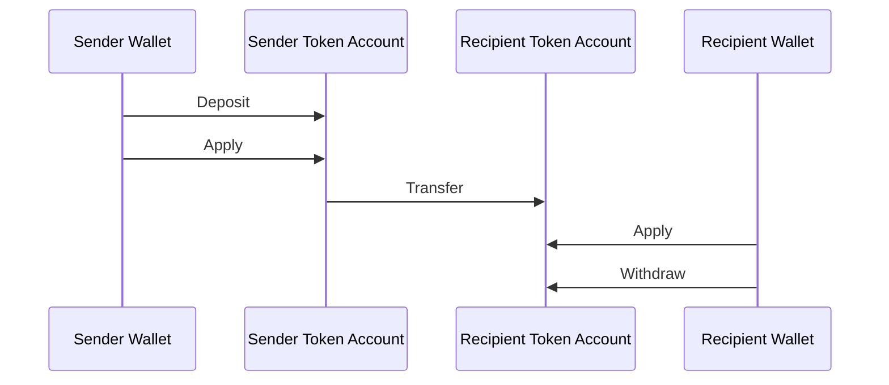
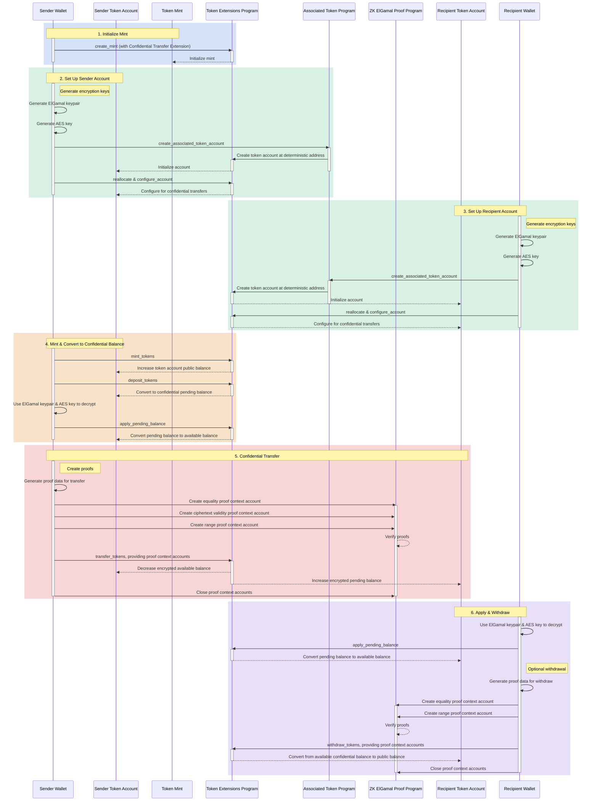

<Callout type="warn">
  El Programa ZK ElGamal está temporalmente deshabilitado en la mainnet y devnet
  mientras se somete a una auditoría de seguridad. Esto significa que la
  extensión de transferencias confidenciales no está disponible actualmente.
  Aunque los conceptos siguen siendo válidos, los ejemplos de código no
  funcionarán.
</Callout>

## ¿Qué son las transferencias confidenciales?

Las transferencias confidenciales te permiten transferir tokens entre cuentas de
tokens sin revelar el monto de la transferencia. Esto es útil para transacciones
que preservan la privacidad. Solo los montos de transferencia y los saldos de
tokens son privados. Las direcciones de las token account permanecen públicas.

- [Descripción general del protocolo](https://www.solana-program.com/docs/confidential-balances/overview) -
  Detalles sobre el protocolo criptográfico subyacente
- [Guía de inicio rápido](https://www.solana-program.com/docs/confidential-balances#setup) -
  Configuración y comandos básicos de CLI
- [Manual de saldos confidenciales](https://github.com/solana-developers/Confidential-Balances-Sample) -
  Fragmentos de código sobre cómo usar la extensión de Transferencia
  Confidencial

### ¿Cómo funciona?

La extensión de Transferencia Confidencial agrega
[instrucciones](https://github.com/solana-program/token-2022/blob/efd0c957fefbd79882d77df5fb2dac88c001249c/program/src/extension/confidential_transfer/instruction.rs#L29)
al Token Extensions Program que te permite transferir tokens entre cuentas sin
revelar el monto de la transferencia.



El flujo básico de las transferencias confidenciales de tokens es el siguiente:

1. Crear una mint account con la extensión de transferencia confidencial.
2. Crear token accounts con extensión de transferencia confidencial para el
   remitente y el destinatario.
3. Acuñar tokens en la cuenta del remitente.
4. **Depositar** el saldo público del remitente al **saldo pendiente
   confidencial**.
5. **Aplicar** el saldo pendiente del remitente al **saldo disponible
   confidencial**.
6. **Transferir** confidencialmente tokens desde la token account del remitente
   a la token account del destinatario.
7. **Aplicar** el saldo pendiente del destinatario al **saldo disponible
   confidencial**.
8. **Retirar** el saldo disponible confidencial del destinatario al **saldo
   público**.

Para más detalles sobre los pasos en el flujo de transferencia confidencial,
consulta las páginas correspondientes:

<Cards>
  <Card
    title="Crear Mint Account"
    href="/docs/tokens/extensions/confidential-transfer/create-mint"
  >
    Cómo crear una mint account con la extensión de Transferencia Confidencial
  </Card>
  <Card
    title="Crear Token Account"
    href="/docs/tokens/extensions/confidential-transfer/create-token-account"
  >
    Cómo configurar una token account con la extensión de Transferencia
    Confidencial
  </Card>
  <Card
    title="Depositar Tokens"
    href="/docs/tokens/extensions/confidential-transfer/deposit-tokens"
  >
    Cómo depositar tokens en el saldo pendiente confidencial
  </Card>
  <Card
    title="Aplicar Saldo Pendiente"
    href="/docs/tokens/extensions/confidential-transfer/apply-pending-balance"
  >
    Cómo aplicar el saldo pendiente al saldo confidencial disponible
  </Card>
  <Card
    title="Retirar Tokens"
    href="/docs/tokens/extensions/confidential-transfer/withdraw-tokens"
  >
    Cómo retirar tokens del saldo confidencial disponible
  </Card>
  <Card
    title="Transferir Tokens"
    href="/docs/tokens/extensions/confidential-transfer/transfer-tokens"
  >
    Cómo transferir tokens confidencialmente entre token accounts
  </Card>
</Cards>

El siguiente diagrama muestra una secuencia detallada del flujo básico para las
transferencias confidenciales de tokens:



### Código de ejemplo

El ejemplo en Rust a continuación muestra los pasos para las transferencias
confidenciales de tokens correspondientes al diagrama anterior. Los pasos están
separados en funciones auxiliares para mayor claridad.

Para ejecutar el ejemplo, inicia un validador local con el Token Extensions
Program clonado desde la mainnet usando el siguiente comando. Debes tener
instalado el CLI de Solana para usar el validador local.

```terminal
$ solana-test-validator --clone-upgradeable-program TokenzQdBNbLqP5VEhdkAS6EPFLC1PHnBqCXEpPxuEb --url https://api.mainnet.solana.com -r
```

<Callout type="info">
  En el momento de escribir esto, las Transferencias Confidenciales no están
  habilitadas en el validador local predeterminado. Debes clonar el Token
  Extensions Program de la mainnet para ejecutar el código de ejemplo.
</Callout>

<CodeTabs>

```rust !! title="main.rs"
use anyhow::{Context, Result};
use solana_client::nonblocking::rpc_client::RpcClient;
use solana_sdk::{
    commitment_config::CommitmentConfig,
    signature::{Keypair, Signer},
    transaction::Transaction,
    pubkey::Pubkey
};
use spl_associated_token_account::{
    get_associated_token_address_with_program_id, instruction::create_associated_token_account,
};
use spl_token_client::{
    client::{ProgramRpcClient, ProgramRpcClientSendTransaction},
    spl_token_2022::{
        extension::{
            confidential_transfer::{
                instruction::{configure_account, PubkeyValidityProofData},
                account_info::{WithdrawAccountInfo, TransferAccountInfo},
                ConfidentialTransferAccount,
            },
            BaseStateWithExtensions, ExtensionType,
        },
        id as token_2022_program_id,
        instruction::reallocate,
        solana_zk_sdk::encryption::{auth_encryption::*, elgamal::*},
    },
    token::{ExtensionInitializationParams, Token},
};
use spl_token_confidential_transfer_proof_extraction::instruction::{ProofData, ProofLocation};
use spl_token_confidential_transfer_proof_generation::withdraw::WithdrawProofData;
use std::sync::Arc;

/// Define a type alias for the Token client to simplify type signatures
type TokenClient = Token<ProgramRpcClientSendTransaction>;

/// Demonstrates the complete lifecycle of confidential tokens:
/// - Creating a mint with confidential transfer extension
/// - Creating token accounts configured for confidential transfer
/// - Minting tokens
/// - Depositing tokens from public balance to confidential pending balance
/// - Applying pending balance to available balance
/// - Transferring tokens confidentially between token accounts
/// - Withdrawing tokens from confidential available balance to public balance
#[tokio::main]
async fn main() -> Result<()> {
    // Create connection to local test validator with confirmed commitment level
    // This ensures transactions are confirmed before proceeding
    let rpc_client = Arc::new(RpcClient::new_with_commitment(
        String::from("http://localhost:8899"),
        CommitmentConfig::confirmed(),
    ));

    // Load the default Solana CLI keypair to use as the fee payer
    let payer = Arc::new(load_keypair()?);
    println!("Payer: {}", payer.pubkey());

    // Generate a new keypair for the mint
    // This pubkey will be the address of the token mint
    let mint = Keypair::new();
    println!("Mint keypair generated: {}", mint.pubkey());

    // Number of decimals for the mint
    // This determines the smallest unit of the token (e.g., 2 decimals means 0.01 is the smallest unit)
    let decimals = 2;

    // Create a program client
    let program_client = ProgramRpcClient::new(rpc_client.clone(), ProgramRpcClientSendTransaction);

    // Create a token client
    // This client provides high-level methods to interact with the token program
    let token = Token::new(
        Arc::new(program_client),
        &token_2022_program_id(),
        &mint.pubkey(),
        Some(decimals),
        payer.clone(),
    );

    // Create a new mint with confidential transfer extension
    // This initializes the token mint with confidential transfer enabled
    create_mint(&token, &mint, payer.clone()).await?;

    // Create first token account (sender)
    // This account will be used to send tokens confidentially
    let (sender_pubkey, sender_elgamal_keypair, sender_aes_key) = create_token_account(
        rpc_client.clone(),
        payer.clone(),
        &mint,
        payer.clone(),
        &token_2022_program_id(),
    )
    .await?;

    // Create second token account (recipient) with a new owner
    // This account will receive tokens confidentially
    let recipient_owner = Arc::new(Keypair::new());
    println!("Recipient owner: {}", recipient_owner.pubkey());

    // Fund the recipient owner account with SOL
    // This ensures the recipient can pay for transaction fees
    fund_account(
        rpc_client.clone(),
        payer.clone(),
        &recipient_owner.pubkey(),
        10_000_000, // 0.01 SOL in lamports
    )
    .await?;

    // Create the recipient token account
    // This account will receive tokens from the sender
    let (recipient_pubkey, recipient_elgamal_keypair, recipient_aes_key) = create_token_account(
        rpc_client.clone(),
        recipient_owner.clone(),
        &mint,
        recipient_owner.clone(),
        &token_2022_program_id(),
    )
    .await?;

    // Mint tokens to sender account
    // This creates new tokens and increases the sender's token account public balance
    let amount = 100 * 10u64.pow(decimals as u32); // 100 tokens
    mint_tokens(&token, &sender_pubkey, &payer, amount).await?;

    // Deposit tokens to confidential pending balance
    // This converts public balance to confidential pending balance
    deposit_tokens(&token, &sender_pubkey, &payer, amount, decimals).await?;

    // Apply pending balance to make funds available
    // This converts confidential pending balance to confidential available balance
    apply_pending_balance(
        &token,
        &sender_pubkey,
        &payer,
        &sender_elgamal_keypair,
        &sender_aes_key,
    )
    .await?;

    // Transfer tokens from sender to recipient
    // This sends tokens confidentially from sender token account to recipient token account
    let transfer_amount = 50 * 10u64.pow(decimals as u32); // 50 tokens
    transfer_tokens(
        &token,
        &sender_pubkey,
        &payer,
        &sender_elgamal_keypair,
        &sender_aes_key,
        &recipient_pubkey,
        recipient_elgamal_keypair.pubkey(),
        transfer_amount,
        payer.clone(),
    )
    .await?;

    // Apply pending balance on recipient token account
    // This converts confidential pending balance to confidential available balance
    apply_pending_balance(
        &token,
        &recipient_pubkey,
        &recipient_owner,
        &recipient_elgamal_keypair,
        &recipient_aes_key,
    )
    .await?;

    // Withdraw half of the tokens from recipient's confidential available balance
    // This converts confidential available balance to public balance
    let withdraw_amount = 25 * 10u64.pow(decimals as u32); // half of the 50 tokens received
    withdraw_tokens(
        &token,
        &recipient_pubkey,
        &recipient_owner,
        &recipient_elgamal_keypair,
        &recipient_aes_key,
        withdraw_amount,
        recipient_owner.clone(),
        decimals,
    )
    .await?;

    println!("\nAll operations completed successfully!");
    println!("Sender Account: {}", sender_pubkey);
    println!("Recipient Account: {}", recipient_pubkey);

    Ok(())
}

/// Load the keypair from the default Solana CLI keypair path
///
/// Returns:
///   - Result<Keypair>: The loaded keypair or an error if loading fails
fn load_keypair() -> Result<Keypair> {
    // Get the default keypair path from the home directory
    let keypair_path = dirs::home_dir()
        .context("Could not find home directory")?
        .join(".config/solana/id.json");

    // Read the keypair file
    let file = std::fs::File::open(&keypair_path)?;
    let keypair_bytes: Vec<u8> = serde_json::from_reader(file)?;

    // Create keypair
    let keypair = Keypair::from_bytes(&keypair_bytes)?;

    Ok(keypair)
}

/// Create a new token mint with confidential transfer extension
///
/// Arguments:
///   - token: Reference to the token client for interacting with the Token-2022 program
///   - mint: Reference to the keypair that will be used as the mint account's address
///   - payer: Arc-wrapped keypair that will pay for the transaction fees and serve as the mint authority
///
/// Returns:
///   - Result<()>: Success or error
async fn create_mint(token: &TokenClient, mint: &Keypair, payer: Arc<Keypair>) -> Result<()> {
    println!("Creating token mint with confidential transfer extension...");

    // Create extension initialization parameters for the mint
    // This configures the confidential transfer extension on the mint
    let extension_initialization_params =
        vec![ExtensionInitializationParams::ConfidentialTransferMint {
            authority: Some(payer.pubkey()), // Authority that can modify confidential transfer settings
            auto_approve_new_accounts: true, // Automatically approve new accounts for confidential transfers
            auditor_elgamal_pubkey: None,    // No auditor for this example
        }];

    // Create and initialize the mint with the ConfidentialTransferMint extension
    let transaction_signature = token
        .create_mint(
            &payer.pubkey(),                 // Mint authority
            Some(&payer.pubkey()),           // Freeze authority (optional)
            extension_initialization_params, // Extension parameters
            &[mint],                         // Signers needed for the transaction
        )
        .await?;

    println!("Mint Address: {}", mint.pubkey());
    println!(
        "Mint Creation Transaction Signature: {}",
        transaction_signature
    );

    Ok(())
}

/// Fund an account with SOL
///
/// Arguments:
///   - rpc_client: Arc-wrapped RPC client for communicating with the Solana cluster
///   - payer: Arc-wrapped keypair that will send the SOL
///   - recipient: Public key of the account that will receive the SOL
///   - amount: Amount of lamports (1 SOL = 1,000,000,000 lamports) to send
///
/// Returns:
///   - Result<()>: Success or error
async fn fund_account(
    rpc_client: Arc<RpcClient>,
    payer: Arc<Keypair>,
    recipient: &Pubkey,
    amount: u64,
) -> Result<()> {
    println!("Funding account {} with {} lamports...", recipient, amount);

    // Create and send a transaction to transfer SOL from payer to recipient
    let fund_signature = rpc_client
        .send_and_confirm_transaction(&Transaction::new_signed_with_payer(
            &[solana_sdk::system_instruction::transfer(
                &payer.pubkey(), // From
                recipient,       // To
                amount,          // Amount in lamports
            )],
            Some(&payer.pubkey()),                    // Fee payer
            &[&payer],                               // Signers
            rpc_client.get_latest_blockhash().await?, // Recent blockhash
        ))
        .await?;

    println!("Fund Transaction Signature: {}", fund_signature);

    Ok(())
}

/// Create and configure a token account for confidential transfers
///
/// Arguments:
///   - rpc_client: Arc-wrapped RPC client for communicating with the Solana cluster
///   - payer: Arc-wrapped keypair that will pay for the transaction fees
///   - mint: Reference to the keypair of the token mint
///   - owner: Arc-wrapped keypair that will own the token account
///   - token_program_id: Public key of the token program (Token-2022)
///
/// Returns:
///   - Result<(Pubkey, ElGamalKeypair, AeKey)>: The token account address, ElGamal keypair, and AES key for encryption
async fn create_token_account(
    rpc_client: Arc<RpcClient>,
    payer: Arc<Keypair>,
    mint: &Keypair,
    owner: Arc<Keypair>,
    token_program_id: &Pubkey,
) -> Result<(Pubkey, ElGamalKeypair, AeKey)> {
    println!("Creating token account for owner: {}", owner.pubkey());

    // Get the associated token account address for the owner
    // This is a deterministic address based on the owner and mint
    let token_account_pubkey = get_associated_token_address_with_program_id(
        &owner.pubkey(),
        &mint.pubkey(),
        token_program_id,
    );
    println!("Token Account Address: {}", token_account_pubkey);

    // Step 1: Create the associated token account
    // This creates a token account at the deterministic address
    let create_associated_token_account_instruction = create_associated_token_account(
        &payer.pubkey(),  // Funding account
        &owner.pubkey(),  // Wallet address
        &mint.pubkey(),   // Mint address
        token_program_id, // Token program ID
    );

    // Step 2: Reallocate the token account to include space for the ConfidentialTransferAccount extension
    // This increases the account size to accommodate the confidential transfer data
    let reallocate_instruction = reallocate(
        token_program_id,                              // Token program ID
        &token_account_pubkey,                         // Token account to reallocate
        &payer.pubkey(),                               // Payer for the reallocation
        &owner.pubkey(),                               // Owner of the token account
        &[&owner.pubkey()],                            // Signers required for the reallocation
        &[ExtensionType::ConfidentialTransferAccount], // Extension to allocate space for
    )?;

    // Step 3: Generate the ElGamal keypair and AES key for token account
    // These are used for encrypting and decrypting confidential token amounts
    let elgamal_keypair = ElGamalKeypair::new_from_signer(&owner, &token_account_pubkey.to_bytes())
        .expect("Failed to create ElGamal keypair");
    let aes_key = AeKey::new_from_signer(&owner, &token_account_pubkey.to_bytes())
        .expect("Failed to create AES key");

    // The maximum number of Deposit and Transfer instructions that can
    // credit pending_balance before the ApplyPendingBalance instruction must be executed
    let maximum_pending_balance_credit_counter = 65536;

    // Initial token balance is 0
    // This is encrypted using the AES key
    let decryptable_balance = aes_key.encrypt(0);

    // Generate the proof data client-side
    // This proves that the ElGamal public key is valid
    let proof_data = PubkeyValidityProofData::new(&elgamal_keypair)
        .map_err(|_| anyhow::anyhow!("Failed to generate proof data"))?;

    // Indicate that proof is included as instruction data
    // This specifies where to find the proof data in the transaction
    let proof_location =
        ProofLocation::InstructionOffset(1.try_into()?, ProofData::InstructionData(&proof_data));

    // Step 4: Create instructions to configure the account for confidential transfers
    // This initializes the confidential transfer extension on the token account
    let configure_account_instructions = configure_account(
        token_program_id,                       // Token program ID
        &token_account_pubkey,                  // Token account to configure
        &mint.pubkey(),                         // Mint of the token
        &decryptable_balance.into(),            // Initial encrypted balance
        maximum_pending_balance_credit_counter, // Maximum pending balance credit counter
        &owner.pubkey(),                        // Owner of the token account
        &[],                                    // Additional signers (none needed)
        proof_location,                         // Location of the proof data
    )?;

    // Combine all instructions
    let mut instructions = vec![
        create_associated_token_account_instruction,
        reallocate_instruction,
    ];
    instructions.extend(configure_account_instructions);

    // Create and send the transaction
    let recent_blockhash = rpc_client.get_latest_blockhash().await?;

    let transaction = Transaction::new_signed_with_payer(
        &instructions,         // Instructions to execute
        Some(&payer.pubkey()), // Fee payer
        &[&payer],              // Signers
        recent_blockhash,      // Recent blockhash
    );

    let transaction_signature = rpc_client
        .send_and_confirm_transaction(&transaction)
        .await?;
    println!(
        "Create Token Account Transaction Signature: {}",
        transaction_signature
    );

    Ok((token_account_pubkey, elgamal_keypair, aes_key))
}

/// Mint tokens to a token account
///
/// Arguments:
///   - token: Reference to the token client for interacting with the Token-2022 program
///   - token_account: Public key of the token account that will receive the tokens
///   - mint_authority: Arc-wrapped keypair that has authority to mint tokens
///   - amount: Amount of tokens to mint (in the smallest units)
///
/// Returns:
///   - Result<()>: Success or error
async fn mint_tokens(
    token: &TokenClient,
    token_account: &Pubkey,
    mint_authority: &Arc<Keypair>,
    amount: u64,
) -> Result<()> {
    println!("Minting {} tokens to account: {}", amount, token_account);

    // Mint tokens to the specified token account
    let mint_signature = token
        .mint_to(
            token_account,            // Destination token account
            &mint_authority.pubkey(), // Mint authority
            amount,                   // Amount to mint
            &[&mint_authority],     // Signers
        )
        .await?;

    println!("Token Minting Transaction Signature: {}", mint_signature);

    Ok(())
}

/// Deposit tokens to confidential state
///
/// Arguments:
///   - token: Reference to the token client for interacting with the Token-2022 program
///   - token_account: Public key of the token account with public balance
///   - owner: Arc-wrapped keypair that owns the token account
///   - amount: Amount of tokens to deposit into confidential pending balance
///   - decimals: Number of decimal for the mint
///
/// Returns:
///   - Result<()>: Success or error
async fn deposit_tokens(
    token: &TokenClient,
    token_account: &Pubkey,
    owner: &Arc<Keypair>,
    amount: u64,
    decimals: u8,
) -> Result<()> {
    println!("Depositing {} tokens to confidential pending balance...", amount);

    // Deposit tokens to confidential pending balance
    let deposit_signature = token
        .confidential_transfer_deposit(
            token_account,   // Token account
            &owner.pubkey(), // Owner of the token account
            amount,          // Amount to deposit
            decimals,        // Decimal for the mint
            &[&owner],     // Signers
        )
        .await?;

    println!(
        "Confidential Transfer Deposit Signature: {}",
        deposit_signature
    );

    Ok(())
}

/// Apply pending balance to make funds available
///
/// Arguments:
///   - token: Reference to the token client for interacting with the Token-2022 program
///   - token_account: Public key of the token account
///   - owner: Arc-wrapped keypair that owns the token account
///   - elgamal_keypair: ElGamal keypair for decrypting confidential amounts
///   - aes_key: AES key for decrypting confidential amounts
///
/// Returns:
///   - Result<()>: Success or error
async fn apply_pending_balance(
    token: &TokenClient,
    token_account: &Pubkey,
    owner: &Arc<Keypair>,
    elgamal_keypair: &ElGamalKeypair,
    aes_key: &AeKey,
) -> Result<()> {
    println!("Applying pending balance for account: {}", token_account);

    // Apply pending balance to convert confidential pending balance to confidential available balance
    let apply_signature = token
        .confidential_transfer_apply_pending_balance(
            token_account,            // Token account
            &owner.pubkey(),          // Owner of the token account
            None,                     // Optional auditor public key (none in this example)
            elgamal_keypair.secret(), // ElGamal secret key for decryption
            aes_key,                  // AES key for decryption
            &[&owner],              // Signers
        )
        .await?;

    println!("Apply Pending Balance Signature: {}", apply_signature);

    Ok(())
}

/// Withdraw tokens from confidential state
///
/// Arguments:
///   - token: Reference to the token client for interacting with the Token-2022 program
///   - token_account: Public key of the token account
///   - owner: Arc-wrapped keypair that owns the token account
///   - elgamal_keypair: ElGamal keypair for decrypting confidential amounts
///   - aes_key: AES key for decrypting confidential amounts
///   - amount: Amount of tokens to withdraw from confidential available balance
///   - payer: Arc-wrapped keypair that will pay for the transaction fees
///   - decimals: Number of decimal for the mint
///
/// Returns:
///   - Result<()>: Success or error
#[allow(clippy::too_many_arguments)]
async fn withdraw_tokens(
    token: &TokenClient,
    token_account: &Pubkey,
    owner: &Arc<Keypair>,
    elgamal_keypair: &ElGamalKeypair,
    aes_key: &AeKey,
    amount: u64,
    payer: Arc<Keypair>,
    decimals: u8,
) -> Result<()> {
    println!("Withdrawing {} tokens from confidential available balance to public balance...", amount);

    // Get the token account data to access the confidential transfer extension state
    let token_account_data = token.get_account_info(token_account).await?;

    // Unpack the ConfidentialTransferAccount extension portion of the token account data
    let extension_data = token_account_data.get_extension::<ConfidentialTransferAccount>()?;

    // Confidential Transfer extension state from token account needed to construct a `Withdraw` instruction
    let withdraw_account_info =
        WithdrawAccountInfo::new(
            extension_data,
        );

    // Create keypairs for the proof context state accounts
    // These accounts will store the context state from the equality and range proofs required for the withdrawal
    let equality_proof_context_state_keypair = Keypair::new();
    let equality_proof_context_state_pubkey = equality_proof_context_state_keypair.pubkey();
    let range_proof_context_state_keypair = Keypair::new();
    let range_proof_context_state_pubkey = range_proof_context_state_keypair.pubkey();

    // Create a withdraw proof data
    // This generates the zero-knowledge proofs needed for the withdrawal
    let WithdrawProofData {
        equality_proof_data,
        range_proof_data,
    } = withdraw_account_info.generate_proof_data(amount, elgamal_keypair, aes_key)?;

    // Generate the equality proof context state account
    // This creates an account to store the equality proof context state
    println!("Creating equality proof context state account...");
    let equality_proof_signature = token
        .confidential_transfer_create_context_state_account(
            &equality_proof_context_state_pubkey,     // Account to create
            &payer.pubkey(),                          // Payer for the account creation
            &equality_proof_data,                     // Proof data to verify
            false,                                    // Not a range proof
            &[&equality_proof_context_state_keypair], // Signers
        )
        .await?;
    println!(
        "Create Equality Proof Context State Account: {}",
        equality_proof_signature
    );

    // Generate the range proof context state account
    // This creates an account to store the range proof context state
    println!("Creating range proof context state account...");
    let range_proof_signature = token
        .confidential_transfer_create_context_state_account(
            &range_proof_context_state_pubkey,     // Account to create
            &payer.pubkey(),                       // Payer for the account creation
            &range_proof_data,                     // Proof data to verify
            true,                                  // Is a range proof
            &[&range_proof_context_state_keypair], // Signers
        )
        .await?;
    println!(
        "Create Range Proof Context State Account: {}",
        range_proof_signature
    );

    // Perform the withdrawal
    // This converts confidential available balance back to public balance
    println!("Executing withdrawal transaction...");
    let withdraw_signature = token
        .confidential_transfer_withdraw(
            token_account,   // Token account
            &owner.pubkey(), // Owner of the token account
            Some(&spl_token_client::token::ProofAccount::ContextAccount(
                equality_proof_context_state_pubkey, // Equality proof account
            )),
            Some(&spl_token_client::token::ProofAccount::ContextAccount(
                range_proof_context_state_pubkey, // Range proof account
            )),
            amount,                      // Amount to withdraw
            decimals,                    // Decimal for the mint
            Some(withdraw_account_info), // Data from token account required for withdrawal
            elgamal_keypair,             // ElGamal keypair for decryption
            aes_key,                     // AES key for decryption
            &[&owner],                 // Signers
        )
        .await?;
    println!("Withdraw Transaction Signature: {}", withdraw_signature);

    // Close the context state accounts to recover rent
    // This reclaims the SOL used to rent space for the proof accounts
    println!("Closing proof context state accounts...");

    let close_equality_signature = token
        .confidential_transfer_close_context_state_account(
            &equality_proof_context_state_pubkey, // Account to close
            token_account,                        // Destination for the rent
            &payer.pubkey(),                      // Authority to close the account
            &[&payer],                           // Signers
        )
        .await?;
    println!(
        "Close Equality Proof Context State Account: {}",
        close_equality_signature
    );

    let close_range_signature = token
        .confidential_transfer_close_context_state_account(
            &range_proof_context_state_pubkey, // Account to close
            token_account,                     // Destination for the rent
            &payer.pubkey(),                   // Authority to close the account
            &[&payer],                        // Signers
        )
        .await?;
    println!(
        "Close Range Proof Context State Account: {}",
        close_range_signature
    );

    Ok(())
}

/// Transfer tokens from one confidential account to another
///
/// Arguments:
///   - token: Reference to the token client for interacting with the Token-2022 program
///   - sender_token_account: Public key of the sender's token account
///   - sender_owner: Arc-wrapped keypair that owns the sender's token account
///   - sender_elgamal_keypair: ElGamal keypair for the sender's account
///   - sender_aes_key: AES key for encrypting sender's confidential amounts
///   - recipient_token_account: Public key of the recipient's token account
///   - recipient_elgamal_pubkey: ElGamal public key of the recipient
///   - amount: Amount of tokens to transfer
///   - payer: Arc-wrapped keypair that will pay for the transaction fees
///
/// Returns:
///   - Result<()>: Success or error
#[allow(clippy::too_many_arguments)]
async fn transfer_tokens(
    token: &TokenClient,
    sender_token_account: &Pubkey,
    sender_owner: &Arc<Keypair>,
    sender_elgamal_keypair: &ElGamalKeypair,
    sender_aes_key: &AeKey,
    recipient_token_account: &Pubkey,
    recipient_elgamal_pubkey: &ElGamalPubkey,
    amount: u64,
    payer: Arc<Keypair>,
) -> Result<()> {
    println!("Performing confidential transfer of {} tokens...", amount);

    // Get the token account data to access the confidential transfer extension
    let token_account_data = token.get_account_info(sender_token_account).await?;
    let extension_data = token_account_data.get_extension::<ConfidentialTransferAccount>()?;

    // Confidential Transfer extension state from token account needed to construct a `Transfer` instruction
    let transfer_account_info =
        TransferAccountInfo::new(
            extension_data,
        );

    // Generate the proof data for the transfer
    // This creates the zero-knowledge proofs needed for the transfer
    let transfer_proof_data = transfer_account_info.generate_split_transfer_proof_data(
        amount,                   // Amount to transfer
        sender_elgamal_keypair,   // Sender's ElGamal keypair
        sender_aes_key,           // Sender's AES key
        recipient_elgamal_pubkey, // Recipient's ElGamal public key
        None,                     // Auditor ElGamal public key (none in this example)
    )?;

    // Create proof context state accounts
    // These accounts will store the context state from the equality, ciphertext validity, and range proofs required for the transfer
    let equality_proof_context_state_keypair = Keypair::new();
    let equality_proof_context_state_pubkey = equality_proof_context_state_keypair.pubkey();

    let ciphertext_validity_proof_context_state_keypair = Keypair::new();
    let ciphertext_validity_proof_context_state_pubkey =
        ciphertext_validity_proof_context_state_keypair.pubkey();

    let range_proof_context_state_keypair = Keypair::new();
    let range_proof_context_state_pubkey = range_proof_context_state_keypair.pubkey();

    // Equality proof - proves that two ciphertexts encrypt the same amount
    println!("Creating equality proof context state account...");
    let equality_proof_signature = token
        .confidential_transfer_create_context_state_account(
            &equality_proof_context_state_pubkey,     // Account to create
            &payer.pubkey(),                          // Payer for the account creation
            &transfer_proof_data.equality_proof_data, // Proof data to verify
            false,                                    // Not a range proof
            &[&equality_proof_context_state_keypair], // Signers
        )
        .await?;
    println!(
        "Create Equality Proof Context State Account: {}",
        equality_proof_signature
    );

    // Ciphertext validity proof - proves that the ciphertext is properly formed
    println!("Creating ciphertext validity proof context state account...");
    let ciphertext_proof_signature = token
        .confidential_transfer_create_context_state_account(
            &ciphertext_validity_proof_context_state_pubkey, // Account to create
            &payer.pubkey(),                                 // Payer for the account creation
            &transfer_proof_data
                .ciphertext_validity_proof_data_with_ciphertext
                .proof_data, // Proof data to verify
            false,                                           // Not a range proof
            &[&ciphertext_validity_proof_context_state_keypair], // Signers
        )
        .await?;
    println!(
        "Create Ciphertext Validity Proof Context State Account: {}",
        ciphertext_proof_signature
    );

    // Range proof - proves that the encrypted amount is within a valid range and non-negative
    println!("Creating range proof context state account...");
    let range_proof_signature = token
        .confidential_transfer_create_context_state_account(
            &range_proof_context_state_pubkey,     // Account to create
            &payer.pubkey(),                       // Payer for the account creation
            &transfer_proof_data.range_proof_data, // Proof to verify
            true,                                  // Is a range proof
            &[&range_proof_context_state_keypair], // Signers
        )
        .await?;
    println!("Create Range Proof Context State Account: {}", range_proof_signature);

    // Execute the confidential transfer
    // This transfers tokens confidentially from sender token account to recipient token account
    println!("Executing confidential transfer transaction...");

    // Create a ProofAccountWithCiphertext for the ciphertext validity proof
    // This combines the proof account with the ciphertext data
    let ciphertext_validity_proof_account_with_ciphertext =
        spl_token_client::token::ProofAccountWithCiphertext {
            proof_account: spl_token_client::token::ProofAccount::ContextAccount(
                ciphertext_validity_proof_context_state_pubkey, // Proof account
            ),
            ciphertext_lo: transfer_proof_data
                .ciphertext_validity_proof_data_with_ciphertext
                .ciphertext_lo, // Low 128 bits of ciphertext
            ciphertext_hi: transfer_proof_data
                .ciphertext_validity_proof_data_with_ciphertext
                .ciphertext_hi, // High 128 bits of ciphertext
        };

    // Perform the confidential transfer
    let transfer_signature = token
        .confidential_transfer_transfer(
            sender_token_account,    // Source token account
            recipient_token_account, // Destination token account
            &sender_owner.pubkey(),  // Owner of the source account
            Some(&spl_token_client::token::ProofAccount::ContextAccount(
                equality_proof_context_state_pubkey, // Equality proof context state account
            )),
            Some(&ciphertext_validity_proof_account_with_ciphertext), // Ciphertext validity proof
            Some(&spl_token_client::token::ProofAccount::ContextAccount(
                range_proof_context_state_pubkey, // Range proof account
            )),
            amount,                   // Amount to transfer
            None,                     // Optional auditor info (none in this case)
            sender_elgamal_keypair,   // Sender's ElGamal keypair
            sender_aes_key,           // Sender's AES key
            recipient_elgamal_pubkey, // Recipient's ElGamal public key
            None,                     // Optional auditor ElGamal public key
            &[&sender_owner],       // Signers
        )
        .await?;
    println!("Confidential Transfer Signature: {}", transfer_signature);

    // Close the context state accounts to recover rent
    // This reclaims the SOL used to rent space for the proof accounts
    println!("Closing proof context state accounts...");

    // Close the equality proof account
    let close_equality_signature = token
        .confidential_transfer_close_context_state_account(
            &equality_proof_context_state_pubkey, // Account to close
            sender_token_account,                 // Destination for the rent
            &payer.pubkey(),                      // Authority to close the account
            &[&payer],                           // Signers
        )
        .await?;
    println!(
        "Close Equality Proof Context State Account: {}",
        close_equality_signature
    );

    // Close the ciphertext validity proof account
    let close_ciphertext_signature = token
        .confidential_transfer_close_context_state_account(
            &ciphertext_validity_proof_context_state_pubkey, // Account to close
            sender_token_account,                            // Destination for the rent
            &payer.pubkey(),                                 // Authority to close the account
            &[&payer],                                      // Signers
        )
        .await?;
    println!(
        "Close Ciphertext Validity Proof Context State Account: {}",
        close_ciphertext_signature
    );

    // Close the range proof account
    let close_range_signature = token
        .confidential_transfer_close_context_state_account(
            &range_proof_context_state_pubkey, // Account to close
            sender_token_account,              // Destination for the rent
            &payer.pubkey(),                   // Authority to close the account
            &[&payer],                        // Signers
        )
        .await?;
    println!(
        "Close Range Proof Context State Account: {}",
        close_range_signature
    );

    Ok(())
}
```

```toml !! title="Cargo.toml"
[package]
name = "confidential-transfer"
version = "0.1.0"
edition = "2021"

[dependencies]
solana-client = "2.2.2"
solana-sdk = "2.2.2"
spl-associated-token-account = "6.0.0"
spl-token-client = "0.14.0"
spl-token-confidential-transfer-proof-extraction = "0.2.1"
spl-token-confidential-transfer-proof-generation = "0.3.0"

anyhow = "1.0.95"
dirs = "6.0.0"
serde_json = "1.0.135"
tokio = { version = "1.44.2", features = ["full"] }
```

</CodeTabs>

## Instrucciones de Transferencia Confidencial

La lista completa de
[instrucciones](https://github.com/solana-program/token-2022/blob/efd0c957fefbd79882d77df5fb2dac88c001249c/program/src/extension/confidential_transfer/instruction.rs#L29)
de la extensión de Transferencia Confidencial es la siguiente:

| Instrucción                         | Descripción                                                                                                                                                                      |
| ----------------------------------- | -------------------------------------------------------------------------------------------------------------------------------------------------------------------------------- |
| _rs`InitializeMint`_                | Configura la mint account para transferencias confidenciales. Esta instrucción debe incluirse en la misma transacción que la instrucción _rs`TokenInstruction::InitializeMint`_. |
| _rs`UpdateMint`_                    | Actualiza la configuración de transferencia confidencial para una mint.                                                                                                          |
| _rs`ConfigureAccount`_              | Configura una token account para transferencias confidenciales.                                                                                                                  |
| _rs`ApproveAccount`_                | Aprueba una token account para transferencias confidenciales si la mint requiere aprobación para nuevas token accounts.                                                          |
| _rs`EmptyAccount`_                  | Vacía los saldos confidenciales pendientes y disponibles para permitir cerrar una token account.                                                                                 |
| _rs`Deposit`_                       | Convierte el saldo público de tokens en saldo confidencial pendiente.                                                                                                            |
| _rs`Withdraw`_                      | Convierte el saldo confidencial disponible de nuevo a saldo público.                                                                                                             |
| _rs`Transfer`_                      | Transfiere tokens entre token accounts de manera confidencial.                                                                                                                   |
| _rs`ApplyPendingBalance`_           | Convierte el saldo pendiente en saldo disponible después de depósitos o transferencias.                                                                                          |
| _rs`EnableConfidentialCredits`_     | Permite que una token account reciba transferencias confidenciales de tokens.                                                                                                    |
| _rs`DisableConfidentialCredits`_    | Bloquea las transferencias confidenciales entrantes mientras sigue permitiendo transferencias públicas.                                                                          |
| _rs`EnableNonConfidentialCredits`_  | Permite que una token account reciba transferencias públicas de tokens.                                                                                                          |
| _rs`DisableNonConfidentialCredits`_ | Bloquea las transferencias regulares para que la cuenta reciba solo transferencias confidenciales.                                                                               |
| _rs`TransferWithFee`_               | Transfiere tokens entre token accounts de manera confidencial con una comisión.                                                                                                  |
| _rs`ConfigureAccountWithRegistry`_  | Forma alternativa de configurar token accounts para transferencias confidenciales usando una cuenta _rs`ElGamalRegistry`_ en lugar de una prueba _rs`VerifyPubkeyValidity`_.     |
