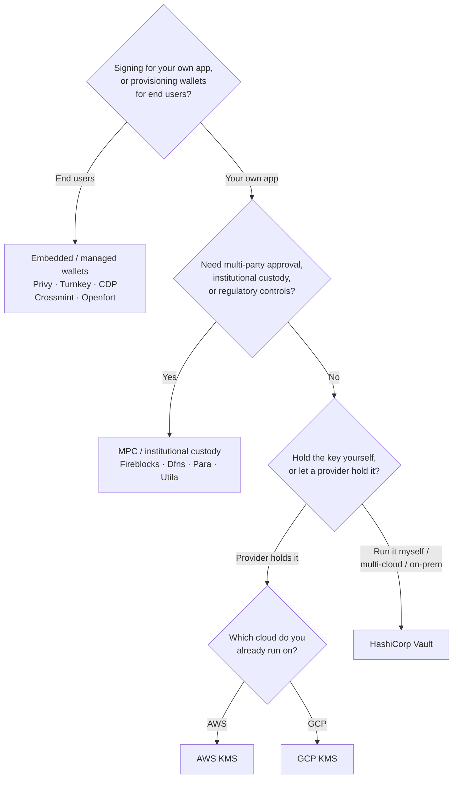

Keychain expone una interfaz `SolanaSigner` única para todos los backends, por
lo que la elección es operativa, no arquitectónica — puedes cambiarla más
adelante mediante configuración. Por eso, **comienza desde tus requisitos, no
desde un producto.** Dos preguntas resuelven la mayor parte: _¿dónde reside la
clave privada y quién está autorizado a firmar con ella?_

No existe un backend universalmente óptimo. Cada uno se adapta mejor a un
conjunto particular de restricciones: la nube en la que ya operas, si deseas
gestionar infraestructura de claves y los controles de custodia y aprobación que
debes cumplir. El flujo a continuación mapea esas restricciones a un backend.

<Callout type="info">
  Esta guía cubre la firma en el backend (lado del servidor). Cuando tus
  usuarios finales firmen sus propias transacciones en un navegador, usa una
  wallet a través del Wallet Standard — consulta [Firma en
  Producción](/docs/core/transactions/signing-in-production).
</Callout>

## Flujo de decisión

<Callout type="info">
  El desarrollo local y las pruebas no necesitan nada de esto — usa el backend
  **Memory** para prototipos y luego cambia a uno de los backends de producción
  mencionados mediante configuración.
</Callout>

## Recorre las preguntas

<Steps>

<Step>

### ¿Estás firmando para tu propia aplicación o para tus usuarios finales?

Si aprovisionas wallets que los **usuarios finales** poseen y operan
(aplicaciones de consumo, flujos de incorporación), utiliza un backend de
**wallet embebida / administrada** — Privy, Turnkey, CDP, Crossmint u Openfort.
Estos gestionan wallets por usuario y la autenticación en tu nombre.

Si estás firmando como **tu propia aplicación** — un pagador de tarifas, una
tesorería, automatización de backend — continúa a continuación.

</Step>

<Step>

### ¿Necesitas aprobación entre múltiples partes, custodia institucional o controles regulatorios?

Si las firmas deben pasar por una política de aprobación, límite de gasto o
flujo de trabajo de cumplimiento antes de generarse — o necesitas un custodio
regulado que gestione las claves — utiliza un backend de **MPC / custodia
institucional**: Fireblocks, Dfns, Para o Utila. Estos dividen o custodian la
clave y cofirman según tu política.

Si solo necesitas una clave que firme bajo petición, continúa a continuación.

</Step>

<Step>

### ¿Quieres gestionar la clave tú mismo o dejar que un proveedor la gestione?

Si un proveedor de nube debe almacenar la clave en infraestructura respaldada
por hardware y tu política de IAM controla quién puede firmar, utiliza el KMS de
ese proveedor:

- **Ejecutándose en AWS** → AWS KMS
- **Ejecutándose en GCP** → GCP KMS

Si quieres operar la infraestructura de claves tú mismo — o tienes un entorno
multi-nube o local — utiliza **HashiCorp Vault**. Tú lo ejecutas y auditas; la
clave permanece dentro del motor Transit y firma bajo petición.

</Step>

</Steps>

## Modelos de custodia

Los backends se agrupan en cinco modelos de custodia. El flujo anterior te sitúa
en uno de ellos.

- **Autocustodia (en proceso)** — tu aplicación almacena la clave privada
  directamente. Conveniente para el desarrollo, pero no apta para producción.
  Backend: **Memory**.
- **Gestión de claves autoalojada** — tú operas la infraestructura de claves; la
  clave permanece dentro de ella y firma bajo petición. Backend: **HashiCorp
  Vault**.
- **Cloud KMS / HSM** — un proveedor de nube almacena la clave en
  infraestructura respaldada por hardware; la clave nunca sale del servicio y tu
  política de IAM controla quién puede firmar. Backends: **AWS KMS**, **GCP
  KMS**.
- **MPC y custodia institucional** — la clave se divide o custodia a través de
  un proveedor, que cofirma según tu política (aprobaciones, límites). Backends:
  **Fireblocks**, **Dfns**, **Para**, **Utila**.
- **Wallets integradas y gestionadas** — un proveedor gestiona wallets en tu
  nombre, generalmente para incorporar usuarios finales. Backends: **Privy**,
  **Turnkey**, **CDP**, **Crossmint**, **Openfort**.

## Comparación de backends

| Backend         | Modelo de custodia              | Ideal para                                                | Notas                                                      |
| --------------- | ------------------------------- | --------------------------------------------------------- | ---------------------------------------------------------- |
| Memory          | Autocustodia (en proceso)       | Desarrollo local, pruebas, CI                             | Clave en texto plano en el proceso — no usar en producción |
| HashiCorp Vault | Gestión de claves autohospedada | Equipos que gestionan su propia infraestructura de claves | Motor Transit; usted lo opera y audita                     |
| AWS KMS         | KMS / HSM en la nube            | Backends que se ejecutan en AWS                           | La clave nunca sale de KMS; IAM controla la firma          |
| GCP KMS         | KMS / HSM en la nube            | Backends que se ejecutan en GCP                           | La clave nunca sale de KMS; IAM controla la firma          |
| Fireblocks      | Custodia MPC / institucional    | Tesorerías, exchanges, custodia regulada                  | Motor de políticas y flujos de aprobación                  |
| Dfns            | Infraestructura de wallets MPC  | Wallets programáticas con controles de política           | Firma Ed25519                                              |
| Para            | Wallets MPC                     | Apps que desean wallets respaldadas por MPC               | API key + ID de wallet                                     |
| Utila           | Custodia MPC + co-firmante      | Wallets de Solana gestionadas por Utila                   | `signMessage` no compatible; usted transmite la tx         |
| Privy           | Wallets embebidas               | Apps de consumo que incorporan usuarios a wallets         | Wallets embebidas gestionadas por la app                   |
| Turnkey         | Gestión de claves sin custodia  | Firma programática con control de políticas               | Gestión de claves sin custodia                             |
| CDP             | Wallet gestionada (Coinbase)    | Apps en Coinbase Developer Platform                       | `signMessage` solo acepta payloads UTF-8                   |
| Crossmint       | Wallets gestionadas             | Marketplaces y apps de wallets gestionadas                | Wallets `smart` e `mpc`; `signMessage` no compatible       |
| Openfort        | Wallets de backend embebidas    | Wallets del lado del servidor                             | Claves almacenadas en TEE                                  |

## Escenarios empresariales

Una sola aplicación frecuentemente necesita más de uno de estos al mismo tiempo.
Dado que la interfaz es idéntica, puedes ejecutar un backend diferente por rol
sin modificar los puntos de llamada.

- **Operaciones de tesorería** — separa un firmante operativo "en caliente" de
  un firmante de tesorería "en frío". Respalde la tesorería con custodia MPC o
  un HSM en la nube y requiera políticas de aprobación antes de firmas de alto
  valor.
- **Flujos de aprobación** — los backends de MPC y custodia (p. ej., Fireblocks)
  exigen aprobación multifirma antes de generar una firma.
- **Cumplimiento y auditoría** — los servicios KMS en la nube (AWS/GCP) y Vault
  emiten registros de auditoría de firmas; los custodios institucionales añaden
  aplicación de políticas e informes.
- **Entornos regulados** — mantén el material de claves en un HSM, KMS o
  custodio institucional para que las claves en bruto nunca entren en contacto
  con tu aplicación.

Consulta
[Mejores prácticas para producción](/docs/tools/keychain/production-best-practices)
para operar estos backends de forma segura.

<Cards>
  <Card title="Guía de Rust" href="/docs/tools/keychain/getting-started/rust">
    Configura cada backend en Rust.
  </Card>
  <Card
    title="Guía de TypeScript"
    href="/docs/tools/keychain/getting-started/typescript"
  >
    Configura cada backend en TypeScript.
  </Card>
</Cards>
