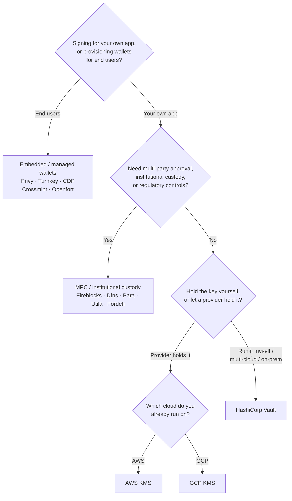

Keychain expone una única interfaz base `SolanaSigner` en todos los backends, por lo que, en
la mayoría de ellos, la elección es operativa y no arquitectónica: puedes cambiarla
más adelante mediante configuración. La excepción es la forma de la transacción. Crossmint
y el modo automático nativo de Fordefi firman y transmiten desde el servidor, y el modo manual
nativo de Fordefi reescribe la transacción antes de firmarla, por lo que pasar a cualquiera
de ellos, o dejarlos, cambia la forma de llamar al firmante. Por eso, **parte de tus
requisitos, no de un producto.** Dos preguntas deciden la mayor parte: _¿dónde
vive la clave privada y quién puede autorizar una firma con ella?_

Todos los backends, excepto Ledger, se ofrecen en los cuatro lenguajes (Rust, TypeScript,
Python y Go). Ledger es solo para Rust, y requiere activar la función opcional `ledger`.

No existe un backend que sea el mejor en todos los casos. Cada uno se adapta mejor a un conjunto
concreto de restricciones: la nube en la que ya trabajas, si quieres operar la infraestructura
de claves y qué controles de custodia y aprobación estás obligado a tener.
El siguiente flujo asocia esas restricciones con un backend.

<Callout type="info">
  Esta guía trata la firma desde el backend (del lado del servidor). Cuando tus usuarios finales firman
  sus propias transacciones en un navegador, utiliza en su lugar una wallet a través del Wallet Standard.
  Consulta [Firma en
  producción](/docs/core/transactions/signing-in-production).
</Callout>

## Flujo de decisión

```mermaid title="Choosing a Keychain backend"
flowchart TD
    Start{Signing for your own app,<br/>or provisioning wallets<br/>for end users?}
    Start -->|End users| Managed[Embedded / managed wallets<br/>Privy · Turnkey · CDP<br/>Crossmint · Openfort]
    Start -->|Your own app| Q2{Need multi-party approval,<br/>institutional custody,<br/>or regulatory controls?}
    Q2 -->|Yes| MPC[MPC / institutional custody<br/>Fireblocks · Dfns · Para · Utila · Fordefi]
    Q2 -->|No| Q3{Hold the key yourself,<br/>or let a provider hold it?}
    Q3 -->|Provider holds it| Q4{Which cloud do you<br/>already run on?}
    Q4 -->|AWS| AWS[AWS KMS]
    Q4 -->|GCP| GCP[GCP KMS]
    Q3 -->|Run it myself /<br/>multi-cloud / on-prem| Vault[HashiCorp Vault]
```

<Callout type="info">
  El desarrollo local y las pruebas no necesitan nada de esto: usa el backend **Memory**
  para prototipar y, después, cambia a uno de los backends de producción anteriores mediante
  configuración.
</Callout>

## Recorre las preguntas

<Steps>

<Step>

### ¿Firmas para tu propia aplicación o para tus usuarios finales?

Si aprovisionas wallets que **los usuarios finales** poseen y operan (aplicaciones de consumo,
flujos de incorporación), utiliza un backend de **wallet embebida / gestionada**: Privy, Turnkey,
CDP, Crossmint u Openfort. Estos gestionan las wallets y la autenticación de cada usuario
por ti.

Si firmas como **tu propia aplicación** (un pagador de comisiones, una tesorería, automatización
de backend), continúa más abajo.

</Step>

<Step>

### ¿Necesitas aprobación multipartita, custodia institucional o controles regulatorios?

Si las firmas deben superar una política de aprobación, un límite de gasto o un flujo
de cumplimiento antes de generarse, o necesitas un custodio regulado que conserve las
claves, utiliza un backend de **MPC / custodia institucional**: Fireblocks, Dfns, Para,
Utila o Fordefi. Estos dividen o custodian la clave y cofirman según tu
política.

Si solo necesitas una clave que firme bajo demanda, continúa más abajo.

</Step>

<Step>

### ¿Quieres conservar la clave tú mismo o que la conserve un proveedor?

Si quieres que un proveedor de nube conserve la clave en infraestructura respaldada por hardware y
que tu política de IAM controle quién puede firmar, utiliza el KMS de esa nube:

- **Si trabajas en AWS** → AWS KMS
- **Si trabajas en GCP** → GCP KMS

Si quieres operar tú mismo la infraestructura de claves, o trabajas en multinube u
on-premise, utiliza **HashiCorp Vault**. Tú lo ejecutas y lo auditas; la clave permanece dentro del
motor Transit y firma bajo demanda.

</Step>

</Steps>

## Modelos de custodia

Los backends se agrupan en seis modelos de custodia. El flujo anterior te lleva a uno
de ellos.

- **Autocustodia (en proceso)**: tu aplicación conserva la clave privada en bruto.
  Es cómodo para el desarrollo, pero no es adecuado para producción. Backend:
  **Memory**.
- **Autocustodia (wallet de hardware)**: la clave nunca sale del dispositivo Ledger, y
  una persona confirma cada firma en su pantalla. Es adecuado para la firma interactiva
  de operadores, no para servicios desatendidos. Solo Rust, opcional y no cubierto
  por la auditoría. Backend: **Ledger**.
- **Gestión de claves autoalojada**: tú operas la infraestructura de claves; la clave
  permanece dentro de ella y firma bajo demanda. Backend: **HashiCorp Vault**.
- **KMS / HSM en la nube**: un proveedor de nube almacena la clave en una infraestructura
  respaldada por hardware; la clave nunca sale del servicio y tu política de IAM controla
  quién puede firmar. Backends: **AWS KMS**, **GCP KMS**.
- **MPC y custodia institucional**: la clave se divide o se custodia en un
  proveedor, que cofirma según tu política (aprobaciones, límites).
  Backends: **Fireblocks**, **Dfns**, **Para**, **Utila**, **Fordefi**.
- **Wallets embebidas y gestionadas**: un proveedor gestiona las wallets por ti,
  a menudo para incorporar a usuarios finales. Backends: **Privy**, **Turnkey**, **CDP**,
  **Crossmint**, **Openfort**.

## Comparación de backends

| Backend         | Modelo de custodia                  | Ideal para                                     | Notas                                                                                                              |
| --------------- | ------------------------------ | -------------------------------------------- | ------------------------------------------------------------------------------------------------------------------ |
| Memory          | Autocustodia (en proceso)      | Desarrollo local, pruebas, CI                 | Clave en bruto en el proceso; no usar en producción                                                                       |
| Ledger          | Autocustodia (wallet de hardware) | Firma interactiva de operadores desde herramientas de Rust | Solo Rust, función opcional `ledger`, sin auditar; cada firma se confirma en el dispositivo                                 |
| HashiCorp Vault | Gestión de claves autoalojada     | Equipos que gestionan su propia infraestructura de claves   | Motor Transit; usted lo opera y audita                                                                           |
| AWS KMS         | KMS / HSM en la nube                | Backends que se ejecutan en AWS                      | La clave nunca sale de KMS; IAM controla la firma                                                                         |
| GCP KMS         | KMS / HSM en la nube                | Backends que se ejecutan en GCP                      | La clave nunca sale de KMS; IAM controla la firma                                                                         |
| Fireblocks      | Custodia MPC / institucional    | Tesorerías, exchanges, custodia regulada     | Motor de políticas y flujos de aprobación                                                                               |
| Dfns            | Infraestructura de carteras MPC      | Carteras programáticas con controles de política    | Firma Ed25519                                                                                                    |
| Para            | Carteras MPC                    | Apps que desean carteras respaldadas por MPC            | Clave API + ID de cartera                                                                                                |
| Utila           | Custodia MPC + co-firmante        | Carteras Solana gestionadas por Utila        | `signMessage` no compatible; usted difunde la tx                                                                    |
| Fordefi         | Custodia MPC / institucional    | Custodia institucional con controles de política   | Caja negra: tú envías. Automático nativo: Fordefi reescribe y envía. Manual nativo: Fordefi reescribe, tú envías el resultado |
| Privy           | Carteras integradas               | Apps de consumo para incorporar usuarios a carteras    | Carteras integradas gestionadas por la app                                                                                       |
| Turnkey         | Gestión de claves no custodial   | Firma programática con control de políticas           | Gestión de claves no custodial                                                                                       |
| CDP             | Cartera gestionada (Coinbase)      | Apps en Coinbase Developer Platform      | `signMessage` solo acepta payloads UTF-8                                                                          |
| Crossmint       | Carteras gestionadas                | Marketplaces y apps con carteras gestionadas         | Solo envío: transmite desde el servidor, puede reescribir para patrocinar el gas; `signMessage` no es compatible                   |
| Openfort        | Carteras backend integradas       | Carteras del lado del servidor                          | Claves almacenadas en TEE                                                                                                    |

## Forma de las capacidades

Además de la custodia, cada backend tiene una única forma de transacción, y esta determina cómo
llamas al firmante:

- **Firmar**: el proveedor firma los bytes que has construido y tú los transmites. La mayoría de
  los backends, incluidos Ledger y el modo de caja negra de Fordefi.
- **Reescribir y firmar**: el proveedor reescribe la transacción y luego la firma
  sin transmitirla. Continúa a partir de la transacción que devuelve. Modo manual
  nativo de Fordefi.
- **Firmar y transmitir**: el proveedor firma y transmite desde el servidor, por lo que un
  fallo no significa que no se haya registrado nada. Crossmint y el modo automático nativo de Fordefi.

La tabla de capacidades del firmante en el README de cada lenguaje indica la forma de cada
backend; el
[modelo de seguridad](https://github.com/solana-foundation/solana-keychain/blob/main/docs/SECURITY_MODEL.md)
explica qué garantiza cada forma.

## Escenarios empresariales

Una misma aplicación suele necesitar más de uno de ellos a la vez. Como la
interfaz es compartida, puedes ejecutar un backend distinto por rol sin cambiar
los puntos de llamada, siempre que los backends compartan la misma forma de capacidades.

- **Operaciones de tesorería** — separa un firmante operativo "caliente" de un
  firmante de tesorería "frío". Respalda la tesorería con custodia MPC o un HSM
  en la nube y exige políticas de aprobación antes de firmas de alto valor.
- **Flujos de aprobación** — los backends de MPC y custodia (p. ej., Fireblocks)
  aplican la aprobación de múltiples partes antes de producir una firma.
- **Cumplimiento y auditoría** — el KMS en la nube (AWS/GCP) y Vault generan
  registros de auditoría de firma; los custodios institucionales añaden
  aplicación de políticas e informes.
- **Entornos regulados** — mantén el material de claves en un HSM, KMS o
  custodio institucional para que las claves sin procesar nunca toquen tu
  aplicación.

Consulta
[Mejores prácticas de producción](/docs/tools/keychain/production-best-practices)
para operar estos backends de forma segura.

<Cards>
  <Card title="Guía de Rust" href="/docs/tools/keychain/getting-started/rust">
    Configura cada backend en Rust.
  </Card>
  <Card
    title="Guía de TypeScript"
    href="/docs/tools/keychain/getting-started/typescript"
  >
    Configura cada backend en TypeScript.
  </Card>
</Cards>
