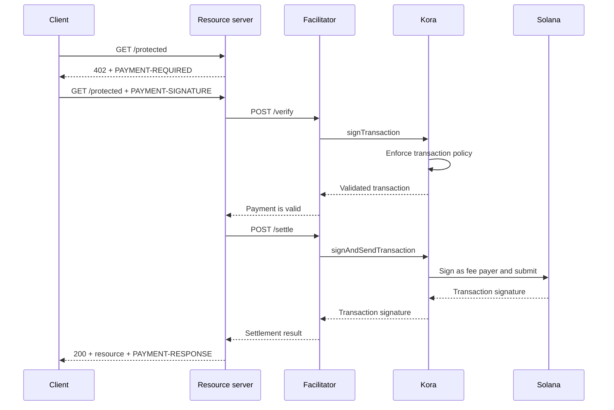

Kora puede proporcionar la capa de firma en Solana, política de transacciones y patrocinio de comisiones detrás de un [facilitador x402 V2](/docs/tools/x402-facilitator). El facilitador implementa la API HTTP de x402; Kora valida, firma y envía las transacciones de pago que acepta.

Esta guía inicia el facilitador de referencia de Kora en Solana Devnet. Es un entorno de desarrollo para probar la integración, no un despliegue en producción.

## Arquitectura



Los cuatro roles de la aplicación se mantienen separados:

- El **cliente** selecciona un requisito de pago y firma la autorización de pago.
- El **servidor de recursos** establece el precio de una ruta y la cumple solo tras una verificación y liquidación exitosas.
- El **facilitador** expone los endpoints `/supported`, `/verify` y `/settle` de x402.
- **Kora** firma únicamente las transacciones permitidas por su política y puede patrocinar las comisiones de red de Solana.

Kora no reemplaza el protocolo x402. Es el límite de firma y política utilizado por esta implementación del facilitador.

## Iniciar el facilitador de referencia

Necesitas Git y [Docker con Compose](https://docs.docker.com/compose/). Clona la última versión estable de Kora e ingresa al demo de x402:

```bash
git clone --branch v2.0.5 --depth 1 https://github.com/solana-foundation/kora.git
cd kora/examples/x402/demo
cp .env.example .env
```

Establece `KORA_PRIVATE_KEY` en `.env` con un keypair desechable de Devnet. La configuración del firmante del demo acepta un secreto en base58, un keypair en formato de array de bytes o la ruta a un archivo keypair JSON. Fondea su dirección pública con SOL de Devnet para que pueda patrocinar las comisiones de transacción.

<Callout type="caution" title="Usa un firmante de Devnet desechable">
  El demo de Docker carga el firmante de Kora desde una variable de entorno. No introduzcas una clave de firma de producción en este demo ni confirmes el archivo `.env`.
</Callout>

Inicia Kora y el facilitador:

```bash
docker compose up --build
```

La primera compilación puede tardar varios minutos. Cuando ambas comprobaciones de estado sean exitosas, inspecciona las capacidades anunciadas del facilitador desde otra terminal:

```bash
curl http://127.0.0.1:3000/supported
```

La respuesta debería anunciar la versión `2` de x402, el esquema `exact` y el identificador de red CAIP-2 de Devnet:

```json
{
  "kinds": [
    {
      "x402Version": 2,
      "scheme": "exact",
      "network": "solana:EtWTRABZaYq6iMfeYKouRu166VU2xqa1",
      "extra": {
        "feePayer": "<KORA_SIGNER_ADDRESS>"
      }
    }
  ]
}
```

Kora escucha en `127.0.0.1:8080` y el facilitador escucha en `127.0.0.1:3000` de forma predeterminada. Detén el demo con `Ctrl+C`.

## Conectar un servidor de recursos

Configura el servidor de recursos de x402 para usar el facilitador local y la dirección pública del firmante de Kora como destinatario:

```bash
FACILITATOR_URL=http://127.0.0.1:3000
SOLANA_PAY_TO=<KORA_SIGNER_ADDRESS>
```

Luego sigue [x402 en Solana](/docs/payments/agentic-payments/x402) para agregar middleware x402 V2 a una ruta de Express. Una solicitud sin pago recibe `PAYMENT-REQUIRED`, el reintento lleva `PAYMENT-SIGNATURE` y una respuesta exitosa lleva `PAYMENT-RESPONSE`.

No copies ejemplos que usen `X-PAYMENT`, `X-PAYMENT-RESPONSE` o el nombre de red `solana-devnet`. Esos campos pertenecen a x402 V1.

El repositorio de Kora también incluye una API protegida y un cliente con conciencia de pagos en el mismo directorio `examples/x402/demo`. Usa esas aplicaciones cuando necesites ejecutar el flujo local completo.

## Configurar la política de Kora

El archivo de referencia `kora/kora.toml` es intencionalmente restrictivo. Su política de validación controla:

- qué programas de Solana permite el firmante;
- qué mints de tokens SPL pueden utilizarse;
- el máximo de lamports patrocinados y el recuento de firmas;
- qué operaciones del pagador de comisiones están prohibidas; y
- qué extensiones de Token-2022 son rechazadas.

El demo habilita únicamente los métodos RPC de Kora que necesita su facilitador: `signTransaction`, `signAndSendTransaction`, `getBlockhash`, `getPayerSigner`, `getConfig` y `getVersion`.

Trata la política como el límite de seguridad para la clave del pagador de comisiones. Para un servicio en producción:

1. Incluye en la lista de permitidos solo los programas, mints de tokens y formas de transacción que produce tu esquema x402.
2. Deniega transferencias, cambios de autoridad, cierre de cuentas y otras instrucciones que puedan mover valor desde el firmante de Kora.
3. Establece límites de transacción y uso que acotan la pérdida ante una credencial de facilitador comprometida.
4. Usa un backend de firmante gestionado en lugar de una clave privada almacenada en una variable de entorno.

## Asegurar la conexión entre el facilitador y Kora

El demo habilita la autenticación mediante clave API de Kora. El facilitador envía el valor de `KORA_API_KEY`, que debe coincidir con `[kora.auth].api_key` en `kora.toml`.

Para producción, también:

- mantén Kora en una red privada y termina TLS en un límite de confianza;
- almacena las credenciales de API en un gestor de secretos y rótalas;
- considera la autenticación de solicitudes HMAC de Kora para protección contra manipulación y repetición;
- separa las claves del pagador de comisiones y del destinatario del pago cuando tu modelo contable lo requiera; y
- configura alertas sobre rechazos de política, fallos de liquidación, consumo de comisiones y saldo del firmante.

## Reforzar la liquidación de pagos

Kora valida la transacción de Solana, pero el facilitador y el servidor de recursos siguen siendo responsables de la corrección del protocolo x402. Antes de servir un recurso, verifica:

- la versión x402 seleccionada, el esquema, la red, el activo, el importe y el destinatario;
- el tiempo de vida de la autorización y el diseño exacto de las instrucciones de Solana;
- la protección atómica contra reproducción y la liquidación idempotente;
- la confirmación al nivel de compromiso requerido por el producto; y
- una correspondencia duradera entre la compra, el resultado de la liquidación y el cumplimiento.

No devuelvas contenido pagado únicamente porque Kora haya aceptado una transacción para firmar. Cumple solo después de que el facilitador devuelva un resultado de liquidación exitoso.

## Recursos relacionados

- [Repositorio de Kora y demo x402](https://github.com/solana-foundation/kora/tree/main/examples/x402/demo)
- [Configuración del operador de Kora](/docs/tools/kora/operators/configuration)
- [Backends de firmante de Kora](/docs/tools/kora/operators/signers)
- [Auditorías de seguridad de Kora](/docs/tools/kora/security-audits)
- [Especificación de x402 V2](https://github.com/x402-foundation/x402/blob/main/specs/x402-specification-v2.md)
- [Descripción general de pagos agénticos](/docs/payments/agentic-payments)
