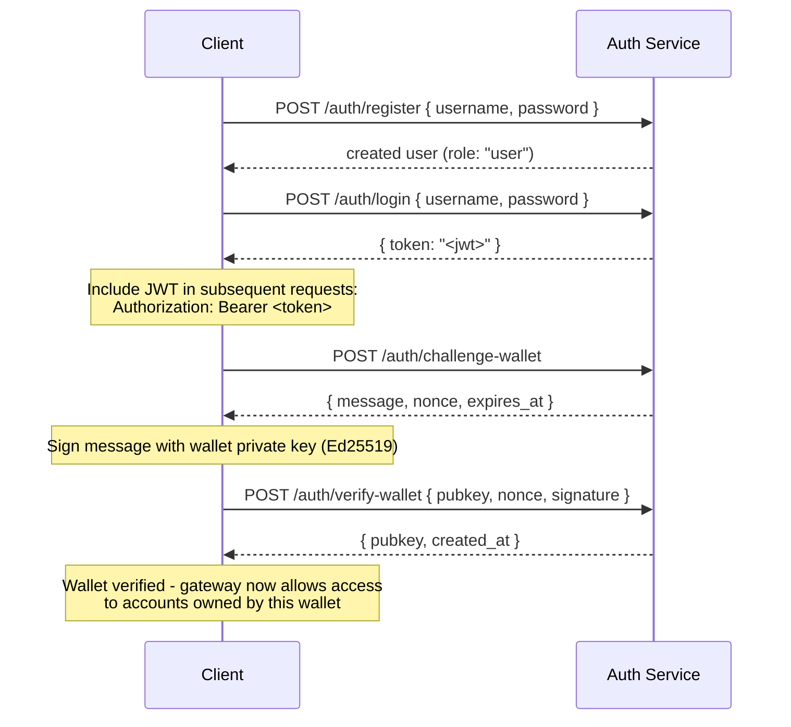

## Descripción general

Private Channels incluye un Servicio de Autenticación opcional que protege el acceso al gateway
mediante autenticación JWT y control de acceso basado en roles (RBAC). Cuando
la autenticación está deshabilitada, el gateway acepta todas las conexiones. Cuando está habilitada,
los clientes deben presentar un JWT válido en cada solicitud.

Esta página cubre ambos tipos de usuario:

- **Desarrolladores** - registro, inicio de sesión, verificación de billetera y realización de
  solicitudes autenticadas
- **Operadores** - habilitación del servicio de autenticación, configuración de `JWT_SECRET` y
  aprovisionamiento del rol `operator`

## Habilitación de la autenticación

La autenticación se habilita configurando `JWT_SECRET` (con un valor no vacío) tanto en el
gateway como en el Servicio de Autenticación. El Servicio de Autenticación también requiere
`AUTH_DATABASE_URL`.

Cuando `JWT_SECRET` no está configurado, el gateway opera en modo abierto; no se requiere
ningún token.

> **Docker Compose:** El servicio de autenticación es un perfil de Docker Compose y **no
> se inicia por defecto**. Para incluirlo, pasa `--profile auth` a tu
> comando `docker compose`, incluyendo `--env-file .env` para que los secretos como
> `JWT_SECRET` y `POSTGRES_PASSWORD` se resuelvan correctamente (Compose deshabilita su
> carga automática de `.env` una vez que se pasa cualquier indicador `--env-file`):
>
> ```bash
> docker compose -f docker-compose.devnet.yml --env-file versions.env --env-file .env.devnet --env-file .env --profile auth up -d
> ```

## API del Servicio de Autenticación

Todos los endpoints están bajo `/auth`. El servicio de autenticación escucha en `AUTH_PORT`
(valor predeterminado `8903`).

### `POST /auth/register`

Crea una nueva cuenta. Todos los usuarios se registran con el rol `user`.

```json
{ "username": "alice", "password": "hunter2" }
```

- Nombre de usuario: entre 5 y 32 caracteres, alfanumérico más `_` y `-`
- Contraseña: entre 6 y 128 caracteres
- Devuelve el usuario creado; la contraseña nunca se devuelve

### `POST /auth/login`

Autentica al usuario y devuelve un JWT firmado válido por 24 horas.

```json
{ "username": "alice", "password": "hunter2" }
```

Devuelve `{ "token": "<jwt>" }`. Tanto un nombre de usuario incorrecto como una contraseña incorrecta devuelven
`401` para evitar la enumeración de nombres de usuario.

### `POST /auth/challenge-wallet`

Solicita un desafío de firma para demostrar la propiedad de una billetera de Solana. Requiere un
JWT válido.

Devuelve un mensaje, un nonce y una fecha de expiración. El desafío expira en 10 minutos.

```json
{
  "message": "PrivateChannel wallet verification\nuser: <uuid>\nnonce: <uuid>\nexpires: <unix>",
  "nonce": "<uuid>",
  "expires_at": "<iso8601>"
}
```

### `POST /auth/verify-wallet`

Envía el desafío firmado para registrar una billetera como verificada. Requiere un JWT
válido.

```json
{
  "pubkey": "<base58 pubkey>",
  "nonce": "<uuid from challenge>",
  "signature": "<base58 Ed25519 signature>"
}
```

El servicio reconstruye el mensaje del desafío, verifica la firma Ed25519
y almacena la billetera. Cada nonce solo puede consumirse una vez; los replays son
rechazados.

Devuelve `{ "pubkey": "<base58>", "created_at": "<iso8601>" }`.

### `GET /auth/wallets`

Lista todas las billeteras verificadas del usuario autenticado. Requiere un JWT válido.

### `DELETE /auth/wallets/{pubkey}`

Elimina una billetera verificada de la cuenta del usuario autenticado. Requiere un JWT
válido.

### `GET /health`

Verificación de actividad. Devuelve `200 ok`. No requiere autenticación.

## Estructura del JWT

Los tokens utilizan el algoritmo HS256 y expiran 24 horas después de su emisión.

| Claim  | Valor                           |
| ------ | ------------------------------- |
| `sub`  | UUID del usuario                       |
| `role` | `"user"` o `"operator"`        |
| `iss`  | `"private-channel-auth"`        |
| `aud`  | `"private-channel-gateway"`     |
| `exp`  | Marca de tiempo Unix (24h desde la emisión) |

> `iss` y `aud` están presentes en el payload del JWT pero son validados por la
> configuración JWT del gateway, no deserializados en el struct de claims de la aplicación.
> El código de la capa de aplicación solo tiene acceso a `sub`, `role` y `exp`.

Pasa el token en el encabezado `Authorization`:

```
Authorization: Bearer <JWT_TOKEN>
```

## Roles

### user

Rol predeterminado al registrarse.

- El acceso está limitado a las billeteras verificadas del propio usuario
- Bloqueado para: `getBlock`, `getTransaction`, `simulateTransaction`
- Puede: llamar a `Deposit` en el Escrow Program, iniciar retiros mediante
  `WithdrawFunds`

### operator

Rol elevado. Debe aprovisionarse directamente; no existe una ruta de autoservicio para
escalar de `user` a `operator`.

**Otorgar el rol**, ya sea mediante la CLI de administración (`private-channel-auth-admin`):

```bash
private-channel-auth-admin set-role --username alice --role operator
```

o con SQL directo:

<Callout type="warning">
  Esta es una operación de base de datos privilegiada. Restringe el acceso a la base de datos del Servicio de Autenticación
  en consecuencia y audita cualquier cambio de rol.
</Callout>

```sql
UPDATE private_channel_auth.users SET role = 'operator' WHERE username = 'alice';
```

**Registrar una billetera sin el flujo de autoverificación (CLI de administración,
`private-channel-auth-admin`):**

```bash
private-channel-auth-admin attach-wallet --username alice --pubkey <base58-pubkey>
```

Este comando inserta una billetera verificada directamente en la tabla `verified_wallets`,
omitiendo el flujo de desafío/verificación. Aplica una restricción de unicidad sobre
`(user_id, pubkey)`. **No** otorga el rol `operator` por sí mismo; usa
`set-role` o la actualización SQL indicada arriba para eso. Este comando sirve para asociar una
billetera a una cuenta (por ejemplo, una cuenta de servicio) sin requerir el
flujo interactivo de desafío/verificación.

**Capacidades:**

- Omite todas las verificaciones de propiedad de billetera
- Acceso completo a todos los métodos RPC del gateway, incluidos `getBlock`,
  `getTransaction`, `simulateTransaction`
- Requerido para: `ReleaseFunds`, `ResetSmtRoot`

## Flujo de autenticación completo



## Realización de solicitudes autenticadas

```typescript
const response = await fetch("http://localhost:8899/", {
  method: "POST",
  headers: {
    "Content-Type": "application/json",
    Authorization: `Bearer ${jwtToken}`
  },
  body: JSON.stringify({
    jsonrpc: "2.0",
    id: 1,
    method: "getBalance",
    params: [walletAddress]
  })
});
const data = await response.json();
```

## Endpoints del gateway

Estos endpoints no requieren autenticación:

| Endpoint  | Método | Descripción                               | Éxito                  | Fallo                     |
| --------- | ------ | ----------------------------------------- | ------------------------ | --------------------------- |
| `/health` | GET    | Verificación de actividad                            | `200 {"status":"ok"}`    | -                           |
| `/ready`  | GET    | Disponibilidad profunda; sondea nodos de escritura y lectura | `200 {"status":"ready"}` | `503 {"status":"degraded"}` |

Para la referencia de `JWT_SECRET` y las variables de entorno del gateway, consulta la
[Referencia de configuración](/docs/tools/private-channels/operators/configuration).

## Matriz de acceso a métodos RPC

Los siguientes métodos son reconocidos por el gateway. Cuando `JWT_SECRET` está configurado,
el acceso depende del rol en el JWT:

| Método                        | Ruta      | Sin JWT | `user`           | `operator` |
| ----------------------------- | ---------- | ------ | ---------------- | ---------- |
| `sendTransaction`             | Nodo de escritura | ✓      | ✓                | ✓          |
| `getLatestBlockhash`          | Nodo de lectura  | ✓      | ✓                | ✓          |
| `getSlot`                     | Nodo de lectura  | ✓      | ✓                | ✓          |
| `getRecentBlockhash`          | Nodo de lectura  | ✓      | ✓                | ✓          |
| `getSignatureStatuses`        | Nodo de lectura  | ✓      | ✓                | ✓          |
| `getTransactionCount`         | Nodo de lectura  | ✓      | ✓                | ✓          |
| `getFirstAvailableBlock`      | Nodo de lectura  | ✓      | ✓                | ✓          |
| `getBlocks`                   | Nodo de lectura  | ✓      | ✓                | ✓          |
| `getEpochInfo`                | Nodo de lectura  | ✓      | ✓                | ✓          |
| `getEpochSchedule`            | Nodo de lectura  | ✓      | ✓                | ✓          |
| `getRecentPerformanceSamples` | Nodo de lectura  | ✓      | ✓                | ✓          |
| `getBlockTime`                | Nodo de lectura  | ✓      | ✓                | ✓          |
| `getVoteAccounts`             | Nodo de lectura  | ✓      | ✓                | ✓          |
| `getSupply`                   | Nodo de lectura  | ✓      | ✓                | ✓          |
| `getSlotLeaders`              | Nodo de lectura  | ✓      | ✓                | ✓          |
| `isBlockhashValid`            | Nodo de lectura  | ✓      | ✓                | ✓          |
| `getAccountInfo`              | Nodo de lectura  | 401    | restringido por propiedad¹ | ✓          |
| `getTokenAccountBalance`      | Nodo de lectura  | 401    | restringido por propiedad¹ | ✓          |
| `getSignaturesForAddress`     | Nodo de lectura  | 401    | restringido por propiedad¹ | ✓          |
| `getBlock`                    | Nodo de lectura  | 401    | 403              | ✓          |
| `getTransaction`              | Nodo de lectura  | 401    | 403              | ✓          |
| `simulateTransaction`         | Nodo de lectura  | 401    | 403              | ✓          |

¹ **Restringido por propiedad**: para una cuenta de token SPL (el campo owner es `TokenkegQ...`
o `TokenzQ...`, con datos de al menos 165 bytes), el gateway verifica que el campo
`owner` o `delegate` coincida con una de las billeteras verificadas del usuario autenticado. Para cualquier otro tipo de cuenta (una billetera de System Program, o un PDA desconocido),
verifica en su lugar si el pubkey consultado es una de las billeteras verificadas del usuario,
ya que dichas cuentas no tienen un campo owner/delegate que inspeccionar.
Si alguna de las verificaciones falla, se devuelve 403.
