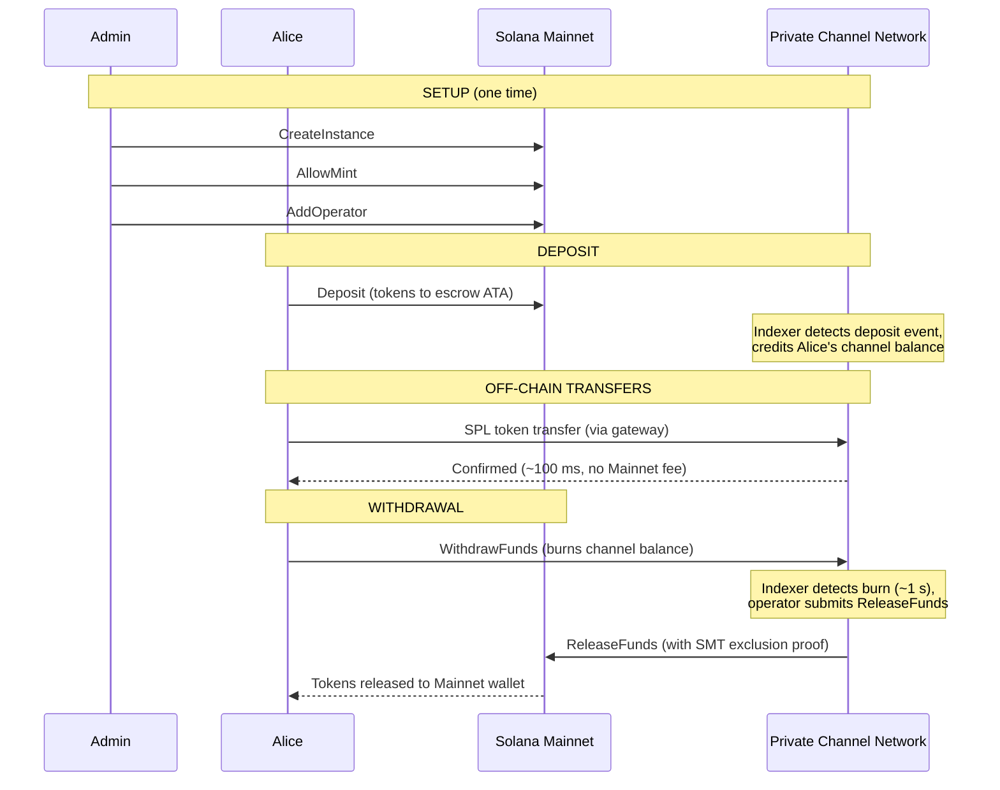
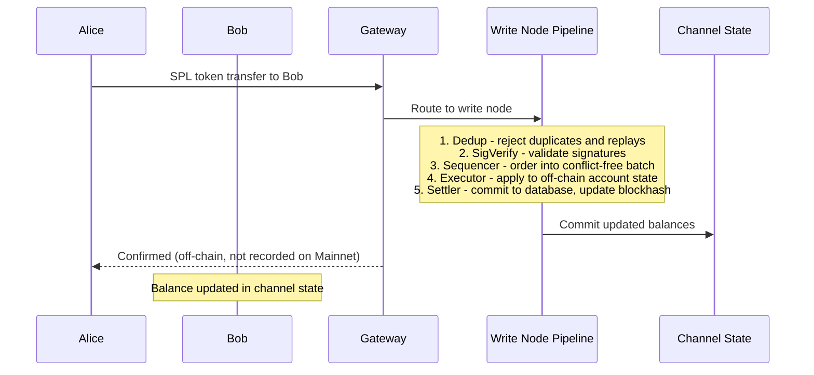
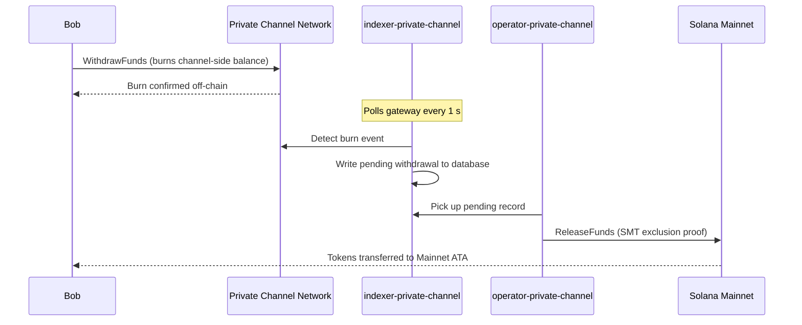

## ¿Qué es un Canal Privado?

Un canal privado es una red de pagos fuera de cadena anclada a Solana. Los usuarios
depositan tokens SPL en un programa de custodia en cadena y luego realizan transacciones fuera de cadena
a través de una pasarela a alta velocidad y sin coste por transferencia. La liquidación de vuelta a
Solana Mainnet se realiza mediante una prueba de Sparse Merkle Tree, lo que garantiza que los fondos siempre
sean recuperables y el doble gasto sea imposible.

A diferencia del flujo de pago nativo de Solana, las transferencias dentro de un canal no aparecen
en cadena hasta que un usuario retira los fondos. La red del canal ejecuta su propio pipeline de transacciones
(dedup -> sig verify -> sequencer -> executor -> settler) que
procesa las transacciones de forma independiente al tiempo de bloque de Solana.

## Participantes

### Administrador de Instancia

El administrador despliega el PDA `Instance` mediante `CreateInstance` y controla qué mints de tokens SPL
son aceptados (`AllowMint` / `BlockMint`). El administrador aprovisiona y
revoca operadores mediante `AddOperator` / `RemoveOperator`, y puede transferir los derechos de administración
mediante `SetNewAdmin`. Existe un único administrador por instancia. La transferencia de derechos de administración
es irreversible en un solo paso: el administrador actual no puede recuperar el rol
sin la cooperación del nuevo administrador.

### Operadores

Los operadores son aprovisionados por el administrador. Poseen un PDA `Operator` y son las
únicas cuentas autorizadas para llamar a `ReleaseFunds` (para liquidar retiros a
Mainnet) y `ResetSmtRoot` (para rotar el Sparse Merkle Tree). Los operadores omiten
todas las verificaciones de propiedad en la pasarela y tienen acceso a todos los métodos JSON-RPC,
incluyendo `getBlock`, `getTransaction` y `simulateTransaction`. Rol JWT:
`"operator"`. Los operadores deben ser aprovisionados directamente en la base de datos; no existe
escalada de autoservicio. Consulta la
[guía de Operadores](/docs/tools/private-channels/operators) para obtener detalles de despliegue y
configuración.

### Usuarios

Los usuarios se registran por su cuenta a través del Servicio de Autenticación. Rol JWT: `"user"`. Los usuarios pueden llamar
a `Deposit` directamente en el Programa de Custodia e iniciar retiros mediante la
instrucción `WithdrawFunds` del lado del canal en el Programa de Retiro. El acceso a la pasarela
está restringido a sus propias billeteras verificadas; no pueden llamar a `getBlock`,
`getTransaction` ni `simulateTransaction`.

## Ciclo de Vida del Canal

1. **Creación de instancia** - El administrador llama a `CreateInstance`, creando el PDA `Instance`
   y configurando los mints permitidos.
2. **Depósito** - Los usuarios depositan tokens SPL en la custodia mediante la instrucción `Deposit`.
   Los tokens se transfieren al associated token account de la instancia.
3. **Transferencias fuera de cadena** - Los usuarios envían transferencias a través de la pasarela. Las transferencias
   son secuenciadas y ejecutadas en la red del canal sin interactuar con Mainnet.
4. **Inicio de retiro** - Un usuario llama a `WithdrawFunds` en el Programa de Retiro
   (lado del canal) para quemar su saldo y señalizar un retiro.
5. **Liquidación en Mainnet** - Un operador proporciona una prueba de exclusión SMT válida y
   llama a `ReleaseFunds` en el Programa de Custodia (Mainnet), liberando los tokens a la
   billetera del usuario.
6. **Rotación del árbol** - Cuando el SMT se aproxima a su capacidad (65.536 hojas), el
   operador llama a `ResetSmtRoot` para rotar el árbol e iniciar un nuevo epoch.

### Transferencia

### Retiro

## Cuándo Usar Canales Privados

Usa canales privados cuando tu aplicación necesite:

- **Rendimiento fuera de cadena** - tu volumen de transferencias saturaría el TPS de Solana o
  necesitas confirmación en menos de un segundo
- **Privacidad** - las identidades de las contrapartes y los montos de las transferencias no deben aparecer
  en cadena
- **Sin comisiones por transferencia** - transferencias frecuentes donde el coste de SOL por transacción
  resulta prohibitivo

Usa transferencias SPL nativas cuando:

- **La componibilidad en cadena** es necesaria (DeFi, intercambios, préstamos; otros programas
  deben poder observar o actuar sobre la transferencia)
- **La liquidación en una sola transferencia** es suficiente y la privacidad no es una preocupación
- **No hay infraestructura de pasarela** disponible o viable operativamente
