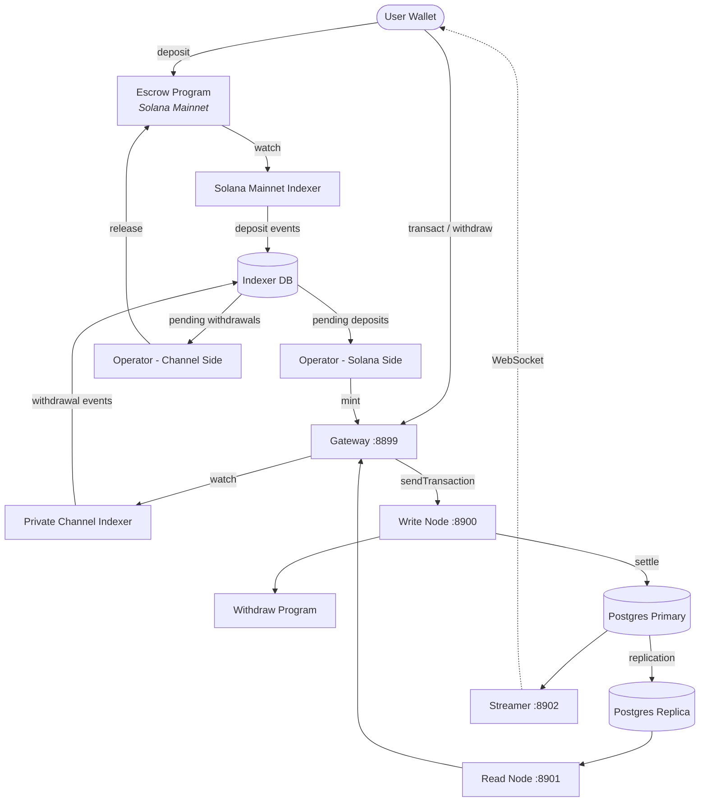

<Callout type="warning">
  Private Channels no ha sido auditado en materia de seguridad y no se recomienda
  su uso en producción con fondos reales sin una revisión de seguridad exhaustiva.
</Callout>

<Callout type="info">
  **¿Desea desplegar una instancia?** Consulte la [guía para
  operadores](/docs/tools/private-channels/operators). **¿Desea integrarse con
  una instancia existente?** Consulte el
  [Inicio rápido](/docs/tools/private-channels/quickstart/installation). Esta página
  es la referencia de arquitectura para ambas audiencias.
</Callout>

## Arquitectura

Private Channels está compuesto por cuatro componentes: dos programas de Solana on-chain
(Escrow y Withdraw) y dos servicios off-chain (Gateway y Auth Service).
Juntos forman un protocolo de canales de estado en el que los fondos residen en Mainnet pero
las transferencias se liquidan off-chain.

### Programa Escrow

El Programa Escrow es un programa de Solana on-chain que almacena tokens SPL
depositados. Es el ancla de confianza del sistema: todos los fondos residen en última
instancia en el escrow hasta que un operador proporcione una prueba de exclusión válida
de Sparse Merkle Tree para liberarlos.

- ID del programa: `9tgHa1DcnaSSUtmMsst8ovKTe1Gfxzezn27KnH9xXYeU`
- Este ID se compila en el binario del programa mediante `declare_id!()`. Los servicios
  off-chain leen el mismo ID en tiempo de compilación desde el crate cliente generado,
  no desde una variable de entorno.
- Gestiona los PDAs `Instance`, `AllowedMint` y `Operator`
- Instrucciones: `CreateInstance`, `AllowMint`, `BlockMint`, `AddOperator`,
  `RemoveOperator`, `SetNewAdmin`, `Deposit`, `ReleaseFunds`, `ResetSmtRoot`

### Programa Withdraw

El Programa Withdraw se ejecuta en la red de canales privados, no en Solana Mainnet.
Los usuarios llaman a `WithdrawFunds` para quemar su saldo de tokens en el lado del canal. Esta quema
no libera los fondos automáticamente; le indica al operador que hay un retiro
pendiente. El operador entonces llama a `ReleaseFunds` en el Programa Escrow
con una prueba SMT válida para completar la liquidación.

- ID del programa: `J231K9UEpS4y4KAPwGc4gsMNCjKFRMYcQBcjVW7vBhVi`
- Este ID se compila en el binario del programa. Los servicios off-chain leen el mismo
  ID en tiempo de compilación desde el crate cliente generado, no desde una variable
  de entorno.

### Gateway

El Gateway es un proxy compatible con JSON-RPC de Solana que enruta las solicitudes de los clientes
al nodo de escritura de la red de canales (para el envío de transacciones) y al nodo de lectura (para
consultas). Se configura mediante variables de entorno: `GATEWAY_PORT`,
`GATEWAY_WRITE_URL`, `GATEWAY_READ_URL`.

Endpoints de salud (sin autenticación requerida):

- `GET /health` - verificación de actividad; devuelve `200 {"status":"ok"}`
- `GET /ready` - disponibilidad profunda, sondea los nodos de escritura y lectura; devuelve
  `200 {"status":"ready"}` o `503 {"status":"degraded"}`

#### Enrutamiento y acceso a métodos RPC

El gateway enruta `sendTransaction` al nodo de escritura y todos los demás métodos al
nodo de lectura. Las solicitudes de más de 64 KB son rechazadas con HTTP 413. Cuando
la autenticación está habilitada, el acceso a los métodos está controlado por el rol JWT. Consulte
**[Autenticación y roles](/docs/tools/private-channels/concepts/auth)** para ver la
matriz completa de métodos.

### Auth Service

El Auth Service es un componente opcional que emite JWTs HS256 (con vencimiento de 24 horas)
para el control de acceso al gateway. Se habilita cuando se establece la variable de entorno
`JWT_SECRET`. Sin ella, el gateway acepta todas las conexiones.

Claims del JWT: `sub` (UUID del usuario), `role` (`"user"` u `"operator"`), `iss`
(`"private-channel-auth"`), `aud` (`"private-channel-gateway"`), `exp` (marca de tiempo Unix).
`iss` y `aud` son validados por la configuración JWT del gateway,
no deserializados en el struct de claims de la aplicación: solo `sub`, `role` y
`exp` están disponibles para el código de la capa de aplicación.

Roles:

- `user` - acceso restringido a los propios monederos verificados; no puede llamar a `getBlock`,
  `getTransaction` ni `simulateTransaction`
- `operator` - omite todas las verificaciones de propiedad; acceso completo a los métodos RPC; debe ser
  provisionado en la base de datos (sin escalada de privilegios por autoservicio)

### Streamer

El Streamer es un servidor WebSocket que envía actualizaciones de estado del canal a los
clientes conectados en tiempo real, eliminando la necesidad de sondear el RPC. Sondea
PostgreSQL para detectar cambios de estado. Forma parte del stack base de Docker Compose, no
del stack de devnet que esta guía despliega; consulte la
[referencia de configuración](/docs/tools/private-channels/operators/configuration#service-port-reference).

- Puerto: `8902`, configurable mediante `STREAMER_PORT`
- Conexión: `ws://localhost:8902`
- Endpoint de salud: `GET /health` - devuelve `503` si algún bucle de sondeo interno
  se detiene durante más de 30 segundos

<Callout type="warning">
  El esquema de eventos WebSocket aún no está documentado públicamente. Consulte
  [`core/src/bin/streamer.rs`](https://github.com/solana-foundation/solana-private-channels/blob/main/core/src/bin/streamer.rs)
  para obtener detalles de implementación hasta que la documentación formal esté disponible.
</Callout>



## Pipeline de transacciones

```text
Transaction -> [1:Dedup] -> [2:SigVerify] -> [3:Sequencer] -> [4:Executor] -> [5:Settler] -> Database
```

Las transacciones enviadas al Gateway pasan por un pipeline de cinco etapas antes
de que su estado sea confirmado:

1. **Dedup** - filtra transacciones duplicadas antes de que entren al pipeline
2. **SigVerify** - valida las firmas de las transacciones contra la clave pública del firmante
3. **Sequencer** - ordena las transacciones válidas de forma determinista para establecer un
   historial canónico
4. **Executor** - ejecuta las transacciones contra la capa de cuentas del canal
   (BOB Cache + AccountsDB), actualizando los saldos off-chain
5. **Settler** - confirma los resultados acumulados de las transacciones en PostgreSQL y
   actualiza la caché de Redis; genera nuevos blockhashes para el siguiente ciclo de bloques.
   La liquidación en Mainnet (llamando a `ReleaseFunds`) es gestionada por separado por el
   servicio `operator-private-channel`

## Características principales

### Privacidad

Las transferencias entre participantes del canal no se registran en Solana Mainnet. Solo
los depósitos (al entrar al canal) y los retiros finales (al salir del canal)
aparecen on-chain. Las identidades de las contrapartes y los montos de las transferencias no son visibles para
observadores externos durante la operación del canal.

### Rendimiento

El pipeline off-chain elimina el tiempo de bloque de Solana de la ruta crítica.
Las transferencias se confirman cuando el sequencer las procesa, no cuando se confirma
un bloque de Solana. Esto permite una finalidad en menos de un segundo y un rendimiento superior
al TPS nativo de Solana para las transferencias a nivel de aplicación.

### Liquidación

Cada retiro está protegido por una prueba de Sparse Merkle Tree on-chain. La raíz SMT
se almacena en `Instance.withdrawal_transactions_root` en el Programa Escrow.
Cuando se llama a `ReleaseFunds`, el programa primero verifica una prueba de exclusión
para un nonce no visto contra la raíz on-chain actual, luego verifica una prueba de
inclusion separada para ese nonce contra la nueva raíz proporcionada por el llamador. Solo
una vez que ambas verificaciones se superan, almacena la nueva raíz, haciendo imposible el
doble gasto incluso si una clave de operador se ve comprometida.

## Modelo de seguridad

**Clave de administrador** - controla la creación de instancias (`CreateInstance`) y el
provisionamiento de operadores (`AddOperator` / `RemoveOperator`). El compromiso de la
clave de administrador permite el provisionamiento arbitrario de operadores. `SetNewAdmin`
transfiere la autoridad de administrador de forma irreversible en un solo paso; proteja la
clave de administrador en consecuencia.

**Claves de operador** - pueden llamar a `ReleaseFunds` y `ResetSmtRoot`. No pueden
liberar fondos sin una prueba de exclusión SMT válida contra la raíz on-chain actual.
La verificación on-chain `verify_smt_exclusion_proof` es la última línea de
defensa contra retiros no autorizados: una clave de operador comprometida por sí sola no
es suficiente para vaciar el escrow.

**Raíz SMT** - almacenada on-chain en `Instance.withdrawal_transactions_root`.
Actualizada de forma atómica con cada llamada a `ReleaseFunds`. Dado que cada prueba debe
referenciar un nonce no visto, el doble gasto del mismo saldo del canal es
imposible incluso si una clave de operador se ve comprometida.

**Rotación del árbol** - `Instance.current_tree_index` rastrea los epoch del árbol. Cuando
se llama a `ResetSmtRoot`, incrementa el índice del árbol e invalida todos los
nonces del epoch del árbol anterior, proporcionando una base limpia para los nuevos ciclos
de liquidación.

## Seguridad operacional de claves

<Callout type="warning">
  Los servicios off-chain utilizan su propio vocabulario de firmantes, que no está relacionado con
  las autoridades de administrador/operador on-chain descritas en el Modelo de seguridad anterior.
  `ADMIN_PRIVATE_KEY` es obligatorio para todo servicio operador y paga las
  tarifas de transacción; un `OPERATOR_PRIVATE_KEY` separado y opcional proporciona la
  firma del Operador on-chain para `ReleaseFunds` y `ResetSmtRoot`, y recurre
  al valor de `ADMIN_PRIVATE_KEY` cuando no está configurado. Nunca coloque la clave de
  administrador de instancia a nivel de protocolo (utilizada para `CreateInstance` / `AddOperator` / `SetNewAdmin`)
  en ninguna de las dos variables ni la exponga en tiempo de ejecución; mantenga esa clave fría y sin conexión.
</Callout>

`ReleaseFunds` y `ResetSmtRoot` requieren dos firmas on-chain: el pagador de tarifas
(de `ADMIN_PRIVATE_KEY`) y la autoridad del PDA del Operador (de
`OPERATOR_PRIVATE_KEY`, o `ADMIN_PRIVATE_KEY` si no está configurado). El tutorial de devnet
de esta guía de despliegue coloca el keypair de operador generado en
`ADMIN_PRIVATE_KEY` y deja `OPERATOR_PRIVATE_KEY` sin configurar, por lo que el mismo keypair
funciona en ambos roles de firmante. Trate cualquier clave que termine en `ADMIN_PRIVATE_KEY` con
los mismos controles que la clave privada de una hot wallet:

- Almacénela únicamente en el archivo `.env` (incluido en el gitignore), nunca en `.env.devnet` ni
  en ninguna configuración confirmada en el repositorio
- Para despliegues en producción, considere un gestor de secretos (AWS Secrets Manager,
  HashiCorp Vault) en lugar de una variable de entorno en texto plano
- El keypair de administrador de instancia a nivel de protocolo (utilizado para llamar a `AddOperator` /
  `SetNewAdmin`) debe mantenerse frío; solo se necesita durante la configuración de la instancia
  y el provisionamiento de operadores, no durante el tiempo de ejecución

`SetNewAdmin` transfiere los derechos de administrador **de forma irreversible en una sola transacción**:
el administrador actual no tiene ruta de recuperación sin la cooperación del nuevo administrador. No
lo llame sin verificar la dirección de destino.

## Próximos pasos

<Cards>
  <Card
    title="Inicio rápido"
    href="/docs/tools/private-channels/quickstart/installation"
  >
    Configure su entorno y genere clientes TypeScript.
  </Card>
  <Card title="Canales" href="/docs/tools/private-channels/concepts/channels">
    Comprenda los participantes y el ciclo de vida del canal.
  </Card>
  <Card
    title="Sparse Merkle Tree"
    href="/docs/tools/private-channels/concepts/smt"
  >
    Comprenda cómo se verifican las pruebas de retiro on-chain.
  </Card>
  <Card
    title="Instrucciones"
    href="/docs/tools/private-channels/instructions/deposit"
  >
    Referencia completa de instrucciones para todos los programas.
  </Card>
</Cards>
