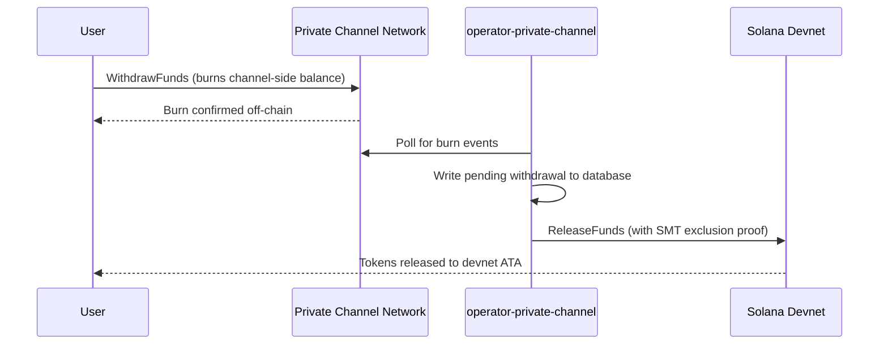

## Descripción General

Retirar fondos de Private Channels es un proceso de dos pasos. Primero, el usuario quema
su saldo de tokens en el canal llamando a `WithdrawFunds` en el Withdraw
Program. Segundo, un operador llama a `ReleaseFunds` en el Escrow Program (devnet,
en este tutorial) con una prueba de exclusión válida del Sparse Merkle Tree para liberar
los fondos. La prueba SMT garantiza que cada nonce de retiro solo pueda usarse una vez,
evitando el doble gasto.



## Paso 1: Iniciar el Retiro en el Canal

Llama a `WithdrawFunds` en el Withdraw Program para quemar tu saldo en el canal.
Usa la variante `Async`, que deriva automáticamente el PDA `tokenAccount` y es la
forma recomendada para uso en producción:

```typescript
import { getWithdrawFundsInstructionAsync } from "../private-channel-withdraw-program/clients/typescript/src/generated";
import {
  createSolanaRpc,
  address,
  pipe,
  createTransactionMessage,
  setTransactionMessageFeePayerSigner,
  setTransactionMessageLifetimeUsingBlockhash,
  appendTransactionMessageInstruction,
  signAndSendTransactionMessageWithSigners,
  assertIsTransactionMessageWithSingleSendingSigner,
  getBase58Decoder
} from "@solana/kit";

// Point to the gateway, not a public Solana RPC
const privateChannelRpc = createSolanaRpc("http://localhost:8899");

const withdrawIx = await getWithdrawFundsInstructionAsync({
  user: userSigner,
  mint: address(mintAddress),
  amount: 1_000_000n, // 1 USDC (6 decimals)
  destination: null // null = release to signer's devnet wallet
});

const { value: latestBlockhash } = await privateChannelRpc
  .getLatestBlockhash({ commitment: "confirmed" })
  .send();

// Sent to the Private Channels gateway (not Solana RPC directly), which
// expects the legacy transaction format - do not switch this to version 0.
const transactionMessage = pipe(
  createTransactionMessage({ version: "legacy" }),
  (m) => setTransactionMessageFeePayerSigner(userSigner, m),
  (m) => setTransactionMessageLifetimeUsingBlockhash(latestBlockhash, m),
  (m) => appendTransactionMessageInstruction(withdrawIx, m)
);

assertIsTransactionMessageWithSingleSendingSigner(transactionMessage);

const signatureBytes =
  await signAndSendTransactionMessageWithSigners(transactionMessage);
const signature = getBase58Decoder().decode(signatureBytes);
console.log("Withdrawal initiated:", signature);
```

- ID del Withdraw Program: `J231K9UEpS4y4KAPwGc4gsMNCjKFRMYcQBcjVW7vBhVi`
- Envía esta transacción al gateway (`http://localhost:8899`), no a un
  RPC público de Solana
- Si se proporciona `destination`, los fondos liberados van a esa billetera en lugar de la
  del firmante

## Qué Esperar

No se requiere ninguna acción adicional después de llamar a `WithdrawFunds`. Los servicios
del operador gestionan la liquidación automáticamente:

1. `indexer-private-channel` consulta el canal cada 1 segundo en busca de eventos de quema
   y escribe un registro de retiro pendiente cuando se detecta el tuyo
2. `operator-private-channel` consulta la base de datos cada 1 segundo en busca de registros
   pendientes y envía `ReleaseFunds` al Escrow Program en Solana devnet
   con la prueba de exclusión SMT requerida; consulta la confirmación en devnet hasta
   5 veces en intervalos de 400 ms antes de reintentar

Los fondos suelen aparecer en tu billetera de devnet en pocos segundos en condiciones normales.

## Cómo Liquida el Operador (Referencia)

Tras la quema en el canal, un operador habilitado debe llamar a `ReleaseFunds` en
el Escrow Program con una prueba de exclusión SMT válida; el operador no puede liberar
fondos sin demostrar que el nonce de retiro no ha sido utilizado antes. Este paso
es gestionado automáticamente por `operator-private-channel`; no necesitas llamarlo
tú mismo.

El operador proporciona:

- `amount`: debe coincidir con el monto quemado
- `user`: billetera destinataria en devnet
- `new_withdrawal_root`: raíz SMT actualizada después de este retiro
- `transaction_nonce`: nonce único para esta hoja
- `sibling_proofs`: 512 bytes (16 hashes de hermanos de 32 bytes para la prueba del árbol)

## Verificar

Una vez confirmada la llamada del operador, comprueba tu saldo de tokens en devnet:

```bash
spl-token balance <MINT_ADDRESS> --owner <YOUR_WALLET>
```

O mediante RPC:

```typescript
import { createSolanaRpc, address } from "@solana/kit";
import { findAssociatedTokenPda } from "@solana-program/token";

const TOKEN_PROGRAM_ADDRESS = address(
  "TokenkegQfeZyiNwAJbNbGKPFXCWuBvf9Ss623VQ5DA"
);

// Query devnet directly; ReleaseFunds settles here, not through the gateway
const rpc = createSolanaRpc("https://api.devnet.solana.com");

const [yourDevnetAta] = await findAssociatedTokenPda({
  mint: address(mintAddress),
  owner: address(userSigner.address),
  tokenProgram: TOKEN_PROGRAM_ADDRESS
});

const balance = await rpc.getTokenAccountBalance(yourDevnetAta).send();
console.log(balance.value.uiAmountString);
```

## Has Completado el Inicio Rápido

Has ejecutado el ciclo completo de Private Channels en devnet: depositaste tokens SPL en
el escrow, enviaste una transferencia off-chain a través del gateway y retiraste los fondos
de vuelta a tu billetera de devnet.

<Cards>
  <Card
    title="Ciclo de Vida del Canal"
    href="/docs/tools/private-channels/concepts/channels"
  >
    Comprende en profundidad los participantes y el flujo completo desde el depósito hasta el retiro.
  </Card>
  <Card
    title="Autenticación y Roles"
    href="/docs/tools/private-channels/concepts/auth"
  >
    Añade autenticación JWT a tu integración.
  </Card>
  <Card
    title="Referencia de Release Funds"
    href="/docs/tools/private-channels/instructions/release-funds"
  >
    Referencia completa de la instrucción ReleaseFunds para herramientas de operador.
  </Card>
  <Card
    title="Sparse Merkle Tree"
    href="/docs/tools/private-channels/concepts/smt"
  >
    Comprende cómo las pruebas de retiro previenen el doble gasto.
  </Card>
</Cards>
