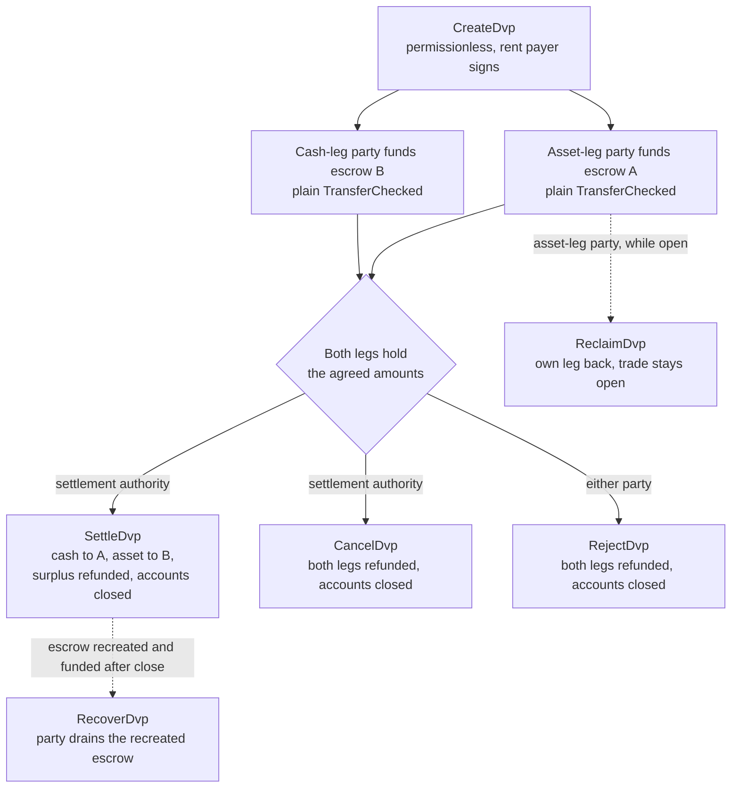
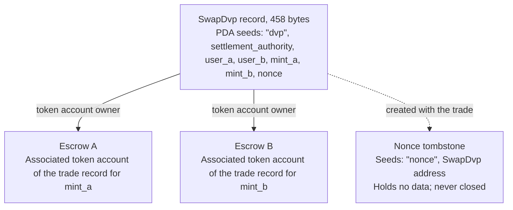

DvP-ohjelma on Solanan vakiomuotoinen ohjelma toimitukseen maksua vastaan.
Sitä ylläpitää Solana Foundation, ja Cantina on auditoinut sen. Kaksi osapuolta sopii
kaupasta, kumpikin lähettää oman osuutensa escrow-tilille tavallisella tokenin
siirrolla, ja selvitysvaltuus selvittää molemmat osuudet yhdessä transaktiossa, jolloin
joko molemmat siirtyvät tai kumpikaan ei siirry. Selvitysvaltuus on kaupassa
nimetty kolmas osoite, kuten tapahtumapaikka tai agentti, joka järjesti kaupan. Kumpikaan osapuoli
ei kirjoita tai ota käyttöön ohjelmaa, ja lompakko tai säilyttäjä, joka voi lähettää vakiomuotoisen
token-siirron (`TransferChecked`), voi rahoittaa osuuden ilman DvP-kohtaista
integraatiota. Selvitykseen asti kumpi tahansa osapuoli voi ottaa oman osuutensa takaisin tai purkaa
kaupan.

<Callout type="warn" title="Lue tietue ennen kuin toimit sen perusteella">

Kauppatietueen luonti on luvaton, joten tietue ei ole todiste
sopimuksesta. Kukin osapuoli lukee tallennetut ehdot ennen rahoitusta, ja selvitysvaltuus
ennen selvitystä (katso
[todentaminen](#verification-before-funding-and-settlement)).

</Callout>

## Miten se toimii

Jokaiselle kaupalle luodaan ohjelman omistama tietue ja kaksi escrow-tiliä, yksi kummallekin osuudelle. Omaisuuseräosuuden osapuoli (`user_a`) ja käteisosuuden osapuoli (`user_b`) rahoittavat kumpikin osuuden siirtämällä tokeneita kyseisen osuuden escrow-tilille. Selvitysvaltuus on ainoa allekirjoittaja, joka voi selvittää kaupan. Selvitys siirtää kummankin osuuden sovitun määrän toiselle puolelle, palauttaa mahdollisen ylijäämän osapuolelle, joka omistaa osuuden, ja sulkee tietueen sekä molemmat escrow't. Atomisuus tulee Solanan [transaktioista](/docs/core/transactions): molemmat siirrot ovat yhdessä transaktiossa,
joten joko molemmat tulevat voimaan tai kumpikaan ei tule.

Jokainen palautus, takaisinotto ja ylijäämän palautus menee osapuolen omaan associated token accountiin: `user_a`:n tilille `mint_a`:lle ja `user_b`:n tilille `mint_b`:lle. Säilyttäjä tai treasury-järjestelmä voi rahoittaa osuuden omalta tililtään, mutta kaikki palautettava päätyy osapuolen tilille, ei takaisin säilyttäjälle. Jokaisesta kaupasta jää myös pysyvä merkintätili (katso [Tila](#state)).

## Oppaat

Vaihesivut vievät yhden kaupan luonnista selvitykseen, ja jokaiselle ohjeelle on TypeScript- ja Rust-esimerkit.

<Cards>
  <Card title="Luo kauppa" href="/docs/defi/dvp-program/create-a-trade">
    Asenna asiakkaat ja tallenna kaupan ehdot CreateDvp:llä
  </Card>
  <Card title="Rahoita osuudet" href="/docs/defi/dvp-program/fund-the-legs">
    Vahvista tallennetut ehdot ja rahoita sitten kukin osuus tavallisella siirrolla
  </Card>
  <Card title="Selvitä kauppa" href="/docs/defi/dvp-program/settle-the-trade">
    Selvitä molemmat osuudet yhdessä transaktiossa selvitysvaltuutena
  </Card>
  <Card title="Pura kauppa" href="/docs/defi/dvp-program/unwind-a-trade">
    Ota osuus takaisin, peruuta tai hylkää kauppa ja palauta myöhäiset talletukset
  </Card>
</Cards>

[Devnet-demo](https://solana.com/delivery-vs-payment/demo) suorittaa kaupan alusta
loppuun: se luo kaupan, rahoittaa molemmat escrow't vakiomuotoisilla token-siirroilla ja
selvittää molemmat osuudet yhdessä transaktiossa.

## Valinta ohjelman ja delegoinnin välillä

[Delivery vs Payment (DvP) delegointia käyttäen](/docs/tokenization/dvp) selvittää
saman vaihdon ilman ohjelmaa: kumpikin osapuoli delegoi positionsa
selvitysagentille, joka siirtää molemmat osuudet yhdessä transaktiossa.

- **Ohjelma** ei tarvitse delegointia, joten yhden delegaatin rajoitus per token
  account ei päde, eikä selvitysvaltuus voi ohjata tuottoja muualle.
  Jokainen kauppa riippuu päivitettävästä ohjelmasta ja sen päivitysvaltuudesta.
- **Delegointimallissa** ei ole ohjelmariippuvuutta, ja se toimii minttien kanssa, joissa
  on Scaled UI Amount. Ohjelma hylkää nämä mintit, mikä sulkee pois kaikki
  Mosaicin `tokenized-security`-mallipohjasta luodut mintit (katso
  [mintin konfiguraatiorajoitukset](#mint-configuration-constraints)).

## Roolit

Ohjelma on symmetrinen. Sen rajapinnassa kaksi osapuolta ovat `user_a`, joka
toimittaa `mint_a`:n, ja `user_b`, joka toimittaa `mint_b`:n. README ja
generoidut asiakkaat kutsuvat `mint_a`:ta omaisuuseräosuudeksi ja `mint_b`:tä käteisosuudeksi, ja
nämä sivut noudattavat tätä käytäntöä, mutta mikään ohjelmassa ei edellytä, että käteisosuus
on käteisinstrumentti. Kaksi omaisuuserää tai kaksi stablecoinia selvitetään samalla
tavalla.

| Rooli                 | Kuka                               | Allekirjoittaa                                              | Huomautukset                                                                                                                                                                                                     |
| -------------------- | --------------------------------- | -------------------------------------------------- | --------------------------------------------------------------------------------------------------------------------------------------------------------------------------------------------------------- |
| Omaisuuseräosuuden osapuoli      | `user_a`, toimittaa `mint_a`:n       | Oma rahoitussiirto; Reclaim, Reject, Recover | keypair-lompakko tai PDA-pohjainen älylompakko, kuten multisig-holvi. SPL Token -multisig-tili tai program account ei voi olla osapuoli: Create epäonnistuu virheellä `PartyNotSignerCapable`                   |
| Käteisosuuden osapuoli       | `user_b`, toimittaa `mint_b`:n       | Oma rahoitussiirto; Reclaim, Reject, Recover | Sama vaatimus                                                                                                                                                                                          |
| Selvitysvaltuus | Luonnin yhteydessä nimetty kolmas osoite | Settle, Cancel                                     | Ainoa allekirjoittaja, joka voi selvittää kaupan. Se ei voi ohjata tuottoja muualle, sillä ne on kiinnitetty luonnin yhteydessä. Se saa suljettujen tilien rentin, kun se selvittää tai peruuttaa kaupan                                         |
| Rentin maksaja           | Se, joka allekirjoittaa `CreateDvp`:n         | Create                                             | Rahoittaa rentin (SOL-talletuksen, joka pitää tilin avoinna) tietueelle, nonce-tombstonelle ja molemmille escrow-tileille. Ei tallenneta rentin vastaanottajaksi: suljetun tilin rent menee sille, joka sulkee kaupan |

## Ohjelmatunnus

```text
dvp34bdbcEm4f4FCUjGV4mDAkDshaQR4LkK8fdcsyZq
```

| Klusteri      | Ohjelma                                       | Päivitysvaltuus                              | Viimeksi käyttöönotettu slot |
| ------------ | --------------------------------------------- | ---------------------------------------------- | ------------------ |
| mainnet-beta | `dvp34bdbcEm4f4FCUjGV4mDAkDshaQR4LkK8fdcsyZq` | `DXtFpbPjcn2hxPnw79x1Pfoj35vXh5AsWBkS37YnXMVv` | 452,058,374        |
| devnet       | `dvp34bdbcEm4f4FCUjGV4mDAkDshaQR4LkK8fdcsyZq` | `5EX1zFeJWj4rGYZv432WnYw8CbaSUeTdxPx4r573UgYU` | 479,376,863        |

Ohjelma on päivitettävissä molemmissa klustereissa. Yllä olevat luvut ovat ne, jotka
`solana program show` raportoi 2. lokakuuta 2026; suorita sama komento saadaksesi
nykyiset arvot. Devnet-koontiversio on vanhempi kuin commit, johon vaihesivut
perustuvat (katso [Asenna](/docs/defi/dvp-program/create-a-trade#install)),
mutta siinä on sama ohje- ja virhejoukko.

## Elinkaari



Kauppa on avoinna `CreateDvp`:stä siihen asti, kunnes jokin toiminnoista Settle, Cancel tai Reject sulkee
sen. Rahoituksella ei ole omaa ohjetta: osuus on rahoitettu, kun sen escrow-
tilillä on vähintään sovittu määrä. Reclaim on osuuskohtainen ja jättää
kaupan avoimeksi, joten yhden osuuden ongelma ei pakota toista osapuolta peruuttamaan
koko kauppaa.

## Tila

Jokaisella kaupalla on yksi `SwapDvp`-tili, jonka koko on 458 tavua ja jonka ohjelma omistaa. Sen
osoite johdetaan selvitysvaltuudesta, kahdesta osapuolesta, kahdesta
mintistä ja noncesta (siemenet
`["dvp", settlement_authority, user_a, user_b, mint_a, mint_b, nonce]`). Määrät
ja ajat tallennetaan tilin sisään eivätkä ne vaikuta osoitteeseen,
minkä vuoksi ne on luettava eikä pääteltävä. Pieni merkintätili,
nonce-tombstone osoitteessa `["nonce", swap_dvp]`, luodaan kaupan yhteydessä eikä
sitä koskaan suljeta, joten kutakin osapuolten, minttien, valtuuden ja noncen yhdistelmää voidaan
käyttää vain yhteen kauppaan.



| Kenttä                                  | Tyyppi          | Merkitys                                                                                                 |
| -------------------------------------- | ------------- | ------------------------------------------------------------------------------------------------------- |
| `bump`                                 | `u8`          | PDA-bump                                                                                                |
| `user_a`, `user_b`                     | `Pubkey`      | Kaksi osapuolta                                                                                         |
| `mint_a`, `mint_b`                     | `Pubkey`      | Omaisuuseräosuuden ja käteisosuuden mintit                                                                        |
| `settlement_authority`                 | `Pubkey`      | Ainoa allekirjoittaja, joka voi selvittää tai peruuttaa kaupan                                                               |
| `token_program_a`, `token_program_b`   | `Pubkey`      | Token-ohjelma, joka omistaa kunkin mintin; kauppa voi yhdistää SPL Token- ja Token-2022-osuuksia                    |
| `amount_a`, `amount_b`                 | `u64`         | Kunkin osuuden sovittu määrä mintin pienimmässä yksikössä (perusyksiköissä)                                 |
| `expiry_timestamp`                     | `i64`         | Tämän verkkoajan (onchain-kellon) jälkeen Settle hylätään. Reclaim, Cancel ja Reject toimivat edelleen |
| `nonce`                                | `u64`         | Erottaa kaupat, joilla on samat muut siemenet. Kertakäyttöinen                                             |
| `ref_string`                           | `[u8; 64]`    | Läpinäkymätön asiakasviite, nollilla täytetty; ohjelma ei koskaan lue sitä                                     |
| `user_a_settlement_destination`        | `Pubkey`      | Vastaanottaa käteisosuuden Settle-vaiheessa; oletuksena `user_a`                                                   |
| `user_b_settlement_destination`        | `Pubkey`      | Vastaanottaa omaisuuseräosuuden Settle-vaiheessa; oletuksena `user_b`                                                  |
| `mint_a_authority`, `mint_b_authority` | `Pubkey`      | Luonnin yhteydessä talteen otetut minttivaltuudet; Settle epäonnistuu, jos jompikumpi on muuttunut                           |
| `earliest_settlement_timestamp`        | `Option<i64>` | Jos asetettu, Settle hylätään ennen tätä verkkoaikaa                                                     |

Kenttäluettelo on otettu ohjelman IDL:stä commitissa, joka on nimetty kohdassa
[Luo kauppa](/docs/defi/dvp-program/create-a-trade#install).

## Ohjeet

| Ohje  | Allekirjoittaja               | Vaikutus                                                                                                                                                              |
| ------------ | -------------------- | ------------------------------------------------------------------------------------------------------------------------------------------------------------------- |
| `CreateDvp`  | Kuka tahansa maksaja            | Luo `SwapDvp`-tietueen, sen nonce-tombstonen ja molemmat escrow-tilit. Ei siirrä tokeneita                                                                        |
| `ReclaimDvp` | `user_a` tai `user_b` | Palauttaa allekirjoittajan oman osuuden escrow'sta. Kauppa pysyy avoinna, ja osuus voidaan rahoittaa uudelleen                                                                      |
| `SettleDvp`  | Selvitysvaltuus | Siirtää `amount_a`:n `user_b`:n kohteeseen ja `amount_b`:n `user_a`:n kohteeseen, palauttaa mahdollisen ylijäämän osuuden osapuolelle sekä sulkee tietueen ja molemmat escrow't |
| `CancelDvp`  | Selvitysvaltuus | Palauttaa kaiken escrow A:ssa olevan `user_a`:lle ja escrow B:ssä olevan `user_b`:lle sekä sulkee tietueen ja molemmat escrow't                                                            |
| `RejectDvp`  | `user_a` tai `user_b` | Sama vaikutus kuin Cancelilla, osapuolen allekirjoittamana                                                                                                                            |
| `RecoverDvp` | `user_a` tai `user_b` | Kun kauppa on suljettu: tyhjentää uudelleen luodun escrow'n allekirjoittajan omaan token accountiin ja sulkee sen. Kattaa talletuksen, joka saapui Settle-, Cancel- tai Reject-toiminnon jälkeen  |

Jokainen palautus menee osapuolen omaan associated token accountiin kyseisen osuuden mintille riippumatta siitä, kuka rahoitti escrow'n.

Kunkin ohjeen tilit ja argumentit ovat kyseisen vaiheen sivulla.

## Virheet

| Koodi | Virhe                            | Milloin                                                                                                   |
| ---- | -------------------------------- | ------------------------------------------------------------------------------------------------------ |
| 0    | `SignerNotParty`                 | Reclaim, Reject tai Recover on allekirjoitettu osoitteella, joka ei ole `user_a` eikä `user_b`                      |
| 1    | `DvpExpired`                     | Settle `expiry_timestamp`:n jälkeen                                                                        |
| 2    | `SettlementAuthorityMismatch`    | Settle tai Cancel on allekirjoitettu osoitteella, joka ei ole selvitysvaltuus                              |
| 3    | `SettlementTooEarly`             | Settle ennen `earliest_settlement_timestamp`:a                                                          |
| 4    | `LegNotFunded`                   | Settle, kun escrow'ssa on vähemmän kuin sovittu määrä                                               |
| 5    | `ExpiryNotInFuture`              | Create, jossa vanhenemisaika on nykyisen verkkoajan kohdalla tai sitä ennen                                            |
| 6    | `EarliestAfterExpiry`            | Create, jossa aikaisin selvitysaika on vanhenemisajan jälkeen                                               |
| 7    | `SelfDvp`                        | Create, jossa `user_a` on sama kuin `user_b`                                                                 |
| 8    | `SameMint`                       | Create, jossa `mint_a` on sama kuin `mint_b`                                                                 |
| 9    | `ZeroAmount`                     | Create, jossa jommankumman osuuden määrä on nolla                                                                |
| 10   | `BlockedMintExtension`           | Create tai Settle mintillä, jossa on TransferFee, InterestBearing, ScaledUiAmount tai NonTransferable |
| 11   | `SettlementAuthorityIsParty`     | Create, jossa selvitysvaltuus on sama kuin osapuoli                                                  |
| 12   | `SettlementAuthorityExecutable`  | Create, jossa selvitysvaltuus on suoritettava                                                         |
| 13   | `NonceAlreadyUsed`               | Create, jossa käytetään uudelleen `(seeds, nonce)` -yhdistelmää, jolla on jo tombstone                                         |
| 14   | `ExpiryTooFarInFuture`           | Create, jossa vanhenemisaika on yli vuoden päässä                                                         |
| 15   | `RefStringTooLong`               | Create, jossa viite on pidempi kuin 64 tavua                                                           |
| 16   | `DvpStillOpen`                   | Recover, kun kauppa on vielä avoinna; käytä Reclaimia                                                     |
| 17   | `DvpNeverCreated`                | Recover siemenillä, joilla ei ole tombstone-merkintää                                                              |
| 18   | `EscrowPreloadedWithLamports`    | Create, kun ei-natiivin escrow-tilin lamports-saldo ylittää sen rent-exempt-vähimmäismäärän                           |
| 19   | `SettlementDestinationIsSwapDvp` | Create siten, että selvityksen kohde on sama kuin kauppatietue                                         |
| 20   | `SwapDvpPreloadedWithLamports`   | Create, kun tietueen osoitteen lamports-saldo ylittää sen rent-varauksen                                   |
| 21   | `RecipientAtaMismatch`           | Vastaanottajan tai hyvityksen token account ei enää kuulu odotetulle lompakolle ja mintille                  |
| 22   | `PartyNotSignerCapable`          | Create osapuolella, joka ei ole järjestelmän omistama, ei-suoritettava tili                                 |
| 23   | `MintAuthorityChanged`           | Settle, kun osuuden mint authority poikkeaa luontihetkellä tallennetusta arvosta                         |

## Tapahtumat ja indeksointi

Ohjelma ei lähetä onchain-tapahtumia. Indeksoija tai täsmäytysjärjestelmä lukee
`SwapDvp`-tilin tilan ja kahden escrow-tilin token-saldot sekä käyttää
`ref_string`-kenttää yhdistääkseen kaupan sen off-chain-toimeksiantoon. Koska
tietue suljetaan selvityksen yhteydessä, järjestelmän, joka tarvitsee ehdot
myöhemmin, on tallennettava ne lukiessaan tai muodostettava ne uudelleen
kaupan luoneesta transaktiosta.

## Tuetut tokenit

Kaupassa voi yhdistää SPL Token -osuuden ja Token-2022-osuuden; kullakin
osuudella on oma token program. Wrapped SOL -osuudet ovat tuettuja.

| Token-2022-laajennus osuuden mintissä                                                     | Ohjelman toiminta                                                  |
| ---------------------------------------------------------------------------------------- | ----------------------------------------------------------------- |
| TransferFee, InterestBearing, ScaledUiAmount, NonTransferable                            | Hylätään Create- ja Settle-vaiheessa virheellä `BlockedMintExtension`         |
| PermanentDelegate, Pausable, DefaultAccountState, freeze authority, MintCloseAuthority | Hyväksytään; kukin authority voi toimia escrow-tokeneilla           |
| ConfidentialTransfer                                                                     | Hyväksytään; kyseisen osuuden määrät ovat julkisia                          |
| TransferHook                                                                             | Tuettu, enintään 32 lisätiliä osuutta kohden                        |
| MemoTransfer kohde- tai hyvitystilillä                                          | Hyväksytään; ohjelma lähettää vaaditun memon ennen siirtoa |

Siirtomaksu jättäisi vastaanottavan puolen vajaaksi sovitusta määrästä.
Interest Bearing ja Scaled UI Amount eivät muuta raakamääriä, mutta niiden
korko tai kerroin voi muuttua kaupan luomisen ja selvityksen välillä, mikä
muuttaa sovittujen määrien näyttötapaa. NonTransferable jumittaisi molemmat
osuudet.

Hyväksytyt authorityt voivat siirtää, jäädyttää tai pysäyttää escrow-tokenit
kaupan koko eliniän ajan (ks. alla). Escrow-tiliä ei voi määrittää vastaanottamaan
luottamuksellisia siirtoja, joten luottamuksellisen osuuden escrow-määrät ja
selvitetyt määrät ovat julkisia.

Hook-mintin osalta asiakasohjelma selvittää hookin lisätilit ja liittää ne
Settle-, Cancel-, Reject-, Reclaim- ja Recover-kutsuihin. Osuutta kohden
sallittu enintään 32 tilin raja sisältää hook-ohjelman ja sen validointitilin.
Jos hook authority laajentaa hookin tililuetteloa tämän rajan yli, jokainen
siirto kyseisellä osuudella epäonnistuu, myös Reclaim, Cancel, Reject ja
Recover, kunnes authority peruu muutoksen. Transaktion tilien enimmäismäärä
voi tulla vastaan ennen osuuskohtaista rajaa, kun molemmilla osuuksilla on
hookit.

Kun kohde- tai hyvitystili vaatii memoja, ohjelma kutsuu Memo-ohjelmaa ennen
siirtoa. Tämän vuoksi jokainen ohjeistus, joka siirtää tokeneita pois
escrowsta, ottaa `memo_program`-tilin.

### Mintin määritysrajoitteet

**Scaled UI Amount.** [Mosaicin](https://github.com/solana-foundation/mosaic), Solana Foundationin
liikkeeseenlaskun työkalupakin, `tokenized-security`-malli lisää aina Scaled UI
Amountin, joten ohjelma ei hyväksy tästä mallista luotua mintiä osuudeksi.
Tähän ohjelmaan tarkoitettu mint voidaan luoda ilman laajennusta (ks.
[Token Extensions](/docs/tokens/extensions));
[DvP delegoinnin avulla](/docs/tokenization/dvp) selvitetään delegoidun
valtuuden kautta, eikä se käytä tätä tarkistusta.

**Oletuksena jäädytetyt mintit.** Kunkin kaupan escrow on associated token account,
jonka omistaa kyseistä kauppaa varten luotu uusi program-derived address. Mintissä,
jonka Default Account State on frozen, escrow luodaan jäädytettynä, ja siihen
tehtävä rahoitussiirto epäonnistuu, kunnes se sulatetaan. [Token ACL:n](/docs/tokenization/token-acl)
alaisuudessa tämä tarkoittaa, että liikkeeseenlaskija tai sen siirtoagentti
hyväksyy kaupan escrow'n ennen rahoitusta: joko lisäämällä kauppatietueen osoitteen
(escrow'n omistajan) sallittujen luetteloon, jolloin kuka tahansa voi sulattaa
escrow'n, jos mintin Token ACL -määritys sallii luvattoman sulatuksen, tai
antamalla freeze authorityn sulattaa se suoraan. Jäädytetty escrow estää myös
Settle-, Reclaim-, Cancel-, Reject- ja Recover-toiminnot kyseisellä osuudella,
joten freeze authority ja hook-mintillä hook authority on luotettu osapuoli
kaupan koko eliniän ajan. Jäädytetyn escrow'n polku kuvataan tässä, eikä sitä
käytetä devnet-koodiesimerkeissä.

## Rajoitukset

- Ei kohdistusta, hinnanmääritystä eikä toimeksiantokirjaa. Osapuolet sopivat
  ehdoista pääkirjan ulkopuolella, ja yksi heistä tallentaa ne.
- Ei netotusta, ja vain kahdenvälinen: yksi tietue on yksi kauppa kahden osapuolen välillä.
- Ei osatäyttöjä. Settle siirtää täsmälleen sovitun määrän kumpaakin osuutta ja
  palauttaa mahdollisen ylijäämän osuuden osapuolelle.
- Ei pääkirjan ulkopuolista osuutta. Molemmat osuudet ovat token accounteja Solanalla;
  olemassa olevia väyliä käyttävä käteisosuus selvitetään erikseen ja täsmäytetään.
- Ei kelpoisuustarkistusta, sallittujen luetteloa eikä KYC:tä. Mintin omat
  hallintamekanismit valvovat haltijoiden kelpoisuutta.
- Ei automaattista selvitystä. Selvitysauthorityn on allekirjoitettava.
- Ei tapahtumia eikä protokollamaksua transaktiomaksujen ja rentin lisäksi.

Ohjelma poistaa kahden osapuolen välisen pääomariskin: kumpikaan osuus ei siirry,
ellei molemmat siirry. Se ei poista kummankaan tokenin liikkeeseenlaskijan
luotto- tai lunastusriskiä, mintin freeze-, pause- tai permanent delegate
-authorityn mahdollisuutta toimia escrow-tokeneilla (ks. [tuetut tokenit](#supported-tokens))
eikä riippuvuutta siitä, että selvitysauthority on käytettävissä allekirjoittamaan.

## Tarkistus ennen rahoitusta ja selvitystä

`CreateDvp` on luvaton: vain maksaja allekirjoittaa, eivätkä osapuolet tai
selvitysauthority allekirjoita. Kuka tahansa voi siis luoda tietueen, jossa on
mitä tahansa osapuolia ja ehtoja. Lue `SwapDvp`-tili ennen rahoitusta ja
uudelleen ennen selvitystä ja varmista seuraavat:

1. Tilin omistaa DvP-ohjelma, ja sen koko on tasan 458 tavua. Tili, jota ohjelma ei
   omista, voidaan täyttää tavuilla, jotka purkautuvat kuin oikea tietue.
2. `user_a`, `user_b`, `mint_a`, `mint_b` ja `settlement_authority` vastaavat
   sovittua kauppaa.
3. `amount_a`, `amount_b`, `expiry_timestamp` ja
   `earliest_settlement_timestamp` vastaavat sovittuja ehtoja.
4. Molemmat selvityskohteet ovat sovitut osoitteet. Väärennetty tietue voi
   ohjata tuotot muualle.

[Rahoita osuudet](/docs/defi/dvp-program/fund-the-legs#verify-the-terms) luettelee
generoitujen asiakasohjelmien tarkistavat lukijat ja näyttää tarkistuksen koodina.

Pidä kauppaa selvitettynä, kun Settle-transaktio saavuttaa tilan
[`finalized`](/docs/rpc#configuring-state-commitment). Tämä on verkon
vahvistustaso; se, merkitseekö se myös selvityksen lopullisuutta juridisessa
mielessä, riippuu osapuolten sopimuksista ja sovellettavista sääntelyjärjestelmistä.

## Versiointi

`SwapDvp`-tilillä ei ole versiokenttää. Sen rakenne on kiinteä 458 tavua
(`SwapDvp::LEN`), ja tarkistavat lukijat hylkäävät minkä tahansa muun pituisen tilin.
IDL:llä on oma versionsa, `0.1.0` 2. lokakuuta 2026 mukaan.

Ohjelma on päivitettävissä kummallakin klusterilla (ks. [Program ID](#program-id)).
Kauppatietue on olemassa vain siihen asti, kun se selvitetään, perutaan tai
hylätään, joten tarkista repositoriosta, miten päivitys käsittelee avoimia
kauppoja, ja generoi asiakasohjelmat uudelleen käyttöön otetun version IDL:stä.

## Repositorio ja auditointi

Lähdekoodi, IDL, generoidut asiakasohjelmat ja testit ovat repositoriossa
[`solana-foundation/dvp`](https://github.com/solana-foundation/dvp) MIT-lisenssillä. Ohjelma on
`no_std`-Pinocchio-ohjelma; asiakasohjelmat generoidaan IDL:stä Codamalla.
Haavoittuvuusilmoitukset tehdään repositorion tietoturvatiedotteen linkin
kautta `SECURITY.md`-tiedoston mukaisesti.

Ohjelman on auditoinut
[Cantina](https://cantina.xyz/portfolio/fe870bb4-d96d-4902-8aec-9dfcfa2d6a79).

## Aiheeseen liittyvää

- [Delivery vs Payment (DvP) delegoinnin avulla](/docs/tokenization/dvp): delegointimalli
  ilman ohjelmaa
- [Token ACL](/docs/tokenization/token-acl): miten rajattu mint toimii
  escrow-tilien kanssa
