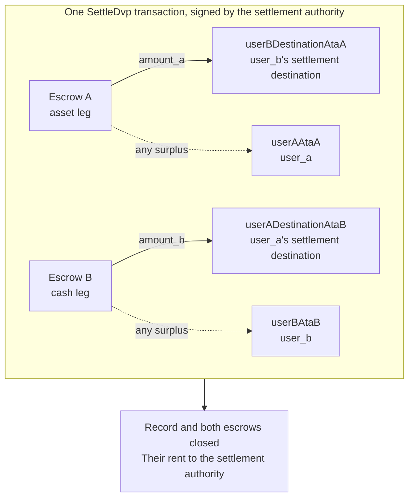

`SettleDvp`-instruktion allekirjoittaa kauppatietueeseen merkitty selvitysvaltuutettu. Yhdessä
transaktiossa se siirtää omaisuusosuudesta määrän `amount_a` käteisosuuden osapuolen
kohdetilille ja käteisosuudesta määrän `amount_b` omaisuusosuuden osapuolen kohdetilille,
palauttaa kummankin escrow-tilin ylijäämän osuuden osapuolelle sekä sulkee tietueen
ja molemmat escrow-tilit. Jos jokin näistä siirroista ei onnistu, instruktio
epäonnistuu eikä mikään siirry.

Tämä sivu jatkaa kohdista [luo kauppa](/docs/defi/dvp-program/create-a-trade)
ja [rahoita osuudet](/docs/defi/dvp-program/fund-the-legs); asiakas, allekirjoittajat,
`trade` ja osapuolten token account -tilit siirtyvät mukaan.

## Tarkista uudelleen ennen allekirjoitusta

Selvitysvaltuutettu allekirjoittaa transaktion, joka siirtää molemmat osuudet, joten se
suorittaa ennen allekirjoitusta saman luennan kuin kumpikin osapuoli: omistajan, koon, osapuolet,
mintit, määrät, voimassaolon päättymisen ja molemmat kohdetilit (ks.
[rahoita osuudet](/docs/defi/dvp-program/fund-the-legs#verify-the-terms)). Ohjelma
tarkistaa itse selvityksen yhteydessä uudelleen, että kukin mint kuuluu edelleen luontihetkellä
tallennettuun token programiin, ettei siinä ole estettyä laajennusta ja että sillä on sama
mint authority kuin kauppaa luotaessa. Siksi mintiä, joka on luotu uudelleen estetyllä
laajennuksella, eri token programilla tai eri mint authorityllä, ei voi
selvittää.

## Luo vastaanottajatilit

Settle kirjoittaa neljälle token account -tilille, joita ohjelma ei luo:

| Tili                | Vastaanottaa                     | Omistaja                           |
| ---------------------- | ---------------------------- | ------------------------------- |
| `userADestinationAtaB` | Käteisosuus (`amount_b`)    | `user_a_settlement_destination` |
| `userBDestinationAtaA` | Omaisuusosuus (`amount_a`)   | `user_b_settlement_destination` |
| `userAAtaA`            | Omaisuusosuuden mahdollinen ylijäämä | `user_a`                        |
| `userBAtaB`            | Käteisosuuden mahdollinen ylijäämä  | `user_b`                        |

Ylijäämätilejä käytetään vain, kun escrow-tilillä on sovittua määrää enemmän, mutta kuka
tahansa mintin haltija voi aiheuttaa ylijäämän lähettämällä escrow-tilille muutaman perusyksikön.
Jos palautustiliä ei ole olemassa, koko Settle epäonnistuu, joten luo kaikki neljä
idempotentisti samassa transaktiossa.

<Tabs items={["TypeScript", "Rust"]}>
  <Tab value="TypeScript">
    ```ts
    import {
      findAssociatedTokenPda,
      getCreateAssociatedTokenIdempotentInstruction,
    } from "@solana-program/token-2022";

    const destinationA = t.userASettlementDestination; // defaults to userA
    const destinationB = t.userBSettlementDestination; // defaults to userB

    const [userADestinationAtaB] = await findAssociatedTokenPda({
      mint: mintB,
      owner: destinationA,
      tokenProgram: tokenProgramB,
    });
    const [userBDestinationAtaA] = await findAssociatedTokenPda({
      mint: mintA,
      owner: destinationB,
      tokenProgram: tokenProgramA,
    });
    // userAAtaA and userBAtaB are from fund the legs.

    const createRecipientAccounts = [
      { ata: userADestinationAtaB, owner: destinationA, mint: mintB, tokenProgram: tokenProgramB },
      { ata: userBDestinationAtaA, owner: destinationB, mint: mintA, tokenProgram: tokenProgramA },
      { ata: userAAtaA, owner: userA, mint: mintA, tokenProgram: tokenProgramA },
      { ata: userBAtaB, owner: userB, mint: mintB, tokenProgram: tokenProgramB },
    ].map(({ ata, owner, mint, tokenProgram }) =>
      getCreateAssociatedTokenIdempotentInstruction({
        payer: authoritySigner,
        ata,
        owner,
        mint,
        tokenProgram,
      }),
    );
    ```

  </Tab>

  <Tab value="Rust">
    ```rust
    use spl_associated_token_account_client::address::get_associated_token_address_with_program_id;
    use spl_associated_token_account_client::instruction::create_associated_token_account_idempotent;

    let authority: Pubkey = pubkey!("SETTLEMENT_AUTHORITY_ADDRESS_HERE");
    let destination_a = trade.user_a_settlement_destination; // defaults to user_a
    let destination_b = trade.user_b_settlement_destination; // defaults to user_b

    let user_a_destination_ata_b =
        get_associated_token_address_with_program_id(&destination_a, &mint_b, &token_program_b);
    let user_b_destination_ata_a =
        get_associated_token_address_with_program_id(&destination_b, &mint_a, &token_program_a);
    let user_a_ata_a = get_associated_token_address_with_program_id(&user_a, &mint_a, &token_program_a);
    let user_b_ata_b = get_associated_token_address_with_program_id(&user_b, &mint_b, &token_program_b);

    let create_recipient_accounts = [
        create_associated_token_account_idempotent(&authority, &destination_a, &mint_b, &token_program_b),
        create_associated_token_account_idempotent(&authority, &destination_b, &mint_a, &token_program_a),
        create_associated_token_account_idempotent(&authority, &user_a, &mint_a, &token_program_a),
        create_associated_token_account_idempotent(&authority, &user_b, &mint_b, &token_program_b),
    ];
    ```

  </Tab>
</Tabs>

## Selvitys

`legAExtrasCount` kertoo ohjelmalle, kuinka monta kiinteän luettelon jälkeen liitetyistä
tileistä kuuluu omaisuusosuuden siirron transfer hookille; loput kuuluvat käteisosuuden
hookille. Jos mintillä ei ole transfer hookeja, anna arvoksi nolla äläkä liitä mitään. Memo
program account vaaditaan instruktiossa, ja sitä käytetään vain kohdetileille,
jotka vaativat memon.

<Tabs items={["TypeScript", "Rust"]}>
  <Tab value="TypeScript">
    ```ts
    import { MEMO_PROGRAM_ADDRESS } from "@solana-program/memo";
    import { getSettleDvpInstruction } from "./dvp";

    const settleInstruction = getSettleDvpInstruction({
      settlementAuthority: authoritySigner,
      swapDvp,
      mintA,
      mintB,
      dvpAtaA: escrowA,
      dvpAtaB: escrowB,
      userADestinationAtaB,
      userBDestinationAtaA,
      userAAtaA,
      userBAtaB,
      tokenProgramA,
      tokenProgramB,
      memoProgram: MEMO_PROGRAM_ADDRESS,
      legAExtrasCount: 0,
    });

    const { context: settleContext } = await client.sendTransaction([
      ...createRecipientAccounts,
      settleInstruction,
    ]);
    const settleSignature = settleContext.signature;
    console.log("Submitted:", settleSignature);

    // sendTransaction returns at the client's commitment (confirmed by default).
    // Wait for finalized before recording the trade as settled.
    let finalized = false;
    for (let attempt = 0; attempt < 30 && !finalized; attempt++) {
      const {
        value: [status],
      } = await client.rpc.getSignatureStatuses([settleSignature]).send();
      if (status?.err) {
        throw new Error("Settle transaction failed");
      }
      finalized = status?.confirmationStatus === "finalized";
      if (!finalized) {
        await new Promise((resolve) => setTimeout(resolve, 2_000));
      }
    }
    if (!finalized) {
      // A closed record means it settled; an open one is safe to settle again.
      throw new Error("Settle not finalized after 60s; read the trade record");
    }
    console.log("Settled:", settleSignature);
    ```

  </Tab>

  <Tab value="Rust">
    ```rust
    use dvp_swap_program_client::instructions::SettleDvpBuilder;

    const MEMO_PROGRAM_ID: Pubkey = pubkey!("MemoSq4gqABAXKb96qnH8TysNcWxMyWCqXgDLGmfcHr");

    let settle_ix = SettleDvpBuilder::new()
        .settlement_authority(authority)
        .swap_dvp(swap_dvp)
        .mint_a(mint_a)
        .mint_b(mint_b)
        .dvp_ata_a(escrow_a)
        .dvp_ata_b(escrow_b)
        .user_a_destination_ata_b(user_a_destination_ata_b)
        .user_b_destination_ata_a(user_b_destination_ata_a)
        .user_a_ata_a(user_a_ata_a)
        .user_b_ata_b(user_b_ata_b)
        .token_program_a(token_program_a)
        .token_program_b(token_program_b)
        .memo_program(MEMO_PROGRAM_ID)
        .leg_a_extras_count(0)
        .instruction();
    ```

  </Tab>
</Tabs>



### Transfer hookit

Generoitu IDL luettelee vain kiinteät tilit, joten generoidut builderit
eivät tunne hook-tilejä. Selvitä kunkin hook-mintin lisätilien metat
samalla tavalla kuin tekisit kyseisen tokenin suoraa siirtoa varten ja liitä ne sitten
instruktioon: ensin omaisuusosuuden tilit, sitten käteisosuuden,
ja aseta `legAExtrasCount` ensimmäisen ryhmän lukumääräksi. TypeScriptissä
levitä selvitetyt metat instruktion `accounts`-taulukkoon; Rustissa käytä builderin
metodia `add_remaining_accounts`. Yläraja on 32 tiliä osuutta kohti,
mukaan lukien hook-ohjelma ja validation account; transaktion tilirajoitus
voi tulla vastaan ensin, jos molemmilla osuuksilla on hookit. Ohjelma poistaa signer-lipun
kaikilta eteenpäin välitettäviltä tileiltä, joten hook ei voi saada selvitysvaltuutetun
allekirjoitusta tämän reitin kautta.

## Kirjaa tulos

Pidä kauppaa selvitettynä, kun Settle-transaktio saavuttaa tilan `finalized`.
Tietuetta ja molempia escrow-tilejä ei ole enää selvityksen jälkeen, joten järjestelmä, joka tarvitsee
ehdot myöhemmin, tallentaa ne ennen selvitystä tehdystä luennasta tai luontitransaktiosta.
Suljettujen tilien rent on siirtynyt selvitysvaltuutetulle.

## Settle-virheet

`LegNotFunded` tarkoittaa, että escrow-tilillä on sovittua määrää vähemmän; `DvpExpired`
ja `SettlementTooEarly` tarkoittavat, että aikaikkuna on ohitettu; `MintAuthorityChanged`
ja `BlockedMintExtension` tarkoittavat, että mint on muuttunut luomisen jälkeen;
`RecipientAtaMismatch` tarkoittaa, että kohde- tai palautus-token account puuttuu tai
ei enää kuulu odotetulle omistajalle ja mintille, yleensä koska yllä oleva
tilin luontivaihe jäi väliin. Kaikissa tapauksissa mikään ei ole siirtynyt, ja
osapuolet voivat purkaa kaupan mintin valtuutettujen asettamien rajoitusten mukaisesti (ks.
[pura kauppa](/docs/defi/dvp-program/unwind-a-trade)).

## Seuraavat vaiheet

- [Pura kauppa](/docs/defi/dvp-program/unwind-a-trade): rahoitettujen
  osuuksien palauttaminen, kun kauppa ei selviä
