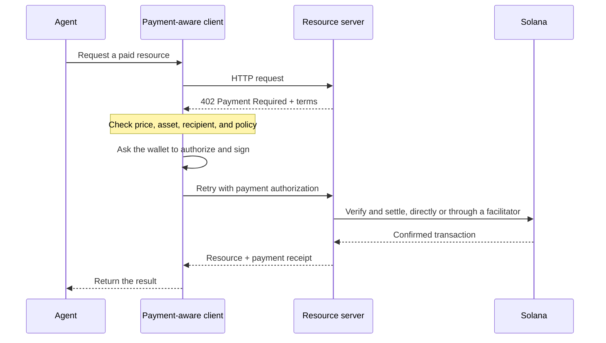

Agenttimaksujen avulla ohjelmisto voi selvittää hinnan, valtuuttaa maksun ja vastaanottaa
resurssin saman HTTP-työnkulun aikana. Agentti voi maksaa datakyselystä, mallin
päättelystä tai työkalukutsusta luomatta ensin laskutustiliä tai kopioimatta
API-avainta.

<Cards>
  <Card title="MPP" href="/docs/payments/agentic-payments/mpp">
    Käytä HTTP-todennusta kertaluonteisiin veloituksiin ja mitattuihin maksuistuntoihin.
  </Card>
  <Card title="x402" href="/docs/payments/agentic-payments/x402">
    Lisää x402 V2 -maksuvaatimukset, allekirjoitukset ja selvitys HTTP-resurssiin.
  </Card>
</Cards>

## Yhteinen maksuvirta

MPP ja x402 käyttävät eri otsakkeita ja tietomalleja, mutta niiden perustason HTTP-virta on
samankaltainen:

## MPP ja x402

Molemmat protokollat voivat selvittää stablecoin-maksuja Solanalla. Valitse protokolla
palvelusi tarvitseman maksumallin ja yhteentoimivuuden perusteella, älä pelkästään yhteisen `402`-
tilakoodin perusteella.

|                         | MPP                                                               | x402                                                                     |
| ----------------------- | ----------------------------------------------------------------- | ------------------------------------------------------------------------ |
| Haaste               | `WWW-Authenticate: Payment`                                       | `PAYMENT-REQUIRED`                                                       |
| Asiakkaan valtuutus    | `Authorization: Payment`                                          | `PAYMENT-SIGNATURE`                                                      |
| Kuitti                 | `Payment-Receipt`                                                 | `PAYMENT-RESPONSE`                                                       |
| Solana-maksumallit   | Kertaluonteinen `charge`-tarkoitus ja ylärajattu, mitattu `session`-tarkoitus           | Skeemat, kuten `exact` ja `upto`; tuki vaihtelee verkon ja asiakkaan mukaan |
| Selvitysarkkitehtuuri | Palvelimen suorittama validointi tai valinnainen välityspalvelin tai yhdyskäytävä                | Resurssipalvelin paikallisella varmennuksella tai facilitator                 |
| Hyvä lähtökohta     | Rajapinnat, jotka tarvitsevat HTTP-todennuksen semantiikkaa tai toistuvaa mittausta | Pyyntökohtaisesti maksettavat resurssit ja olemassa olevat x402-asiakkaat                      |

MPP on **Machine Payments Protocol**. Älä sekoita sitä **Model
Context Protocoliin (MCP)**. MCP tarjoaa agenteille työkaluja ja resursseja; MPP tai x402
voi edellyttää maksua, kun agentti kutsuu jotakin näistä työkaluista.

<Callout type="info">
  Palvelu voi mainostaa useampaa kuin yhtä protokollaa. Asiakas valitsee tukemansa
  maksuvaihtoehdon ja käyttää sitten koko vuorovaikutuksen ajan vastaavia haaste-, valtuutus- ja
  kuittiotsakkeita.
</Callout>
