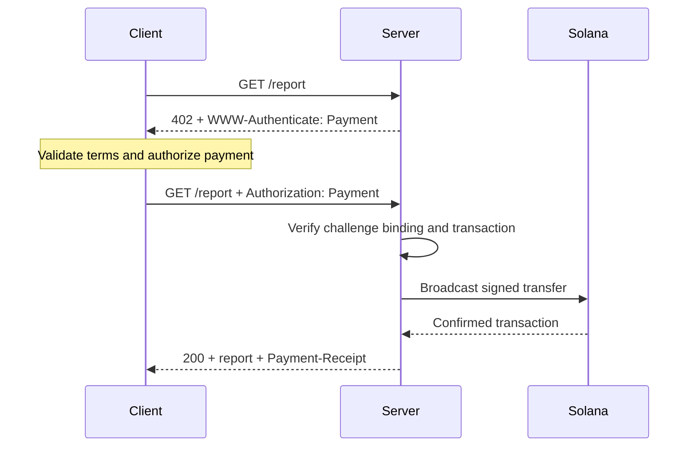
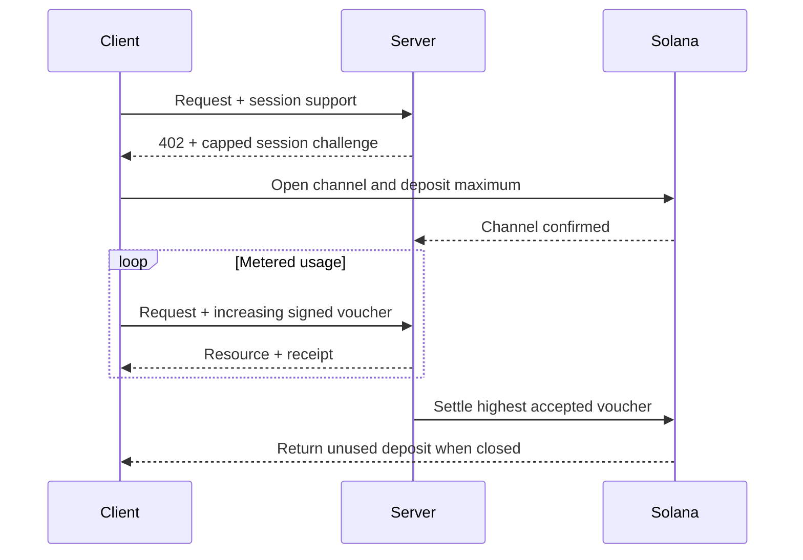

[Machine Payments Protocol (MPP)](https://mpp.dev/) soveltaa HTTP-todennuksen semantiikkaa maksuihin. Palvelin esittää haasteen maksamattomalle pyynnölle, asiakas palauttaa maksutunnisteen (payment credential), ja palvelin palauttaa kuitin hyväksyttyään maksun.

MPP erottaa toisistaan kolme asiaa:

- **Intentti** (intent) kuvaa kaupallista vuorovaikutusta, kuten kertaluonteista `charge`-veloitusta tai mitattua `session`-istuntoa.
- **Maksutapa** kuvaa, miten arvo siirtyy. Solana-maksutapa tukee veloituksissa natiivia SOL-tokenia ja SPL-tokeneita.
- HTTP-**kuljetuskerros** (transport) välittää haasteet, tunnisteet, kuitit ja virheet.

MPP julkaistaan Internet-Draft-luonnosten joukkona. Pidä [voimassa olevia määrityksiä](https://paymentauth.org/) totuuden lähteenä ja varaudu siihen, että yksityiskohdat muuttuvat luonnosten ollessa vielä työn alla.

## HTTP-vaihto

MPP käyttää tavallisia HTTP-todennuskenttiä protokollakohtaisten maksuotsikoiden sijaan:

| Viesti                 | HTTP-esitys                                         |
| ----------------------- | ----------------------------------------------------------- |
| Maksuhaaste       | `402 Payment Required` ja `WWW-Authenticate: Payment ...` |
| Maksutunniste      | Uudelleen lähetetty pyyntö, jossa `Authorization: Payment ...`           |
| Onnistunut kuitti      | Resurssin vastaus, jossa `Payment-Receipt: ...`               |
| Virheelliset maksutiedot | Problem Details -runko, jossa käytetään `application/problem+json`-muotoa       |



Haaste sisältää palvelimen luoman tunnisteen, realmin, menetelmän, intentin, koodatun maksupyynnön ja vanhenemisajan. Tunniste toistaa haasteen ja lisää siihen maksutapakohtaisen maksutodisteen. Palvelimen on varmennettava molemmat osat: pätevä siirto, joka kuuluu eri haasteeseen, ei saa avata resurssia.

## Kertaluonteiset Solana-veloitukset

Solanan `charge`-intentti tukee kahta tunnistetyyppiä:

- **Pull-tila** käyttää allekirjoitettua transaktiota. Asiakas allekirjoittaa siirron ja lähettää transaktion palvelimelle. Palvelin varmentaa sen, lisää tarvittaessa maksajan (fee payer) allekirjoituksen, lähettää transaktion verkkoon, vahvistaa sen ja palauttaa transaktion allekirjoituksen kuitissaan.
- **Push-tila** käyttää transaktion allekirjoitusta. Asiakas lähettää transaktion verkkoon ensin ja toimittaa sitten vahvistetun allekirjoituksen palvelimelle. Palvelin hakee ja varmentaa transaktion ennen resurssin palauttamista.

Pull-tila mahdollistaa palvelimen sponsoroimat transaktiomaksut ja palvelinpuolen uudelleenyrityslogiikan. Push-tila on hyödyllinen, kun lompakko vaatii asiakasta lähettämään oman transaktionsa, mutta se ei voi hyödyntää palvelimen maksusponsorointia.

Normatiiviset kentät ja varmennussäännöt löytyvät [Solana charge -määrityksestä](https://paymentauth.org/draft-solana-charge-00.html).

## MPP-veloituksen lisääminen Express-rajapintaan

Solana Pay Kit tarjoaa ajantasaisen TypeScript-integraation MPP:lle ja x402:lle. Asenna se Expressin kanssa:

```bash
pnpm add @solana/pay-kit @solana/kit@^6.9.0 express
pnpm add --save-dev @types/express tsx
```

Tämä pienin esimerkki käyttää isännöityä Surfpool-hiekkalaatikkoa ja paketin julkista demovastaanottajaa. Se on tarkoitettu vain paikalliseen kehitykseen:

```ts filename=server.ts
import express from "express";
import { createPayKit, usd } from "@solana/pay-kit";

const pay = await createPayKit({
  accept: ["mpp"],
  rpcUrl: "https://402.surfnet.dev:8899"
});

const app = express();

app.get("/report", pay.express(usd("0.01")), (_req, res) => {
  res.json({ report: "Paid report" });
});

app.listen(4567, () => {
  console.log("Paid API listening on http://127.0.0.1:4567");
});
```

Suorita se ja vertaa maksamatonta pyyntöä maksun huomioivaan pyyntöön:

```bash
pnpm tsx server.ts
curl -i http://127.0.0.1:4567/report
pay --sandbox curl http://127.0.0.1:4567/report
```

Reitin käsittelijä suoritetaan vasta, kun väliohjelmisto (middleware) on hyväksynyt maksun.

<Callout type="warn" title="Korvaa kaikki hiekkalaatikon oletusarvot tuotannossa">
  Määritä erikseen verkko, kauppiaan vastaanottaja, oma RPC, vakaa haasteen sitomiseen käytettävä salaisuus, tuotantoallekirjoittaja ja pysyvä toistohyökkäysten estotallennus (replay store). Älä koskaan ohjaa oikeita maksuja paketin demoallekirjoittajalle.
</Callout>

## Mitatut istunnot

Käytä Solana MPP:n `session`-istuntoa, kun asiakas tekee paljon pieniä, toisiinsa liittyviä maksuja. Istunto avaa ketjussa (onchain) maksukanavan, jolla on enimmäistalletus, ja käyttää sitten kumulatiivisia allekirjoitettuja vouchereita käytön kasvaessa. Palvelin voi varmentaa voucherit ketjun ulkopuolella (offchain) ja suorittaa suurimman hyväksytyn summan selvityksen myöhemmin.

Tämä sopii tokenipohjaisesti mitattuun inferenssiin, tavuina mitattuihin latauksiin, reaaliaikaiseen dataan ja toistuviin työkalukutsuihin. Se ei ole sama asia kuin erillisen ketjussa tehtävän maksun lähettäminen jokaisesta tapahtumasta.



Kutsu istuntoa nimellä **istuntomaksu** (session payment), **maksukanava** (payment channel) tai **rajattu toistuva valtuutus** (capped repeated authorization). Kutsu sitä suoratoistomaksuksi vain, jos palvelu ja maksusopimus todella mittaavat käytön virtaa.

## Tuotantovarmennus

Jokaisen Solana-veloituksen osalta palvelimen on varmennettava vähintään seuraavat asiat:

- Haaste on aito, voimassa, sidottu tähän pyyntöön ja tarkoitettu tälle realmille.
- Transaktio käyttää odotettua verkkoa, omaisuuserää tai mintiä, vastaanottajaa, summaa ja token-ohjelmaa.
- Kaikki maksajan (fee payer) tai associated token account -tilin ohjeet on sallittu nimenomaisesti, eivätkä ne voi tyhjentää palvelimen allekirjoittajaa.
- Transaktio onnistui vaaditulla vahvistustasolla (commitment level).
- Transaktion allekirjoitusta ei ole jo käytetty.
- Toistotarkistus ja käyttö (consume) ovat atomisia kaikissa palvelininstansseissa.

Tallenna istuntojen osalta lisäksi kanavan tila, hyväksytty kumulatiivinen summa ja selvityksen vesileima (settlement watermark) jaettuun tallennustilaan. Dokumentoi, miten asiakkaat saavat käyttämättömät varat takaisin, jos palvelin ei ole saatavilla.

## Aiheeseen liittyvät resurssit

- [MPP-määritykset](https://paymentauth.org/)
- [MPP-protokollan dokumentaatio](https://mpp.dev/protocol)
- [Solana Pay Kit](https://github.com/solana-foundation/pay-kit)
- [Agenttimaksujen yleiskatsaus](/docs/payments/agentic-payments)
- [Tuotantovalmius](/docs/tools/production-readiness)
